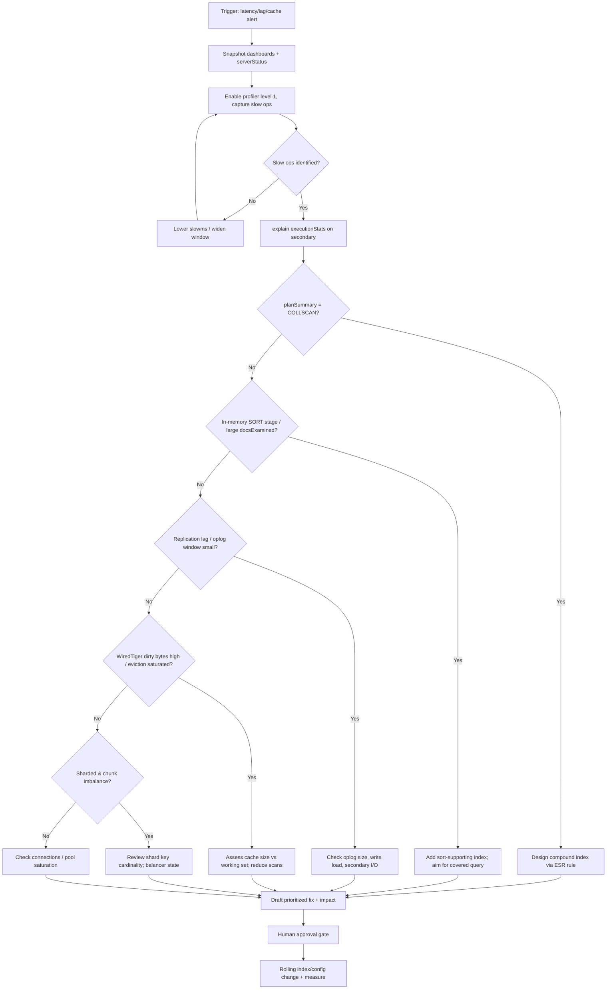
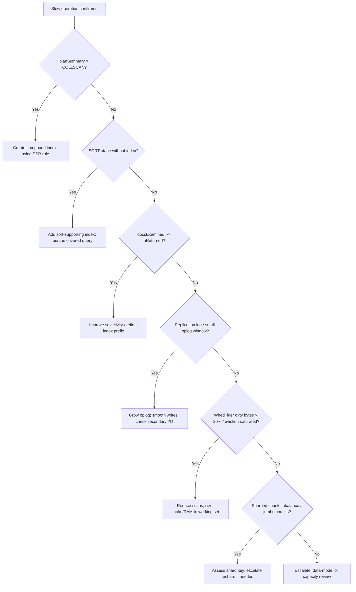

# MongoDB Health Review

> Conduct a structured MongoDB health review — slow queries and collection
> scans, index coverage, replica-set health, WiredTiger cache pressure, and
> shard balance — and deliver an evidence-backed remediation plan.

## Objective

Assess the operational health of a MongoDB deployment and produce a prioritized
remediation plan that restores query latency and cluster stability to within
SLO. "Done" means slow operations are identified via the profiler and
`$currentOp`, index coverage is evaluated with `explain("executionStats")`,
replica-set and (if applicable) shard health are verified, and each finding has
a concrete fix, expected impact, and rollback.

## Business Context

MongoDB powers product catalogs, user-generated content, IoT/event stores, and
flexible-schema services where document modeling accelerated delivery. Its
schema flexibility, however, makes it easy to ship queries that trigger
full-collection scans (`COLLSCAN`), unbounded array growth, or unindexed sort
stages that silently consume the WiredTiger cache. In replica sets, a slow
primary drives read preference fallbacks and stale reads; in sharded clusters, a
poorly chosen shard key creates jumbo chunks and hot shards. A disciplined
health review protects customer-facing latency, keeps replication healthy, and
avoids premature (and expensive) horizontal scaling.

## Problem Statement

The deployment shows elevated operation latency, high `COLLSCAN` counts, rising
replication lag, WiredTiger cache eviction pressure, connection saturation, or
shard imbalance. The agent must isolate the offending operations, collections,
and indexes and separate symptom from cause using the profiler,
`explain()`, `serverStatus`, and `rs.status()`.

Out of scope: full data-model redesign, changing the shard key (an involved
migration), engine swaps, and major-version upgrades — these may be recommended
but are not executed here.

## Success Criteria

- [ ] Slow operations captured via the database profiler (level 1) and `$currentOp`.
- [ ] Top offenders explained with `explain("executionStats")`; scan vs index confirmed.
- [ ] Index coverage assessed; `$indexStats` reviewed for unused indexes.
- [ ] Replica-set health verified (`rs.status()`, oplog window, lag).
- [ ] WiredTiger cache and eviction pressure assessed via `serverStatus`.
- [ ] Shard balance checked if sharded (`sh.status()`, chunk distribution).
- [ ] Prioritized remediation list with impact/risk; no unapproved production writes.

## Trigger Conditions

- Alert: `mongodb_op_latency_p99 > 200ms for 10m` or `COLLSCAN` rate rising.
- Alert: `mongodb_replication_lag_seconds > 10` or oplog window shrinking.
- Alert: `wiredTiger.cache dirty bytes > 20%` or eviction threads saturated.
- Schedule: monthly health review across the fleet.
- Manual: engineer reports a slow query or degraded endpoint.

## Inputs Required

| Input | Description | Example | Required |
|-------|-------------|---------|----------|
| `connection_uri` | Prefer a secondary read | `mongodb://catalog-ro.internal:27017/?readPreference=secondary` | Yes |
| `database` | Target database | `catalog` | Yes |
| `topology` | replica-set / sharded | `replica-set` | Yes |
| `slo_p99_ms` | Latency SLO | `100` | Yes |
| `time_window` | Analysis window | `last 24h` | Yes |
| `mongodb_version` | Version | `7.0` | Yes |

## Required Access

| Scope | Purpose | Read/Write | Sensitivity |
|-------|---------|-----------|-------------|
| Secondary read connection | Safe diagnostics | Read | Medium |
| `clusterMonitor` role | `serverStatus`, `rs.status`, `sh.status` | Read | Low |
| Profiler read (`system.profile`) | Identify slow ops | Read | Medium |
| Metrics dashboard | Observe latency/cache/lag | Read | Low |
| Index build on primary | `createIndex` rolling build | Write | High (approval gated) |

## Assumptions

- A readable secondary exists for diagnostics.
- The profiler can be enabled at level 1 with a slow-op threshold (e.g. 100ms).
- The user has `clusterMonitor`/`read` roles; no `dbAdminAnyDatabase` write use without approval.
- WiredTiger is the storage engine.
- For sharded clusters, `mongos` and config servers are reachable.

## Risks

| Risk | Likelihood | Impact | Mitigation |
|------|-----------|--------|------------|
| Profiler level 2 (all ops) overwhelms the primary | Medium | High | Use level 1 with threshold; disable after capture |
| Foreground index build blocks the database | Low | Critical | Use rolling index builds on secondaries first |
| Large index build spikes WiredTiger cache | Medium | High | Build off-peak; monitor eviction and dirty bytes |
| Dropping an "unused" index breaks a rare query | Medium | High | Confirm via `$indexStats` over full window; hide index first |
| Changing shard key attempted | Low | Critical | Out of scope; escalate as a migration project |

## Constraints

- No foreground index builds or profiler level 2 during business hours.
- Production index/config changes require an approved ticket and rollback.
- Respect data residency; do not export documents off the secured network.
- Keep changes within a single collection/index blast radius.
- Honor active change freezes.

## Agent Persona

Adopt the persona of a **Principal Database Engineer** who thinks in documents
and access patterns: compound-index prefix rules (Equality, Sort, Range — the
"ESR" rule), covered queries, the cost of in-memory `SORT` stages, WiredTiger
cache dynamics (dirty vs clean, eviction), oplog sizing, and shard-key
cardinality. Be precise — prove a scan with `explain("executionStats")` and cite
`totalDocsExamined` vs `nReturned` before recommending an index. Prefer index
and query-shape fixes over topology changes. Follow
[`docs/AI_AGENT_STANDARDS.md`](../../docs/AI_AGENT_STANDARDS.md): diagnose on a
secondary first, mutate only with approval.

## Planning Instructions

1. Restate the objective and latency SLO.
2. Enumerate observability: dashboards, profiler, `serverStatus`, `rs.status`, `sh.status`.
3. Rank likely cause classes: missing index / scan, sort spill, cache pressure,
   replication/oplog, connection saturation, shard imbalance.
4. Mark read-only steps (immediate) vs mutating (approval gated).
5. Externalize the plan; because `human_in_the_loop` is `required`, obtain
   approval before enabling profiler level 2, building indexes, or config changes.

## Execution Instructions

Run diagnostics via `mongosh` against a secondary where possible.

```javascript
// 1. Enable profiler at level 1 with a 100ms slow-op threshold (temporary)
db.setProfilingLevel(1, { slowms: 100 });

// Review captured slow operations
db.system.profile.find({ millis: { $gt: 100 } })
  .sort({ ts: -1 }).limit(20)
  .forEach(d => printjson({ ns: d.ns, op: d.op, ms: d.millis,
    plan: d.planSummary, keys: d.keysExamined, docs: d.docsExamined,
    ret: d.nreturned, filter: d.command && d.command.filter }));
```

```javascript
// 2. Explain a specific offending query on the secondary
db.products.find({ category: "shoes", inStock: true })
  .sort({ updatedAt: -1 })
  .explain("executionStats");
// Inspect: winningPlan.stage (IXSCAN vs COLLSCAN),
// executionStats.totalDocsExamined vs nReturned, and any SORT stage.
```

```javascript
// 3. Index usage stats — find unused indexes
db.products.aggregate([{ $indexStats: {} }])
  .forEach(i => print(i.name, JSON.stringify(i.accesses)));

// List indexes and sizes
db.products.getIndexes();
db.products.stats().indexSizes;
```

```javascript
// 4. Live long-running operations
db.getSiblingDB("admin").aggregate([
  { $currentOp: { allUsers: true } },
  { $match: { active: true, secs_running: { $gt: 5 } } },
  { $project: { op:1, ns:1, secs_running:1, planSummary:1, waitingForLock:1 } }
]);
```

```javascript
// 5. Replica-set health, oplog window, lag
rs.status();                       // members, state, optimeDate
rs.printReplicationInfo();         // oplog size + time window
rs.printSecondaryReplicationInfo();// per-secondary lag

// 6. WiredTiger cache & connections
const ss = db.serverStatus();
printjson({
  cacheBytes: ss.wiredTiger.cache["bytes currently in the cache"],
  maxBytes:   ss.wiredTiger.cache["maximum bytes configured"],
  dirtyBytes: ss.wiredTiger.cache["tracked dirty bytes in the cache"],
  connections: ss.connections,
  opLatencies: ss.opLatencies
});
```

```javascript
// 7. Sharded cluster balance (run via mongos)
sh.status();
use config;
db.chunks.aggregate([{ $group: { _id: "$shard", chunks: { $sum: 1 } } }]);
```

Only after diagnosis and approval, apply the least-invasive fix:

```javascript
// 8. Build a compound index following ESR (Equality, Sort, Range) — rolling build
db.products.createIndex(
  { category: 1, inStock: 1, updatedAt: -1 },
  { name: "cat_stock_updated", background: true }
);

// Turn the profiler back off after capture
db.setProfilingLevel(0);
```

## Investigation Workflow



## Analysis Framework

Classify the dominant cause:

1. **Missing / suboptimal index** — `explain` shows `COLLSCAN` or
   `totalDocsExamined` >> `nReturned`. Design compound indexes with the **ESR**
   rule: equality-matched fields first, then the sort field, then range fields.
   Aim for covered queries (all fields served from the index, `PROJECTION_COVERED`).
2. **In-memory sort** — a `SORT` stage without an index causes documents to be
   sorted in RAM; if it exceeds 100MB it errors unless `allowDiskUse`. Add a
   sort-supporting index.
3. **WiredTiger cache pressure** — cache near `maximum bytes configured`, high
   "tracked dirty bytes" (>20%), eviction threads busy; working set exceeds cache
   (default ~50% of RAM). Reduce scans, add indexes, or size RAM.
4. **Replication / oplog** — secondaries lagging, oplog window too short to
   survive maintenance; increase oplog size, reduce write bursts, check secondary
   disk throughput.
5. **Connections / pooling** — `connections.current` near limit; fix client pool
   configuration and `maxPoolSize`.
6. **Shard imbalance** — jumbo chunks, hot shard from low-cardinality or
   monotonically increasing shard key; balancer disabled or lagging.

Prioritize index/query-shape fixes (low risk, high impact), then cache/oplog
sizing, then topology changes as escalations.

## Decision Tree



## Validation Steps

- [ ] Re-run `explain("executionStats")`; `winningPlan.stage` is `IXSCAN` (not `COLLSCAN`).
- [ ] `totalDocsExamined` approaches `nReturned` and execution time drops.
- [ ] New index shows accesses in `$indexStats` for the target query.
- [ ] p95/p99 op latency trends back to SLO on the dashboard.
- [ ] WiredTiger dirty bytes and eviction pressure normalize.
- [ ] `rs.printSecondaryReplicationInfo()` lag stable/reduced; oplog window healthy.
- [ ] Profiler returned to level 0 to avoid overhead.

## Expected Outputs

- Profiler-derived list of slow operations with namespaces and plans.
- `explain("executionStats")` before/after for each offender.
- `$indexStats` usage report and index-size table.
- Replica-set/oplog health and WiredTiger cache summary.
- Shard-balance summary (if sharded).
- Prioritized remediation plan with impact/risk and rollback.

## Deliverables

Produce a report using [`templates/report-template.md`](../../templates/report-template.md):
executive summary, evidence (profiler/explain/serverStatus snapshots), root-cause
analysis, prioritized recommendations, applied changes with before/after metrics,
and follow-ups (data-model, oplog sizing, shard-key review). Include the exact
`createIndex`/config commands and their rollback.

## Escalation Process

- **Sev-2 (SLO breach ongoing):** page on-call DBA; post the slow op, plan, and
  proposed index in `#db-oncall` within 15 minutes.
- **Structural** (shard-key change, data-model redesign, resharding): open an RFC
  to the data-platform team; out of scope here.
- **Approval required:** index builds, profiler level 2, config/oplog changes
  route to the change approver with blast radius and rollback.

## Rollback Strategy

- New index: `db.products.dropIndex("cat_stock_updated")` — reversible; or hide
  first with `db.products.hideIndex("cat_stock_updated")` to validate no query
  depends on it before dropping.
- Profiler: `db.setProfilingLevel(0)` and drop/cap `system.profile` if needed.
- Config (e.g. `wiredTigerCacheSizeGB`): revert parameter and restart the member
  during a maintenance window.
- Confirm rollback by re-running the query explain and comparing to baseline.

## Post-Execution Review

- Was the offending query shape avoidable with an ESR-compliant index from day one?
- Is the oplog window sized to survive the longest expected maintenance?
- Does the working set fit the WiredTiger cache, or is RAM under-provisioned?
- What CI guardrail (explain gate, index linter) prevents `COLLSCAN` regressions?

## Metrics

| Metric | Definition | Target |
|--------|-----------|--------|
| MTTD | Time from regression to detection | < 10m |
| MTTR | Time from trigger to SLO restored | < 2h |
| p99 op latency | Post-fix p99 for target op | < `slo_p99_ms` |
| Scan ratio | `totalDocsExamined / nReturned` | ~1 for point queries |
| Replication lag | Max secondary lag | < 5s |
| Cache dirty bytes | WiredTiger dirty fraction | < 20% |

## Example Execution

**Input:** `connection_uri=...catalog-ro...readPreference=secondary`,
`database=catalog`, `topology=replica-set`, `slo_p99_ms=100`, alert `COLLSCAN`
rate rising.

**Agent reasoning (abridged):** Profiler level 1 captured a products listing
query at 240ms. `explain("executionStats")` showed `COLLSCAN` with
`totalDocsExamined: 1,240,551` and `nReturned: 40`, plus an in-memory `SORT` on
`updatedAt`. The query filtered `category` (equality) and `inStock` (equality)
and sorted by `updatedAt` (range/sort). No compound index existed. Classified as
**missing ESR-compliant index + in-memory sort**.

```text
Before (executionStats):
  winningPlan.stage: COLLSCAN
  totalDocsExamined: 1,240,551   nReturned: 40   executionTimeMillis: 238
  SORT stage: in-memory (updatedAt: -1)

After createIndex({ category:1, inStock:1, updatedAt:-1 }):
  winningPlan.stage: IXSCAN -> FETCH
  totalDocsExamined: 40        nReturned: 40   executionTimeMillis: 3
  Sort provided by index (no in-memory SORT)
```

**Outcome:** Query time fell from 238ms to 3ms; endpoint p99 dropped from 260ms
to 45ms after a rolling index build with no primary disruption. Profiler
returned to level 0. Rollback documented (`hideIndex` then `dropIndex`).
Follow-up: add an explain gate in CI for new catalog queries.

## References

- [`docs/AI_AGENT_STANDARDS.md`](../../docs/AI_AGENT_STANDARDS.md)
- [`templates/report-template.md`](../../templates/report-template.md)
- [Redis Performance Diagnostics runbook](./redis-performance-diagnostics.md)
- MongoDB docs: database profiler, `explain` results, the ESR rule, WiredTiger cache, replica-set oplog, sharding.
