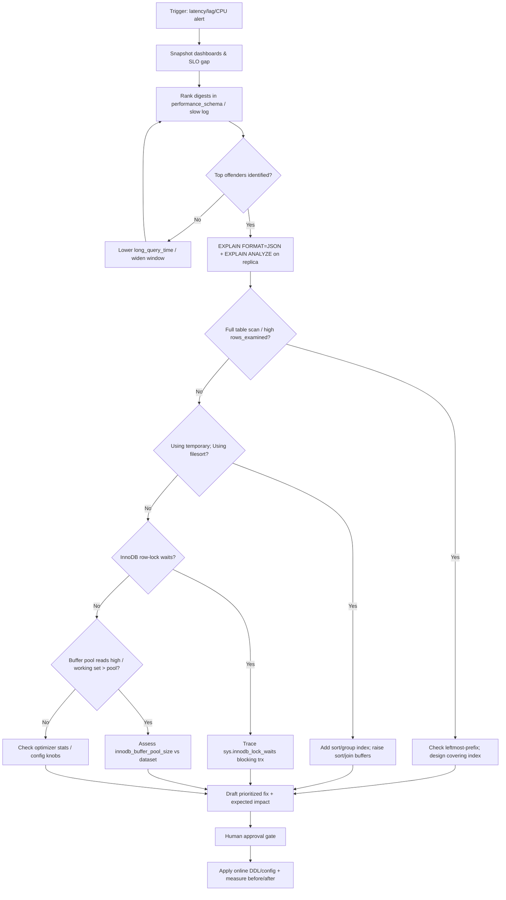
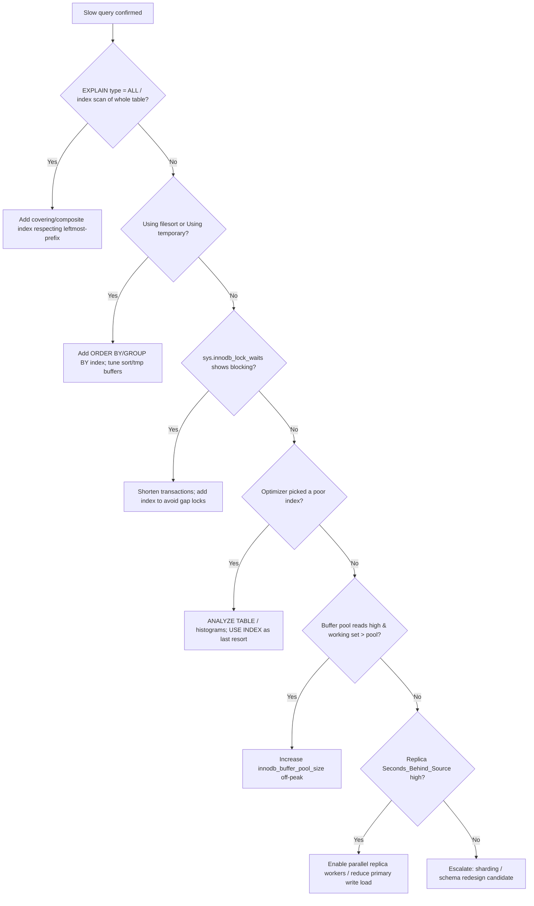

# MySQL Performance Analysis

> Diagnose MySQL/InnoDB performance degradation — slow queries, missing indexes,
> lock contention, buffer-pool pressure, and replication lag — and deliver an
> evidence-backed remediation plan that restores latency to within SLO.

## Objective

Locate the specific queries, indexes, tables, and configuration parameters
responsible for MySQL performance degradation and produce a prioritized,
low-risk remediation plan. "Done" means each top offender is explained via
`EXPLAIN ANALYZE`/`EXPLAIN FORMAT=JSON`, attributed to a concrete cause, and
paired with a proposed fix, expected impact, and rollback path that restores
p95/p99 latency to the target SLO.

## Business Context

MySQL (and its InnoDB storage engine) underpins e-commerce carts, user
profiles, session stores, and reporting for a large share of the industry.
Because MySQL commonly runs a primary with read replicas, a single unindexed
query can saturate the primary's buffer pool, spike replication lag, and serve
stale reads to customers. Slow queries directly translate to abandoned carts,
timeouts, and elevated infrastructure spend as teams over-provision instances to
mask inefficiency. Disciplined MySQL analysis protects revenue, keeps read
replicas fresh, and defers costly vertical scaling.

## Problem Statement

The database shows elevated latency, high CPU/IO, buffer-pool churn, growing
`Seconds_Behind_Source` on replicas, row-lock waits, or connection saturation.
The agent must isolate the responsible statements and structures using
Performance Schema, `sys` schema, the slow query log, and `EXPLAIN`, and
distinguish symptom from cause.

Out of scope: schema redesign, sharding/Vitess adoption, engine migration
(MyISAM→InnoDB), and major-version upgrades. These may be recommended but are
not executed here.

## Success Criteria

- [ ] Top offending statements identified from `performance_schema.events_statements_summary_by_digest` and/or slow query log.
- [ ] `EXPLAIN FORMAT=JSON` / `EXPLAIN ANALYZE` captured for each on a replica.
- [ ] Root cause classified (missing/covering index, full scan, temp table/filesort, lock wait, buffer-pool pressure, bad optimizer choice, config).
- [ ] Prioritized remediation list with expected impact and risk.
- [ ] No production DDL/config change without explicit approval.
- [ ] Before/after latency captured for applied changes.

## Trigger Conditions

- Alert: `mysql_p99_query_latency > 500ms for 10m` or `Threads_running > 50`.
- Alert: `Seconds_Behind_Source > 30` on a read replica.
- Alert: `Innodb_buffer_pool_reads` rate surging (cache misses to disk).
- Schedule: monthly proactive review of the top digest workload.
- Manual: engineer reports a slow endpoint traced to a specific query.

## Inputs Required

| Input | Description | Example | Required |
|-------|-------------|---------|----------|
| `db_host` | Instance or replica endpoint | `cart-db-ro.internal:3306` | Yes |
| `schema` | Target schema | `cart` | Yes |
| `slo_p99_ms` | Latency SLO to restore | `300` | Yes |
| `time_window` | Analysis window | `last 24h` | Yes |
| `mysql_version` | Version/flavor | `8.0.36` (MySQL) / `10.11` (MariaDB) | Yes |
| `suspect_query` | Optional known-slow statement | `SELECT ... FROM cart_items ...` | No |

## Required Access

| Scope | Purpose | Read/Write | Sensitivity |
|-------|---------|-----------|-------------|
| Read replica connection | Run EXPLAIN safely | Read | Medium |
| `performance_schema` / `sys` | Rank digests, waits, IO | Read | Low |
| Slow query log access | Identify slow statements | Read | Low |
| Metrics dashboard | Observe CPU/IOPS/lag | Read | Low |
| Production DDL (index) | Apply online DDL | Write | High (approval gated) |

## Assumptions

- Performance Schema is enabled (default in MySQL 8.0) with statement digests.
- `slow_query_log` is on with a sane `long_query_time` (e.g. 0.5s).
- A read replica exists for safe `EXPLAIN`/`EXPLAIN ANALYZE`.
- InnoDB is the storage engine for the hot tables.
- Table statistics are reasonably current (`innodb_stats_persistent`).

## Risks

| Risk | Likelihood | Impact | Mitigation |
|------|-----------|--------|------------|
| `EXPLAIN ANALYZE` actually executes the query | High | Medium | Only run on replicas / `SELECT`; bound with `MAX_EXECUTION_TIME` |
| Online DDL still copies the table (algorithm=COPY) | Medium | High | Verify `ALGORITHM=INPLACE, LOCK=NONE`; else use gh-ost/pt-osc |
| Dropping an "unused" index breaks a rare query | Medium | High | Confirm via `sys.schema_unused_indexes` over full window; make invisible first |
| Buffer-pool resize causes stall | Low | High | Resize in chunks; schedule off-peak |
| Optimizer hint masks a deeper issue | Medium | Medium | Prefer index/stats fix; treat hints as last resort |

## Constraints

- No blocking `ALTER TABLE` (ALGORITHM=COPY) during business hours; use
  `pt-online-schema-change` or `gh-ost` for large tables.
- Production DDL/config requires an approved ticket and rollback plan.
- Respect data residency; no row-level data leaves the secured network.
- Keep each mutating operation within a single-table blast radius.
- Honor active change freezes.

## Agent Persona

Adopt the persona of a **Principal Database Engineer** fluent in InnoDB
internals: the buffer pool, clustered vs. secondary indexes, the redo/undo logs,
MVCC, gap/next-key locks, and the cost-based optimizer. Be rigorous — prove an
index is needed with an `EXPLAIN` plan before recommending it, and never make a
"cargo-cult" `my.cnf` change without measurement. Prefer covering and composite
indexes, and always check whether an index is *usable* given leftmost-prefix
rules. Follow [`docs/AI_AGENT_STANDARDS.md`](../../docs/AI_AGENT_STANDARDS.md):
read-only diagnosis precedes every mutation.

## Planning Instructions

1. Restate the objective and SLO.
2. List available observability: dashboards, Performance Schema, `sys`, slow log.
3. Rank candidate cause classes (index, scan/filesort, locks, buffer pool,
   stats/optimizer, config) by likelihood given the symptom.
4. Separate read-only steps (immediate) from mutating steps (approval gated).
5. Externalize the plan; because `human_in_the_loop` is `required`, obtain
   approval before any `ALTER`, `ANALYZE TABLE`, or `SET GLOBAL`.

## Execution Instructions

Begin read-only, on the replica where possible.

```sql
-- 1. Top statements by total latency (sys schema wraps performance_schema)
SELECT
    digest_text,
    count_star            AS calls,
    ROUND(sum_timer_wait/1e12, 2)  AS total_s,
    ROUND(avg_timer_wait/1e9, 2)   AS avg_ms,
    sum_rows_examined,
    sum_rows_sent
FROM performance_schema.events_statements_summary_by_digest
ORDER BY sum_timer_wait DESC
LIMIT 20;
```

```sql
-- 2. sys schema shortcut: statements doing full scans
SELECT * FROM sys.statements_with_full_table_scans
ORDER BY rows_examined DESC
LIMIT 15;
```

```sql
-- 3. Explain a specific offender (JSON exposes cost + chosen indexes)
EXPLAIN FORMAT=JSON
SELECT ci.id, ci.qty, p.name
FROM cart_items ci
JOIN products p ON p.id = ci.product_id
WHERE ci.cart_id = 918273 AND ci.status = 'ACTIVE'
ORDER BY ci.updated_at DESC;

-- Runtime plan with actual rows/time (executes! replica only)
EXPLAIN ANALYZE
SELECT ci.id FROM cart_items ci
WHERE ci.cart_id = 918273 AND ci.status = 'ACTIVE';
```

```sql
-- 4. Unused and redundant indexes
SELECT * FROM sys.schema_unused_indexes;
SELECT * FROM sys.schema_redundant_indexes;
```

```sql
-- 5. InnoDB row-lock waits and current blocking
SELECT * FROM sys.innodb_lock_waits\G

SELECT event_name, count_star, ROUND(sum_timer_wait/1e12,2) AS total_s
FROM performance_schema.events_waits_summary_global_by_event_name
WHERE event_name LIKE 'wait/io/%' OR event_name LIKE 'wait/lock/%'
ORDER BY sum_timer_wait DESC LIMIT 15;
```

```sql
-- 6. Buffer pool efficiency and key status
SHOW GLOBAL STATUS LIKE 'Innodb_buffer_pool_read%';
SHOW GLOBAL STATUS LIKE 'Threads_running';
SHOW GLOBAL STATUS LIKE 'Created_tmp_disk_tables';
SHOW VARIABLES LIKE 'innodb_buffer_pool_size';
```

Only after diagnosis and approval, apply the least-invasive mutating fix:

```sql
-- 7. Add a covering index online (approval gated)
ALTER TABLE cart_items
    ADD INDEX idx_cart_status_updated (cart_id, status, updated_at),
    ALGORITHM=INPLACE, LOCK=NONE;

-- Refresh optimizer statistics
ANALYZE TABLE cart_items;
```

```bash
# For large tables, prefer a non-blocking online schema change:
gh-ost --host=cart-db-ro.internal --database=cart --table=cart_items \
  --alter="ADD INDEX idx_cart_status_updated (cart_id, status, updated_at)" \
  --execute --allow-on-master=false
```

## Investigation Workflow



## Analysis Framework

Evaluate evidence across these cause classes:

1. **Missing / non-usable index** — `type: ALL` in EXPLAIN, huge
   `rows_examined` vs `rows_sent`, or an index that can't be used because the
   query violates the leftmost-prefix rule. Design composite indexes with
   equality columns first, then range/sort columns; use covering indexes so the
   query reads only the secondary index.
2. **Filesort / temp tables** — `Using filesort`, `Using temporary`,
   `Created_tmp_disk_tables` climbing; add an index matching `ORDER BY`/`GROUP
   BY`, or increase `sort_buffer_size`/`tmp_table_size` cautiously.
3. **Lock contention** — `sys.innodb_lock_waits`, long-running transactions,
   gap/next-key locks from range scans under `REPEATABLE READ`.
4. **Buffer-pool pressure** — high `Innodb_buffer_pool_reads` (disk) vs
   `Innodb_buffer_pool_read_requests` (logical); working set exceeds
   `innodb_buffer_pool_size` (target the pool at ~70–80% of RAM on a dedicated host).
5. **Stale statistics / optimizer misestimate** — chosen index differs from the
   selective one; refresh with `ANALYZE TABLE`, consider histograms
   (`ANALYZE TABLE ... UPDATE HISTOGRAM`).
6. **Configuration** — `innodb_io_capacity`, `innodb_flush_log_at_trx_commit`,
   `innodb_log_file_size`, `join_buffer_size`, `max_connections`, thread pool.
7. **Replication** — single-threaded apply causing lag; enable
   `replica_parallel_workers` / MTS.

Rank fixes by impact/(risk×effort); indexes and statistics first, config next,
schema/topology changes as escalations.

## Decision Tree



## Validation Steps

- [ ] Re-run `EXPLAIN` and confirm `type` improved (e.g. `ALL` → `ref`/`range`) and `rows` dropped.
- [ ] Confirm `EXPLAIN ANALYZE` actual time reduced on the replica.
- [ ] Verify the new index is used (not just present) for the target query.
- [ ] Confirm p95/p99 latency trends back to SLO and `Threads_running` normalizes.
- [ ] Check `Created_tmp_disk_tables` / `Innodb_buffer_pool_reads` improved.
- [ ] Confirm replica `Seconds_Behind_Source` is not worsened by DDL.
- [ ] Re-check `sys.schema_unused_indexes` did not gain a new never-used index.

## Expected Outputs

- Ranked digest table with calls, total/avg latency, rows examined vs sent.
- Captured `EXPLAIN FORMAT=JSON` / `EXPLAIN ANALYZE` plans (before/after).
- Root-cause classification per offender.
- Prioritized remediation plan with impact, risk, and rollback.
- Before/after latency and resource comparison.

## Deliverables

Produce a report using [`templates/report-template.md`](../../templates/report-template.md):
executive summary, evidence (plans + `sys`/PS snapshots), root-cause analysis,
prioritized recommendations, applied changes with before/after metrics, and
follow-ups (histograms, buffer-pool sizing, replication tuning). Include the
exact DDL and its rollback.

## Escalation Process

- **Sev-2 (SLO breach ongoing):** page on-call DBA, post top digest + plan +
  proposed fix in `#db-oncall` within 15 minutes.
- **Structural** (sharding, Vitess, engine/version migration): open an RFC to
  the data-platform team; out of scope here.
- **Approval required:** any DDL/config change routes to the change approver;
  include blast radius, online-DDL algorithm, and rollback.

## Rollback Strategy

- New index: `ALTER TABLE cart_items DROP INDEX idx_cart_status_updated, ALGORITHM=INPLACE, LOCK=NONE;`
  (or `gh-ost` reverse). Alternatively make it invisible first:
  `ALTER TABLE cart_items ALTER INDEX idx_cart_status_updated INVISIBLE;`
- Config: `SET GLOBAL innodb_buffer_pool_size = <old>;` and revert `my.cnf`.
- Statistics/histogram: `ANALYZE TABLE cart_items DROP HISTOGRAM ON status;`
- Confirm rollback by re-running the plan and verifying the metric returns to baseline.

## Post-Execution Review

- Which cause class was it, and did the slow log / PS surface it fast enough?
- Should the index become a tracked migration in the schema repo?
- Is `long_query_time` set appropriately, and is digest retention sufficient?
- What CI guardrail (EXPLAIN gate, index linter) prevents recurrence?

## Metrics

| Metric | Definition | Target |
|--------|-----------|--------|
| MTTD | Time from regression to detection | < 10m |
| MTTR | Time from trigger to SLO restored | < 2h |
| p99 query latency | Post-fix p99 for target query | < `slo_p99_ms` |
| Buffer pool hit ratio | `1 - reads/read_requests` | > 99% |
| Replica lag | `Seconds_Behind_Source` | < 5s |
| Diagnosis accuracy | Fixes achieving predicted impact | > 90% |

## Example Execution

**Input:** `db_host=cart-db-ro.internal`, `schema=cart`, `slo_p99_ms=300`, alert
`mysql_p99_query_latency > 500ms`.

**Agent reasoning (abridged):** The top digest by total latency was the active
cart-items lookup, examining ~2.1M rows to send ~14. `EXPLAIN` showed
`type: ALL` on `cart_items` — the existing index led with `product_id`, so the
`(cart_id, status)` predicate could not use it (leftmost-prefix violation).
`sys.innodb_lock_waits` was empty; buffer-pool reads were moderate. Classified as
**missing usable index**.

```text
Before (EXPLAIN):
 id  select_type  table       type  key            rows       Extra
  1  SIMPLE       cart_items  ALL   NULL           2,113,404  Using where; Using filesort

After ADD INDEX idx_cart_status_updated (cart_id, status, updated_at):
 id  select_type  table       type  key                        rows  Extra
  1  SIMPLE       cart_items  ref   idx_cart_status_updated       14  Using index condition
```

**Outcome:** Average statement time dropped from 486ms to 1.2ms; endpoint p99
fell from 520ms to 180ms within 20 minutes. Index added online with
`ALGORITHM=INPLACE, LOCK=NONE`; no replica lag introduced. Rollback documented as
`DROP INDEX`. Follow-up: add an EXPLAIN gate in CI for new queries on `cart_items`.

## References

- [`docs/AI_AGENT_STANDARDS.md`](../../docs/AI_AGENT_STANDARDS.md)
- [`templates/report-template.md`](../../templates/report-template.md)
- [PostgreSQL Optimization runbook](./postgresql-optimization.md)
- MySQL docs: Performance Schema, `sys` schema, optimizer, InnoDB buffer pool; `gh-ost` and `pt-online-schema-change`.
