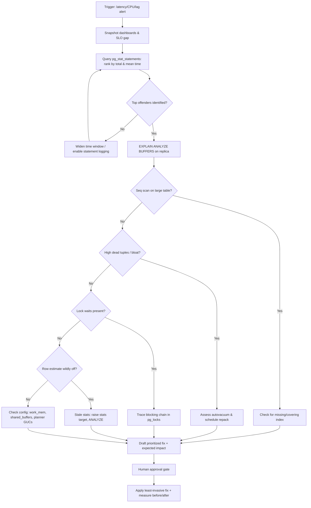
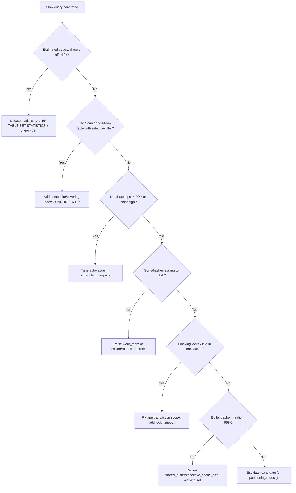

# PostgreSQL Performance Optimization

> Systematically diagnose and remediate PostgreSQL performance degradation —
> slow queries, bloat, lock contention, and misconfigured planner settings —
> and produce an evidence-backed, prioritized optimization plan.

## Objective

Identify the root cause(s) of measurable PostgreSQL performance degradation and
deliver a prioritized, low-risk remediation plan that restores p95/p99 query
latency to within SLO. "Done" means the top offending queries are explained and
attributed to a concrete cause (missing index, bloat, stale statistics, bad
plan, lock waits, I/O saturation, or configuration), each with a proposed fix,
expected impact, and a rollback path.

## Business Context

PostgreSQL frequently backs the transactional core of the business: checkout,
billing, authentication, and inventory. A 200ms regression in the hot path of a
checkout query can shave conversion by measurable percentages and cascade into
connection-pool exhaustion, elevated error rates, and paging fatigue for the
on-call rotation. Database compute is also one of the largest fixed costs in
most cloud bills; a query that scans 40M rows instead of using an index wastes
CPU, IOPS, and buffer cache that could otherwise serve real traffic. Optimizing
PostgreSQL is therefore simultaneously a reliability, revenue, and cost lever.

## Problem Statement

The database exhibits one or more of: elevated query latency (p95/p99), rising
CPU or I/O utilization, growing replication lag, connection saturation, or
lock-wait storms. The agent must locate the specific queries, tables, indexes,
or settings responsible using system catalogs and `EXPLAIN (ANALYZE, BUFFERS)`,
and separate symptoms from causes.

Out of scope: application-layer caching redesign, sharding/partitioning
strategy overhauls, major-version upgrades, and hardware procurement. These may
be *recommended* as follow-ups but are not executed by this runbook.

## Success Criteria

- [ ] Top 10 queries by total and mean execution time identified from `pg_stat_statements`.
- [ ] Each top offender has an `EXPLAIN (ANALYZE, BUFFERS)` plan captured on a replica or with a bounded statement timeout.
- [ ] Root cause classified for each offender (missing/unused index, bloat, stale stats, plan flip, lock wait, I/O bound, config).
- [ ] A prioritized remediation list produced, each item tagged with expected impact and risk.
- [ ] No mutating change applied to production without explicit human approval.
- [ ] Before/after latency captured for any change that is applied.

## Trigger Conditions

- Alert: `pg_p99_query_latency > 500ms for 10m` or `db_cpu_utilization > 85% for 15m`.
- Alert: `pg_replication_lag_seconds > 30` or `connections_used / max_connections > 0.85`.
- Schedule: monthly proactive optimization review of the top query workload.
- Manual: engineer reports a slow endpoint traced to a specific SQL statement.

## Inputs Required

| Input | Description | Example | Required |
|-------|-------------|---------|----------|
| `db_host` | Target instance or read replica endpoint | `orders-db-ro.internal:5432` | Yes |
| `database` | Database name | `orders` | Yes |
| `slo_p99_ms` | Latency SLO to restore | `300` | Yes |
| `time_window` | Analysis window | `last 24h` | Yes |
| `suspect_query` | Optional known-slow statement | `SELECT ... FROM orders ...` | No |
| `pg_version` | Major version | `15.6` | Yes |

## Required Access

| Scope | Purpose | Read/Write | Sensitivity |
|-------|---------|-----------|-------------|
| Read replica connection | Run EXPLAIN ANALYZE safely | Read | Medium |
| `pg_stat_statements` view | Rank query workload | Read | Low |
| Metrics dashboard (Prometheus/CloudWatch) | Observe CPU/IOPS/latency | Read | Low |
| `pg_catalog` / `pg_stat_*` views | Inspect bloat, locks, stats | Read | Low |
| Production write (index creation) | Apply `CREATE INDEX CONCURRENTLY` | Write | High (approval gated) |

## Assumptions

- `pg_stat_statements` is installed and `shared_preload_libraries` includes it.
- A read replica or low-traffic maintenance window exists for `EXPLAIN ANALYZE`.
- Autovacuum is enabled (default) but may be under-tuned.
- The agent can correlate DB metrics with application traffic timestamps.
- Statistics targets and table sizes are representative of production.

## Risks

| Risk | Likelihood | Impact | Mitigation |
|------|-----------|--------|------------|
| `EXPLAIN ANALYZE` runs an expensive mutating statement | Low | High | Only ANALYZE `SELECT`s, or wrap DML in a rolled-back transaction on a replica |
| `CREATE INDEX` (non-concurrent) locks the table | Medium | High | Always use `CREATE INDEX CONCURRENTLY`; never during peak |
| Dropping an "unused" index breaks a rare critical query | Medium | High | Verify across full workload window; mark invalid first, drop later |
| Aggressive `VACUUM FULL` takes an exclusive lock | Medium | High | Prefer `pg_repack` or scheduled maintenance window |
| Planner setting change regresses other queries | Medium | Medium | Change at session/role scope first, measure, then promote |

## Constraints

- No `VACUUM FULL`, `REINDEX` (blocking), or non-concurrent index builds during business hours.
- All production DDL requires an approved change ticket and a rollback plan.
- Respect data residency; do not export row-level data off the secured network.
- Keep any single mutating operation within a defined blast-radius (one table/index).
- Honor active change freezes.

## Agent Persona

Adopt the persona of a **Principal Database Reliability Engineer** with deep
PostgreSQL internals knowledge: the cost-based planner, MVCC and visibility,
heap-only tuples (HOT), the buffer cache, WAL, and autovacuum dynamics. Be
skeptical and evidence-driven — never recommend an index without a plan proving
it is needed, and never blame "the database" without pinpointing a query,
table, or setting. Prefer the least invasive fix that resolves the bottleneck.
Communicate crisply with expected-impact estimates and explicit risk. Follow
the conventions in [`docs/AI_AGENT_STANDARDS.md`](../../docs/AI_AGENT_STANDARDS.md),
especially the rule that read-only diagnosis always precedes any mutation.

## Planning Instructions

1. Restate the objective and the SLO to restore.
2. Enumerate the observability sources available (dashboards, `pg_stat_*`, logs).
3. Draft a hypothesis-ranked plan: which of the seven cause classes (index,
   bloat, stats, plan, locks, I/O, config) are most likely given the symptom.
4. Identify which steps are read-only (safe to run immediately) vs. mutating
   (require approval).
5. Externalize the plan and, because `human_in_the_loop` is `required`, request
   approval before any `CREATE INDEX`, `ANALYZE`, `VACUUM`, or `ALTER`.

## Execution Instructions

Start with read-only observation. Connect to the read replica where possible.

```sql
-- 1. Rank the workload by total time (the biggest cost centers)
SELECT
    queryid,
    calls,
    round(total_exec_time::numeric, 1)   AS total_ms,
    round(mean_exec_time::numeric, 2)     AS mean_ms,
    round((100 * total_exec_time / sum(total_exec_time) OVER ())::numeric, 1) AS pct,
    rows,
    left(query, 120) AS query
FROM pg_stat_statements
ORDER BY total_exec_time DESC
LIMIT 20;
```

```sql
-- 2. Inspect a specific offender's plan on a replica (read-only)
EXPLAIN (ANALYZE, BUFFERS, VERBOSE, FORMAT TEXT)
SELECT o.id, o.total, c.email
FROM orders o
JOIN customers c ON c.id = o.customer_id
WHERE o.created_at >= now() - interval '7 days'
  AND o.status = 'PENDING'
ORDER BY o.created_at DESC
LIMIT 100;
```

```sql
-- 3. Find missing-index candidates: heavy sequential scans on large tables
SELECT
    relname,
    seq_scan,
    seq_tup_read,
    idx_scan,
    round(seq_tup_read::numeric / NULLIF(seq_scan, 0), 0) AS avg_rows_per_seq_scan,
    n_live_tup
FROM pg_stat_user_tables
WHERE seq_scan > 0
ORDER BY seq_tup_read DESC
LIMIT 20;
```

```sql
-- 4. Find unused / rarely used indexes (candidates for removal)
SELECT
    s.schemaname, s.relname, s.indexrelname,
    s.idx_scan,
    pg_size_pretty(pg_relation_size(s.indexrelid)) AS index_size
FROM pg_stat_user_indexes s
JOIN pg_index i ON i.indexrelid = s.indexrelid
WHERE s.idx_scan < 50
  AND NOT i.indisunique
ORDER BY pg_relation_size(s.indexrelid) DESC
LIMIT 20;
```

```sql
-- 5. Estimate table/index bloat and dead tuples
SELECT
    relname,
    n_live_tup, n_dead_tup,
    round(n_dead_tup::numeric / NULLIF(n_live_tup, 0) * 100, 1) AS dead_pct,
    last_autovacuum, last_autoanalyze
FROM pg_stat_user_tables
ORDER BY n_dead_tup DESC
LIMIT 20;
```

```sql
-- 6. Check current lock waits / blocking chains
SELECT
    blocked.pid          AS blocked_pid,
    blocked.query        AS blocked_query,
    blocking.pid         AS blocking_pid,
    blocking.query       AS blocking_query,
    now() - blocked.query_start AS blocked_for
FROM pg_stat_activity blocked
JOIN pg_locks bl ON bl.pid = blocked.pid AND NOT bl.granted
JOIN pg_locks kl ON kl.locktype = bl.locktype
  AND kl.relation IS NOT DISTINCT FROM bl.relation
  AND kl.granted
JOIN pg_stat_activity blocking ON blocking.pid = kl.pid
WHERE blocked.pid <> blocking.pid;
```

Only after diagnosis and approval, apply the least-invasive mutating fix:

```sql
-- 7. Add a covering index online (approval gated)
CREATE INDEX CONCURRENTLY idx_orders_status_created
    ON orders (status, created_at DESC)
    INCLUDE (customer_id, total);

-- Refresh planner statistics for the affected table
ANALYZE orders;
```

## Investigation Workflow



## Analysis Framework

Reason across seven cause classes and correlate evidence rather than reacting to
a single signal:

1. **Missing / suboptimal index** — `Seq Scan` on large tables, high
   `seq_tup_read`, filter/join columns absent from any index. Consider composite
   and covering (`INCLUDE`) indexes and column order (equality before range).
2. **Unused / redundant index** — write amplification and bloat; `idx_scan`
   near zero over a full workload window.
3. **Bloat & dead tuples** — high `n_dead_tup`, stale `last_autovacuum`; look at
   `dead_pct` > 20% and rising heap size relative to live tuples.
4. **Stale statistics / bad plan** — `EXPLAIN ANALYZE` shows estimated vs.
   actual rows off by >10x; raise `default_statistics_target` or per-column
   stats and re-`ANALYZE`.
5. **Lock contention** — blocking chains in `pg_locks`, long `idle in
   transaction` sessions holding row/table locks.
6. **I/O / memory pressure** — `BUFFERS` output shows large `read=` (cache
   misses); low buffer cache hit ratio; spilling sorts/hashes to disk when
   `work_mem` is too small.
7. **Configuration** — `shared_buffers`, `effective_cache_size`, `work_mem`,
   `random_page_cost`, `max_parallel_workers_per_gather`, autovacuum thresholds.

Rank fixes by (expected latency reduction) / (risk × effort). Prefer index and
statistics fixes (low risk, high impact) before config changes; treat
`VACUUM FULL`/`pg_repack` as scheduled maintenance, not emergency actions.

## Decision Tree



## Validation Steps

- [ ] Re-run `EXPLAIN (ANALYZE, BUFFERS)` and confirm the plan node changed (e.g. `Seq Scan` → `Index Scan`) and actual time dropped.
- [ ] Confirm the new index is used: `idx_scan` increments in `pg_stat_user_indexes`.
- [ ] Verify p95/p99 latency on the dashboard trends back toward SLO over 30–60 min.
- [ ] Confirm no regression in other top queries via a follow-up `pg_stat_statements` snapshot (reset baseline, compare).
- [ ] Confirm CPU/IOPS reduced and no new lock waits introduced.
- [ ] Ensure index build completed `VALID` (`pg_index.indisvalid = true`).

## Expected Outputs

- A ranked table of the top offending queries with total time, mean time, and call counts.
- Captured `EXPLAIN (ANALYZE, BUFFERS)` plans (before, and after any fix).
- A root-cause classification per offender.
- A prioritized remediation plan with expected impact, risk, and rollback.
- Before/after latency and resource-utilization comparison.

## Deliverables

Produce a report using [`templates/report-template.md`](../../templates/report-template.md)
containing: executive summary, evidence (plans + catalog snapshots), root-cause
analysis, prioritized recommendations, applied changes with before/after
metrics, and follow-up items (e.g. partitioning candidates). Attach the exact
DDL executed and its rollback statements.

## Escalation Process

- **Sev-2 (SLO breach ongoing):** page the on-call DBA and post in `#db-oncall`
  with the top query, plan, and proposed fix within 15 minutes.
- **Structural issue** (needs partitioning, sharding, or major-version upgrade):
  open an RFC and route to the data-platform team; do not attempt in this runbook.
- **Approval required:** any production DDL/config change routes to the change
  approver named in the ticket. Include blast radius and rollback.

## Rollback Strategy

- New index: `DROP INDEX CONCURRENTLY idx_orders_status_created;` — safe, online.
- Config change made at session/role scope: `ALTER ROLE app RESET work_mem;`
  or revert the `ALTER SYSTEM` value and `SELECT pg_reload_conf();`.
- Statistics change: reset with `ALTER TABLE orders ALTER COLUMN status SET STATISTICS -1;` then `ANALYZE`.
- Confirm rollback by re-running the offending query's plan and verifying the
  metric returns to its pre-change baseline.

## Post-Execution Review

- Which cause class was it, and could an alert have caught it earlier?
- Should the fix (index, autovacuum tuning) become a standing migration?
- Did `pg_stat_statements` have enough retention? Consider `pg_stat_statements.max`.
- What guardrail (query linter, index advisor in CI) would prevent recurrence?

## Metrics

| Metric | Definition | Target |
|--------|-----------|--------|
| MTTD | Time from regression to detection | < 10m |
| MTTR | Time from trigger to SLO restored | < 2h |
| p99 query latency | Post-fix p99 for target query | < `slo_p99_ms` |
| Buffer cache hit ratio | `blks_hit / (blks_hit + blks_read)` | > 99% |
| Diagnosis accuracy | Fixes that produced predicted impact | > 90% |
| Regression rate | Changes causing a new regression | < 5% |

## Example Execution

**Input:** `db_host=orders-db-ro.internal`, `database=orders`, `slo_p99_ms=300`,
alert `pg_p99_query_latency > 500ms for 10m`.

**Agent reasoning (abridged):** Ranked `pg_stat_statements`; the top query by
total time was the pending-orders dashboard query consuming 38% of total
execution time. `EXPLAIN (ANALYZE, BUFFERS)` showed a `Seq Scan on orders`
reading 4.2M rows to return 100, with a filter on `(status, created_at)` and no
supporting index. Estimated vs. actual rows were close, ruling out stale stats;
dead-tuple percentage was 6%, ruling out bloat. Classified as **missing index**.

```text
Before:
 Limit (actual time=812.4..812.6 rows=100)
   ->  Sort (actual time=812.4..812.5 rows=100)
         Sort Method: top-N heapsort  Memory: 96kB
         ->  Seq Scan on orders (actual time=0.02..absent 5..absent rows=41,893)
               Filter: (status = 'PENDING' AND created_at >= now() - '7 days')
               Rows Removed by Filter: 4,158,107
               Buffers: shared read=58,214

After CREATE INDEX CONCURRENTLY idx_orders_status_created (status, created_at DESC):
 Limit (actual time=0.09..0.21 rows=100)
   ->  Index Scan using idx_orders_status_created on orders (actual time=0.08..0.19 rows=100)
         Index Cond: (status = 'PENDING' AND created_at >= now() - '7 days')
         Buffers: shared hit=104
```

**Outcome:** Query mean time fell from 812ms to 0.21ms; dashboard p99 dropped
from 540ms to 190ms within 25 minutes. Index build completed `VALID` online with
no locking. Rollback (`DROP INDEX CONCURRENTLY`) documented. Follow-up filed to
add a CI index-advisor check.

## References

- [`docs/AI_AGENT_STANDARDS.md`](../../docs/AI_AGENT_STANDARDS.md)
- [`templates/report-template.md`](../../templates/report-template.md)
- [MySQL Performance Analysis runbook](./mysql-performance-analysis.md)
- PostgreSQL docs: `EXPLAIN`, `pg_stat_statements`, autovacuum, and planner configuration.
