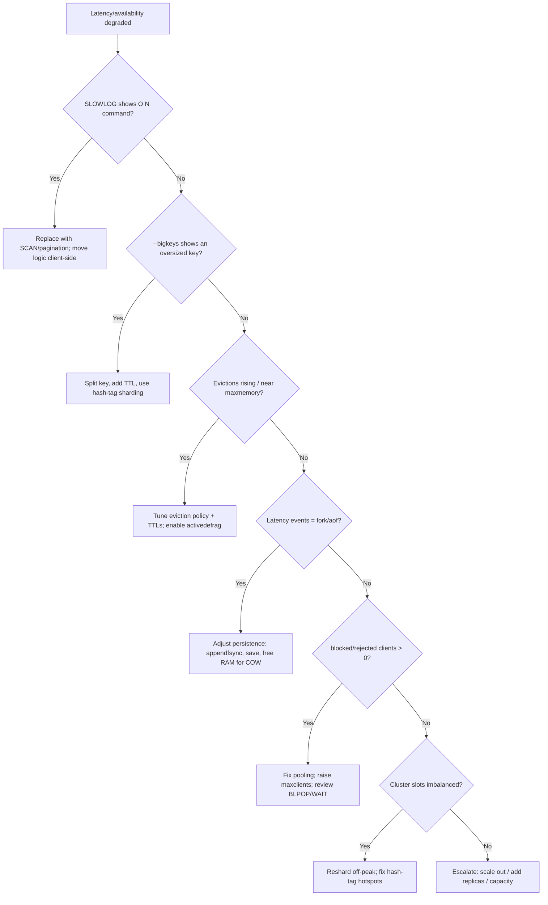

# Redis Performance Diagnostics

> Diagnose Redis latency spikes, memory pressure, eviction storms, blocking
> commands, and cluster/replication issues — then deliver a targeted remediation
> plan that restores sub-millisecond hot-path latency.

## Objective

Determine why Redis latency, memory, or availability has degraded and produce a
prioritized remediation plan. "Done" means the dominant cause — slow/blocking
commands, memory fragmentation or eviction, hot/large keys, persistence stalls,
network/CPU saturation, or cluster imbalance — is identified with evidence from
`INFO`, `SLOWLOG`, `LATENCY`, and keyspace analysis, and each finding has a fix,
expected impact, and rollback.

## Business Context

Redis is the latency-critical layer for sessions, rate limiters, feature flags,
leaderboards, queues, and read-through caches. When Redis stalls, every
downstream service that assumed a sub-millisecond cache hit suddenly falls back
to the database — often triggering a thundering herd that takes down the very
datastore Redis was protecting. A single `KEYS *` in production, an unbounded
list, or an eviction storm can convert a healthy system into a cascading outage
in seconds. Keeping Redis fast and predictable protects the entire dependency
graph and prevents expensive database over-provisioning.

## Problem Statement

Redis shows elevated command latency, rising memory with evictions, high CPU on
the single-threaded event loop, blocked clients, replication link drops, or
uneven load across cluster shards. The agent must isolate the responsible
commands, keys, or configuration and separate the symptom (latency) from the
cause (e.g., a `O(N)` command scanning a million-element set).

Out of scope: application caching-strategy redesign, migrating to a different
cache technology, and capacity procurement — these can be recommended but are
not executed here.

## Success Criteria

- [ ] `SLOWLOG` reviewed and top slow commands identified with their keys.
- [ ] `INFO` snapshot captured (memory, stats, clients, persistence, replication).
- [ ] `LATENCY` events and latency histogram analyzed.
- [ ] Dominant cause classified (slow/blocking command, memory/eviction, hot/big key, persistence, network/CPU, cluster imbalance).
- [ ] Prioritized remediation list with expected impact and risk.
- [ ] No destructive command (`FLUSHALL`, `FLUSHDB`, blocking `KEYS`) run in production.
- [ ] Before/after latency captured for applied changes.

## Trigger Conditions

- Alert: `redis_command_latency_p99 > 5ms for 5m` or `redis_blocked_clients > 0`.
- Alert: `redis_evicted_keys` rate rising or `used_memory / maxmemory > 0.9`.
- Alert: `redis_rejected_connections > 0` or replica link down.
- Schedule: weekly keyspace and slowlog hygiene review.
- Manual: engineer reports cache-dependent endpoint timeouts.

## Inputs Required

| Input | Description | Example | Required |
|-------|-------------|---------|----------|
| `redis_endpoint` | Host:port (prefer replica) | `sessions-redis-ro.internal:6379` | Yes |
| `topology` | standalone / sentinel / cluster | `cluster` | Yes |
| `slo_p99_ms` | Latency SLO | `2` | Yes |
| `maxmemory_policy` | Current eviction policy | `allkeys-lru` | Yes |
| `time_window` | Analysis window | `last 6h` | Yes |
| `redis_version` | Version | `7.2` | Yes |

## Required Access

| Scope | Purpose | Read/Write | Sensitivity |
|-------|---------|-----------|-------------|
| `redis-cli` read-only (replica) | Run diagnostics safely | Read | Medium |
| `INFO` / `SLOWLOG` / `LATENCY` | Collect metrics | Read | Low |
| Metrics dashboard | Observe latency/memory/CPU | Read | Low |
| `CONFIG SET` on primary | Apply tuning (policy, limits) | Write | High (approval gated) |

## Assumptions

- A replica is available so read-only diagnostics avoid loading the primary.
- `SLOWLOG` is enabled with a reasonable `slowlog-log-slower-than` (e.g. 10000µs).
- Latency monitoring is enabled (`latency-monitor-threshold` > 0).
- The client uses connection pooling; connection churn is observable.
- For cluster topology, slot distribution and per-node stats are reachable.

## Risks

| Risk | Likelihood | Impact | Mitigation |
|------|-----------|--------|------------|
| `KEYS *` / `SMEMBERS` on huge keys blocks the event loop | High | Critical | Always use `SCAN`/`OBJECT ENCODING`; never `KEYS` in prod |
| `CONFIG SET maxmemory-policy` causes mass eviction | Medium | High | Change during low traffic; monitor `evicted_keys` |
| Enabling AOF `everysec`→`always` stalls writes | Medium | High | Test on replica; understand fsync cost |
| `DEBUG SLEEP` / `MONITOR` degrades a busy instance | Medium | High | Never run `MONITOR` on hot primary; sample instead |
| Resharding a cluster slot moves hot data | Medium | Medium | Reshard off-peak; verify slot migration health |

## Constraints

- Never run `FLUSHALL`, `FLUSHDB`, unbounded `KEYS`, or `MONITOR` on a busy primary.
- All `CONFIG SET`/topology changes require an approved ticket and rollback.
- Respect data residency; do not dump key values off the secured network.
- Keep changes within a single-node/single-config blast radius where possible.
- Honor active change freezes.

## Agent Persona

Adopt the persona of a **Principal Platform Engineer** who understands that
Redis executes commands on a single main thread, so any `O(N)` command,
persistence fork, or large-key operation directly inflates tail latency for
every other client. Reason about time complexity of commands, memory encoding
(`listpack` vs `hashtable`/`skiplist`), copy-on-write during `BGSAVE`, and the
difference between logical and RSS memory. Be conservative — prefer client-side
and data-model fixes over risky server config changes. Follow
[`docs/AI_AGENT_STANDARDS.md`](../../docs/AI_AGENT_STANDARDS.md): observe on a
replica first, mutate only with approval.

## Planning Instructions

1. Restate the objective and latency SLO.
2. Enumerate observability: dashboards, `INFO`, `SLOWLOG`, `LATENCY`, keyspace tools.
3. Rank likely cause classes given the symptom (latency vs memory vs availability).
4. Mark read-only steps (safe now) vs mutating (approval gated).
5. Externalize the plan; because `human_in_the_loop` is `required`, get approval
   before any `CONFIG SET`, resharding, or persistence change.

## Execution Instructions

Run diagnostics against a replica where possible.

```bash
# 1. Live latency sampling and worst-case spikes (read-only, cheap)
redis-cli -h sessions-redis-ro.internal --latency
redis-cli -h sessions-redis-ro.internal --latency-history -i 5
redis-cli -h sessions-redis-ro.internal LATENCY LATEST
redis-cli -h sessions-redis-ro.internal LATENCY HISTORY command
```

```bash
# 2. Slow command log with keys and durations (microseconds)
redis-cli SLOWLOG GET 25
redis-cli SLOWLOG LEN
```

```bash
# 3. INFO sections that matter most
redis-cli INFO memory        # used_memory, used_memory_rss, mem_fragmentation_ratio, maxmemory*
redis-cli INFO stats         # evicted_keys, expired_keys, keyspace_hits/misses, instantaneous_ops_per_sec
redis-cli INFO clients       # connected_clients, blocked_clients, maxclients
redis-cli INFO persistence   # rdb_last_bgsave_status, aof_enabled, aof_last_write_status
redis-cli INFO replication   # role, connected_slaves, master_link_status, repl offset lag
redis-cli INFO commandstats  # per-command calls, usec_per_call
```

```bash
# 4. Find big/hot keys WITHOUT blocking (sampling)
redis-cli --bigkeys              # samples largest key per type
redis-cli --hotkeys              # requires maxmemory-policy with LFU
redis-cli --memkeys              # memory usage sampling (7.x)

# Inspect a suspect key safely
redis-cli MEMORY USAGE user:sessions:index
redis-cli OBJECT ENCODING user:sessions:index
redis-cli TYPE user:sessions:index
redis-cli SCAN 0 MATCH 'session:*' COUNT 100   # iterate, never KEYS *
```

```bash
# 5. Cluster health & slot balance (cluster topology)
redis-cli --cluster check sessions-redis.internal:6379
redis-cli CLUSTER INFO
redis-cli CLUSTER SLOTS
```

Only after diagnosis and approval, apply the least-invasive mutating fix:

```bash
# 6. Tune eviction policy / memory ceiling (approval gated, off-peak)
redis-cli CONFIG SET maxmemory-policy allkeys-lru
redis-cli CONFIG SET maxmemory 12gb
redis-cli CONFIG SET slowlog-log-slower-than 5000
redis-cli CONFIG REWRITE   # persist to redis.conf
```

## Investigation Workflow

```mermaid
flowchart TD
    A[Trigger: latency/memory/availability alert] --> B[Snapshot dashboards + INFO]
    B --> C[redis-cli --latency + LATENCY LATEST]
    C --> D{Latency spikes correlated with an event?}
    D -->|Yes| E[Check LATENCY HISTORY: fork, aof, expire, command]
    D -->|No| F[SLOWLOG GET: find O(N)/blocking commands]
    E --> G{Persistence fork/AOF stall?}
    G -->|Yes| H[Review BGSAVE timing, COW, aof fsync policy]
    G -->|No| F
    F --> I{Slow command tied to a big/hot key?}
    I -->|Yes| J[--bigkeys/--hotkeys; inspect encoding & size]
    I -->|No| K{used_memory near maxmemory / evictions rising?}
    K -->|Yes| L[Review eviction policy, TTLs, fragmentation ratio]
    K -->|No| M{blocked_clients or rejected_connections > 0?}
    M -->|Yes| N[Check BLPOP/WAIT, maxclients, pool churn]
    M -->|No| O{Cluster slot imbalance / link down?}
    O -->|Yes| P[cluster check; assess reshard]
    O -->|No| Q[Check CPU saturation / network]
    H --> R[Draft prioritized fix + impact]
    J --> R
    L --> R
    N --> R
    P --> R
    Q --> R
    R --> S[Human approval gate]
    S --> T[Apply fix + measure before/after]
```

## Analysis Framework

Classify the dominant cause:

1. **Slow / blocking commands** — `SLOWLOG` shows `O(N)` commands (`KEYS`,
   `SMEMBERS`, `HGETALL`, `LRANGE 0 -1`, `SORT`) or Lua scripts hogging the main
   thread. Fix by replacing with `SCAN`/paginated access or moving work
   client-side.
2. **Big / hot keys** — a single key holds millions of elements or absorbs a
   disproportionate share of ops. Split keys, add TTLs, or shard by hash tag.
   Watch `OBJECT ENCODING` transitions (`listpack` → `hashtable`) that raise cost.
3. **Memory pressure / eviction** — `used_memory` near `maxmemory`, rising
   `evicted_keys`, `mem_fragmentation_ratio` > 1.5 (fragmentation) or < 1 (swap).
   Tune policy (`allkeys-lru`/`allkeys-lfu`/`volatile-ttl`), set TTLs, enable
   `activedefrag`.
4. **Persistence stalls** — `rdb_last_bgsave_status` failures, long fork times,
   AOF rewrite pauses; latency events labeled `fork`/`aof-write`. Adjust
   `save`/`appendfsync`, ensure enough free RAM for COW.
5. **Client/connection issues** — `blocked_clients`, `rejected_connections`,
   connection churn from missing pooling; raise `maxclients`, fix the client.
6. **CPU / network saturation** — `instantaneous_ops_per_sec` and CPU pinned;
   consider read replicas, cluster scaling, pipelining, or `io-threads`.
7. **Cluster imbalance** — uneven slots/keys per node; reshard or fix hash-tag
   design causing hot slots.

Prefer client/data-model fixes (safe, durable) before server config changes, and
treat resharding/persistence changes as scheduled operations.

## Decision Tree



## Validation Steps

- [ ] Re-run `redis-cli --latency`; p99 within `slo_p99_ms`.
- [ ] `SLOWLOG LEN` no longer growing; offending command absent.
- [ ] `evicted_keys` rate flat; `used_memory` comfortably below `maxmemory`.
- [ ] `mem_fragmentation_ratio` in healthy range (~1.0–1.5).
- [ ] `blocked_clients` = 0 and `rejected_connections` not increasing.
- [ ] `keyspace_hits/(hits+misses)` hit ratio maintained or improved.
- [ ] Cluster `--cluster check` reports all slots covered and balanced.

## Expected Outputs

- `SLOWLOG` extract with offending commands and keys.
- `INFO` snapshot (memory/stats/clients/persistence/replication).
- `LATENCY` event summary and big/hot key report.
- Root-cause classification and prioritized remediation with impact/risk.
- Before/after latency and memory comparison.

## Deliverables

Produce a report using [`templates/report-template.md`](../../templates/report-template.md):
executive summary, evidence (`INFO`/`SLOWLOG`/`LATENCY`/keyspace), root-cause,
prioritized recommendations, applied changes with before/after metrics, and
follow-ups (key-model redesign, pooling fixes, cluster scaling). Include exact
`CONFIG SET` commands and rollback values.

## Escalation Process

- **Sev-1 (cache down / cascading DB overload):** page on-call platform + DBA;
  consider enabling client-side circuit breakers to protect the database.
- **Sev-2 (latency SLO breach):** post `SLOWLOG`, `INFO memory`, and proposed
  fix in `#cache-oncall` within 15 minutes.
- **Approval required:** `CONFIG SET`, persistence changes, and resharding route
  to the change approver with blast radius and rollback.

## Rollback Strategy

- Config: capture originals first (`CONFIG GET maxmemory-policy`), then
  `CONFIG SET maxmemory-policy <original>` and `CONFIG REWRITE`.
- Persistence: revert `appendfsync`/`save` to prior values; disable
  `activedefrag` if it added CPU pressure.
- Resharding: cluster slot moves are reversible via `redis-cli --cluster
  reshard` back to the source node; verify with `--cluster check`.
- Confirm rollback by re-sampling `--latency` and `INFO` against the baseline.

## Post-Execution Review

- Was the trigger a code path issuing `O(N)` commands? File a client fix.
- Are TTLs and key-size limits enforced at write time?
- Is `maxmemory` sized with headroom for COW during `BGSAVE`?
- Should a lint rule ban `KEYS`/`FLUSHALL` in application code?

## Metrics

| Metric | Definition | Target |
|--------|-----------|--------|
| MTTD | Time from spike to detection | < 5m |
| MTTR | Time from trigger to SLO restored | < 1h |
| Command p99 latency | Post-fix p99 | < `slo_p99_ms` |
| Cache hit ratio | `hits/(hits+misses)` | > 95% |
| Eviction rate | `evicted_keys` per minute | ~0 (unless intentional) |
| Fragmentation ratio | `mem_fragmentation_ratio` | 1.0–1.5 |

## Example Execution

**Input:** `redis_endpoint=sessions-redis-ro.internal`, `topology=cluster`,
`slo_p99_ms=2`, alert `redis_command_latency_p99 > 5ms`.

**Agent reasoning (abridged):** `--latency` showed p99 at 14ms. `SLOWLOG GET`
revealed repeated `SMEMBERS active_sessions` at ~9,000µs. `--bigkeys` found
`active_sessions` was a SET with 3.1M members encoded as a `hashtable`. Each
`SMEMBERS` materialized the entire set on the main thread, blocking all other
clients. Memory and eviction were healthy; not a memory problem. Classified as
**big key + O(N) command**.

```text
SLOWLOG (excerpt):
 1) id=48213  ts=1723545600  usec=9042  cmd="SMEMBERS active_sessions"
 2) id=48210  ts=1723545597  usec=8771  cmd="SMEMBERS active_sessions"

--bigkeys (excerpt):
 [SET] active_sessions  members=3,102,884  encoding=hashtable  ~248 MB

After: replaced SMEMBERS with SSCAN pagination (COUNT 500) in the client,
and added a 24h TTL sweep; introduced per-shard sets via hash tags.
```

**Outcome:** p99 latency dropped from 14ms to 0.6ms after the client stopped
issuing full-set reads; no server config change was needed. Follow-up: add a lint
rule flagging `SMEMBERS`/`KEYS`, and enforce set-size caps at write time.

## References

- [`docs/AI_AGENT_STANDARDS.md`](../../docs/AI_AGENT_STANDARDS.md)
- [`templates/report-template.md`](../../templates/report-template.md)
- [MongoDB Health Review runbook](./mongodb-health-review.md)
- Redis docs: `SLOWLOG`, `LATENCY`, `INFO`, memory optimization, cluster tutorial.
