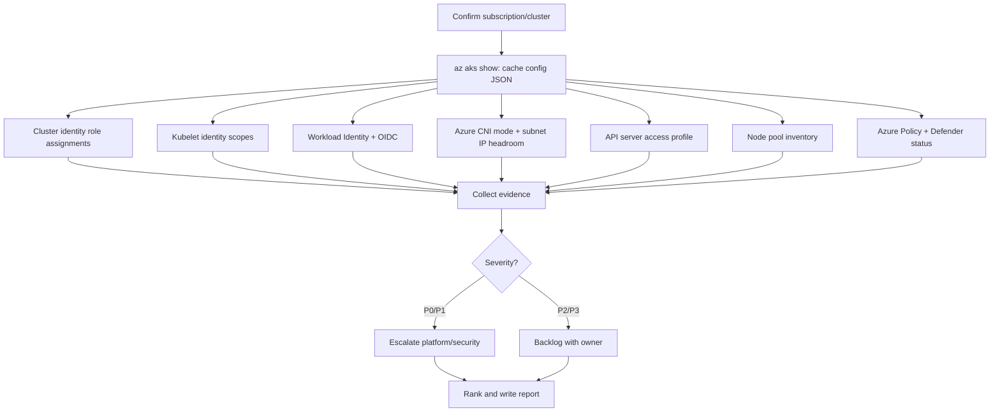
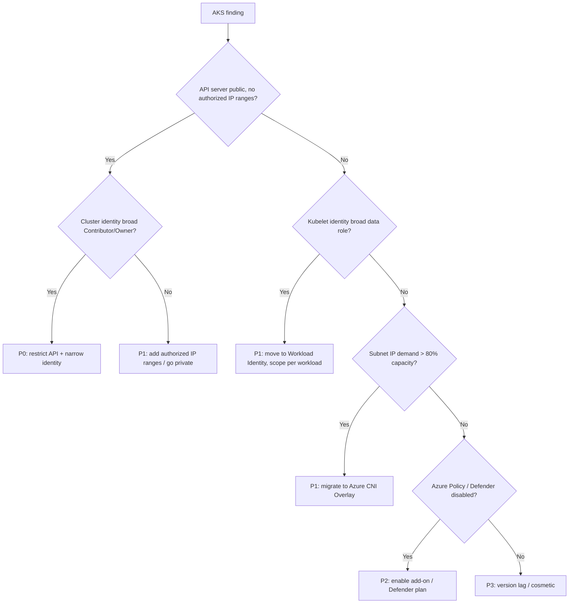

# Azure AKS Audit

> An Azure-specific operational playbook for autonomous agents to audit an AKS cluster's managed identity / workload identity, Azure CNI networking, node pools, Azure Policy add-on, and AKS security-baseline posture.

## Objective

Produce an evidence-backed assessment of an Azure Kubernetes Service (AKS)
cluster's Azure-native controls — cluster and kubelet managed identities,
Microsoft Entra Workload Identity, Azure CNI (Overlay vs. traditional) and IP
planning, API server authorized IP ranges / private cluster config, node pool
composition and version currency, the Azure Policy add-on, Microsoft Defender
for Containers, and the AKS security baseline — and deliver a ranked remediation
plan with concrete `az aks` commands. "Done" means all Success Criteria are
checked and a report is committed.

## Business Context

AKS underpins the organization's Azure workloads. Its trust boundary spans
Kubernetes objects and Azure resources: an over-privileged kubelet identity can
grant pods access to Key Vault secrets or storage; a public API server without
authorized IP ranges exposes the control plane; poor Azure CNI IP planning
causes `SubnetIsFull` failures that block scaling; a disabled Azure Policy
add-on means no Gatekeeper guardrails; missing Defender for Containers removes
runtime threat detection. Aligning to the Microsoft AKS security baseline and
Azure Well-Architected reduces breach blast radius, prevents scaling outages,
and satisfies Microsoft Cloud Security Benchmark (MCSB) controls. AKS control
plane is free on the Free tier, so node pool right-sizing is the main cost lever.

## Problem Statement

AKS clusters drift as teams grant broad Azure RBAC role assignments to the
cluster identity, run public API servers, over-allocate node pools, disable the
Azure Policy add-on, and fall behind on Kubernetes patch versions. Symptoms:
kubelet identity with `Contributor` at subscription scope, `SubnetIsFull` on
scale-out, System node pool running user workloads, and node images months out
of date. This runbook detects and ranks these. **Out of scope:** performing the
cluster upgrade, rotating identities, and container image vulnerability scanning
(Defender surfaces those separately).

## Success Criteria

- [ ] Cluster identity type (system-assigned/user-assigned) and its Azure role assignments are enumerated.
- [ ] Kubelet identity and its scope/role assignments are recorded (Key Vault, ACR, storage access).
- [ ] Microsoft Entra Workload Identity + OIDC issuer enablement is captured, with federated credential mappings.
- [ ] Azure CNI mode (Overlay/traditional/kubenet legacy), pod CIDR, and subnet free-IP headroom are reported.
- [ ] API server access profile (private cluster, authorized IP ranges) is recorded.
- [ ] Node pool inventory (mode System/User, VM size, autoscale, OS SKU, K8s version) is captured.
- [ ] Azure Policy add-on and Defender for Containers enablement states are captured.
- [ ] A ranked remediation table (P0–P3) is delivered in the report template.

## Trigger Conditions

- Schedule: quarterly AKS security-baseline review.
- Alert: Defender for Cloud recommendation, `SubnetIsFull`, or public-endpoint drift.
- Manual: inheriting an AKS cluster or pre-upgrade readiness.
- Change: before enabling Workload Identity or a new node pool.

## Inputs Required

| Input | Description | Example | Required |
|-------|-------------|---------|----------|
| `cluster_name` | AKS cluster name | `prod-main` | Yes |
| `resource_group` | Resource group | `rg-prod-aks` | Yes |
| `subscription_id` | Azure subscription | `00000000-0000-0000-0000-000000000000` | Yes |
| `environment` | Deployment tier | `prod` | Yes |
| `owners_map` | Identity → team mapping | `team-map.yaml` | No |

## Required Access

| Scope | Purpose | Read/Write | Sensitivity |
|-------|---------|-----------|-------------|
| Read-only kubeconfig + `view` ClusterRole | List SAs, pods, policies | Read | Medium |
| Azure `Reader` on the cluster resource group | Cluster/node pool config | Read | Medium |
| `Microsoft.Authorization/*/read` | Role assignments of identities | Read | High |
| Azure Policy read | Add-on assignments & compliance | Read | Low |
| Defender for Cloud read | Container plan status | Read | Low |

## Assumptions

- The agent can run `az` CLI (with `aks` extension) using a Reader principal and `kubectl` against the cluster.
- The cluster is AKS-managed (not Azure Arc-connected, which is audited separately).
- The Reader principal can also read role assignments (`Microsoft.Authorization`).
- The cluster runs a supported AKS Kubernetes version.
- If role-assignment read is denied, the agent escalates rather than omitting identity findings.

## Risks

| Risk | Likelihood | Impact | Mitigation |
|------|-----------|--------|------------|
| Auditing wrong subscription | Low | High | Echo `az account show` and confirm before proceeding |
| Flagging a legitimate kubelet ACR pull role | Medium | Low | ACR `AcrPull` is expected; verify scope narrowness only |
| Point-in-time subnet IP reading | Medium | Medium | Report free IPs AND max pods × nodes projection |
| Misreading Overlay vs traditional CNI | Low | Medium | Confirm `networkPluginMode` field explicitly |

## Constraints

- Read-only: no `az aks update/create/scale`, no `kubectl apply`.
- Do not print Key Vault secret values; report access grants only.
- Respect change freezes; recommendations only.
- Keep Azure Resource Manager calls within read throttling limits.

## Agent Persona

Adopt the persona of a **Principal Azure Platform / AKS Specialist Engineer**
who knows the AKS security baseline, MCSB, and the differences between
system-assigned, user-assigned, kubelet, and Workload Identity. Be exact about
role-assignment scopes, subnet CIDRs, and `az aks` flags. Never recommend
`Contributor` at subscription scope; always propose the narrowest scope.
Follow [`docs/AI_AGENT_STANDARDS.md`](../../docs/AI_AGENT_STANDARDS.md). Resist
over-flagging expected grants (AcrPull, managed add-on identities).

## Planning Instructions

1. Echo `az account show`; confirm `subscription_id`/`cluster_name`/`environment`.
2. `az aks show` once and cache the JSON (identity, apiServerAccessProfile, networkProfile, nodePools, addonProfiles).
3. Enumerate identities to inspect: cluster identity, kubelet identity, and any Workload Identity federated credentials.
4. Plan CNI/IP analysis based on `networkPluginMode` and node subnet.
5. Externalize the plan; for `prod`, wait for approval when HITL is required.
6. Define ranking rubric (P0 = public API + broad identity; P3 = version lag).

## Execution Instructions

```bash
# 0. Confirm target
az account show --output json | jq '{sub:.id, name:.name}'
az aks show -g "$RG" -n "$CLUSTER" --output json > cluster.json
jq '{version:.kubernetesVersion,
     apiAccess:.apiServerAccessProfile,
     privateCluster:.apiServerAccessProfile.enablePrivateCluster,
     network:{plugin:.networkProfile.networkPlugin, mode:.networkProfile.networkPluginMode,
              podCidr:.networkProfile.podCidr, serviceCidr:.networkProfile.serviceCidr},
     oidc:.oidcIssuerProfile.enabled,
     workloadIdentity:.securityProfile.workloadIdentity.enabled,
     defender:.securityProfile.defender,
     addons:.addonProfiles}' cluster.json

# 1. Cluster identity + role assignments
CID=$(jq -r '.identity.principalId // .servicePrincipalProfile.clientId' cluster.json)
az role assignment list --assignee "$CID" --all --output table

# 2. Kubelet identity (pulls images, may access Key Vault via CSI)
KID=$(jq -r '.identityProfile.kubeletidentity.objectId' cluster.json)
az role assignment list --assignee "$KID" --all --output table

# 3. Workload Identity: OIDC issuer + federated credentials on user-assigned MIs
az aks show -g "$RG" -n "$CLUSTER" --query "oidcIssuerProfile.issuerUrl" -o tsv
kubectl get sa -A -o json \
  | jq -r '.items[] | select(.metadata.annotations["azure.workload.identity/client-id"])
    | "\(.metadata.namespace)/\(.metadata.name)\t\(.metadata.annotations["azure.workload.identity/client-id"])"'

# 4. Azure CNI IP headroom (traditional Azure CNI consumes subnet IPs per pod)
SUBNET_ID=$(jq -r '.agentPoolProfiles[0].vnetSubnetId' cluster.json)
az network vnet subnet show --ids "$SUBNET_ID" \
  --query '{cidr:addressPrefix, available:availableIpAddressCount}' -o json

# 5. Node pools
az aks nodepool list -g "$RG" --cluster-name "$CLUSTER" -o json \
  | jq -r '.[] | "\(.name)\tmode=\(.mode)\tvm=\(.vmSize)\tos=\(.osSku)\tk8s=\(.orchestratorVersion)\tauto=\(.enableAutoScaling)\tmin=\(.minCount)\tmax=\(.maxCount)"'

# 6. Azure Policy add-on + Gatekeeper constraints
jq '.addonProfiles.azurepolicy.enabled' cluster.json
kubectl get constrainttemplates 2>/dev/null | head

# 7. Node image / version currency
az aks nodepool get-upgrades -g "$RG" --cluster-name "$CLUSTER" --nodepool-name "$NP" -o json
az aks get-upgrades -g "$RG" -n "$CLUSTER" -o json | jq '.controlPlaneProfile.upgrades'
```

## Investigation Workflow



## Analysis Framework

Correlate Azure and Kubernetes layers. Highest-risk combinations:

- **Public API server (no `authorizedIpRanges`, not private) + cluster identity with `Contributor`/`Owner` at subscription or RG scope** → P0.
- **Kubelet identity granted broad data-plane roles** (Storage Blob Data Contributor at subscription scope) → P1; recommend Workload Identity scoped per workload instead.
- **Traditional Azure CNI on a subnet with `availableIpAddressCount` low relative to `maxPods × maxNodes`** → P1 `SubnetIsFull` risk; recommend Azure CNI Overlay migration.
- **Azure Policy add-on disabled** → no admission guardrails → P2.
- **Defender for Containers off** → no runtime detection → P2.
- **System node pool running user workloads / behind on version** → P2/P3.

Thresholds: alert when projected max pod IP demand exceeds 80% of subnet
capacity; treat any identity with `Owner`/`Contributor` above resource-group
scope as P1; treat public API without authorized IP ranges as P1 (P0 if paired
with broad identity). Verify `AcrPull` and add-on identities against the owners
map before flagging.

## Decision Tree



## Validation Steps

- [ ] Re-run `az aks show` and confirm API/network/identity values match the report.
- [ ] Confirm `az account show` subscription == `subscription_id`.
- [ ] Verify each Workload Identity federated credential maps to the expected SA.
- [ ] Confirm no `az aks update/scale/create` or `kubectl apply` in the artifacts.
- [ ] Re-check subnet `availableIpAddressCount` to confirm headroom figures.

## Expected Outputs

- Identity table: cluster identity + kubelet identity role assignments with scopes.
- Workload Identity federated-credential mapping.
- CNI mode + subnet IP headroom projection.
- API server access posture and node pool inventory.
- Azure Policy / Defender enablement status.
- Ranked P0–P3 remediation table.

## Deliverables

A report following
[`templates/report-template.md`](../../templates/report-template.md), attached
to the triggering ticket, including the identity table, networking headroom,
node pool inventory, and an action plan with owners and `az aks` remediation
snippets (e.g. `az aks update --api-server-authorized-ip-ranges`,
`az aks enable-addons --addons azure-policy`, Workload Identity enablement).

## Escalation Process

- **P0 (public API + broad identity):** page platform + security on-call
  immediately; attach evidence within 15 minutes.
- **P1 (kubelet over-privilege, IP exhaustion imminent):** high-priority ticket,
  48h SLA.
- **P2/P3:** quarterly AKS hardening backlog.
- Include cluster, subscription, resource group, identity object ID, evidence, and fix.

## Rollback Strategy

Read-only execution has nothing to roll back. If a downstream remediation
regresses (e.g. authorized IP ranges lock out CI, or Overlay migration disrupts
addressing), roll back via the Bicep/Terraform config in Git: revert, re-apply,
and confirm with `az aks show` / `kubectl get nodes` that the prior known-good
state is restored and workloads schedule normally.

## Post-Execution Review

- Should the API server be private with authorized IP ranges enforced by policy?
- Can Workload Identity be mandated so kubelet-identity data access is eliminated?
- Should Azure CNI Overlay be the default network mode in the module?
- Are Azure Policy add-on and Defender for Containers enabled by landing-zone default?

## Metrics

| Metric | Definition | Target |
|--------|-----------|--------|
| API exposure | Clusters public without authorized IP ranges | 0 |
| Identity over-privilege | Identities with role above RG scope | 0 |
| CNI IP headroom | Projected demand vs subnet capacity | < 80% |
| Guardrails enabled | Azure Policy add-on + Defender on | 100% |
| Version currency | Node pools within N-2 of latest supported | 100% |
| Audit duration | Wall-clock to complete | < 3h |

## Example Execution

**Inputs:** `cluster_name=prod-main`, `resource_group=rg-prod-aks`,
`subscription_id=0000...0000`, `environment=prod`.

**Agent reasoning (abridged):** subscription confirmed. Cluster v1.29,
`enablePrivateCluster=false`, `authorizedIpRanges` empty → public API. Cluster
identity has `Contributor` at subscription scope → combined P0. Kubelet identity
has `Storage Blob Data Contributor` at RG scope (needs only one container) → P1.
Node pool `userpool1` uses traditional Azure CNI on a `/24` with 22 free IPs;
`maxPods=30 × maxNodes=10` projects 300 IPs > capacity → P1 SubnetIsFull. Azure
Policy add-on disabled → P2.

**Sample report excerpt:**

```text
F1 (P0) — API server public with no authorized IP ranges; cluster identity is
  subscription-scoped Contributor.
  Evidence: apiServerAccessProfile.authorizedIpRanges=[]; enablePrivateCluster=false;
            role assignment Contributor scope=/subscriptions/0000....
  Fix: az aks update --api-server-authorized-ip-ranges <corp-cidrs> (or private
       cluster); reassign identity to RG scope. Escalated 10:41 UTC.

F2 (P1) — Kubelet identity has Storage Blob Data Contributor at RG scope.
  Fix: enable Workload Identity; grant blob access to the specific workload SA
       scoped to the single container.

F3 (P1) — userpool1 traditional Azure CNI subnet projected over capacity.
  Fix: migrate to Azure CNI Overlay to decouple pod IPs from the subnet.
```

## References

- [`docs/AI_AGENT_STANDARDS.md`](../../docs/AI_AGENT_STANDARDS.md)
- [`templates/report-template.md`](../../templates/report-template.md)
- [Generic Kubernetes Cluster Audit](./kubernetes-cluster-audit.md)
- [Azure Cost Optimization runbook](../cloud-cost/azure-cost-optimization.md)
- AKS security baseline; Microsoft Entra Workload Identity docs; Azure CNI Overlay docs
