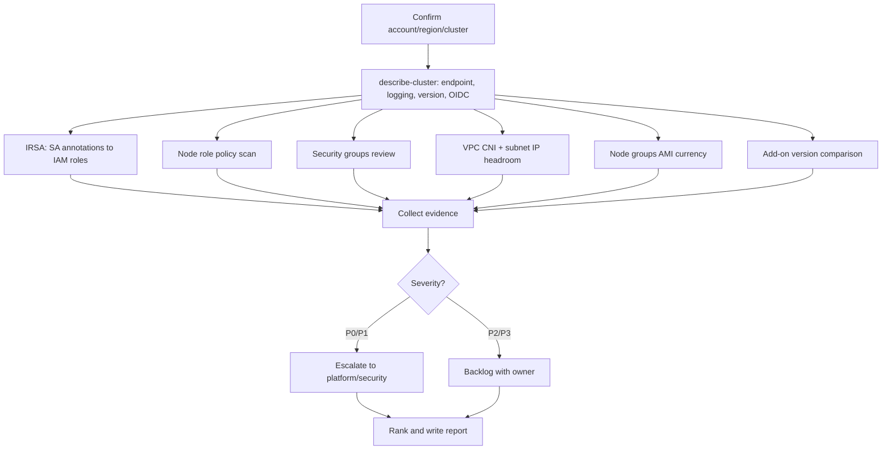
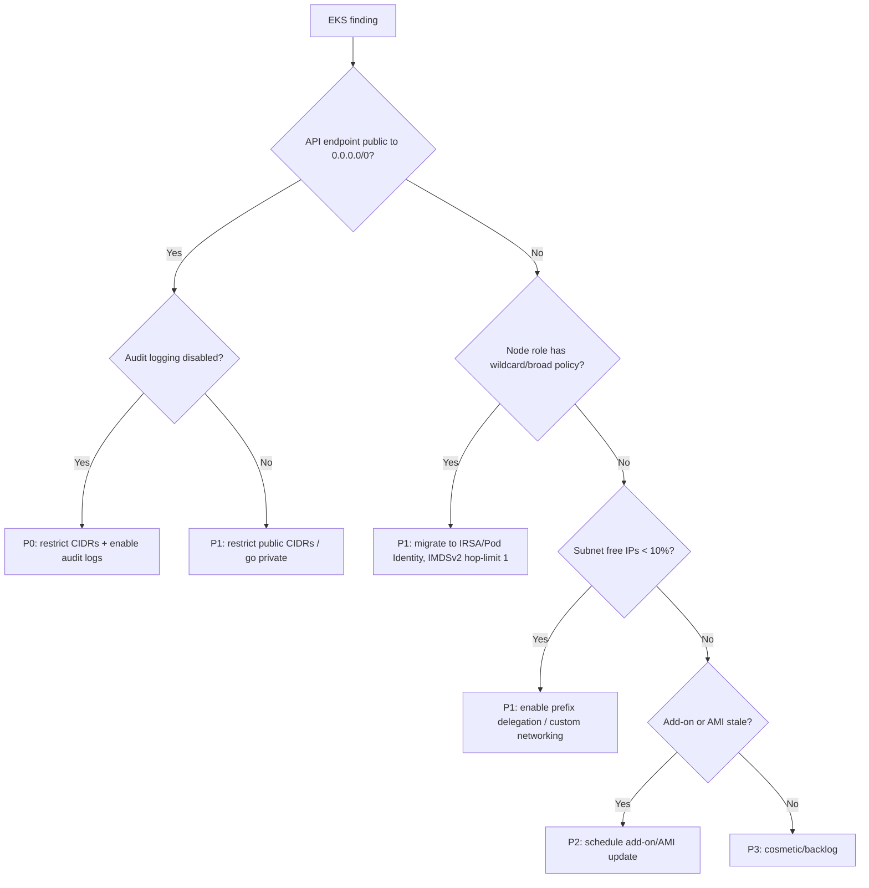

# Amazon EKS Audit

> An AWS-specific operational playbook for autonomous agents to audit an Amazon EKS cluster's IRSA/Pod Identity, security groups, VPC CNI configuration, managed node groups, control plane logging, and EKS best-practice posture.

## Objective

Produce an evidence-backed assessment of an Amazon EKS cluster's AWS-native
controls — IAM Roles for Service Accounts (IRSA) / EKS Pod Identity, cluster and
node security groups, Amazon VPC CNI configuration, managed vs. self-managed
node groups, control plane logging, endpoint access, and add-on currency — and
deliver a ranked remediation plan referencing exact AWS APIs and `eksctl`/`aws`
commands. "Done" means all Success Criteria are checked and a report is
committed.

## Business Context

EKS runs the organization's regulated and revenue-critical workloads on AWS. The
security and reliability boundary spans both Kubernetes objects and AWS
resources: an over-broad IRSA role can grant a compromised pod full S3 or
DynamoDB access; a public API server endpoint with `0.0.0.0/0` CIDR exposes the
control plane; a misconfigured VPC CNI silently exhausts ENI/IP capacity and
throttles pod scheduling; missing control plane audit logs blind incident
responders. Aligning EKS to the AWS EKS Best Practices Guide reduces breach
blast radius, prevents IP-exhaustion outages, and satisfies well-architected and
compliance reviews. AWS charges $0.10/hour per cluster plus node compute, so
right-sized node groups also protect budget.

## Problem Statement

EKS clusters accumulate risk as teams attach broad IAM policies to node
instance roles (the "node role shortcut" instead of IRSA), leave the public
endpoint open, run outdated `aws-node`/`coredns`/`kube-proxy` add-ons, and let
managed node groups drift from the latest AMI with unpatched CVEs. Symptoms:
pods assuming powerful roles they don't need, `InsufficientFreeAddresses`
scheduling errors, control plane logging disabled, and node groups pinned to an
old Kubernetes minor version nearing end of standard support. This runbook
detects and ranks these. **Out of scope:** performing the cluster version
upgrade, rotating IAM credentials, and application image scanning.

## Success Criteria

- [ ] OIDC provider status and every IRSA-annotated ServiceAccount → IAM role mapping is enumerated.
- [ ] IAM policies attached to the node instance role are listed and flagged if they include `*:*` or broad managed policies.
- [ ] Cluster endpoint access config (public/private, allowed CIDRs) is recorded.
- [ ] Control plane logging (api, audit, authenticator, controllerManager, scheduler) enabled state is captured.
- [ ] VPC CNI mode (prefix delegation, custom networking, security groups for pods) and subnet free-IP headroom are reported.
- [ ] Managed node group AMI type, version, and update status are recorded per node group.
- [ ] EKS add-on versions (`vpc-cni`, `coredns`, `kube-proxy`, `eks-pod-identity-agent`) are compared against latest available.
- [ ] A ranked remediation table (P0–P3) is delivered in the report template.

## Trigger Conditions

- Schedule: quarterly EKS well-architected / security review.
- Alert: GuardDuty EKS finding, `InsufficientFreeAddresses` events, or public-endpoint drift.
- Manual: inheriting an EKS cluster, or pre-upgrade readiness check.
- Change: before a Kubernetes minor upgrade or new node group rollout.

## Inputs Required

| Input | Description | Example | Required |
|-------|-------------|---------|----------|
| `cluster_name` | EKS cluster name | `prod-main` | Yes |
| `aws_region` | Region of the cluster | `us-east-1` | Yes |
| `aws_profile` | Read-only credentials profile | `audit-ro` | Yes |
| `account_id` | AWS account ID | `123456789012` | Yes |
| `environment` | Deployment tier | `prod` | Yes |
| `owners_map` | ServiceAccount/role → team mapping | `team-map.yaml` | No |

## Required Access

| Scope | Purpose | Read/Write | Sensitivity |
|-------|---------|-----------|-------------|
| Read-only kubeconfig + `view` ClusterRole | List SAs, pods, add-ons | Read | Medium |
| `eks:Describe*`, `eks:List*` | Cluster/node group/add-on config | Read | Medium |
| `iam:Get*`, `iam:List*` | IRSA roles and node role policies | Read | High |
| `ec2:Describe*` | Security groups, subnets, ENIs, AMIs | Read | Low |
| CloudWatch Logs read | Verify control plane log delivery | Read | Low |

## Assumptions

- The agent can run `aws` CLI v2 with the read-only profile and `kubectl` against the cluster.
- The cluster uses managed node groups or Fargate profiles (self-managed noted separately).
- The `audit-ro` profile has the IAM read permissions listed above.
- The cluster is on a Kubernetes version within AWS standard or extended support.
- If IAM read access is missing, the agent escalates rather than reporting incomplete IRSA data.

## Risks

| Risk | Likelihood | Impact | Mitigation |
|------|-----------|--------|------------|
| Reading wrong account/region | Low | High | Echo `aws sts get-caller-identity` and region before proceeding |
| Flagging a controller IRSA role as over-broad | Medium | Medium | Cross-reference owners map; verify against least-privilege intent |
| Missing IP-exhaustion because metrics are point-in-time | Medium | Medium | Report free IPs per subnet AND trend from CNI metrics |
| Add-on "latest" comparison drifts | Low | Low | Query `aws eks describe-addon-versions` live, do not hardcode |

## Constraints

- Read-only: no `eksctl create/delete`, no `aws eks update-*`, no `kubectl apply`.
- Do not print IAM policy documents containing account-specific ARNs beyond what the report needs; redact if necessary.
- Respect change freezes; recommendations only.
- Keep AWS API calls within read rate limits; batch describes.

## Agent Persona

Adopt the persona of a **Principal AWS Platform / EKS Specialist Solutions
Architect**. You know the EKS Best Practices Guide, the shared-responsibility
model, and the difference between IRSA and EKS Pod Identity cold. Be exact about
ARNs, security group rules, and CNI environment variables. Never recommend
attaching `AdministratorAccess`; always propose the narrowest policy. Follow
[`docs/AI_AGENT_STANDARDS.md`](../../docs/AI_AGENT_STANDARDS.md). Resist
over-flagging: managed add-on roles and the EKS-managed cluster role are
expected.

## Planning Instructions

1. Echo caller identity and region; confirm `cluster_name`/`account_id`/`environment`.
2. Describe the cluster once and cache the JSON (endpoint config, logging, version, OIDC issuer).
3. List node groups, add-ons, and Fargate profiles to scope the audit.
4. Plan IRSA enumeration: join Kubernetes SA annotations to IAM roles via the OIDC trust policy.
5. Externalize the plan and, for `prod`, wait for approval when HITL is required.
6. Define the ranking rubric (P0 = public endpoint + broad node role; P3 = cosmetic add-on lag).

## Execution Instructions

```bash
# 0. Confirm target
aws sts get-caller-identity --profile "$AWS_PROFILE"
aws eks describe-cluster --name "$CLUSTER" --region "$REGION" --profile "$AWS_PROFILE" \
  > cluster.json
jq '{version:.cluster.version, endpointPublic:.cluster.resourcesVpcConfig.endpointPublicAccess,
     publicCidrs:.cluster.resourcesVpcConfig.publicAccessCidrs,
     logging:.cluster.logging.clusterLogging, oidc:.cluster.identity.oidc.issuer}' cluster.json

# 1. IRSA: list ServiceAccounts annotated with an IAM role
kubectl get sa -A -o json \
  | jq -r '.items[] | select(.metadata.annotations["eks.amazonaws.com/role-arn"])
    | "\(.metadata.namespace)/\(.metadata.name)\t\(.metadata.annotations["eks.amazonaws.com/role-arn"])"'

# For each role ARN, inspect trust and attached policies
aws iam list-attached-role-policies --role-name "$ROLE_NAME" --profile "$AWS_PROFILE"
aws iam get-role --role-name "$ROLE_NAME" --profile "$AWS_PROFILE" \
  --query 'Role.AssumeRolePolicyDocument'

# 2. Node instance role: flag broad policies (the anti-pattern)
NODE_ROLE=$(aws eks describe-nodegroup --cluster-name "$CLUSTER" --nodegroup-name "$NG" \
  --region "$REGION" --profile "$AWS_PROFILE" --query 'nodegroup.nodeRole' --output text)
aws iam list-attached-role-policies --role-name "${NODE_ROLE##*/}" --profile "$AWS_PROFILE"

# 3. Security groups for cluster and nodes
aws ec2 describe-security-groups --group-ids "$CLUSTER_SG" --region "$REGION" \
  --profile "$AWS_PROFILE" --query 'SecurityGroups[].IpPermissions'

# 4. VPC CNI configuration and subnet IP headroom
kubectl -n kube-system get ds aws-node -o json \
  | jq '.spec.template.spec.containers[0].env[] | select(.name|test("PREFIX|CUSTOM|WARM|MAX"))'
aws ec2 describe-subnets --region "$REGION" --profile "$AWS_PROFILE" \
  --filters "Name=tag:kubernetes.io/cluster/$CLUSTER,Values=owned,shared" \
  --query 'Subnets[].{id:SubnetId,az:AvailabilityZone,free:AvailableIpAddressCount,cidr:CidrBlock}'

# 5. Node groups and AMI currency
aws eks list-nodegroups --cluster-name "$CLUSTER" --region "$REGION" --profile "$AWS_PROFILE"
aws eks describe-nodegroup --cluster-name "$CLUSTER" --nodegroup-name "$NG" \
  --region "$REGION" --profile "$AWS_PROFILE" \
  --query 'nodegroup.{ami:amiType,version:version,release:releaseVersion,status:status,scaling:scalingConfig}'

# 6. Add-on currency
for A in vpc-cni coredns kube-proxy eks-pod-identity-agent; do
  cur=$(aws eks describe-addon --cluster-name "$CLUSTER" --addon-name "$A" --region "$REGION" \
        --profile "$AWS_PROFILE" --query 'addon.addonVersion' --output text 2>/dev/null)
  latest=$(aws eks describe-addon-versions --addon-name "$A" --kubernetes-version \
        "$(jq -r .cluster.version cluster.json)" --region "$REGION" --profile "$AWS_PROFILE" \
        --query 'addons[0].addonVersions[0].addonVersion' --output text)
  echo "$A current=$cur latest=$latest"
done
```

## Investigation Workflow



## Analysis Framework

Evaluate the AWS and Kubernetes layers together. The highest-risk combinations:

- **Public API endpoint (`endpointPublicAccess=true`) with `publicAccessCidrs=0.0.0.0/0`** and control plane audit logging **disabled** → P0 (exposed control plane, no forensics).
- **Node instance role carrying `AmazonS3FullAccess` or wildcard policies** → every pod without IRSA inherits it via IMDS → P1; recommend IRSA/Pod Identity + IMDSv2 hop-limit 1.
- **VPC CNI without prefix delegation on `/24` node subnets** with `AvailableIpAddressCount` trending toward zero → P1 imminent IP exhaustion; recommend `ENABLE_PREFIX_DELEGATION=true` or custom networking.
- **Node group `releaseVersion` several AMI releases behind** → CVE exposure, weighted by internet exposure.
- **Add-ons more than one minor behind cluster version** → P2/P3.

Thresholds: alert when any node subnet has < 10% free IPs; treat any IRSA trust
policy with a wildcard `sub` condition (`system:serviceaccount:*:*`) as P1.
Cross-check controller roles (Karpenter, ALB controller, EBS CSI) against the
owners map before flagging as over-broad.

## Decision Tree



## Validation Steps

- [ ] Re-run `describe-cluster` and confirm endpoint/logging values match the report.
- [ ] Confirm caller identity account == `account_id` and region == `aws_region`.
- [ ] Verify each IRSA role ARN resolves and its trust policy scopes to the exact SA.
- [ ] Confirm no `update-*`/`create`/`apply` command appears in the artifacts.
- [ ] Re-query `describe-addon-versions` to confirm "latest" values are current.

## Expected Outputs

- IRSA mapping table: `namespace/serviceaccount → role ARN → attached policies`.
- Node role policy findings and IMDS configuration.
- Endpoint/logging posture summary and security group exposure list.
- VPC CNI settings + per-subnet free-IP table.
- Node group AMI currency and add-on version deltas.
- Ranked P0–P3 remediation table.

## Deliverables

A report following
[`templates/report-template.md`](../../templates/report-template.md), attached
to the triggering ticket, including the IRSA mapping, node-role findings,
networking headroom table, and an action plan with owners and `eksctl`/`aws`
remediation snippets (e.g. `eksctl utils update-cluster-logging`,
`aws eks update-addon`, prefix-delegation env patch for a maintenance window).

## Escalation Process

- **P0 (exposed control plane / broad node role reachable from internet):** page
  platform + security on-call immediately; attach evidence within 15 minutes.
- **P1 (IP exhaustion imminent, IRSA over-privilege):** high-priority ticket,
  48h SLA to owning team.
- **P2/P3:** batch into the quarterly EKS hardening backlog.
- Include cluster, account, region, resource ARN, evidence, and fix.

## Rollback Strategy

Read-only execution has nothing to roll back. If a downstream remediation
regresses (e.g. going private breaks CI runners, or a CNI change disrupts
scheduling), roll back via the Terraform/CloudFormation/eksctl config in Git:
revert the change, re-apply, and confirm with `aws eks describe-cluster` /
`kubectl get nodes` that the prior known-good state is restored and pods
schedule normally.

## Post-Execution Review

- Should the public endpoint be private-only with access via SSM/VPN going forward?
- Can IRSA/Pod Identity be enforced by policy so node-role shortcuts are impossible?
- Should prefix delegation and IMDSv2 hop-limit 1 become node group defaults in the module?
- Are EKS-managed add-ons on auto-update with a canary node group?

## Metrics

| Metric | Definition | Target |
|--------|-----------|--------|
| Public exposure | Clusters with `0.0.0.0/0` public endpoint | 0 |
| Node-role over-privilege | Node roles with broad/wildcard policies | 0 |
| CNI IP headroom | Min free IPs across node subnets | > 10% |
| Add-on currency | Add-ons within 1 minor of cluster version | 100% |
| Control plane logging | Log types enabled (of 5) | 5/5 |
| Audit duration | Wall-clock to complete | < 3h |

## Example Execution

**Inputs:** `cluster_name=prod-main`, `aws_region=us-east-1`,
`aws_profile=audit-ro`, `account_id=123456789012`, `environment=prod`.

**Agent reasoning (abridged):** caller identity confirmed account 1234...012,
region us-east-1. Cluster v1.29, `endpointPublicAccess=true`,
`publicAccessCidrs=["0.0.0.0/0"]`, and `logging.clusterLogging` shows `audit`
disabled → P0. Node group `ng-general` node role has `AmazonS3FullAccess`
attached directly → P1. Subnet `subnet-0ab...` in `us-east-1c` has 14 free IPs
of a `/24` (5.5%), CNI has `ENABLE_PREFIX_DELEGATION` unset → P1 IP exhaustion
risk. `vpc-cni` add-on is v1.15.1 vs latest v1.18.3 → P2.

**Sample report excerpt:**

```text
F1 (P0) — Control plane API is public to 0.0.0.0/0 with audit logging OFF.
  Evidence: resourcesVpcConfig.publicAccessCidrs=["0.0.0.0/0"];
            logging.clusterLogging audit=false.
  Fix: restrict publicAccessCidrs to corp egress CIDRs (or go private) and
       `eksctl utils update-cluster-logging --enable-types audit`. Escalated 09:12 UTC.

F2 (P1) — Node role eksNodeRole-ng-general has AmazonS3FullAccess.
  Fix: detach; grant S3 via IRSA on the specific workload SA; set IMDSv2
       http-put-response-hop-limit=1 on the launch template.

F3 (P1) — subnet-0ab (us-east-1c) 5.5% free IPs; prefix delegation disabled.
  Fix: set ENABLE_PREFIX_DELEGATION=true on aws-node during maintenance window.
```

## References

- [`docs/AI_AGENT_STANDARDS.md`](../../docs/AI_AGENT_STANDARDS.md)
- [`templates/report-template.md`](../../templates/report-template.md)
- [Generic Kubernetes Cluster Audit](./kubernetes-cluster-audit.md)
- [AWS Cost Optimization runbook](../cloud-cost/aws-cost-optimization.md)
- AWS EKS Best Practices Guide; Amazon VPC CNI docs; EKS Pod Identity docs
