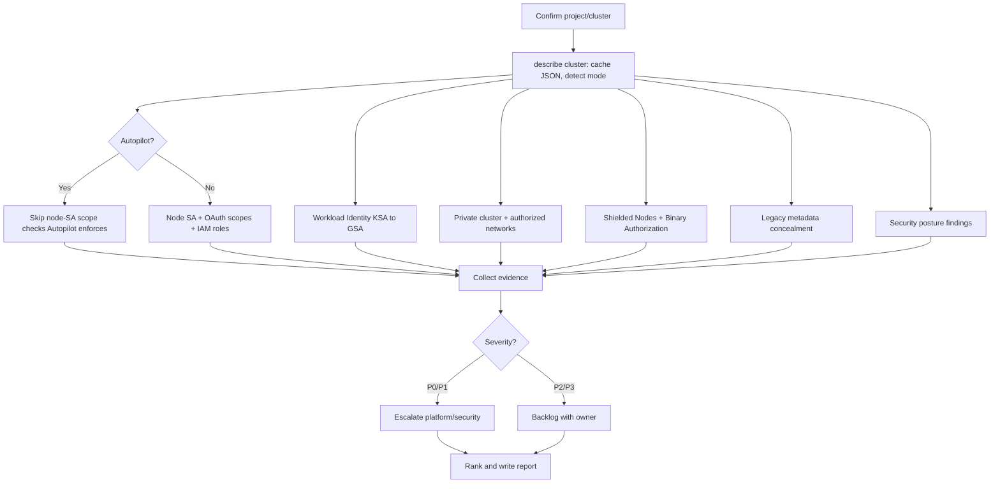
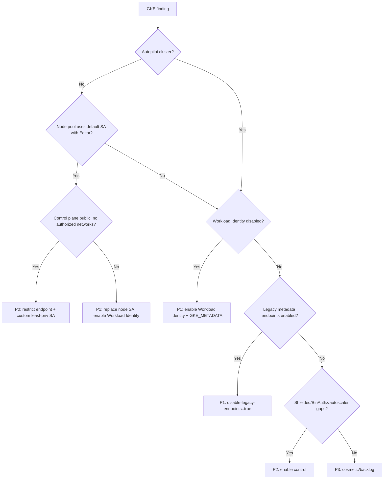

# Google GKE Audit

> A GCP-specific operational playbook for autonomous agents to audit a GKE cluster's Workload Identity, Autopilot vs. Standard mode, node auto-provisioning, private cluster networking, and the GKE security posture dashboard.

## Objective

Produce an evidence-backed assessment of a Google Kubernetes Engine (GKE)
cluster's GCP-native controls — Workload Identity Federation for GKE, cluster
mode (Autopilot vs. Standard), node auto-provisioning (NAP) and autoscaling,
private cluster / authorized networks, Shielded GKE Nodes, node service account
scopes, Binary Authorization, and the GKE security posture dashboard findings —
and deliver a ranked remediation plan with concrete `gcloud container` commands.
"Done" means all Success Criteria are checked and a report is committed.

## Business Context

GKE runs the organization's GCP workloads. Its trust boundary spans Kubernetes
and Google Cloud IAM: a node service account with the default Compute Engine
scope or `Editor` role grants every pod broad project access; a public control
plane without authorized networks exposes the API; legacy metadata endpoints
enable SSRF-to-credential-theft; disabled Shielded Nodes weaken boot integrity;
an unmanaged Standard cluster wastes spend that Autopilot or NAP would reclaim.
Aligning to the GKE security posture, CIS GKE Benchmark, and Google's hardening
guide reduces breach blast radius, prevents scaling failures, and satisfies
compliance. GKE Enterprise/Standard charges a per-cluster management fee, so node
efficiency and Autopilot adoption are direct cost levers.

## Problem Statement

GKE clusters drift as teams keep the default node service account with broad
scopes, run public control planes, leave legacy metadata concealment off,
disable Workload Identity, and operate oversized Standard node pools. Symptoms:
pods able to call arbitrary GCP APIs via the node SA, Workload Identity not
enabled, security posture dashboard flagging vulnerabilities, and node pools
without autoscaling. This runbook detects and ranks these. **Out of scope:**
performing the cluster upgrade, changing IAM bindings, and container image
vulnerability remediation (Artifact Analysis surfaces those separately).

## Success Criteria

- [ ] Cluster mode (Autopilot vs. Standard) and release channel are recorded.
- [ ] Workload Identity Federation enablement and the GKE metadata server / metadata concealment state are captured.
- [ ] Node service account identity and its IAM roles/scopes are enumerated (default vs. custom).
- [ ] Private cluster config (private nodes, private endpoint, master authorized networks) is recorded.
- [ ] Shielded GKE Nodes (secure boot, integrity monitoring) and Binary Authorization state are captured.
- [ ] Node auto-provisioning / cluster autoscaler config is reported (Standard clusters).
- [ ] GKE security posture dashboard findings are pulled and summarized.
- [ ] A ranked remediation table (P0–P3) is delivered in the report template.

## Trigger Conditions

- Schedule: quarterly GKE security posture review.
- Alert: Security Command Center / security posture finding, or public-endpoint drift.
- Manual: inheriting a GKE cluster or pre-upgrade readiness.
- Change: before enabling Workload Identity or migrating to Autopilot.

## Inputs Required

| Input | Description | Example | Required |
|-------|-------------|---------|----------|
| `cluster_name` | GKE cluster name | `prod-main` | Yes |
| `location` | Region or zone | `us-central1` | Yes |
| `project_id` | GCP project | `acme-prod` | Yes |
| `environment` | Deployment tier | `prod` | Yes |
| `owners_map` | KSA/GSA → team mapping | `team-map.yaml` | No |

## Required Access

| Scope | Purpose | Read/Write | Sensitivity |
|-------|---------|-----------|-------------|
| Read-only kubeconfig + `view` ClusterRole | List SAs, pods, policies | Read | Medium |
| `roles/container.viewer` | Cluster/node pool config | Read | Medium |
| `roles/iam.securityReviewer` | Service account roles/bindings | Read | High |
| `roles/securitycenter.findingsViewer` | Security posture findings | Read | Low |
| `roles/compute.viewer` | Node SA scopes, networks | Read | Low |

## Assumptions

- The agent can run `gcloud` (with `container` component) as a Viewer/Security Reviewer principal and `kubectl` against the cluster.
- `gcloud container clusters get-credentials` succeeds for the target cluster.
- The principal can read IAM policy (`getIamPolicy`) at project scope.
- The cluster is on a supported GKE version / release channel.
- If IAM policy read is denied, the agent escalates rather than omitting node-SA findings.

## Risks

| Risk | Likelihood | Impact | Mitigation |
|------|-----------|--------|------------|
| Auditing wrong project | Low | High | Echo `gcloud config get-value project` and confirm |
| Flagging Autopilot-managed defaults as findings | Medium | Low | Autopilot enforces many controls; note mode before flagging |
| Default node SA assumed benign | Medium | High | Default Compute SA + `Editor` is a real P1; verify scopes |
| Stale security posture cache | Low | Low | Pull findings live from the API |

## Constraints

- Read-only: no `gcloud container clusters update/create`, no `gcloud projects add-iam-policy-binding`, no `kubectl apply`.
- Do not print Secret Manager values; report access bindings only.
- Respect change freezes; recommendations only.
- Keep GCP API calls within read quotas.

## Agent Persona

Adopt the persona of a **Principal Google Cloud Platform / GKE Specialist
Engineer** who knows the GKE hardening guide, CIS GKE Benchmark, and the
difference between Workload Identity, node service accounts, and legacy metadata.
Be exact about IAM roles, OAuth scopes, and `gcloud container` flags. Never
recommend the default Compute Engine SA with `Editor`; always propose Workload
Identity with a least-privilege GSA. Follow
[`docs/AI_AGENT_STANDARDS.md`](../../docs/AI_AGENT_STANDARDS.md). Account for
cluster mode: Autopilot enforces many controls automatically, so do not flag
what the platform already guarantees.

## Planning Instructions

1. Echo `gcloud config get-value project`; confirm `project_id`/`cluster_name`/`location`.
2. `gcloud container clusters describe` once and cache the JSON (mode, workloadIdentityConfig, privateClusterConfig, masterAuthorizedNetworks, nodeConfig, autoscaling).
3. Determine mode (Autopilot vs Standard) to scope which controls apply.
4. Plan node-SA analysis: resolve each node pool's service account and its IAM roles.
5. Externalize the plan; for `prod`, wait for approval when HITL is required.
6. Define ranking rubric (P0 = public endpoint + default SA with Editor; P3 = cosmetic).

## Execution Instructions

```bash
# 0. Confirm target
gcloud config get-value project
gcloud container clusters describe "$CLUSTER" --location "$LOCATION" --format=json > cluster.json
jq '{mode:(if .autopilot.enabled then "Autopilot" else "Standard" end),
     channel:.releaseChannel.channel,
     workloadIdentity:.workloadIdentityConfig.workloadPool,
     privateNodes:.privateClusterConfig.enablePrivateNodes,
     privateEndpoint:.privateClusterConfig.enablePrivateEndpoint,
     authorizedNets:.masterAuthorizedNetworksConfig,
     shielded:.shieldedNodes.enabled,
     binauthz:.binaryAuthorization,
     legacyMetadata:.nodeConfig.metadata}' cluster.json

# 1. Node service account + scopes (Standard node pools)
gcloud container node-pools list --cluster "$CLUSTER" --location "$LOCATION" --format=json \
  | jq -r '.[] | "\(.name)\tsa=\(.config.serviceAccount)\tscopes=\(.config.oauthScopes|join(","))\tshielded=\(.config.shieldedInstanceConfig.enableSecureBoot)"'

# For each node SA, list project IAM roles
NODE_SA=$(jq -r '.nodeConfig.serviceAccount' cluster.json)
gcloud projects get-iam-policy "$PROJECT" --flatten="bindings[].members" \
  --filter="bindings.members:serviceAccount:$NODE_SA" \
  --format="table(bindings.role)"

# 2. Workload Identity: KSA -> GSA bindings
kubectl get sa -A -o json \
  | jq -r '.items[] | select(.metadata.annotations["iam.gke.io/gcp-service-account"])
    | "\(.metadata.namespace)/\(.metadata.name)\t\(.metadata.annotations["iam.gke.io/gcp-service-account"])"'

# 3. Legacy metadata / metadata concealment
jq '.nodeConfig.metadata["disable-legacy-endpoints"]' cluster.json
jq '.nodeConfig.workloadMetadataConfig.mode' cluster.json   # GKE_METADATA is good

# 4. Autoscaling / node auto-provisioning
jq '{autoscaling:.autoscaling, nap:.autoscaling.enableNodeAutoprovisioning,
     limits:.autoscaling.resourceLimits}' cluster.json

# 5. Security posture findings
gcloud container clusters describe "$CLUSTER" --location "$LOCATION" \
  --format="value(securityPostureConfig.mode, securityPostureConfig.vulnerabilityMode)"
# Vulnerability/posture findings surface in Security Command Center:
gcloud scc findings list "organizations/$ORG_ID" \
  --filter="category:\"GKE\" AND state=\"ACTIVE\"" --format=json 2>/dev/null | jq 'length'
```

## Investigation Workflow



## Analysis Framework

Correlate GKE and GCP IAM layers, and always factor cluster mode. Highest-risk
combinations:

- **Public control plane (no master authorized networks, public endpoint) + node pools using the default Compute Engine SA with `roles/editor`** → P0 (any pod → project-wide write via metadata server).
- **Workload Identity disabled** while pods need GCP access → they fall back to the node SA → P1; recommend enabling Workload Identity and `GKE_METADATA` mode.
- **`disable-legacy-endpoints` false / metadata concealment off** → SSRF can steal node credentials → P1.
- **Shielded GKE Nodes disabled** → weaker boot integrity → P2.
- **Standard cluster without cluster autoscaler / NAP** → cost + reliability → P2/P3.
- **Security posture dashboard active findings** → triage by severity mapping.

Thresholds: any node pool on the default SA with `Editor` is at least P1 (P0 if
control plane is public); treat public endpoint without authorized networks as
P1; treat Binary Authorization disabled in `prod` as P2. For Autopilot clusters,
Workload Identity, Shielded Nodes, and metadata concealment are enforced —
verify, don't re-flag.

## Decision Tree



## Validation Steps

- [ ] Re-run `clusters describe` and confirm mode/network/WI values match the report.
- [ ] Confirm `gcloud config get-value project` == `project_id`.
- [ ] Verify each Workload Identity KSA→GSA binding via `gcloud iam service-accounts get-iam-policy`.
- [ ] Confirm no `update`/`create`/`add-iam-policy-binding`/`kubectl apply` in the artifacts.
- [ ] Re-pull security posture findings to confirm counts.

## Expected Outputs

- Cluster summary: mode, channel, WI pool, private config.
- Node SA table with OAuth scopes and IAM roles (Standard).
- Workload Identity KSA→GSA mapping.
- Shielded Nodes / Binary Authorization / metadata concealment states.
- Autoscaling / NAP config and security posture findings summary.
- Ranked P0–P3 remediation table.

## Deliverables

A report following
[`templates/report-template.md`](../../templates/report-template.md), attached
to the triggering ticket, including the node-SA table, WI mapping, posture
findings, and an action plan with owners and `gcloud container` remediation
snippets (e.g. `--workload-pool`, `--enable-master-authorized-networks`,
`--metadata disable-legacy-endpoints=true`, `--shielded-secure-boot`).

## Escalation Process

- **P0 (public control plane + default SA with Editor):** page platform +
  security on-call immediately; evidence within 15 minutes.
- **P1 (Workload Identity disabled, legacy metadata on, node-SA over-privilege):**
  high-priority ticket, 48h SLA.
- **P2/P3:** quarterly GKE hardening backlog.
- Include cluster, project, location, service account, evidence, and fix.

## Rollback Strategy

Read-only execution has nothing to roll back. If a downstream remediation
regresses (e.g. authorized networks lock out an operator, or Workload Identity
enablement breaks a pod's credentials), roll back via the Terraform/Config
Connector definition in Git: revert, re-apply, and confirm with
`gcloud container clusters describe` / `kubectl get pods` that the prior
known-good state is restored and workloads authenticate normally.

## Post-Execution Review

- Should new clusters default to Autopilot to inherit hardened defaults?
- Can Workload Identity + custom least-privilege node SAs be mandated by Org Policy?
- Should master authorized networks and private nodes be landing-zone defaults?
- Are security posture and Binary Authorization enforced org-wide?

## Metrics

| Metric | Definition | Target |
|--------|-----------|--------|
| Node SA over-privilege | Node pools on default SA with Editor | 0 |
| Control plane exposure | Public endpoint without authorized networks | 0 |
| Workload Identity coverage | Clusters with WI enabled | 100% |
| Metadata concealment | Clusters with legacy endpoints disabled | 100% |
| Posture findings | Active high/critical GKE findings | 0 |
| Audit duration | Wall-clock to complete | < 3h |

## Example Execution

**Inputs:** `cluster_name=prod-main`, `location=us-central1`,
`project_id=acme-prod`, `environment=prod`.

**Agent reasoning (abridged):** project confirmed `acme-prod`. Cluster is
Standard, `regular` channel. `masterAuthorizedNetworksConfig` disabled and
public endpoint enabled → public control plane. Node pool `default-pool` uses
`123456-compute@developer.gserviceaccount.com` with `roles/editor` and
`cloud-platform` scope → combined P0. `workloadIdentityConfig.workloadPool` null
→ WI disabled → P1. `disable-legacy-endpoints` not set true → P1. Shielded Nodes
enabled (good). Security posture reports 2 active HIGH findings → P2.

**Sample report excerpt:**

```text
F1 (P0) — Public control plane + default Compute SA with roles/editor on default-pool.
  Evidence: masterAuthorizedNetworksConfig.enabled=false; publicEndpoint present;
            node SA 123456-compute@... has roles/editor + scope cloud-platform.
  Fix: enable master authorized networks (or private endpoint); create custom
       least-privilege node SA; migrate workloads to Workload Identity. Escalated 11:20 UTC.

F2 (P1) — Workload Identity disabled; pods fall back to node SA.
  Fix: gcloud container clusters update prod-main --workload-pool=acme-prod.svc.id.goog
       and set nodeConfig workloadMetadata mode GKE_METADATA.

F3 (P1) — Legacy metadata endpoints not disabled (SSRF credential-theft risk).
  Fix: --metadata disable-legacy-endpoints=true on node pools.
```

## References

- [`docs/AI_AGENT_STANDARDS.md`](../../docs/AI_AGENT_STANDARDS.md)
- [`templates/report-template.md`](../../templates/report-template.md)
- [Generic Kubernetes Cluster Audit](./kubernetes-cluster-audit.md)
- [GCP Cost Optimization runbook](../cloud-cost/gcp-cost-optimization.md)
- GKE hardening guide; CIS GKE Benchmark; Workload Identity Federation for GKE docs
