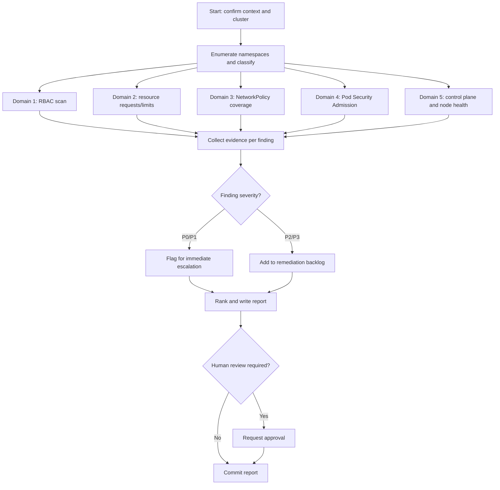
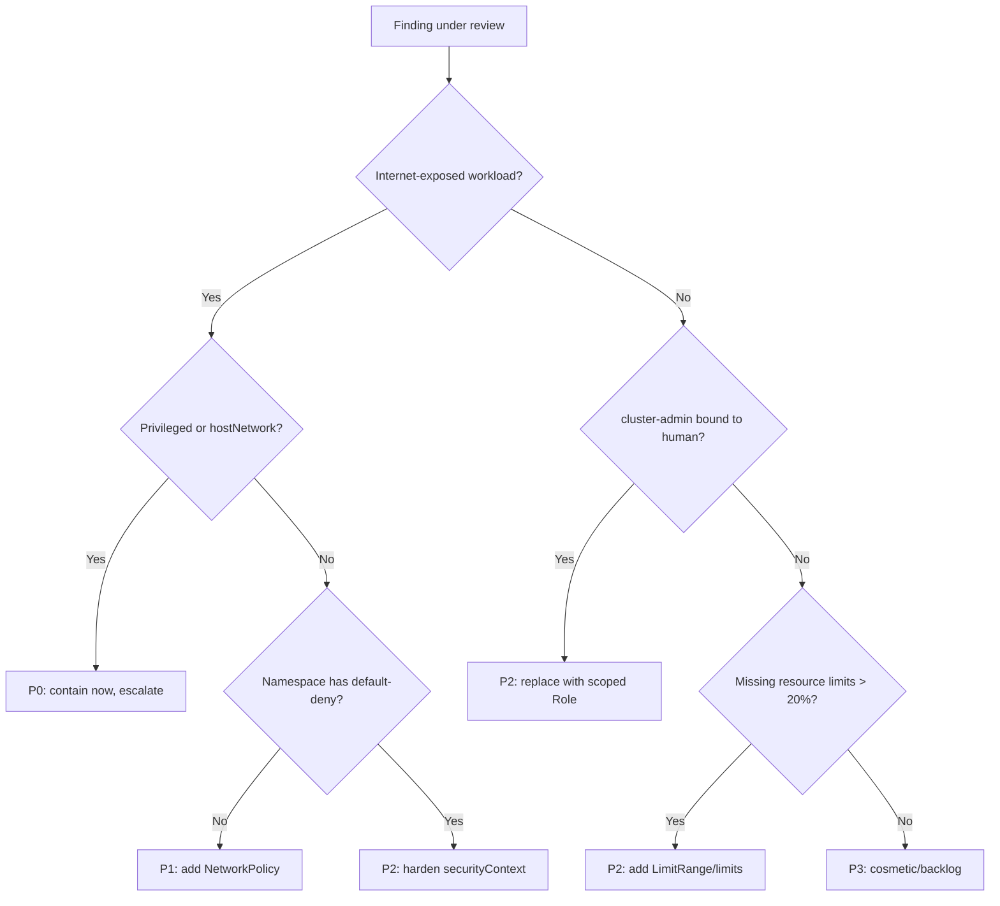

# Kubernetes Cluster Audit

> A vendor-neutral operational playbook for autonomous agents to audit a Kubernetes cluster's RBAC, resource governance, network segmentation, Pod Security posture, and overall health, then produce a prioritized remediation report.

## Objective

Produce an evidence-backed assessment of a single Kubernetes cluster across five
control domains — identity and access (RBAC), workload resource governance,
network segmentation (NetworkPolicy), Pod Security Admission (PSA), and control
plane / node health — and deliver a ranked remediation plan with concrete
`kubectl`/manifest changes. "Done" means every Success Criterion below is
checked and a report conforming to the report template is committed.

## Business Context

Kubernetes is the substrate for most of the organization's stateless and
stateful workloads. Misconfigured RBAC (wildcard `cluster-admin` bindings),
missing resource limits (noisy-neighbor outages and unbounded cost), absent
NetworkPolicies (flat east-west network enabling lateral movement), and
permissive Pod Security (privileged containers, host namespace access) are the
top causes of both production incidents and audit findings (SOC 2, PCI-DSS,
CIS Kubernetes Benchmark). A cluster audit reduces breach blast radius, prevents
resource-exhaustion outages, and produces the evidence auditors require. Every
hour of avoided cluster-wide outage typically protects five to seven figures of
revenue depending on the workload tier.

## Problem Statement

Clusters drift from their intended secure baseline as teams self-serve
namespaces, copy-paste manifests, and grant broad access "temporarily." The
symptoms are: unexplained `cluster-admin` subjects, pods with no
`resources.requests`/`limits`, namespaces with zero NetworkPolicies, workloads
running as UID 0 or with `privileged: true`, and nodes under memory pressure.
This runbook detects and ranks those issues. Explicitly **out of scope**:
application-level vulnerability scanning of container images (see the security
category image-scan runbook), Kubernetes version upgrade execution, and any
mutating change to production — this runbook is read-only and produces
recommendations only.

## Success Criteria

- [ ] Every namespace has been enumerated and classified (system vs. workload).
- [ ] All `ClusterRoleBinding`/`RoleBinding` subjects with `cluster-admin` or wildcard verbs are listed with justification status.
- [ ] Percentage of pods missing CPU/memory requests and limits is quantified per namespace.
- [ ] NetworkPolicy coverage is reported per namespace (default-deny present: yes/no).
- [ ] Pod Security Admission mode (enforce/audit/warn) and level is recorded per namespace.
- [ ] Control plane component and node health (Ready, pressure conditions) is captured.
- [ ] A ranked remediation table (P0–P3) with concrete fixes is delivered in the report template.
- [ ] No mutating commands were executed against the cluster.

## Trigger Conditions

- Schedule: monthly cluster hygiene review or pre-audit (SOC 2 / CIS) window.
- Alert: SecurityHub/Falco/Kyverno reports a privileged pod or wildcard RBAC grant.
- Manual: onboarding a newly inherited cluster, or after a security incident.
- Change: before enabling a new multi-tenant namespace or team onboarding.

## Inputs Required

| Input | Description | Example | Required |
|-------|-------------|---------|----------|
| `kubeconfig_context` | Context naming the target cluster | `prod-us-east-1` | Yes |
| `cluster_name` | Human-readable cluster identifier | `prod-main` | Yes |
| `environment` | Deployment tier | `prod` | Yes |
| `namespace_scope` | `all` or comma-separated list | `all` | No |
| `benchmark` | Baseline to compare against | `cis-1.9` | No |
| `owners_map` | Namespace-to-team mapping for triage | `team-map.yaml` | No |

## Required Access

| Scope | Purpose | Read/Write | Sensitivity |
|-------|---------|-----------|-------------|
| Read-only kubeconfig | Connect to API server | Read | Medium |
| `view` + `cluster-reader` ClusterRole | List RBAC, pods, policies, nodes | Read | Medium |
| Metrics API / Prometheus | Node/pod utilization and pressure | Read | Low |
| Cloud provider console (optional) | Cross-check node group health | Read | Low |

## Assumptions

- The agent has a working `kubectl` (>= 1.27) and the context resolves to the intended cluster.
- The `metrics-server` or a Prometheus endpoint is available for utilization data.
- RBAC allows `get`/`list` on `clusterroles`, `clusterrolebindings`, `roles`, `rolebindings`, `pods`, `networkpolicies`, `namespaces`, and `nodes`.
- The cluster runs a supported Kubernetes version (1.25+) where PSA is GA.
- If any assumption is false, the agent escalates rather than proceeding with partial, misleading data.

## Risks

| Risk | Likelihood | Impact | Mitigation |
|------|-----------|--------|------------|
| Read call storms throttle the API server | Low | Medium | Use `--chunk-size`, avoid tight loops, prefer server-side filtering |
| Misreading a legitimate `cluster-admin` (e.g. GitOps controller) as a finding | Medium | Medium | Cross-reference `owners_map`; mark "needs owner confirmation" not "remove" |
| Stale metrics lead to wrong rightsizing hints | Medium | Low | Note the metrics time window; require 7+ days before firm limits advice |
| Auditing a wrong context (staging vs prod) | Low | High | Echo `kubectl config current-context` and confirm before proceeding |

## Constraints

- Read-only: no `apply`, `edit`, `delete`, `patch`, `scale`, or `cordon`.
- Respect change-freeze windows; recommendations only, no live remediation.
- Do not export secret values; when listing `Secrets`, report names/types only.
- Keep API pressure low on production control planes during business hours.
- Data residency: reports must not leave the approved region/bucket.

## Agent Persona

Adopt the persona of a **Principal Platform / Kubernetes Security Engineer**
who has run multi-tenant clusters at scale. Be precise, cite exact resource
names and namespaces, and never assert a finding without command evidence.
Prefer least-privilege recommendations and default-deny postures. Distinguish
clearly between "confirmed misconfiguration" and "requires owner context."
Follow the conventions in
[`docs/AI_AGENT_STANDARDS.md`](../../docs/AI_AGENT_STANDARDS.md) for tone,
evidence standards, and safety. Control your bias toward over-reporting: rank by
real blast radius, not by raw count.

## Planning Instructions

1. Resolve and echo the target context; confirm `cluster_name`/`environment` match.
2. Enumerate namespaces and classify system (`kube-*`, `*-system`) vs. workload.
3. Draft the audit matrix: five domains × namespaces, with the exact read commands to run.
4. Identify data sources for utilization (metrics-server vs Prometheus) and confirm availability.
5. Externalize the plan; when `human_in_the_loop` is `required` for the environment, wait for approval before execution.
6. Define the ranking rubric (P0 = internet-exposed or cluster-admin sprawl; P3 = cosmetic) up front.

## Execution Instructions

Run read-only observation first. Capture raw output to an artifacts directory.

```bash
# 0. Confirm target
kubectl config current-context
kubectl version --output=json | jq '.serverVersion.gitVersion'
kubectl get nodes -o wide

# 1. RBAC: find cluster-admin and wildcard grants
kubectl get clusterrolebindings -o json \
  | jq -r '.items[] | select(.roleRef.name=="cluster-admin")
    | "\(.metadata.name)\t\(.subjects[]?.kind)/\(.subjects[]?.name)"'
kubectl get clusterroles -o json \
  | jq -r '.items[] | select(any(.rules[]?; (.verbs[]?=="*") and (.resources[]?=="*")))
    | .metadata.name'

# 2. Resource governance: pods missing requests/limits
kubectl get pods -A -o json \
  | jq -r '.items[] | select(any(.spec.containers[];
      (.resources.requests.cpu==null) or (.resources.limits.memory==null)))
    | "\(.metadata.namespace)/\(.metadata.name)"' | sort | uniq -c

# 3. Network segmentation: namespaces without any NetworkPolicy
for ns in $(kubectl get ns -o jsonpath='{.items[*].metadata.name}'); do
  count=$(kubectl get netpol -n "$ns" --no-headers 2>/dev/null | wc -l)
  echo "$ns netpol=$count"
done

# 4. Pod Security Admission labels per namespace
kubectl get ns -o json \
  | jq -r '.items[] | "\(.metadata.name)\tenforce=\(.metadata.labels["pod-security.kubernetes.io/enforce"] // "none")\taudit=\(.metadata.labels["pod-security.kubernetes.io/audit"] // "none")"'

# 5. Health: node conditions and pressure
kubectl get nodes -o json \
  | jq -r '.items[] | "\(.metadata.name)\t\(.status.conditions[] | select(.type=="Ready").status)\tMemPressure=\(.status.conditions[] | select(.type=="MemoryPressure").status)"'
kubectl top nodes 2>/dev/null || echo "metrics-server unavailable"

# 6. Privileged / host-namespace workloads
kubectl get pods -A -o json \
  | jq -r '.items[] | select(any(.spec.containers[]?.securityContext;
      .privileged==true) or (.spec.hostNetwork==true) or (.spec.hostPID==true))
    | "\(.metadata.namespace)/\(.metadata.name)"'
```

## Investigation Workflow



## Analysis Framework

Correlate signals across domains rather than scoring each in isolation. A pod
that is `privileged: true` **and** in a namespace with no NetworkPolicy **and**
bound to a `cluster-admin` ServiceAccount is a P0 — the combination is what
creates real breach blast radius. Rank findings by:

- **Exposure:** Is the workload internet-reachable (Ingress/LoadBalancer)?
- **Privilege:** Does the identity or securityContext grant escalation paths?
- **Segmentation:** Can a compromise move laterally (no default-deny)?
- **Governance:** Missing limits → outage/cost risk, weighted by namespace tier.
- **Health:** Pressure conditions and non-Ready nodes reduce headroom.

Thresholds worth encoding: flag namespaces where >20% of pods lack limits;
treat any `cluster-admin` subject that is a human user (not a controller) as at
least P2; treat internet-exposed namespaces with zero NetworkPolicies as P1.
Avoid confirmation bias: a controller SA needing broad RBAC (e.g. Argo CD,
cert-manager) is expected — verify against the owners map before flagging.

## Decision Tree



## Validation Steps

- [ ] Re-run each detection command and confirm the counts match the report.
- [ ] Confirm the current context equals the intended `cluster_name`.
- [ ] Spot-check three flagged RBAC subjects against the owners map.
- [ ] Verify no mutating verb appears in the command history/artifacts.
- [ ] Confirm every finding links to a captured evidence artifact.

## Expected Outputs

- A per-namespace audit matrix (CSV/Markdown) across the five domains.
- A ranked findings table (P0–P3) with concrete remediation manifests.
- Raw evidence artifacts (JSON dumps) stored alongside the report.
- Optional CIS Kubernetes Benchmark delta if `benchmark` was provided.

## Deliverables

A single agent execution report following
[`templates/report-template.md`](../../templates/report-template.md),
committed to the repository or attached to the triggering ticket, including the
audit matrix, ranked findings, evidence excerpts, and an action plan with
owners. Include ready-to-apply YAML snippets (LimitRange, default-deny
NetworkPolicy, PSA labels) so humans can remediate quickly.

## Escalation Process

- **P0 (privileged + exposed, or cluster-admin sprawl):** page the platform
  on-call and the security team immediately via the incident channel; attach
  evidence within 15 minutes.
- **P1:** open a high-priority ticket to the owning team; 48h SLA.
- **P2/P3:** batch into the monthly hardening backlog with owner assignment.
- Always include: cluster, namespace, resource name, evidence, recommended fix.

## Rollback Strategy

This runbook is read-only, so there is nothing to roll back from execution
itself. If a subsequent remediation (applied by a human/another runbook)
regresses, roll back by reverting the specific manifest in Git and
`kubectl apply`-ing the prior known-good version; confirm with
`kubectl get <resource> -o yaml` and re-run the relevant detection command to
show the finding is resolved without new failures.

## Post-Execution Review

- Which findings were false positives, and how do we teach the owners map to suppress them next time?
- Can default-deny NetworkPolicy and PSA `restricted` be made the namespace-creation default via a policy engine (Kyverno/OPA Gatekeeper)?
- Should resource limits be enforced by an admission policy rather than audited after the fact?
- What percentage of findings recurred since the last audit (drift rate)?

## Metrics

| Metric | Definition | Target |
|--------|-----------|--------|
| RBAC risk count | Human subjects with cluster-admin/wildcard | 0 |
| Limits coverage | % pods with requests+limits | > 95% |
| NetworkPolicy coverage | % workload namespaces with default-deny | 100% |
| PSA enforcement | % workload namespaces at `restricted` enforce | > 90% |
| Audit duration | Wall-clock time to complete | < 3h |
| False-positive rate | Findings rejected on owner review | < 10% |

## Example Execution

**Inputs:** `kubeconfig_context=prod-us-east-1`, `cluster_name=prod-main`,
`environment=prod`, `namespace_scope=all`.

**Agent reasoning (abridged):** confirmed context `prod-us-east-1`, server
v1.29.4, 42 nodes all Ready. RBAC scan found two `cluster-admin`
ClusterRoleBindings: `argocd-application-controller` (expected, in owners map)
and `bob-debug` (human user, not in map → P2). Resource scan: `payments`
namespace has 31/40 pods missing memory limits → P2 outage/cost risk. Network
scan: `payments` and `edge` namespaces have zero NetworkPolicies; `edge` fronts
an internet LoadBalancer → P1. One pod `edge/legacy-proxy` runs
`hostNetwork: true` and `privileged: true` → combined with exposure, P0.

**Sample report excerpt:**

```text
F1 (P0) — edge/legacy-proxy is privileged + hostNetwork behind internet LB.
  Evidence: securityContext.privileged=true; spec.hostNetwork=true; Service
  edge/gateway type=LoadBalancer, external IP 203.0.113.10.
  Recommendation: drop privileged, remove hostNetwork, add default-deny + scoped
  ingress NetworkPolicy. Escalated to platform+security on-call at 14:03 UTC.

F2 (P1) — namespace 'edge' has 0 NetworkPolicies while internet-exposed.
  Recommendation: apply default-deny-ingress + explicit allow from ingress-nginx.

F3 (P2) — clusterrolebinding 'bob-debug' grants cluster-admin to user bob.
  Recommendation: replace with namespaced Role scoped to debug verbs; 48h SLA.
```

## References

- [`docs/AI_AGENT_STANDARDS.md`](../../docs/AI_AGENT_STANDARDS.md)
- [`templates/report-template.md`](../../templates/report-template.md)
- [EKS Audit runbook](./eks-audit.md)
- Kubernetes docs: Pod Security Admission, NetworkPolicy, RBAC Good Practices
- CIS Kubernetes Benchmark v1.9
