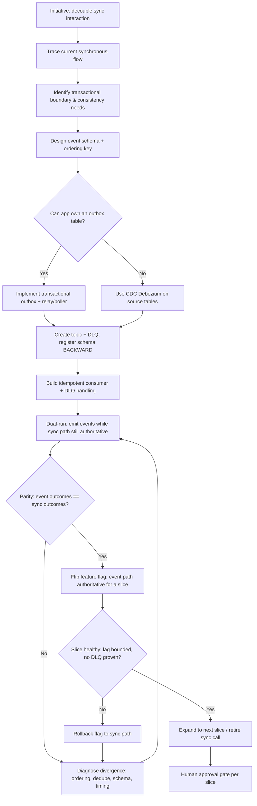
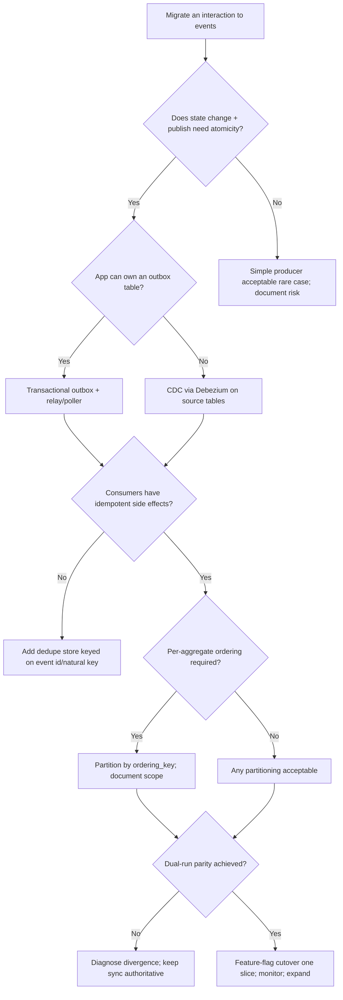

# Event-Driven Architecture Migration

> Plan and execute an incremental migration from synchronous request/response
> coupling to an event-driven architecture — using the strangler-fig and
> transactional-outbox patterns — without data loss or big-bang risk.

## Objective

Migrate one or more synchronous, tightly-coupled service interactions to an
asynchronous, event-driven model backed by Kafka, incrementally and safely.
"Done" means a bounded set of interactions is converted to events with a defined
schema and contract, dual-run validation shows parity with the legacy path,
consumers are idempotent and observable, and the synchronous coupling is retired
with a documented rollback at every step.

## Business Context

Synchronous coupling — Service A calls Service B, which calls C — creates
fragile, latency-additive chains where one slow dependency stalls the whole
request and a single deploy can cascade failures. Moving to event-driven
architecture decouples producers from consumers, improves resilience (consumers
can be down without failing the producer), enables independent scaling, and
unlocks new consumers (analytics, search indexing, ML features) without touching
the producer. Done wrong, however, event-driven migration introduces
eventual-consistency bugs, dual-write inconsistencies, message loss, and
duplicate processing that are far harder to debug than a synchronous call. This
runbook enforces an incremental, evidence-backed path that captures the upside
while containing the risk.

## Problem Statement

A synchronous integration is causing coupling problems: cascading failures,
scaling limits, latency, or an inability to add new consumers. The agent must
migrate the interaction to events without a big-bang cutover, avoiding the
classic dual-write problem (writing to the DB and publishing to Kafka
non-atomically) and guaranteeing at-least-once delivery with idempotent
consumers.

Out of scope: choosing the message broker (assumed Kafka), organization-wide
event taxonomy governance, and decommissioning entire services — only the
targeted interaction(s) are migrated here.

## Success Criteria

- [ ] Target interaction(s) and their consistency/ordering requirements documented.
- [ ] Event schema defined and registered (Schema Registry) with a compatibility policy.
- [ ] Transactional outbox (or CDC) implemented so DB write and event publish are atomic.
- [ ] Consumers are idempotent and handle at-least-once delivery.
- [ ] Dual-run (shadow) validation shows parity between legacy and event paths.
- [ ] Synchronous path retired behind a feature flag with instant rollback.
- [ ] Observability (lag, DLQ, throughput, end-to-end latency) in place.

## Trigger Conditions

- Initiative: architecture decision record (ADR) approves decoupling a hotspot.
- Alert-driven: repeated cascading failures traced to a synchronous dependency.
- Scaling: a service cannot scale independently because of tight coupling.
- New requirement: additional consumers (analytics/search/ML) need the same data.
- Manual: platform team schedules a strangler-fig migration.

## Inputs Required

| Input | Description | Example | Required |
|-------|-------------|---------|----------|
| `source_service` | Producer of the state change | `orders-service` | Yes |
| `target_interaction` | Sync call being replaced | `POST /notify-inventory` | Yes |
| `event_name` | New event topic | `order.placed.v1` | Yes |
| `ordering_key` | Partition key for ordering | `order_id` | Yes |
| `consistency` | Required semantics | `at-least-once, per-order ordering` | Yes |
| `bootstrap_servers` | Kafka brokers | `kafka-0.internal:9092` | Yes |
| `schema_registry` | Registry URL | `http://schema-registry.internal:8081` | Yes |

## Required Access

| Scope | Purpose | Read/Write | Sensitivity |
|-------|---------|-----------|-------------|
| Source repo read | Understand call sites & transactions | Read | Medium |
| Kafka admin | Create topics, configure retention | Write | High (approval gated) |
| Schema Registry | Register/evolve schemas | Write | Medium (approval gated) |
| Metrics/tracing | Validate parity & lag | Read | Low |
| Deploy pipeline | Ship producer/consumer + flags | Write | High (approval gated) |

## Assumptions

- Kafka and a Schema Registry (Avro/Protobuf/JSON Schema) are available.
- The source service owns a relational database supporting an outbox table (or CDC via Debezium).
- Feature-flag infrastructure exists for safe cutover.
- Distributed tracing spans both legacy and event paths for parity checks.
- The team can tolerate eventual consistency for the migrated interaction.

## Risks

| Risk | Likelihood | Impact | Mitigation |
|------|-----------|--------|------------|
| Dual-write inconsistency (DB commits, publish fails) | High | Critical | Use transactional outbox or CDC — never publish inside app code non-atomically |
| Duplicate processing | High | High | Idempotent consumers keyed on event id / natural key |
| Out-of-order events | Medium | High | Partition by `ordering_key`; document ordering scope |
| Schema breaking change | Medium | High | Enforce BACKWARD compatibility in Schema Registry; version topics |
| Message loss on retention expiry | Low | Critical | Size retention; monitor lag; DLQ for failures |
| Big-bang cutover regression | Medium | Critical | Strangler-fig + dual-run + feature flag rollback |

## Constraints

- No non-atomic dual writes; publishing must be transactionally tied to the state change.
- Every step must be independently reversible via feature flag.
- Topic creation, schema changes, and deploys require approved tickets.
- Respect data residency; events must not carry restricted fields off-region.
- Honor active change freezes; cut over during low-traffic windows.

## Agent Persona

Adopt the persona of a **Principal Distributed Systems Architect** who has
migrated monoliths to event-driven systems and has the scars to prove it. You
default to the **strangler-fig** pattern (incrementally route slices of behavior
to the new path while the old one still works) and the **transactional outbox**
pattern (write the event to an `outbox` table in the same DB transaction as the
state change, then relay it to Kafka via a poller or CDC) to eliminate
dual-write inconsistency. You design consumers to be **idempotent** because Kafka
is at-least-once. You are dogmatic about schema governance, ordering scope, and
observability, and you never recommend a big-bang cutover. Follow
[`docs/AI_AGENT_STANDARDS.md`](../../docs/AI_AGENT_STANDARDS.md): analyze and dual-run
before retiring any synchronous path.

## Planning Instructions

1. Restate the target interaction, its consistency/ordering needs, and success criteria.
2. Map the current synchronous flow with a trace; identify the transactional boundary.
3. Design the event schema and choose the partition/ordering key.
4. Choose the reliability mechanism: transactional outbox (app-owned) vs CDC (Debezium).
5. Design idempotent consumers and the DLQ/retry strategy.
6. Plan the dual-run (shadow) phase and the parity metric.
7. Plan the feature-flag cutover and rollback for each slice.
8. Externalize the plan; because `human_in_the_loop` is `required`, get approval
   before creating topics, registering schemas, or cutting over.

## Execution Instructions

Design first (read-only analysis), then build the outbox, then dual-run, then cut over.

```bash
# 1. Create the event topic with ordering-appropriate partitioning (approval gated)
kafka-topics.sh --bootstrap-server kafka-0.internal:9092 \
  --create --topic order.placed.v1 \
  --partitions 24 --replication-factor 3 \
  --config retention.ms=1209600000 --config min.insync.replicas=2

# DLQ topic for poison messages
kafka-topics.sh --bootstrap-server kafka-0.internal:9092 \
  --create --topic order.placed.v1.DLQ --partitions 6 --replication-factor 3
```

```sql
-- 2. Transactional outbox: write event + state change in ONE transaction
CREATE TABLE outbox (
  id           UUID PRIMARY KEY DEFAULT gen_random_uuid(),
  aggregate_id TEXT NOT NULL,           -- e.g. order_id (partition key)
  event_type   TEXT NOT NULL,           -- 'order.placed.v1'
  payload      JSONB NOT NULL,
  created_at   TIMESTAMPTZ NOT NULL DEFAULT now(),
  published_at TIMESTAMPTZ
);

-- Application writes both in the same transaction (no dual write):
BEGIN;
  INSERT INTO orders (id, customer_id, total, status)
    VALUES ('ord_123', 'cus_9', 4999, 'PLACED');
  INSERT INTO outbox (aggregate_id, event_type, payload)
    VALUES ('ord_123', 'order.placed.v1',
            '{"orderId":"ord_123","customerId":"cus_9","total":4999}');
COMMIT;
```

```json
// 3. Register the Avro schema (BACKWARD compatibility) in Schema Registry
{
  "type": "record",
  "name": "OrderPlaced",
  "namespace": "com.example.orders.v1",
  "fields": [
    { "name": "orderId", "type": "string" },
    { "name": "customerId", "type": "string" },
    { "name": "total", "type": "long" },
    { "name": "currency", "type": "string", "default": "USD" }
  ]
}
```

```bash
# Set the subject compatibility policy so evolution stays safe
curl -X PUT http://schema-registry.internal:8081/config/order.placed.v1-value \
  -H 'content-type: application/json' -d '{"compatibility":"BACKWARD"}'
```

```java
// 4. Idempotent consumer: dedupe on event id / natural key, then process
void onOrderPlaced(ConsumerRecord<String, OrderPlaced> rec) {
    String eventId = rec.key();                      // or a header/UUID
    if (processedStore.exists(eventId)) return;      // already handled -> skip
    try {
        inventory.reserve(rec.value().getOrderId()); // idempotent side effect
        processedStore.markProcessed(eventId);       // in same tx as the effect
        // commit offset only after successful processing
    } catch (PoisonMessageException e) {
        dlqProducer.send("order.placed.v1.DLQ", rec.key(), rec.value());
    }
}
```

```bash
# 5. Dual-run parity check: compare legacy sync outcomes vs event-driven outcomes
#    (feature flag routes reads/writes; a reconciler diffs the two paths)
kafka-consumer-groups.sh --bootstrap-server kafka-0.internal:9092 \
  --describe --group inventory-order-placed   # ensure lag stays bounded
```

## Investigation Workflow



## Analysis Framework

Reason across the core distributed-systems concerns:

1. **Consistency & the dual-write problem** — Never write to the DB and publish
   to Kafka as two independent operations; a crash between them loses or invents
   events. Use the **transactional outbox** (event row committed with the state
   change, then relayed) or **CDC** (Debezium tails the WAL/binlog). This is the
   single most important decision.
2. **Delivery semantics** — Kafka is at-least-once by default; design every
   consumer to be **idempotent** (dedupe on event id or natural key, idempotent
   side effects). Exactly-once via transactions is possible but costly; prefer
   idempotency.
3. **Ordering** — Ordering is guaranteed only within a partition. Partition by
   the `ordering_key` (e.g. `order_id`) so all events for one aggregate are
   ordered; document that cross-aggregate ordering is not guaranteed.
4. **Schema evolution** — Register schemas and enforce a compatibility policy
   (BACKWARD is the common default). Add fields with defaults; version the topic
   (`.v1`, `.v2`) for breaking changes.
5. **Migration strategy** — Use strangler-fig: run the event path in shadow
   alongside the authoritative sync path, compare outcomes, then flip a feature
   flag one slice at a time with instant rollback.
6. **Observability & failure handling** — Track consumer lag, DLQ volume,
   throughput, and end-to-end latency; wire a DLQ + retry topic for poison
   messages before cutover.
7. **Retention & recovery** — Size topic retention to cover replay/recovery
   windows; ensure `min.insync.replicas` and replication factor protect against
   broker loss.

Sequence work so that every step is independently reversible and validated before
the next.

## Decision Tree



## Validation Steps

- [ ] Outbox relay/CDC publishes every committed event exactly once to the topic (no gaps).
- [ ] Consumer reprocessing the same event produces no duplicate side effects (idempotency proven).
- [ ] Events for a single `ordering_key` are consumed in order.
- [ ] Schema Registry rejects an incompatible schema change (policy enforced).
- [ ] Dual-run parity: event-path outcomes match legacy outcomes for a sampled window (target >= 99.99%).
- [ ] Consumer lag stays bounded and DLQ volume is ~0 during the slice cutover.
- [ ] Feature-flag rollback restores the synchronous path within seconds.

## Expected Outputs

- Current-vs-target architecture diagrams and the migration sequence.
- Event schema(s) and registered compatibility policy.
- Outbox/CDC implementation and idempotent consumer code.
- Dual-run parity report and cutover/rollback plan per slice.
- Observability dashboards (lag, DLQ, throughput, e2e latency).

## Deliverables

Produce a report using [`templates/report-template.md`](../../templates/report-template.md):
executive summary, architecture before/after, chosen patterns (outbox vs CDC,
idempotency, ordering) with rationale, schema and compatibility decisions,
dual-run parity evidence, cutover log, and follow-ups (next slices to migrate,
sync-path decommission plan). Include topic configs, schemas, and rollback steps.

## Escalation Process

- **Sev-1 (data inconsistency in production):** halt cutover, flip the feature
  flag back to the synchronous path, page the owning team and streaming on-call;
  begin reconciliation of divergent records.
- **Design ambiguity** (consistency/ordering requirements unclear): escalate to
  the domain owners and architecture review board before proceeding.
- **Approval required:** topic creation, schema registration/evolution, and each
  feature-flag cutover route to the change approver with the parity report and rollback.

## Rollback Strategy

- Per-slice feature flag: flip the consumer/producer flag back so the synchronous
  path is authoritative again — instantaneous and the primary rollback mechanism.
- Outbox relay: pause the relay/poller to stop publishing while keeping committed
  outbox rows for later replay; no data lost.
- Schema: a bad schema is rejected by the BACKWARD policy; if one slipped through,
  roll the producer back to the prior schema version and keep `.v1` topic intact.
- Topic: retain the topic (events are durable); consumers can be reset with
  `kafka-consumer-groups.sh --reset-offsets --to-datetime` to replay after a fix.
- Confirm rollback by verifying the sync path serves traffic and the reconciler
  reports zero divergence.

## Post-Execution Review

- Did the outbox/CDC choice hold up under load and failure injection?
- Were there hidden ordering assumptions the consumers relied on?
- Is schema governance (compatibility, ownership) sustainable as consumers grow?
- Which slice should migrate next, and when can the sync path be deleted?

## Metrics

| Metric | Definition | Target |
|--------|-----------|--------|
| Dual-run parity | Event outcomes matching legacy | >= 99.99% |
| Event loss | Committed state changes without an event | 0 |
| Duplicate side effects | Non-idempotent reprocessing incidents | 0 |
| Consumer lag | Steady-state lag on new consumer | Bounded / < threshold |
| DLQ volume | Poison messages per day | ~0 |
| Cutover rollback time | Time to revert a slice via flag | < 60s |

## Example Execution

**Input:** `source_service=orders-service`, `target_interaction=POST
/notify-inventory`, `event_name=order.placed.v1`, `ordering_key=order_id`,
`consistency=at-least-once, per-order ordering`.

**Agent reasoning (abridged):** Tracing showed `orders-service` synchronously
called `inventory-service` inside the order-placement request; when inventory was
slow, order placement failed — textbook harmful coupling. The transactional
boundary was the `orders` DB commit, so the agent chose the **transactional
outbox** pattern (an `outbox` row written in the same transaction as the order),
with a relay publishing to `order.placed.v1` partitioned by `order_id`. The
inventory consumer was made idempotent by deduping on `orderId` before reserving
stock. A dual-run phase kept the synchronous call authoritative while emitting
events and reconciling outcomes.

```text
Dual-run parity (24h shadow window):
  orders placed:            412,905
  events published:         412,905   (0 gaps, outbox relay)
  inventory reservations:   412,905   (0 duplicates after dedupe)
  divergences:              3  -> all traced to a legacy retry bug, not events
  parity:                   99.9993%

Cutover: feature flag `inventory.via_events=true` for 5% -> 50% -> 100% of orders
Consumer lag during cutover: peak 1,240, drained < 30s; DLQ: 0
```

**Outcome:** The synchronous `POST /notify-inventory` call was retired behind the
feature flag after parity held at 100% traffic for 48 hours. Order placement no
longer fails when inventory is slow; a new analytics consumer was added to the
same topic with zero producer changes. Rollback (flip flag to sync) was tested
and documented. Follow-up: migrate the shipping notification interaction next and
schedule deletion of the legacy sync endpoint.

## References

- [`docs/AI_AGENT_STANDARDS.md`](../../docs/AI_AGENT_STANDARDS.md)
- [`templates/report-template.md`](../../templates/report-template.md)
- [Investigate Kafka Consumer Lag runbook](./investigate-kafka-lag.md)
- Patterns: transactional outbox, change data capture (Debezium), strangler-fig, idempotent consumers; Confluent Schema Registry compatibility docs.
