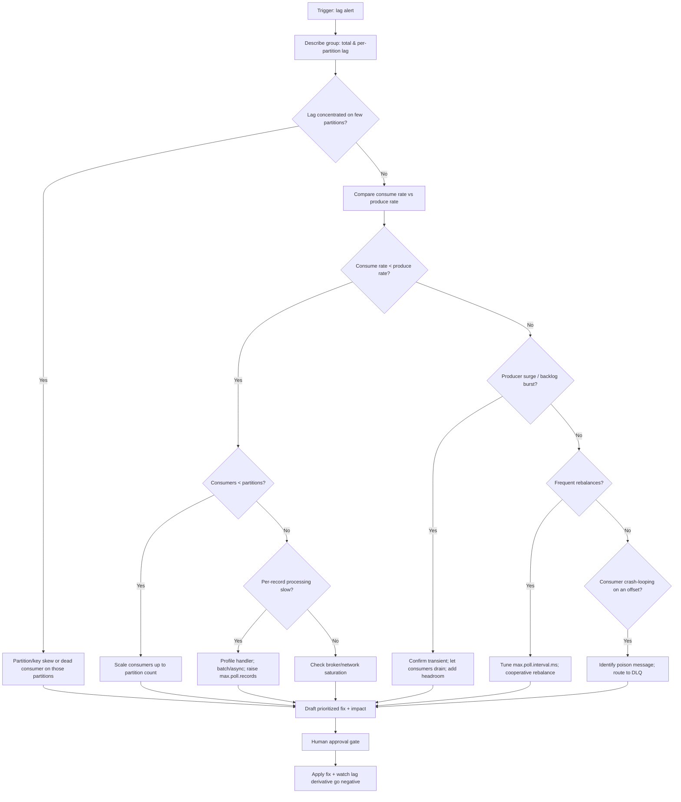
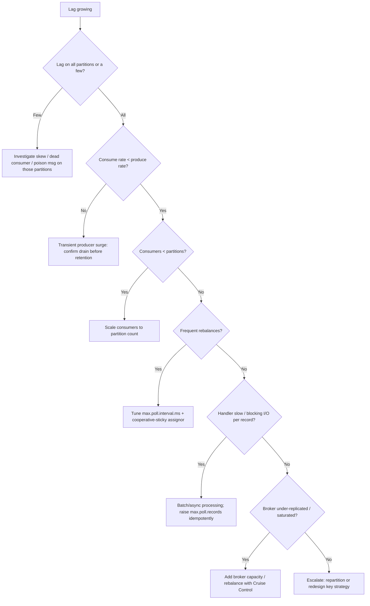

# Investigate Kafka Consumer Lag

> Diagnose and remediate growing Kafka consumer lag — slow consumers, partition
> skew, rebalancing storms, broker bottlenecks, and poison messages — and
> restore end-to-end processing latency to within SLO.

## Objective

Determine the root cause of rising Kafka consumer-group lag and produce a
prioritized remediation plan that returns lag to a steady, bounded state within
SLO. "Done" means lag is attributed to a concrete cause — under-provisioned
consumers, partition skew, frequent rebalances, a stuck/poison message, broker
or network saturation, or a producer surge — with a fix, expected impact, and
rollback for each.

## Business Context

Kafka is the central nervous system for event-driven architectures: order
events, payment captures, clickstream, CDC pipelines, and ML feature streams all
flow through it. Consumer lag is the single most important health signal because
it measures how far behind real time the business is operating. Lag on a payment
settlement topic means money is not moving; lag on a fraud-detection stream means
fraudulent transactions clear before they are scored; lag on a CDC pipeline means
downstream analytics and search indexes serve stale data. Unbounded lag also
risks data loss when it exceeds the topic retention window. Keeping lag bounded
is therefore a direct measure of business timeliness and data integrity.

## Problem Statement

A consumer group's lag (the difference between the log-end offset and the
committed offset, summed across partitions) is growing or has breached an alert
threshold. The agent must determine whether the cause is consumer throughput,
partition/key skew, rebalancing instability, a poison message, broker/disk/network
saturation, or a producer spike, and separate the symptom (lag) from the cause.

Out of scope: redesigning the topic/partitioning scheme, changing the event
schema, migrating clusters, and capacity procurement — these may be recommended
but are not executed here.

## Success Criteria

- [ ] Total and per-partition lag captured for the affected consumer group.
- [ ] Consumer throughput vs. producer rate compared over the incident window.
- [ ] Partition skew and consumer-to-partition assignment mapped.
- [ ] Rebalance frequency and duration assessed from consumer logs/metrics.
- [ ] Root cause classified (consumer capacity, skew, rebalance, poison message, broker/network, producer surge).
- [ ] Prioritized remediation plan with expected impact and risk.
- [ ] No offset reset or scaling change in production without explicit approval.

## Trigger Conditions

- Alert: `kafka_consumergroup_lag_sum > 100000 for 10m` or lag time-derivative positive and rising.
- Alert: `consumer_rebalance_rate` elevated (frequent group rebalances).
- Alert: `records-lag-max` (JMX) breaching threshold on a consumer instance.
- Alert: broker `UnderReplicatedPartitions > 0` or `RequestHandlerAvgIdlePercent` low.
- Manual: downstream team reports stale/late data traced to a topic.

## Inputs Required

| Input | Description | Example | Required |
|-------|-------------|---------|----------|
| `bootstrap_servers` | Broker list | `kafka-0.internal:9092,...` | Yes |
| `consumer_group` | Affected group | `payments-settlement` | Yes |
| `topic` | Primary topic | `payment.captured.v1` | Yes |
| `slo_lag` | Acceptable steady-state lag | `< 5000` | Yes |
| `slo_e2e_ms` | End-to-end latency SLO | `2000` | Yes |
| `retention_ms` | Topic retention | `604800000` (7d) | Yes |

## Required Access

| Scope | Purpose | Read/Write | Sensitivity |
|-------|---------|-----------|-------------|
| `kafka-consumer-groups.sh --describe` | Read lag & assignment | Read | Low |
| Broker JMX / Prometheus (JMX exporter) | Broker & consumer metrics | Read | Low |
| Consumer application logs | Rebalance & error signals | Read | Medium |
| Kafka admin (reset offsets / alter partitions) | Apply remediation | Write | High (approval gated) |
| Deployment/scaling (consumer replicas) | Scale consumers | Write | High (approval gated) |

## Assumptions

- The consumer group uses Kafka's group coordinator (not manual partition assignment) unless noted.
- Prometheus with the JMX exporter (or Burrow/Cruise Control) is scraping brokers and consumers.
- Consumer instances emit `records-lag-max`, `records-consumed-rate`, and rebalance metrics.
- Topic partition count and consumer instance count are known.
- Retention is long enough that resetting offsets is feasible where needed.

## Risks

| Risk | Likelihood | Impact | Mitigation |
|------|-----------|--------|------------|
| `--reset-offsets` skips unprocessed data | Medium | Critical | Never reset without approval; prefer `--to-datetime`; document skipped range |
| Scaling consumers past partition count adds no throughput | High | Low | Consumers > partitions sit idle; increase partitions instead (carefully) |
| Increasing partitions breaks key ordering | Medium | High | Repartitioning changes key→partition mapping; assess ordering guarantees |
| Poison message repeatedly crashes consumers | Medium | High | Route to DLQ; add `max.poll` guards; skip only with approval |
| Rebalance storm from long processing | Medium | High | Tune `max.poll.interval.ms` / `max.poll.records`; use cooperative rebalancing |

## Constraints

- No offset resets, partition changes, or consumer scaling in production without an approved ticket and rollback.
- Repartitioning must account for key-ordering guarantees; treat as a design change.
- Respect data residency; do not export message payloads off-network.
- Keep changes within a single consumer group / topic blast radius.
- Honor active change freezes.

## Agent Persona

Adopt the persona of a **Principal Streaming Platform Engineer** who understands
the Kafka consumer group protocol deeply: partition assignment and the
group coordinator, the `poll()` loop and `max.poll.interval.ms`, eager vs.
cooperative (incremental) rebalancing, offset commit semantics, consumer lag as
`log-end-offset − committed-offset`, and broker-side signals like ISR shrink and
request handler saturation. Be precise about the fundamental constraint that
parallelism is capped by partition count. Never recommend an offset reset without
quantifying the data that would be skipped. Follow
[`docs/AI_AGENT_STANDARDS.md`](../../docs/AI_AGENT_STANDARDS.md): observe with
read-only admin/metrics first, mutate only with approval.

## Planning Instructions

1. Restate the lag SLO and the end-to-end latency target.
2. Enumerate observability: `kafka-consumer-groups.sh`, JMX/Prometheus, consumer logs, Burrow/Cruise Control.
3. Rank likely cause classes given the shape of the lag curve (steady climb vs. step change vs. sawtooth).
4. Mark read-only steps vs. mutating (scaling, offset reset, partition change).
5. Externalize the plan; because `human_in_the_loop` is `required`, get approval
   before any scaling, offset reset, or partition change.

## Execution Instructions

Start read-only: quantify lag and assignment.

```bash
# 1. Describe the group: per-partition lag, current vs log-end offset, owner
kafka-consumer-groups.sh --bootstrap-server kafka-0.internal:9092 \
  --describe --group payments-settlement

# Output columns: TOPIC PARTITION CURRENT-OFFSET LOG-END-OFFSET LAG CONSUMER-ID HOST CLIENT-ID
```

```bash
# 2. State of the group (Stable vs PreparingRebalance/CompletingRebalance)
kafka-consumer-groups.sh --bootstrap-server kafka-0.internal:9092 \
  --describe --group payments-settlement --state

# List members and their partition assignments (detect skew / idle members)
kafka-consumer-groups.sh --bootstrap-server kafka-0.internal:9092 \
  --describe --group payments-settlement --members --verbose
```

```promql
# 3. PromQL: total lag trend and per-partition breakdown (kafka_exporter / Burrow)
sum(kafka_consumergroup_lag{consumergroup="payments-settlement"})

topk(10, kafka_consumergroup_lag{consumergroup="payments-settlement"})

# Consumer throughput vs producer rate
sum(rate(kafka_consumer_records_consumed_total{group="payments-settlement"}[5m]))
sum(rate(kafka_topic_partition_current_offset{topic="payment.captured.v1"}[5m]))

# Rebalance activity and poll behavior (from JMX exporter)
rate(kafka_consumer_coordinator_rebalance_total{group="payments-settlement"}[15m])
max(kafka_consumer_fetch_manager_records_lag_max{group="payments-settlement"})
```

```bash
# 4. Broker-side saturation signals (JMX via kafka-run-class or exporter)
# Under-replicated partitions (should be 0)
kafka-topics.sh --bootstrap-server kafka-0.internal:9092 \
  --describe --under-replicated-partitions

# Check topic partition count (parallelism ceiling)
kafka-topics.sh --bootstrap-server kafka-0.internal:9092 \
  --describe --topic payment.captured.v1
```

```bash
# 5. Inspect a suspected poison message at a partition/offset (read-only)
kafka-console-consumer.sh --bootstrap-server kafka-0.internal:9092 \
  --topic payment.captured.v1 --partition 7 --offset 4531190 \
  --max-messages 1 --property print.headers=true
```

Only after diagnosis and approval, apply the least-invasive fix:

```bash
# 6a. Scale consumers up to (but not beyond) partition count (approval gated)
kubectl scale deployment payments-settlement-consumer --replicas=12

# 6b. Add partitions to raise the parallelism ceiling (assess ordering first!)
kafka-topics.sh --bootstrap-server kafka-0.internal:9092 \
  --alter --topic payment.captured.v1 --partitions 24

# 6c. Skip a confirmed poison message by advancing offset (approval gated, dry-run first)
kafka-consumer-groups.sh --bootstrap-server kafka-0.internal:9092 \
  --group payments-settlement --topic payment.captured.v1:7 \
  --reset-offsets --to-offset 4531191 --dry-run
# then re-run with --execute after approval
```

## Investigation Workflow



## Analysis Framework

Classify by the shape of the lag curve and corroborating metrics:

1. **Insufficient consumer capacity** — consume rate < produce rate, consumers
   fewer than partitions, or CPU-bound handlers. Fix: scale consumers up to (not
   beyond) partition count; parallelism is capped by partitions.
2. **Slow per-record processing** — lag climbs even with enough consumers;
   handler does synchronous I/O (DB/HTTP) per record. Fix: batch, parallelize,
   async, or raise `max.poll.records` with idempotent processing.
3. **Partition / key skew** — a few partitions carry most lag because a hot key
   (e.g. one big merchant) funnels traffic to one partition. Fix: better key
   design or repartitioning (ordering caveats).
4. **Rebalance storms** — sawtooth lag with frequent `PreparingRebalance`;
   processing exceeds `max.poll.interval.ms`, so the coordinator evicts and
   rebalances. Fix: increase `max.poll.interval.ms`, lower `max.poll.records`,
   enable cooperative-sticky assignor.
5. **Poison message** — one partition's lag frozen while a consumer crash-loops
   on a specific offset. Fix: DLQ pattern, error handling, skip with approval.
6. **Broker / network / disk saturation** — `UnderReplicatedPartitions > 0`, ISR
   shrink, low request-handler idle, disk-full; consumers starve on fetch. Fix:
   broker capacity, rebalance leadership (Cruise Control).
7. **Producer surge** — legitimate step-change in input; verify it is transient
   and that consumers can drain before retention expiry.

Prioritize scaling and consumer-config fixes (low risk) before repartitioning or
offset resets (high risk).

## Decision Tree



## Validation Steps

- [ ] Total lag derivative turns negative and trends toward `slo_lag`.
- [ ] Per-partition lag evens out (no single partition stuck).
- [ ] Consume rate >= produce rate sustained over 15+ minutes.
- [ ] Group state is `Stable`; rebalance rate returns to baseline.
- [ ] `records-lag-max` (JMX) drops below threshold on all consumer instances.
- [ ] No `UnderReplicatedPartitions`; broker request-handler idle recovers.
- [ ] If offsets were reset, the skipped range is documented and reconciled.

## Expected Outputs

- Per-partition lag table and total-lag trend.
- Consume-vs-produce rate comparison over the window.
- Consumer assignment/skew map and rebalance summary.
- Root-cause classification and prioritized remediation with impact/risk.
- Before/after lag and end-to-end latency.

## Deliverables

Produce a report using [`templates/report-template.md`](../../templates/report-template.md):
executive summary, evidence (`--describe` output, PromQL panels, consumer logs),
root-cause analysis, prioritized recommendations, applied changes with before/after
metrics, and follow-ups (autoscaling on lag, DLQ, partition strategy). Include the
exact commands executed and rollback (scale-down, offset restore).

## Escalation Process

- **Sev-1 (lag approaching retention / data-loss risk):** page on-call
  streaming + the topic-owning team immediately; consider temporary retention
  extension to preserve data while draining.
- **Sev-2 (SLO breach):** post `--describe` output, lag trend, and proposed fix
  in `#streaming-oncall` within 15 minutes.
- **Approval required:** offset resets, partition increases, and consumer scaling
  route to the change approver with the skipped-data/ordering analysis and rollback.

## Rollback Strategy

- Consumer scaling: `kubectl scale deployment ... --replicas=<original>`; safe
  and immediate.
- Config changes (`max.poll.records`, `max.poll.interval.ms`): revert the
  deployment env/config and roll consumers.
- Offset reset: if committed offsets were captured beforehand, restore with
  `--reset-offsets --to-offset <saved>` per partition (dry-run then execute).
- Partition increase: **cannot** be reduced — this is why ordering must be
  assessed first; rollback means creating a new topic with the prior partition
  count and migrating producers/consumers.
- Confirm rollback by re-describing the group and verifying lag behavior matches baseline.

## Post-Execution Review

- Should the consumer group autoscale on lag (e.g. KEDA on `kafka_consumergroup_lag`)?
- Is `max.poll.interval.ms` sized to the real worst-case processing time?
- Should a DLQ + retry topic be standard for this consumer?
- Was partition count sized for peak parallelism, or is repartitioning overdue?

## Metrics

| Metric | Definition | Target |
|--------|-----------|--------|
| MTTD | Time from lag growth to detection | < 10m |
| MTTR | Time from trigger to lag bounded | < 2h |
| Steady-state lag | Sum of per-partition lag | < `slo_lag` |
| End-to-end latency | Produce-to-process p99 | < `slo_e2e_ms` |
| Rebalance rate | Rebalances per hour | Near baseline |
| Consume/produce ratio | Consume rate / produce rate | >= 1.0 sustained |

## Example Execution

**Input:** `bootstrap_servers=kafka-0.internal:9092`,
`consumer_group=payments-settlement`, `topic=payment.captured.v1`,
`slo_lag=<5000`, alert `kafka_consumergroup_lag_sum > 100000 for 10m`.

**Agent reasoning (abridged):** `--describe` showed total lag ~430k, but 92% of
it was on partitions 6–8, each still owned by a live consumer. `--members
--verbose` confirmed 12 consumers across 24 partitions (2 partitions each), so
capacity was not obviously the issue. PromQL showed consume rate had dropped to
zero on partitions 6–8 fifteen minutes earlier, while other partitions kept up.
Consumer logs showed a crash loop deserializing offset 4531190 on partition 7 —
a message with a malformed Avro header from a bad producer deploy. Classified as
**poison message causing partial stall**.

```text
kafka-consumer-groups.sh --describe (excerpt):
 TOPIC                 PARTITION  CURRENT-OFFSET  LOG-END-OFFSET   LAG
 payment.captured.v1   6          4,530,001       4,662,340        132,339
 payment.captured.v1   7          4,531,190       4,663,101        131,911
 payment.captured.v1   8          4,529,880       4,660,210        130,330
 payment.captured.v1   0          8,912,004       8,912,050            46
 ...

Consumer log: SerializationException at partition=7 offset=4531190 (retry x3271)
```

**Outcome:** The malformed message was routed to a DLQ and the offset advanced
past 4531190 (dry-run, then `--execute` after approval). Lag on partitions 6–8
drained within 12 minutes and total lag returned to ~1,800. The producer bug was
fixed and a DLQ + schema-validation guard added. Rollback (restore committed
offsets) was documented but not needed. Follow-up: add KEDA lag-based autoscaling
and a dead-letter pattern as standard for settlement consumers.

## References

- [`docs/AI_AGENT_STANDARDS.md`](../../docs/AI_AGENT_STANDARDS.md)
- [`templates/report-template.md`](../../templates/report-template.md)
- [Event-Driven Migration runbook](./event-driven-migration.md)
- Kafka docs: consumer groups, rebalancing (cooperative-sticky), `kafka-consumer-groups.sh`, JMX metrics; Burrow / Cruise Control.
