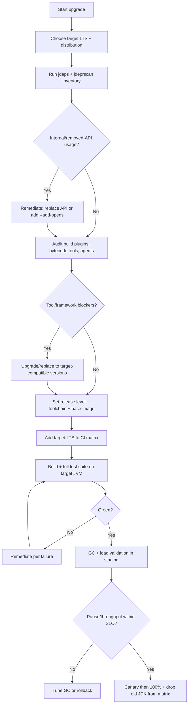
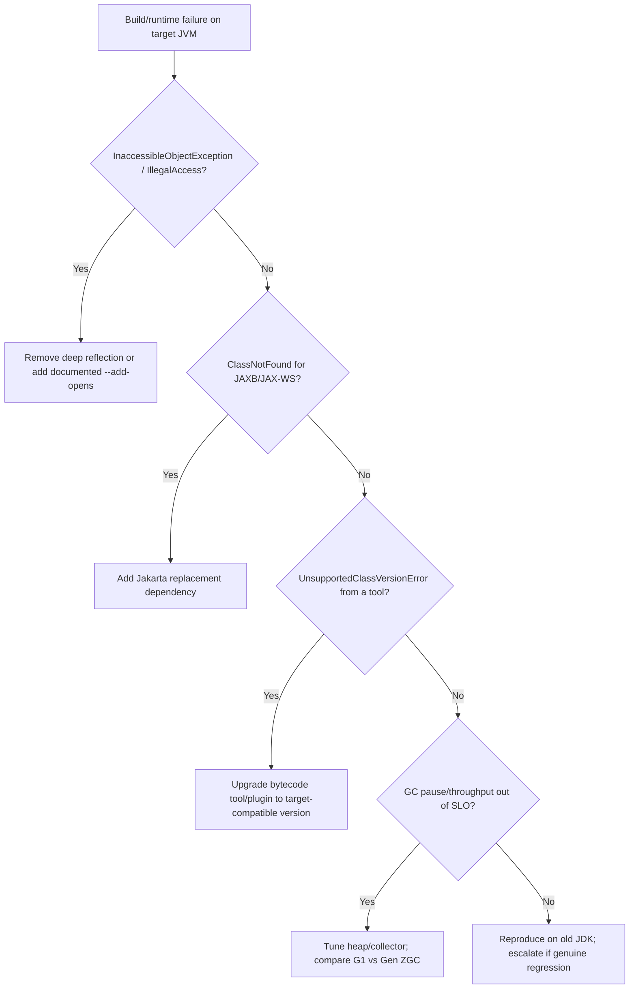

# Java Version Upgrade

> Upgrade a JVM application from an older Java (8/11/17) to a modern LTS such as
> Java 21, handling the module system, removed/deprecated APIs, garbage
> collector changes, and build-tooling updates — safely and reversibly.

## Objective

Migrate all build, test, and runtime environments to the target Java LTS (e.g.
21) so the application compiles with the new `--release` level, passes its full
test suite, runs on the new JVM with a validated GC and startup profile, and
removes reliance on APIs deleted between the source and target versions. "Done"
means production runs on the target LTS behind a progressive rollout with stable
latency/throughput and a documented compatibility baseline.

## Business Context

Java LTS releases (8, 11, 17, 21, 25...) each carry multi-year vendor support;
non-LTS feature releases expire in six months. Oracle and OpenJDK distributions
(Temurin, Corretto, Zulu, Liberica) tie security patches to supported lines, so
running Java 8 or an unsupported build is a recurring audit finding and a real
CVE exposure. Modern LTS releases deliver large operational wins: the G1 and
ZGC/Generational ZGC collectors dramatically cut pause times, virtual threads
(Project Loom, GA in 21) transform throughput for I/O-bound services, and
records, sealed classes, pattern matching, and text blocks reduce boilerplate.
Vendors and frameworks (Spring Boot 3.x requires Java 17+, Jakarta EE 10) have
moved their baseline forward. Upgrading protects security posture, lowers cloud
cost through better GC and startup, and unblocks framework adoption.

## Problem Statement

A JVM major upgrade changes bytecode targets, the classpath/module semantics,
and the runtime. Key hazards: the strong encapsulation of JDK internals
(`--illegal-access` was removed after 16, so `sun.misc.Unsafe` / reflective
access into `java.*` now fails without `--add-opens`), removed modules (JAXB,
JAX-WS, CORBA, `java.se.ee` removed after Java 11), removed tools and APIs
(`Applet`, `SecurityManager` deprecated for removal, `Thread.stop`, finalization
deprecation), byte-for-byte behavior changes (default charset UTF-8 since 18,
`Locale` provider changes), and GC default/tuning changes. Build tooling must be
aligned: Maven compiler/surefire plugins, Gradle toolchains, and any bytecode
processors (Lombok, ASM, ByteBuddy, Mockito inline) must support the target
class-file version. Native/agent instrumentation and reflection-heavy libraries
frequently break.

Out of scope: rewriting the app onto virtual threads or the module system
(JPMS) as new architecture — those are optional follow-on tracks noted here.

## Success Criteria

- [ ] Build toolchain (Maven/Gradle) targets the new `--release`/toolchain
      language level and produces the correct class-file version.
- [ ] CI runs and passes on the target LTS (and the outgoing version during the
      transition).
- [ ] No compile or runtime references to removed modules/APIs remain, or they
      are explicitly shimmed (e.g. JAXB via `jakarta.xml.bind` dependency).
- [ ] All required `--add-opens`/`--add-exports` flags are documented and set,
      or the underlying reflective access is removed.
- [ ] Full unit, integration, and contract tests pass on the target JVM.
- [ ] GC and startup profile validated under load; pause times within SLO.
- [ ] Container base image / runtime JDK pinned to the target LTS distribution.
- [ ] Production rollout (canary → 100%) completes with stable metrics.

## Trigger Conditions

- Schedule: Current JDK line approaches or reaches End-of-Life.
- Security: A CVE is patched only on a newer LTS.
- Framework requirement: e.g. Spring Boot 3 requires Java 17+.
- Manual: Platform team schedules a fleet JVM upgrade.

## Inputs Required

| Input | Description | Example | Required |
|-------|-------------|---------|----------|
| `current_java` | Current version | `11` | Yes |
| `target_java` | Target LTS | `21` | Yes |
| `jdk_distribution` | Vendor build | `Eclipse Temurin` | Yes |
| `build_tool` | Maven or Gradle | `Maven 3.9` | Yes |
| `frameworks` | Major frameworks in use | `Spring Boot 2.7` | Yes |
| `agents` | Java agents / bytecode tools | `Lombok`, `ByteBuddy` | No |
| `gc_slo` | Pause-time / throughput SLO | `p99 GC pause < 50ms` | No |

## Required Access

| Scope | Purpose | Read/Write | Sensitivity |
|-------|---------|-----------|-------------|
| Source repositories | Edit code, build config | Read/Write | Medium |
| CI pipeline | Run the JDK matrix | Read/Write | Medium |
| Artifact registry | Publish/consume built artifacts | Read/Write | Medium |
| Container registry | Build/push new JDK base images | Read/Write | Medium |
| Staging/canary | Validate under load | Read/Write | High |
| APM/GC logs | Compare pause times, throughput | Read | Low |

## Assumptions

- Builds are reproducible in CI with a pinned JDK toolchain.
- A representative staging environment exists for GC/load validation.
- Dependencies are managed via a lockfile-equivalent (Maven BOM/`dependency:tree`
  or Gradle lockfile) and can be pinned.
- Java agents (profilers, APM) have builds compatible with the target JVM.

## Risks

| Risk | Likelihood | Impact | Mitigation |
|------|-----------|--------|------------|
| Reflective access to JDK internals blocked | High | High | Remove `Unsafe`/deep reflection or add `--add-opens`; upgrade libs |
| Removed module (JAXB/JAX-WS) breaks build | High | High | Add Jakarta replacement deps; run `jdeps` early |
| Bytecode tool unsupported for target class version | Medium | High | Upgrade Lombok/ASM/ByteBuddy/Mockito to compatible versions |
| GC behavior/pauses change under load | Medium | High | Benchmark G1 vs Generational ZGC; tune; watch pause SLO |
| Charset/Locale default changes alter output | Medium | Medium | Pin `file.encoding`; add golden tests; audit `Locale` use |
| Java agent (APM) incompatible | Medium | Medium | Validate agent on target JVM in staging first |

## Constraints

- No production deploy without a green matrix and staging soak under load.
- Progressive, reversible rollout only.
- Pin exact JDK distribution + version in build and runtime images.
- Keep language-feature adoption (records, virtual threads) in separate commits
  from the mechanical version bump.
- Respect change-freeze windows and compliance requirements.

## Agent Persona

Adopt the persona of a **Principal JVM/Platform Engineer**. Reason about the
JVM as a shared runtime with strong encapsulation and nuanced GC behavior. Be
rigorous with `jdeps`/`jdeprscan` evidence, class-file versions, and
launch-flag hygiene. Prefer load-tested evidence over defaults. Follow
[`docs/AI_AGENT_STANDARDS.md`](../../docs/AI_AGENT_STANDARDS.md).

## Planning Instructions

1. Confirm the target is an LTS and choose a supported distribution (Temurin,
   Corretto, Zulu, Liberica) with a defined support window.
2. Run `jdeps` and `jdeprscan` to inventory internal-API dependence, removed
   modules, and deprecated-for-removal API usage.
3. Build a compatibility matrix for build plugins, bytecode tools, frameworks,
   and Java agents against the target class-file version.
4. Sequence the plan: (a) build toolchain, (b) remediate removed modules/APIs,
   (c) dependency + agent upgrades, (d) CI matrix, (e) GC/load validation,
   (f) rollout.
5. Present the plan for approval with the list of blockers.

## Execution Instructions

Discovery first (read-only), then changes in isolated commits.

```bash
# 1. Inventory JDK internal + removed-module dependence (read-only)
jdeps --multi-release 21 --print-module-deps --recursive target/app.jar
jdeps -jdkinternals target/app.jar          # flags sun.*/jdk.internal use
jdeprscan --release 21 target/app.jar        # deprecated-for-removal usage
```

```bash
# 2. Set the build toolchain — Maven
mvn -v
# pom.xml: use the modern release flag instead of source/target
```

```xml
<!-- pom.xml -->
<properties>
  <maven.compiler.release>21</maven.compiler.release>
  <project.build.sourceEncoding>UTF-8</project.build.sourceEncoding>
</properties>
<!-- Replace removed JAXB (java.se.ee) with Jakarta implementation -->
<dependency>
  <groupId>jakarta.xml.bind</groupId>
  <artifactId>jakarta.xml.bind-api</artifactId>
  <version>4.0.2</version>
</dependency>
<dependency>
  <groupId>org.glassfish.jaxb</groupId>
  <artifactId>jaxb-runtime</artifactId>
  <version>4.0.5</version>
</dependency>
```

```gradle
// build.gradle — Gradle toolchains pin the JDK independent of the host
java {
    toolchain {
        languageVersion = JavaLanguageVersion.of(21)
        vendor = JvmVendorSpec.ADOPTIUM
    }
}
tasks.withType(Test).configureEach {
    // Grant reflective access only where a dependency genuinely needs it
    jvmArgs = ["--add-opens", "java.base/java.lang=ALL-UNNAMED"]
}
```

```bash
# 3. Rebuild and run the suite on the target JDK
export JAVA_HOME=$(dirname $(dirname $(readlink -f $(which java))))
mvn -e clean verify
# 4. Validate GC under load with logging enabled
java -XX:+UseG1GC -Xlog:gc*:file=gc.log:time,uptime,level,tags -jar target/app.jar
# Compare against Generational ZGC:
java -XX:+UseZGC -XX:+ZGenerational -Xlog:gc* -jar target/app.jar
```

Container base image update (pin distribution + version):

```dockerfile
# Before
FROM eclipse-temurin:11-jre-jammy
# After
FROM eclipse-temurin:21-jre-jammy
```

CI matrix testing both the outgoing and target LTS during transition:

```yaml
# .github/workflows/ci.yml
jobs:
  build:
    runs-on: ubuntu-latest
    strategy:
      fail-fast: false
      matrix:
        java: ['11', '17', '21']
    steps:
      - uses: actions/checkout@v4
      - uses: actions/setup-java@v4
        with:
          distribution: temurin
          java-version: ${{ matrix.java }}
          cache: maven
      - run: mvn -B clean verify
```

## Investigation Workflow



## Analysis Framework

Assess findings across four axes:

1. **Encapsulation & internals:** `jdeps -jdkinternals` output pinpoints
   `sun.misc.Unsafe`/`jdk.internal.*` usage. Prefer removing the dependence
   (many uses have public replacements: `VarHandle`, `MethodHandles`,
   `java.lang.foreign`). Only add `--add-opens`/`--add-exports` as a documented
   stopgap.
2. **Removed modules:** Java 11 removed `java.se.ee` (JAXB, JAX-WS, CORBA,
   JTA/JAF). Map each to its Jakarta/standalone dependency. Confirm with a
   clean build, not just a compile.
3. **Toolchain & bytecode:** The class-file major version must match the target
   (Java 17 = 61, Java 21 = 65). Every processor touching bytecode (Lombok,
   Mockito inline, ByteBuddy, ASM, JaCoCo, GraalVM) needs a compatible version.
4. **Runtime behavior & GC:** Default charset became UTF-8 in 18; audit code
   that assumed platform default. Benchmark G1 (default) vs Generational ZGC
   for latency-sensitive services and validate pause-time SLO under production-
   like load before choosing a collector and heap sizing.

Triage `jdeprscan` hits by "deprecated" vs "deprecated for removal"; the latter
must be remediated before the next major, not deferred indefinitely.

## Decision Tree



## Validation Steps

- [ ] `mvn clean verify` / `gradle build` green on the target LTS.
- [ ] `jdeps -jdkinternals` reports no unaddressed internal-API usage.
- [ ] `jdeprscan --release <target>` shows no deprecated-for-removal usage.
- [ ] Class-file version of built artifacts matches the target.
- [ ] Integration and contract tests pass on the target JVM.
- [ ] GC logs show pause times within SLO under load.
- [ ] Startup time and RSS within acceptable bounds vs baseline.
- [ ] Java agent (APM/profiler) attaches and reports correctly on target JVM.

## Expected Outputs

- Upgrade branch/PR with build toolchain, dependency, and image changes.
- `jdeps`/`jdeprscan` inventory reports (before/after).
- GC and load-test comparison across collectors.
- CI matrix run demonstrating green on the target LTS.

## Deliverables

- A PR `chore: upgrade Java <old> → <target> LTS` summarizing removed-API
  remediation, added launch flags, and GC decision.
- A completed report per
  [`templates/report-template.md`](../../templates/report-template.md) with
  GC/throughput/startup comparisons.
- An ADR recording the LTS + distribution choice and GC selection rationale.

## Escalation Process

- **P0 (EOL security exposure):** Current JDK is EOL with an unpatched critical
  CVE — escalate to security + platform leads immediately.
- **P1 (blocking internal-API/tool):** No viable replacement and `--add-opens`
  is insufficient; escalate within one business day with `jdeps` evidence.
- **P2 (GC regression):** Pause times or throughput breach SLO under load;
  escalate to the owning team with GC logs and load-test results.
- Communicate in `#platform-jvm` with links to the matrix run and report.

## Rollback Strategy

1. Revert the deployed runtime image tag to the previous LTS build and redeploy
   (or set canary weight to 0).
2. `git revert -m 1 <merge_sha>` to restore build toolchain, dependencies, and
   launch flags.
3. Rebuild and republish the artifact on the previous JDK to confirm class-file
   version reverts.
4. Confirm rollback: `java -version` in the running container reports the
   previous LTS and GC/latency metrics return to baseline.

## Post-Execution Review

- Which internal-API usages forced `--add-opens`, and can we eliminate them?
- Was G1 or Generational ZGC the better fit, and why?
- Should we adopt virtual threads for I/O-bound endpoints as a follow-up?
- Can we automate `jdeps`/`jdeprscan` gates in CI for future majors?

## Metrics

| Metric | Definition | Target |
|--------|-----------|--------|
| EOL exposure window | Days on EOL JDK | 0 |
| Matrix pass rate | CI green on target LTS | 100% |
| Internal-API residue | Unaddressed `jdeps` hits | 0 |
| GC pause p99 | Under production-like load | Within SLO |
| Startup time delta | vs baseline | <= baseline |
| Rollback count | During rollout | 0 |

## Example Execution

Inputs: `current=11`, `target=21`, distribution Temurin, Maven 3.9, Spring Boot
2.7 → 3.3 (required by Java 17+), agents Lombok + Datadog APM.

Agent reasoning excerpt:

```text
Step 1 — jdeps -jdkinternals: 2 uses of sun.misc.Unsafe in a caching lib (old
         Caffeine). jdeprscan: SecurityManager use in bootstrap (deprecated
         for removal). Removed module: JAXB used by SOAP client.
Step 2 — Remediation: upgrade Caffeine (drops Unsafe), remove SecurityManager
         policy (unused), add jakarta.xml.bind-api + jaxb-runtime.
Step 3 — Spring Boot 2.7 -> 3.3 (javax -> jakarta namespace migration via
         OpenRewrite recipe). Lombok 1.18.30 supports Java 21; Mockito 5.x.
Step 4 — maven.compiler.release=21; CI matrix 11/17/21. First run: 40 javax
         import failures fixed by OpenRewrite rewrite-jakarta recipe.
Step 5 — GC: G1 p99 pause 22ms; Generational ZGC p99 3ms. Chose Gen ZGC for the
         latency-sensitive gateway. Load test throughput +6%.
Step 6 — Staging soak 48h stable. Canary 10% -> 100%. Dropped Java 11 from matrix.
```

Sample report excerpt:

```text
Finding F1 — JAXB removal required Jakarta replacement for the SOAP integration.
Finding F2 — Generational ZGC cut p99 GC pause from 22ms (G1) to 3ms.
Impact — Throughput +6%; startup -12% via AppCDS; no functional regressions.
Recommendation R1 — Pilot virtual threads on the outbound HTTP connector next.
```

## References

- [JDK 21 release notes](https://jdk.java.net/21/release-notes)
- [`jdeps` documentation](https://docs.oracle.com/en/java/javase/21/docs/specs/man/jdeps.html)
- [`jdeprscan` documentation](https://docs.oracle.com/en/java/javase/21/docs/specs/man/jdeprscan.html)
- [OpenRewrite Java migration recipes](https://docs.openrewrite.org/recipes/java/migrate)
- [Generational ZGC (JEP 439)](https://openjdk.org/jeps/439)
- [`docs/AI_AGENT_STANDARDS.md`](../../docs/AI_AGENT_STANDARDS.md)
- [`templates/report-template.md`](../../templates/report-template.md)
