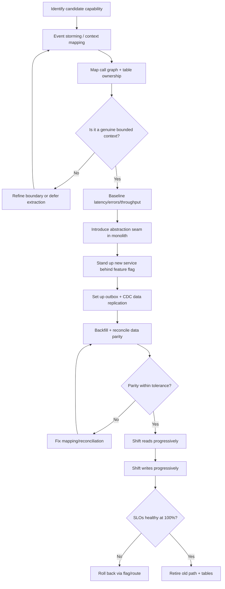
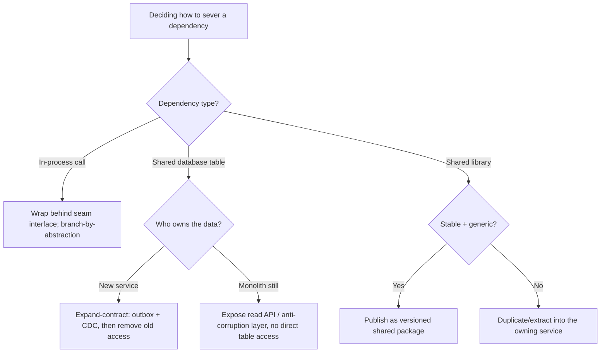

# Microservice Decomposition

> Decompose a specific capability out of a larger system into an independently
> deployable service using domain boundaries, seams, the strangler fig pattern,
> and clear data ownership — incrementally and without downtime.

## Objective

Extract one bounded capability (e.g. "Notifications", "Pricing", "Inventory")
from an existing monolith or coarse service into an independently deployable,
independently ownable microservice with its own data store and API contract,
while keeping the system fully operational throughout. "Done" means traffic for
that capability is served by the new service behind a routing seam, the old code
path is retired, and the service owns its data with no shared-table coupling.

## Business Context

Not every system should be a fleet of microservices, but specific capabilities
benefit enormously from extraction: those with a different scaling profile
(fan-out notifications), a different change cadence (pricing rules that change
daily), a different team owner (a dedicated payments squad), or a different
compliance boundary (PII isolation). Decomposition done well improves
deployability, fault isolation, and team autonomy — Team Topologies "stream-
aligned" ownership. Done poorly, it creates a distributed monolith: the
operational cost of microservices (network, eventual consistency, distributed
tracing) with none of the autonomy. This runbook decomposes *one* capability at
a time so value is delivered incrementally and risk stays bounded, rather than
attempting a big-bang rewrite.

## Problem Statement

The target capability is currently entangled in a larger codebase: it shares a
database schema, in-process function calls, and deployment lifecycle with
unrelated features. Symptoms include: a single slow feature forcing the whole
app to scale, a risky release cadence because unrelated changes ship together,
and cross-team contention on the same modules. The problem is to identify the
capability's true boundary (its "seam"), sever the in-process coupling behind
an abstraction, migrate its data to a dedicated store, and route traffic to the
new service — all without a maintenance window and with a safe rollback at each
step.

Out of scope: decomposing the entire monolith (see
`monolith-to-microservices.md`), and choosing an orchestration platform.

## Success Criteria

- [ ] The capability's bounded context and public contract are documented and
      agreed with stakeholders.
- [ ] A routing seam (façade/adapter or API gateway route) directs the
      capability's traffic and can toggle old vs new implementation.
- [ ] The new service owns its data; no other service reads/writes its tables
      directly.
- [ ] Reads and writes for the capability are served by the new service at
      100% with the old path removed.
- [ ] Latency, error rate, and correctness are within agreed tolerances vs the
      pre-extraction baseline.
- [ ] Distributed tracing spans the seam end to end.
- [ ] Rollback to the monolith path is possible at every intermediate step.

## Trigger Conditions

- A capability has a divergent scaling or availability requirement.
- Team ownership boundaries no longer match the codebase (frequent merge
  conflicts, cross-team blocking).
- A compliance boundary (PII, PCI) requires isolation.
- Release risk is dominated by coupling of an otherwise-independent feature.

## Inputs Required

| Input | Description | Example | Required |
|-------|-------------|---------|----------|
| `capability` | The bounded context to extract | `Notifications` | Yes |
| `source_repo` | Monolith/source system | `github.com/acme/core` | Yes |
| `data_stores` | Tables/collections in scope | `notifications`, `templates` | Yes |
| `traffic_profile` | RPS, read/write mix | `1.2k RPS, 90% read` | Yes |
| `routing_layer` | Where the seam lives | `API gateway / façade` | Yes |
| `consistency_needs` | Sync vs eventual tolerance | `eventual OK` | Yes |
| `slo` | Latency/error SLOs to preserve | `p99 < 200ms` | Yes |

## Required Access

| Scope | Purpose | Read/Write | Sensitivity |
|-------|---------|-----------|-------------|
| Source repository | Introduce abstractions, extract code | Read/Write | Medium |
| New service repo/infra | Stand up the service + DB | Read/Write | High |
| CI/CD | Pipelines for both artifacts | Read/Write | Medium |
| Observability | Baseline + validate latency/errors/traces | Read | Low |
| Data store | Migrate/replicate the capability's data | Read/Write | High |

## Assumptions

- The team practices trunk-based or short-lived branches and can deploy
  frequently.
- Feature flags or gateway routing weights are available for progressive
  cutover.
- The monolith has (or can get) integration tests around the capability.
- There is an observability stack (metrics, logs, distributed tracing).

## Risks

| Risk | Likelihood | Impact | Mitigation |
|------|-----------|--------|------------|
| Wrong boundary → distributed monolith | Medium | High | Validate seam via DDD/event storming before extracting |
| Shared-database coupling persists | High | High | Enforce data ownership; use expand-contract + views/CDC |
| Dual-write inconsistency during migration | Medium | High | Prefer CDC/outbox over dual writes; reconcile continuously |
| Latency increases (network + serialization) | Medium | Medium | Batch/cache; measure vs baseline; co-locate initially |
| Hidden synchronous dependency | Medium | Medium | Contract tests; trace the seam; degrade gracefully |
| Rollback becomes impossible mid-migration | Low | High | Keep old path live behind the seam until fully validated |

## Constraints

- No maintenance window; migration must be online.
- Every step must be independently reversible.
- No new service may read another service's private tables.
- The public contract must be versioned and backward compatible during
  transition.
- Respect data-residency and PII handling requirements.

## Agent Persona

Adopt the persona of a **Principal Software Architect** specializing in
domain-driven design and evolutionary architecture. Be skeptical of premature
decomposition; justify the boundary with evidence (coupling, change cadence,
ownership). Favor the strangler fig and branch-by-abstraction patterns over
rewrites. Externalize the boundary decision for human sign-off. Follow
[`docs/AI_AGENT_STANDARDS.md`](../../docs/AI_AGENT_STANDARDS.md).

## Planning Instructions

1. Run a lightweight domain analysis (event storming / context mapping) to
   confirm the capability is a genuine bounded context with a stable contract.
2. Map current coupling: static call graph into/out of the capability, and the
   database tables it reads/writes and who else touches them.
3. Choose the seam location (façade in the monolith vs gateway route) and the
   data-ownership strategy (own DB from day one vs expand-contract migration).
4. Sequence: (a) introduce abstraction/seam, (b) stand up service behind flag,
   (c) migrate data with CDC/outbox, (d) shift reads, (e) shift writes,
   (f) retire old path.
5. Present the boundary + sequencing plan for human approval.

## Execution Instructions

Introduce an abstraction (branch-by-abstraction) so old and new implementations
are interchangeable behind one interface:

```java
// 1. Branch-by-abstraction: define the seam interface in the monolith
public interface NotificationService {
    void send(NotificationRequest request);
    DeliveryStatus status(NotificationId id);
}

// Existing in-process implementation (unchanged behavior)
class InProcessNotificationService implements NotificationService { /* ... */ }

// New adapter that calls the extracted microservice over HTTP/gRPC
class RemoteNotificationService implements NotificationService {
    private final NotificationClient client;
    public void send(NotificationRequest r) { client.send(map(r)); }
    public DeliveryStatus status(NotificationId id) { return client.status(id); }
}
```

Route via a feature flag so cutover is progressive and reversible:

```java
NotificationService impl =
    flags.isEnabled("notifications.use-remote", context)
        ? remoteNotificationService
        : inProcessNotificationService;
```

Migrate data with an outbox + change-data-capture rather than dual writes:

```sql
-- Expand phase: outbox table written in the SAME local transaction as the
-- business write, then streamed to the new service (via Debezium/Kafka).
CREATE TABLE notification_outbox (
    id           BIGSERIAL PRIMARY KEY,
    aggregate_id UUID NOT NULL,
    event_type   TEXT NOT NULL,
    payload      JSONB NOT NULL,
    created_at   TIMESTAMPTZ NOT NULL DEFAULT now(),
    published_at TIMESTAMPTZ
);
```

```bash
# Stand up the new service and replicate data continuously
kubectl apply -f notifications-service/deploy/
# Backfill history, then let CDC keep the new store current
python scripts/backfill_notifications.py --since 2020-01-01 --batch 5000
# Verify parity before shifting reads
python scripts/reconcile.py --source monolith --target notifications-svc
```

```bash
# Progressive read cutover via gateway weights
# 5% -> 25% -> 50% -> 100%, watching SLOs at each step
gateway route set /v1/notifications --canary notifications-svc=5
```

## Investigation Workflow



## Analysis Framework

Evaluate the extraction across four lenses:

1. **Boundary cohesion:** Does the capability change together, deploy together,
   and have a single owner? Use event storming to find aggregate boundaries and
   context maps to name upstream/downstream relationships (customer/supplier,
   conformist, anti-corruption layer).
2. **Coupling to sever:** Classify each dependency as in-process call (wrap in
   the seam interface), shared table (must be broken via expand-contract), or
   shared library (extract or duplicate). Shared-database access is the most
   dangerous — it silently recreates coupling.
3. **Data ownership & consistency:** Decide the source of truth. Prefer the new
   service owning its data with an outbox/CDC feed rather than dual writes.
   Determine where eventual consistency is acceptable and where a synchronous
   read-through is required.
4. **Operational cost vs benefit:** Each network hop adds latency and failure
   modes. Confirm the autonomy/scaling/compliance benefit outweighs the added
   distributed-systems complexity; if not, keep it a module.

Guard against confirmation bias: if the "boundary" requires many chatty
synchronous calls back to the monolith, the seam is wrong — revisit it.

## Decision Tree



## Validation Steps

- [ ] Contract tests (consumer-driven, e.g. Pact) pass between monolith and
      new service.
- [ ] Data reconciliation shows parity within tolerance during migration.
- [ ] Distributed traces show the seam end to end with acceptable added latency.
- [ ] Error rate and p99 latency within agreed delta vs baseline at each canary
      step.
- [ ] No service other than the new one accesses its tables (verified via DB
      audit/grants).
- [ ] Feature-flag/route rollback exercised successfully in staging.

## Expected Outputs

- A context map and boundary decision document.
- The seam abstraction merged into the monolith.
- A running, independently deployable service with its own store.
- Reconciliation and canary dashboards showing parity and SLO health.

## Deliverables

- PRs for the abstraction, the new service, and the data-migration tooling.
- A completed report per
  [`templates/report-template.md`](../../templates/report-template.md) covering
  boundary rationale, migration steps, and before/after metrics.
- An ADR recording the boundary and data-ownership decisions.

## Escalation Process

- **P1 (data divergence):** Reconciliation shows sustained drift the agent
  cannot explain — halt write cutover and escalate to the data owner within 2
  hours with the divergence report.
- **P2 (SLO breach):** Latency/error regression at a canary step that cannot be
  mitigated by caching/batching; escalate to the owning team.
- **Architecture concern:** If the seam requires chatty synchronous calls back
  to the monolith, escalate to the architecture review board before proceeding.
- Communicate in `#architecture` with the context map and current canary state.

## Rollback Strategy

1. At any step, flip the feature flag / gateway weight back to the in-process
   implementation — this is instant and traffic returns to the monolith path.
2. Because the outbox/CDC feed is additive, the monolith's data remains the
   source of truth until write cutover; no data rollback is needed before that
   point.
3. If rolling back after write cutover, replay the new service's outbox back
   into the monolith store and reconcile before disabling the service.
4. Confirm rollback: traces show traffic on the monolith path and SLOs return
   to baseline.

## Post-Execution Review

- Was the boundary correct, or did we discover hidden coupling?
- Did outbox/CDC avoid the dual-write pitfalls as intended?
- What added latency did the network hop introduce, and is it acceptable?
- Which capability should we extract next, and what did we learn to reuse?

## Metrics

| Metric | Definition | Target |
|--------|-----------|--------|
| Data parity | Reconciliation match rate | > 99.99% |
| Latency delta | p99 vs pre-extraction baseline | < +15% |
| Independent deploys | New service deploys without monolith | Yes |
| Cross-boundary DB access | Other services touching new tables | 0 |
| Rollback readiness | Steps with a tested rollback | 100% |

## Example Execution

Inputs: capability `Notifications`, source `acme/core`, tables `notifications`,
`templates`; 1.2k RPS, 90% read; gateway routing; eventual consistency OK;
p99 SLO 200ms.

Agent reasoning excerpt:

```text
Step 1 — Event storming confirms Notifications is a bounded context: owns
         delivery + templates, consumes UserRegistered/OrderShipped events.
         No feature outside it writes the notifications table (verified grants).
Step 2 — Introduced NotificationService interface; wrapped existing code as
         InProcessNotificationService. Added RemoteNotificationService adapter.
Step 3 — Added notification_outbox written in the same tx as sends. Debezium
         streams to notifications-svc Postgres. Backfilled 42M rows; reconcile
         reports 99.997% parity (remaining 0.003% were soft-deleted rows).
Step 4 — Read cutover 5%->25%->50%->100% over 3 days. p99 178ms vs 165ms
         baseline (+8%, within tolerance). Traces clean across the seam.
Step 5 — Write cutover behind flag; monolith now calls remote adapter only.
Step 6 — Retired in-process implementation and revoked monolith grants on the
         notifications tables.
```

Sample report excerpt:

```text
Finding F1 — Notifications is a clean bounded context; no external table writes.
Finding F2 — Outbox+CDC achieved 99.997% parity, avoiding dual-write drift.
Impact — Notifications now scales independently (peak fan-out 8x) without
         scaling the monolith; release cadence decoupled.
Recommendation R1 — Extract Pricing next; it shows similar change-cadence signal.
```

## References

- [Strangler Fig pattern (Martin Fowler)](https://martinfowler.com/bliki/StranglerFigApplication.html)
- [Branch by Abstraction (Martin Fowler)](https://martinfowler.com/bliki/BranchByAbstraction.html)
- [Transactional Outbox pattern](https://microservices.io/patterns/data/transactional-outbox.html)
- [Domain-Driven Design context mapping](https://martinfowler.com/bliki/BoundedContext.html)
- [`monolith-to-microservices.md`](./monolith-to-microservices.md)
- [`docs/AI_AGENT_STANDARDS.md`](../../docs/AI_AGENT_STANDARDS.md)
- [`templates/report-template.md`](../../templates/report-template.md)
