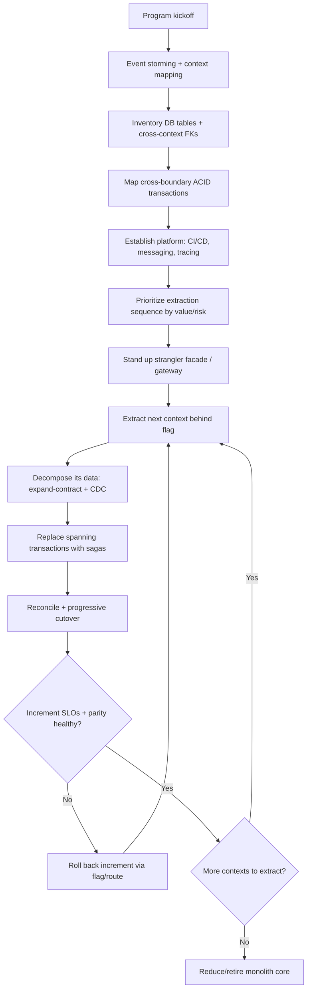
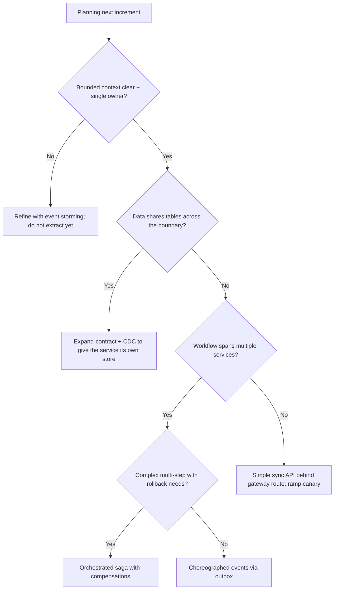

# Monolith to Microservices Migration

> A staged, end-to-end program to migrate a monolithic application into a set of
> microservices organized around bounded contexts, with database decomposition,
> saga-based transactions, and a strangler-fig cutover — delivering value
> incrementally rather than as a big-bang rewrite.

## Objective

Transform a monolithic application into a set of independently deployable
services aligned to bounded contexts, each owning its data, communicating via
well-defined contracts, and coordinating cross-service workflows with sagas —
while the system stays live throughout. "Done" for the program means the
majority of change-heavy capabilities are extracted, the monolith is reduced to
a thin (or retired) core, and teams deploy independently with clear ownership.
Each *increment* has its own definition of done: one context extracted, its
data split, and its traffic cut over with rollback available.

## Business Context

Monoliths are often the right starting point — they are simple to build, test,
and deploy. They become a liability when the organization scales: a single
deploy pipeline bottlenecks dozens of teams, one hot feature forces the whole
app to scale, a single bug can take down everything, and the shared database
becomes an unmanaged integration point. Migrating to microservices aligned with
Team Topologies stream-aligned teams restores autonomy, fault isolation, and
independent scalability. However, microservices trade code complexity for
operational and data-consistency complexity; a botched migration produces a
"distributed monolith" that is worse than the original. This program therefore
uses the strangler fig pattern to migrate incrementally, proving value and
retiring risk at each step, and only decomposes where the business case is
clear.

## Problem Statement

The monolith exhibits classic scaling pains: coupled deploys, a shared database
with hundreds of cross-cutting foreign keys, long CI times, and cross-team merge
contention. The migration must (1) discover the true bounded contexts hidden in
the codebase, (2) establish a routing seam so traffic can be redirected context
by context, (3) decompose the shared database so each service owns its data
without cross-service joins, (4) replace in-process ACID transactions that span
future service boundaries with sagas or other consistency patterns, and (5) do
all of this without downtime and with per-increment rollback. The hardest part
is almost always the data, not the code.

Out of scope: choosing between Kubernetes/serverless platforms, and extracting a
single capability in isolation (see `microservice-decomposition.md` for the
per-capability mechanics this program repeats).

## Success Criteria

- [ ] A prioritized bounded-context map and migration sequence exist and are
      agreed by stakeholders.
- [ ] A strangler façade / API gateway routes traffic per context and supports
      progressive, reversible cutover.
- [ ] Each extracted service owns its data; no cross-service database joins or
      shared-table writes remain.
- [ ] Cross-service workflows that were ACID transactions use sagas with
      compensations and are idempotent.
- [ ] Distributed tracing, per-service SLOs, and dashboards exist for every new
      service.
- [ ] Each increment ships with a tested rollback and no downtime.
- [ ] Deploy frequency and lead time improve measurably for migrated teams.

## Trigger Conditions

- Deploy pipeline and merge contention block multiple teams.
- The monolith cannot scale hot paths without scaling everything.
- A single fault domain repeatedly causes broad outages.
- Organizational restructuring into stream-aligned teams.

## Inputs Required

| Input | Description | Example | Required |
|-------|-------------|---------|----------|
| `monolith_repo` | Source system | `github.com/acme/erp` | Yes |
| `domain_map` | Draft bounded contexts | `Orders, Billing, Inventory` | Yes |
| `database_inventory` | Schemas/tables + FKs | `~420 tables` | Yes |
| `transaction_map` | Cross-boundary ACID flows | `place-order` | Yes |
| `traffic_profile` | RPS, hot paths | `checkout 3k RPS` | Yes |
| `platform` | Runtime + messaging | `K8s + Kafka` | Yes |
| `slo` | Per-context SLOs | `checkout p99 < 300ms` | Yes |

## Required Access

| Scope | Purpose | Read/Write | Sensitivity |
|-------|---------|-----------|-------------|
| Monolith repository | Introduce seams, extract code | Read/Write | High |
| New service repos/infra | Stand up services + stores | Read/Write | Critical |
| CI/CD | Multi-artifact pipelines | Read/Write | High |
| Databases | Decompose schemas, migrate data | Read/Write | Critical |
| Messaging (Kafka/etc.) | Events, CDC, saga orchestration | Read/Write | High |
| Observability | Baseline + validate per service | Read | Low |

## Assumptions

- Leadership funds a multi-quarter program and accepts incremental delivery.
- Teams can deploy frequently and use feature flags / gateway weights.
- A messaging backbone (Kafka, RabbitMQ, or cloud equivalent) is available.
- Observability (metrics, logs, distributed tracing) exists or will be added
  before extraction begins.

## Risks

| Risk | Likelihood | Impact | Mitigation |
|------|-----------|--------|------------|
| Distributed monolith (chatty sync coupling) | High | Critical | Align services to bounded contexts; prefer async events |
| Database decomposition data loss/drift | Medium | Critical | Expand-contract, CDC, continuous reconciliation, backups |
| Broken cross-service transaction integrity | Medium | Critical | Sagas with idempotent compensations; outbox for atomicity |
| Big-bang temptation / scope creep | Medium | High | Strict strangler increments; one context at a time |
| Operational immaturity (no tracing/on-call) | Medium | High | Establish platform + observability before first extraction |
| Latency regression on hot paths | Medium | High | Cache, batch, co-locate; measure vs baseline per increment |

## Constraints

- No downtime; every increment is online and independently reversible.
- No cross-service database access; each service owns its schema.
- No new distributed synchronous transaction spanning services — use sagas.
- Public contracts are versioned and backward compatible during transition.
- Respect data-residency, PII, and audit requirements throughout.

## Agent Persona

Adopt the persona of a **Principal Architect / Migration Program Lead** with
deep DDD, distributed-systems, and data-migration expertise. Be relentlessly
incremental and evidence-driven; resist big-bang rewrites and premature
decomposition. Treat data consistency as the primary risk. Externalize the
context map, sequencing, and each cutover plan for human approval. Follow
[`docs/AI_AGENT_STANDARDS.md`](../../docs/AI_AGENT_STANDARDS.md).

## Planning Instructions

1. Run domain analysis (event storming, context mapping) to identify bounded
   contexts and their relationships; validate against the org's team structure.
2. Prioritize the extraction sequence by value/risk: pick a context with high
   change cadence, clear ownership, and limited coupling as the first slice.
3. Inventory the database: tables per context and the foreign keys crossing
   context lines — these are the seams to break with expand-contract.
4. Map cross-boundary transactions and design sagas (orchestration vs
   choreography) with compensating actions.
5. Establish platform readiness (CI/CD templates, messaging, tracing) before
   the first extraction.
6. Present the context map, sequence, and first-increment plan for approval.

## Execution Instructions

Stand up the strangler façade so traffic can be routed per context:

```yaml
# gateway/routes.yaml — route by context; default to monolith
routes:
  - match: { path: /api/orders/** }
    route: orders-service        # extracted
    canaryWeight: 0              # ramp 0 -> 100 during cutover
    fallback: monolith
  - match: { path: /api/** }
    route: monolith              # everything not yet extracted
```

Break a cross-context foreign key with expand-contract (no hard FK across
service boundaries):

```sql
-- EXPAND: add a denormalized owner-controlled reference, backfill it,
-- and stop relying on the cross-context JOIN before CONTRACT (dropping the FK).
ALTER TABLE billing.invoice ADD COLUMN order_ref UUID;          -- expand
UPDATE billing.invoice i SET order_ref = o.public_id            -- backfill
  FROM orders.order o WHERE i.order_id = o.id;
-- Application now reads order_ref via the Orders API / event, not a JOIN.
ALTER TABLE billing.invoice DROP CONSTRAINT fk_invoice_order;   -- contract
```

Use the transactional outbox so a state change and its event are atomic:

```java
@Transactional
public void placeOrder(OrderCmd cmd) {
    Order order = orders.save(Order.from(cmd));      // business write
    outbox.append(new OrderPlaced(order.id(), ...)); // same DB transaction
}   // a relay/CDC publishes OrderPlaced to Kafka after commit
```

Coordinate a cross-service workflow with an orchestrated saga:

```text
place-order saga (orchestrator):
  1. Orders:    createOrder            -> compensation: cancelOrder
  2. Inventory: reserveStock           -> compensation: releaseStock
  3. Billing:   authorizePayment       -> compensation: voidAuthorization
  4. Shipping:  scheduleShipment       -> compensation: cancelShipment
  On any step failure: run compensations in reverse; all steps idempotent.
```

```bash
# Progressive cutover for a context, watching SLOs at each step
gateway route set /api/orders --canary orders-service=5   # then 25, 50, 100
python scripts/reconcile.py --context orders --source monolith --target orders-svc
```

## Investigation Workflow



## Analysis Framework

Reason about the program across four dimensions:

1. **Context boundaries:** Bounded contexts, not entities, are the unit of
   decomposition. Use event storming to surface aggregates and domain events,
   and context maps to classify relationships (partnership, customer/supplier,
   anti-corruption layer). Align boundaries with team ownership.
2. **Data decomposition (the hard part):** Every cross-context foreign key is a
   coupling to break. Apply expand-contract: introduce owner-controlled
   references, backfill, redirect reads to APIs/events, then drop the FK. Never
   allow one service to query another's tables. Use CDC + reconciliation to keep
   data consistent during transition.
3. **Consistency & transactions:** In-process ACID transactions that will span
   services must become sagas. Choose orchestration (a central coordinator, best
   for complex flows and visibility) vs choreography (event reactions, best for
   loose coupling). Every step and compensation must be idempotent; use the
   outbox to make state+event atomic.
4. **Sequencing & operability:** Pick early increments that de-risk the program
   (clear boundary, high change cadence, limited coupling). Confirm platform
   readiness — tracing across services and per-service on-call — before
   extracting anything customer-facing.

Beware the distributed monolith smell: if extraction requires many synchronous
round-trips back to the monolith, the boundary or the data split is wrong.

## Decision Tree



## Validation Steps

- [ ] Consumer-driven contract tests (Pact) pass for every new dependency.
- [ ] Data reconciliation shows parity within tolerance per migrated context.
- [ ] Saga happy-path and every compensation path are tested (including
      partial-failure and duplicate-delivery scenarios).
- [ ] Distributed traces span each cross-service workflow end to end.
- [ ] Per-context SLOs (latency, error rate) hold at each canary step.
- [ ] No cross-service DB access remains (verified via grants/audit).
- [ ] Rollback exercised in staging for the increment.

## Expected Outputs

- A living context map and prioritized migration backlog.
- A strangler façade/gateway routing traffic per context.
- Independently deployable services with owned data stores.
- Saga definitions with tested compensations for spanning workflows.
- Reconciliation and per-service observability dashboards.

## Deliverables

- PRs per increment (façade route, service, data migration, saga).
- A completed report per
  [`templates/report-template.md`](../../templates/report-template.md)
  summarizing each increment's boundary, data split, saga design, and metrics.
- ADRs for context boundaries, data-ownership, and saga orchestration choices.

## Escalation Process

- **P0 (data integrity):** Reconciliation shows unexplained divergence or a
  saga leaves an inconsistent state — halt cutover, freeze writes if needed, and
  escalate to the data owner and on-call architect immediately.
- **P1 (SLO breach on hot path):** Checkout/payment latency or error regression
  that mitigation cannot fix — escalate to the owning team and roll back.
- **Program risk:** Repeated distributed-monolith symptoms or scope creep —
  escalate to the architecture review board / sponsor.
- Communicate in `#migration-program` with the context map and cutover state.

## Rollback Strategy

1. Per increment, set the gateway canary weight for the context back to the
   monolith (instant, reversible) — traffic returns to the proven path.
2. While the monolith remains the source of truth (pre write-cutover), no data
   rollback is required; CDC to the new store is additive.
3. After write-cutover, replay the new service's outbox back into the monolith
   store, reconcile, then disable the service.
4. For a failed saga, ensure compensations have run so no partial state remains;
   verify with the reconciliation report.
5. Confirm rollback: traces show the monolith path and SLOs return to baseline.

## Post-Execution Review

- Which boundaries proved wrong once real traffic flowed, and why?
- Did sagas correctly compensate under injected failures (chaos testing)?
- How much latency did decomposition add on hot paths, net of caching?
- Are deploy frequency and lead time improving for migrated teams?
- What platform capabilities (tracing, saga tooling) should we invest in next?

## Metrics

| Metric | Definition | Target |
|--------|-----------|--------|
| Deploy frequency | Independent deploys per migrated team/week | Increasing |
| Lead time for change | Commit → prod for migrated services | Decreasing |
| Data parity | Reconciliation match rate per context | > 99.99% |
| Saga success rate | Completed without stuck/inconsistent state | > 99.9% |
| Cross-service DB access | Direct foreign-service table access | 0 |
| Change-failure rate | Failed increments requiring rollback | < 10% |

## Example Execution

Inputs: monolith `acme/erp` (~420 tables), contexts `Orders, Billing,
Inventory, Shipping`; checkout 3k RPS; K8s + Kafka; checkout p99 SLO 300ms.
First increment: extract `Orders`.

Agent reasoning excerpt:

```text
Step 1 — Event storming identifies place-order as a saga spanning Orders,
         Inventory, Billing, Shipping. Context map: Orders is upstream supplier.
Step 2 — DB inventory: 38 tables belong to Orders; 6 cross-context FKs (Billing
         and Shipping reference orders). These become expand-contract targets.
Step 3 — Platform: added OpenTelemetry tracing + Kafka outbox relay. On-call set.
Step 4 — Stood up orders-service (own Postgres). Outbox publishes OrderPlaced.
         Expand-contract removed the Billing->Orders FK (order_ref backfilled).
Step 5 — Rebuilt place-order as an orchestrated saga: createOrder, reserveStock,
         authorizePayment, scheduleShipment with reverse compensations; all
         steps idempotent via idempotency keys.
Step 6 — Reconcile parity 99.998%. Canary 5%->25%->50%->100% over 5 days.
         Checkout p99 268ms (baseline 240ms, +12%, within SLO). Chaos test:
         payment failure correctly released stock + cancelled order.
Step 7 — Orders fully cut over. Next increment: Billing.
```

Sample report excerpt:

```text
Finding F1 — place-order required a saga; ACID across 4 future services was
             impossible. Orchestration chosen for visibility + compensation.
Finding F2 — 6 cross-context FKs broken via expand-contract; no cross-service
             joins remain.
Impact — Orders now deploys ~14x/week independently; checkout scales without
         scaling ERP core. Change-failure rate for the increment: 0.
Recommendation R1 — Extract Billing next; reuse the outbox+saga scaffolding.
```

## References

- [Strangler Fig pattern (Martin Fowler)](https://martinfowler.com/bliki/StranglerFigApplication.html)
- [Saga pattern](https://microservices.io/patterns/data/saga.html)
- [Database per service](https://microservices.io/patterns/data/database-per-service.html)
- [Transactional Outbox](https://microservices.io/patterns/data/transactional-outbox.html)
- ["Monolith to Microservices" — Sam Newman](https://samnewman.io/books/monolith-to-microservices/)
- [`microservice-decomposition.md`](./microservice-decomposition.md)
- [`docs/AI_AGENT_STANDARDS.md`](../../docs/AI_AGENT_STANDARDS.md)
- [`templates/report-template.md`](../../templates/report-template.md)
