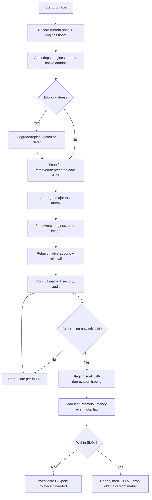
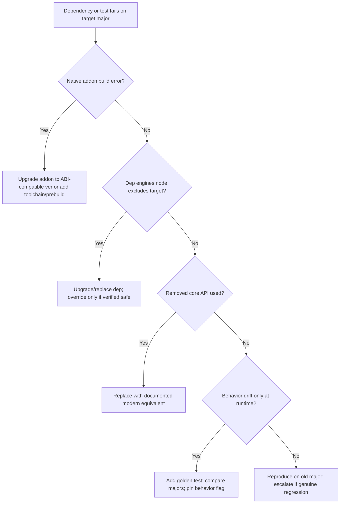

# Node.js Major Version Upgrade

> Upgrade a service or monorepo from an older Node.js major (e.g. 18) to a
> current Active LTS (e.g. 22), handling breaking changes, native ESM, the
> dependency audit, and a CI test matrix — safely and reversibly.

## Objective

Move all runtime, build, and CI environments from the current Node.js major to
the target Active LTS with no functional regressions, no supply-chain surprises,
and a documented compatibility baseline. "Done" means production runs on the
target major behind a progressive rollout, `engines` and CI pin the new
version, and every deprecated/removed API in the codebase and dependency tree
has been remediated or explicitly accepted.

## Business Context

Node.js majors follow a predictable release cadence: a new major cuts every
April/October, even-numbered releases become LTS, and each LTS receives ~30
months of support before End-of-Life. Running an EOL major means no security
patches — an unacceptable risk for internet-facing services and a common audit
finding (SOC 2, PCI-DSS). Newer majors also ship meaningful performance wins
(V8 upgrades, faster startup, better `fetch`/`undici`, the built-in test runner,
`--watch`, permission model) and let the team drop polyfills and transpilation.
Staying current reduces dependency friction because popular packages steadily
raise their `engines.node` floor. The upgrade protects the security posture and
unlocks developer velocity.

## Problem Statement

The application targets an aging Node.js major. Upgrading a runtime major is
riskier than a library bump because it changes the execution environment for
*all* code and dependencies simultaneously: V8 semantics, OpenSSL version,
global APIs (`fetch`, `structuredClone`, `Blob`), the module system (CommonJS
vs native ESM), removed/deprecated core APIs (e.g. `url.parse` legacy behavior,
`Buffer()` constructor, `domain`, certain `crypto` defaults), and native addon
ABI (`node-gyp`, `NODE_MODULE_VERSION`). Native modules must be rebuilt; some
transitive dependencies may not support the target major. The migration must
audit, remediate, and validate across a version matrix before rollout.

Out of scope: rewriting the app from CommonJS to ESM as a standalone
initiative (covered as an optional track here), and framework upgrades beyond
what the runtime requires.

## Success Criteria

- [ ] `engines.node` in every `package.json` reflects the target major.
- [ ] `.nvmrc` / `.node-version` / Dockerfile base images pin the target LTS.
- [ ] CI matrix runs and passes on the target major (and the outgoing major
      during the transition window).
- [ ] All native addons rebuild cleanly against the target ABI.
- [ ] `npm audit` / `osv-scanner` shows no new unresolved criticals introduced.
- [ ] No usage of removed core APIs remains; deprecations are triaged.
- [ ] Full test suite, integration, and load tests pass on the target major.
- [ ] Production rollout (canary → 100%) completes with stable memory/latency.

## Trigger Conditions

- Schedule: Current major approaches or reaches End-of-Life.
- Security: A CVE is patched only on a newer line.
- Dependency alert: A required package raises `engines.node` above current.
- Manual: Platform team schedules a fleet-wide runtime bump.

## Inputs Required

| Input | Description | Example | Required |
|-------|-------------|---------|----------|
| `current_node_major` | Version in use today | `18` | Yes |
| `target_node_major` | Target Active LTS | `22` | Yes |
| `repos` | Services/monorepos in scope | `orders-api` | Yes |
| `package_manager` | npm/pnpm/yarn | `pnpm` | Yes |
| `base_image` | Container base image family | `node:22-bookworm-slim` | Yes |
| `native_deps` | Known native addons | `bcrypt`, `sharp` | No |
| `load_test_tool` | For perf validation | `k6` | No |

## Required Access

| Scope | Purpose | Read/Write | Sensitivity |
|-------|---------|-----------|-------------|
| Source repositories | Edit code, engines, CI config | Read/Write | Medium |
| CI pipeline | Run the version matrix | Read/Write | Medium |
| Container registry | Build/push new base images | Read/Write | Medium |
| Package registry | Resolve dependencies | Read | Low |
| Staging/canary environment | Validate before rollout | Read/Write | High |
| APM/metrics | Compare memory, latency, GC | Read | Low |

## Assumptions

- CI already builds and tests the service in a reproducible container.
- There is a staging environment representative of production traffic.
- The team can pin exact versions (lockfile committed) and run a canary.
- Native dependencies are declared and buildable from source if prebuilt
  binaries are unavailable for the target ABI.

## Risks

| Risk | Likelihood | Impact | Mitigation |
|------|-----------|--------|------------|
| Transitive dep incompatible with target major | High | High | Full `engines` audit; upgrade/replace before runtime bump |
| Native addon fails to rebuild (ABI change) | Medium | High | Rebuild in CI; pin toolchain; use prebuilt or upgrade addon |
| Silent behavior change (OpenSSL/V8/tz) | Medium | High | Integration + golden-output tests; compare on both majors |
| ESM/CJS interop breakage | Medium | Medium | Isolate ESM migration; use dual-mode carefully |
| Memory/GC profile shifts | Low | Medium | Load test; watch RSS and event-loop lag on canary |
| Removed core API used at runtime only | Medium | Medium | Static scan + runtime deprecation logging (`--pending-deprecation`) |

## Constraints

- No production deploy without a green matrix and staging soak.
- Progressive, reversible rollout only (canary before fleet-wide).
- Pin exact versions; never rely on floating `latest` base images in prod.
- Keep CommonJS→ESM changes in separate commits from the runtime bump.
- Respect change-freeze windows and PCI/SOC audit constraints.

## Agent Persona

Adopt the persona of a **Principal Platform/Runtime Engineer**. Reason about
the runtime as a shared environment: a single change affects all code paths.
Be rigorous about native ABI, deprecation lifecycles, and reproducible builds.
Prefer evidence (matrix results, load tests) over optimism. Follow
[`docs/AI_AGENT_STANDARDS.md`](../../docs/AI_AGENT_STANDARDS.md).

## Planning Instructions

1. Confirm the target is an Active LTS (not merely Current) unless leadership
   explicitly accepts Current-line risk.
2. Produce a dependency audit: every direct/critical transitive dep's
   `engines.node` range and native-addon status against the target.
3. Sequence the plan: (a) audit & remediate deps, (b) CI matrix add target,
   (c) local dev pins, (d) container base image, (e) staging soak, (f) rollout.
4. If ESM migration is needed, plan it as a separate, sequenced track.
5. Present the plan for approval with the list of blocking dependencies.

## Execution Instructions

Discovery first (read-only), then changes in isolated commits.

```bash
# 1. Establish the current environment and dependency floors (read-only)
node --version
npx ls-engines            # summarize engines.node across the tree
npm ls --all 2>/dev/null | rg -i "gyp|prebuild|node-pre-gyp" || true

# 2. Scan for removed/deprecated core APIs
rg -n "new Buffer\(|url\.parse\(|require\('domain'\)|crypto\.createCipher\(" src/
```

```bash
# 3. Install and pin the target locally
nvm install 22 && nvm use 22
echo "22" > .nvmrc
# Update engines in every package.json
npm pkg set engines.node=">=22 <23"
```

```bash
# 4. Rebuild native addons against the new ABI and run audit
rm -rf node_modules
pnpm install
pnpm rebuild
npm audit --omit=dev
npx osv-scanner --lockfile=pnpm-lock.yaml
```

Container base image update:

```dockerfile
# Before
FROM node:18-bookworm-slim
# After — pin to the target LTS, digest-pinned in prod
FROM node:22-bookworm-slim
```

CI matrix (GitHub Actions) that tests both the outgoing and target majors
during the transition:

```yaml
# .github/workflows/ci.yml
name: ci
on: [push, pull_request]
jobs:
  test:
    runs-on: ubuntu-latest
    strategy:
      fail-fast: false
      matrix:
        node: [18, 20, 22]
    steps:
      - uses: actions/checkout@v4
      - uses: actions/setup-node@v4
        with:
          node-version: ${{ matrix.node }}
          cache: pnpm
      - run: corepack enable
      - run: pnpm install --frozen-lockfile
      - run: pnpm rebuild
      - run: pnpm test
```

Surface pending deprecations at runtime during staging soak:

```bash
node --pending-deprecation --throw-deprecation ./dist/server.js
# Or log without throwing to collect a full inventory:
node --trace-deprecation ./dist/server.js
```

## Investigation Workflow



## Analysis Framework

Evaluate findings across four dimensions:

1. **Compatibility floor:** Does every dependency permit the target major
   (`engines.node`)? Packages with `engines` below target that *work* can be
   overridden; those that genuinely break must be upgraded or replaced.
2. **Native ABI:** Every package with a `binding.gyp`/prebuild must rebuild
   against the target `NODE_MODULE_VERSION`. Prefer packages shipping prebuilt
   binaries for the target; otherwise ensure the CI image has the C++ toolchain.
3. **Core API surface:** Map each removed/deprecated API usage to its
   replacement (`new Buffer()` → `Buffer.alloc`/`Buffer.from`; legacy
   `url.parse` → WHATWG `URL`; `crypto.createCipher` → `createCipheriv`).
4. **Runtime behavior:** OpenSSL/V8/timezone/Intl changes can alter output
   subtly. Use golden-output and integration tests run on *both* majors to
   detect drift, and load tests to catch memory/GC regressions.

Do not conflate "warning" with "broken": triage deprecations by whether they
are runtime, pending, or end-of-life, and prioritize accordingly.

## Decision Tree



## Validation Steps

- [ ] CI matrix green on the target major across all packages.
- [ ] `pnpm rebuild` succeeds for every native addon.
- [ ] `npm audit` / `osv-scanner` introduces no new criticals.
- [ ] Integration and golden-output tests match on old and new majors.
- [ ] Staging soak (≥24h) shows stable RSS and event-loop lag.
- [ ] Load test throughput/latency within ±5% of baseline.
- [ ] `--pending-deprecation` run produces a triaged, empty-blocking list.

## Expected Outputs

- Upgrade branch/PR with engines, `.nvmrc`, Dockerfile, and CI matrix changes.
- A dependency + native-addon compatibility report.
- Security audit results before/after.
- Load-test comparison (baseline vs target major).

## Deliverables

- A PR `chore: upgrade Node.js <old> → <target> LTS` with a clear summary of
  remediated APIs and blocking dependencies resolved.
- A completed report per
  [`templates/report-template.md`](../../templates/report-template.md) with
  memory/latency/GC comparisons.
- An ADR documenting the target LTS choice and support-window rationale.

## Escalation Process

- **P0 (EOL security exposure):** If the current major is EOL and a critical CVE
  is unpatched, escalate immediately to security + platform leads.
- **P1 (blocking native dep):** No prebuilt binary and build fails on target;
  escalate within 4 hours with the failing addon and toolchain logs.
- **P2 (perf regression):** Sustained memory growth or latency > +5% on canary;
  escalate to the owning team with load-test evidence.
- Communicate in `#platform-runtime` with links to the matrix run and report.

## Rollback Strategy

1. Revert the deployed image tag to the last known-good build on the previous
   major and redeploy (or flip the canary weight to 0).
2. `git revert -m 1 <merge_sha>` to restore engines, `.nvmrc`, Dockerfile.
3. Restore the previous lockfile and reinstall to guarantee old-major
   resolution of native addons.
4. Confirm rollback: `node --version` in the running container reports the
   previous major and memory/latency return to baseline.

## Post-Execution Review

- Which dependencies blocked us, and can we reduce native-addon reliance?
- Did any runtime behavior change surprise us (OpenSSL/Intl/tz)?
- Should we automate the `ls-engines` audit as a recurring CI check?
- When is the next LTS, and can we script this runbook for the fleet?

## Metrics

| Metric | Definition | Target |
|--------|-----------|--------|
| EOL exposure window | Days running on EOL major | 0 |
| Matrix pass rate | CI green on target major | 100% |
| New criticals introduced | From dependency audit | 0 |
| Memory delta | RSS vs baseline on canary | < +5% |
| Latency delta | p99 vs baseline | < +5% |
| Rollback count | During rollout | 0 |

## Example Execution

Inputs: `current=18`, `target=22`, repo `orders-api`, `pnpm`, base image
`node:22-bookworm-slim`, native deps `bcrypt`, `sharp`.

Agent reasoning excerpt:

```text
Step 1 — node v18.19.1. ls-engines: 3 deps floor at >=18, none exclude 22.
Step 2 — Native: bcrypt@5.1 has prebuilds for Node 22 ABI 127; sharp@0.33 OK.
Step 3 — Core API scan: 4 `new Buffer(len)` in legacy parser -> Buffer.alloc.
         1 crypto.createCipher in tokens.js -> createCipheriv (needs IV migration).
Step 4 — Added 22 to CI matrix alongside 18/20. First run: 2 failures in
         tokens.test due to cipher change. Fixed with explicit IV + upgrade note.
Step 5 — Rebuilt addons in CI, audit clean. Staging soak 36h: RSS flat at 210MB.
Step 6 — k6 load test: p99 148ms vs 151ms baseline (-2%). Canary 10% -> 100%.
Step 7 — Dropped Node 18 from matrix after fleet migration.
```

Sample report excerpt:

```text
Finding F1 — crypto.createCipher removed path required IV migration in tokens.js.
Finding F2 — bcrypt/sharp rebuilt cleanly against ABI 127 via prebuilt binaries.
Impact — p99 latency -2%, startup time -18% due to V8 12.x improvements.
Recommendation R1 — Add `npx ls-engines` gate to CI to catch future floor drift.
```

## References

- [Node.js Releases & LTS schedule](https://github.com/nodejs/release#release-schedule)
- [Node.js API deprecations](https://nodejs.org/api/deprecations.html)
- [Node.js ESM documentation](https://nodejs.org/api/esm.html)
- [ls-engines](https://github.com/ljharb/ls-engines)
- [OSV-Scanner](https://google.github.io/osv-scanner/)
- [`docs/AI_AGENT_STANDARDS.md`](../../docs/AI_AGENT_STANDARDS.md)
- [`templates/report-template.md`](../../templates/report-template.md)
