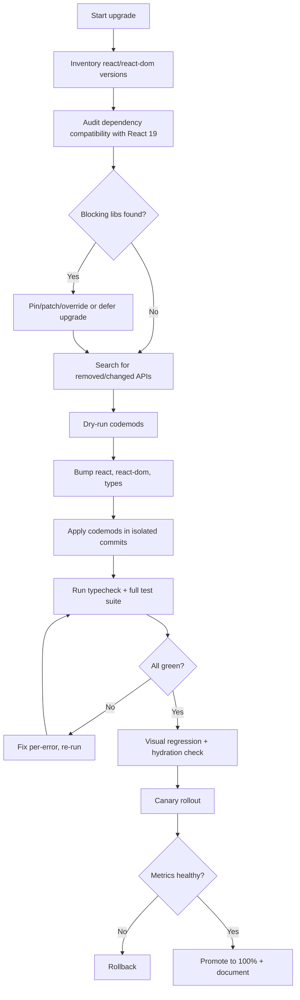
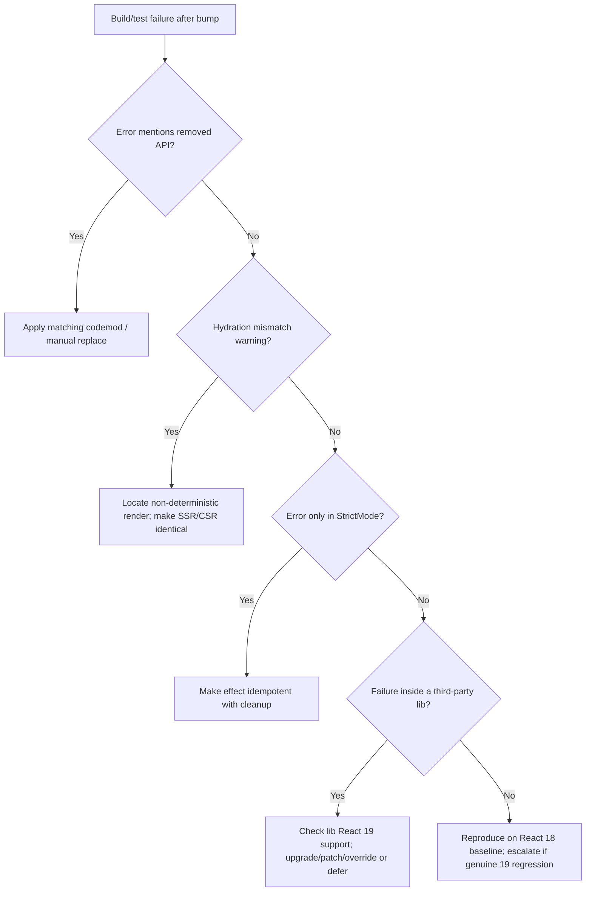

# React 18 to 19 Upgrade

> Upgrade a production React 18 application to React 19, adopting Actions, the
> `use()` API, `ref` as a prop, and the new form primitives while removing
> APIs deleted in 19 — with a safe, incremental, test-backed rollout.

## Objective

Migrate the target codebase from React 18.x to React 19.x such that the
application builds, passes its full test suite, renders identically in visual
regression, and adopts the new concurrency and data primitives where they
reduce boilerplate — without regressing hydration, performance, or
accessibility. "Done" means React 19 is running in production behind a
progressive rollout with zero net-new P0/P1 incidents attributable to the
upgrade and all removed APIs eliminated from the source tree.

## Business Context

React 19 is the first major release since React 18 (2022) and consolidates the
Actions model, server components/functions, and the `use()` primitive that
frameworks like Next.js and Remix already build upon. Staying on React 18
increasingly blocks adoption of the latest Next.js App Router features,
first-class form handling, and improved hydration diagnostics. Vendors and
component libraries (MUI, Radix, React Router, TanStack Query) are moving their
baseline to 19; delaying the upgrade accumulates dependency debt, forces peer
dependency overrides, and slows feature delivery. A clean upgrade unlocks
smaller bundles (better tree-shaking of the removed legacy APIs), fewer
`useEffect` data-fetching patterns, and improved developer velocity.

## Problem Statement

The application currently depends on `react@18` and `react-dom@18`. React 19
removes several long-deprecated APIs (`ReactDOM.render`, `ReactDOM.hydrate`,
`unmountComponentAtNode`, `findDOMNode`, string refs, legacy Context,
`propTypes`/`defaultProps` on function components, `react-test-renderer`
deprecation), changes ref semantics (`forwardRef` is no longer required),
tightens the JSX transform requirement, and alters error handling and
hydration mismatch reporting. The migration must identify every use of a
removed or changed API, apply official codemods, verify behavior, and adopt new
primitives selectively.

Out of scope: migrating to React Server Components as a new architecture,
rewriting state management libraries, and framework version bumps beyond what
React 19 strictly requires (those are separate runbooks).

## Success Criteria

- [ ] `react` and `react-dom` are pinned to a `19.x` release across all
      workspaces and lockfiles.
- [ ] No references remain to removed APIs (`ReactDOM.render`, `hydrate`,
      `unmountComponentAtNode`, `findDOMNode`, string refs, `defaultProps` on
      function components, legacy Context API).
- [ ] The project uses the automatic JSX runtime (`jsx: react-jsx`).
- [ ] All unit, integration, and E2E tests pass in CI on the upgrade branch.
- [ ] Visual regression diff shows no unintended UI changes.
- [ ] No new hydration mismatch warnings in the console for critical routes.
- [ ] Bundle size and Core Web Vitals (LCP, INP, CLS) are within +2% of the
      React 18 baseline.
- [ ] Progressive production rollout (canary → 100%) completes without rollback.

## Trigger Conditions

- Manual: Engineering leadership approves a scheduled framework upgrade.
- Dependency alert: A key library raises its peer dependency to `react@>=19`.
- Schedule: Quarterly dependency-health review flags React major drift.
- Security: A patched vulnerability is only backported to the React 19 line.

## Inputs Required

| Input | Description | Example | Required |
|-------|-------------|---------|----------|
| `repo_url` | Target repository | `github.com/acme/webapp` | Yes |
| `package_manager` | npm/pnpm/yarn/bun | `pnpm` | Yes |
| `target_react_version` | Exact React 19 version to pin | `19.1.0` | Yes |
| `app_entrypoints` | Files calling `createRoot`/`hydrateRoot` | `src/main.tsx` | Yes |
| `component_libraries` | UI libs needing peer-dep bumps | `@mui/material` | Yes |
| `ci_provider` | CI system for the matrix | `GitHub Actions` | Yes |
| `rollout_mechanism` | Feature flag or deploy canary | `LaunchDarkly` | No |

## Required Access

| Scope | Purpose | Read/Write | Sensitivity |
|-------|---------|-----------|-------------|
| Source repository | Create branch, edit code, open PR | Read/Write | Medium |
| CI pipeline | Run and inspect the build matrix | Read/Write | Medium |
| Package registry | Resolve and install React 19 + peers | Read | Low |
| Preview/canary environment | Validate before full rollout | Read/Write | Medium |
| Observability (RUM/APM) | Compare Web Vitals pre/post | Read | Low |

## Assumptions

- The app already runs React 18 with `createRoot` (not legacy `ReactDOM.render`
  in the primary entrypoint). If it still uses legacy roots, an extra step is
  required.
- TypeScript projects use `@types/react` and `@types/react-dom`; these must be
  bumped in lockstep.
- There is an existing automated test suite and, ideally, a visual regression
  tool (Chromatic, Percy, Playwright screenshots).
- The team can tolerate a short-lived upgrade branch and can gate the release
  behind a canary or feature flag.

## Risks

| Risk | Likelihood | Impact | Mitigation |
|------|-----------|--------|------------|
| Third-party lib incompatible with React 19 | High | High | Audit peers first; pin/patch or defer until lib supports 19 |
| Hydration mismatches surface as runtime errors | Medium | High | Test SSR routes explicitly; use new mismatch diagnostics |
| Ref semantic change breaks imperative handles | Medium | Medium | Codemod + targeted tests on components using refs |
| `StrictMode` double-invocation exposes latent bugs | Medium | Medium | Fix effects to be idempotent; do not disable StrictMode |
| Bundle/perf regression | Low | Medium | Compare Web Vitals and bundle analyzer before/after |
| Removed `propTypes` silently drops validation | Medium | Low | Rely on TypeScript; add runtime schema checks where needed |

## Constraints

- No direct commits to `main`; all work on a dedicated upgrade branch behind PR
  review.
- Production rollout must be progressive (canary first) and reversible.
- Do not disable `StrictMode` to paper over double-invocation bugs.
- Keep the diff reviewable: separate mechanical codemod commits from behavioral
  changes.
- Respect any active change-freeze windows.

## Agent Persona

Adopt the persona of a **Principal Frontend Architect** with deep React
internals knowledge. Be precise about API semantics, conservative about
behavioral changes, and explicit about the difference between mechanical
codemods and judgment calls. Externalize reasoning, cite the specific removed
API for every change, and never suppress warnings to force a green build.
Follow the conventions in
[`docs/AI_AGENT_STANDARDS.md`](../../docs/AI_AGENT_STANDARDS.md).

## Planning Instructions

1. Produce a dependency compatibility matrix for React 19 across all direct and
   critical transitive dependencies before touching code.
2. Enumerate every occurrence of a removed/changed API using static search and
   the React codemod dry-runs.
3. Draft a sequenced plan: (a) tooling/JSX runtime, (b) core `react`/`react-dom`
   bump, (c) codemods, (d) new-primitive adoption (optional), (e) test/rollout.
4. Present the plan for human approval (`human_in_the_loop: required`) with an
   explicit list of libraries that block the upgrade.

## Execution Instructions

Run read-only discovery first, then apply changes in small, reviewable commits.

```bash
# 1. Inventory current versions and search for removed APIs (read-only)
npm ls react react-dom @types/react @types/react-dom 2>/dev/null
grep -rEn "ReactDOM\.render|ReactDOM\.hydrate|unmountComponentAtNode|findDOMNode" src/
grep -rEn "defaultProps|createReactClass|PropTypes|React\.PropTypes" src/
grep -rEn "ref=\"[a-zA-Z]" src/   # string refs
```

```bash
# 2. Run the official React 19 codemod suite (dry run first)
npx codemod@latest react/19/migration-recipe --dry
# Apply once reviewed:
npx codemod@latest react/19/migration-recipe

# Individual codemods of note:
npx codemod@latest react/19/replace-reactdom-render
npx codemod@latest react/19/remove-forward-ref     # forwardRef -> ref prop
npx codemod@latest react/19/replace-string-ref
```

```bash
# 3. Bump the core packages and types in lockstep
pnpm add react@19.1.0 react-dom@19.1.0
pnpm add -D @types/react@19 @types/react-dom@19
pnpm install
```

Example modern entrypoint (React 18 → 19 is source-compatible for `createRoot`,
but confirm no legacy `render` remains):

```tsx
// src/main.tsx
import { StrictMode } from "react";
import { createRoot } from "react-dom/client";
import App from "./App";

createRoot(document.getElementById("root")!).render(
  <StrictMode>
    <App />
  </StrictMode>,
);
```

`ref` as a prop (no more `forwardRef` for new components):

```tsx
// Before (React 18)
const Input = forwardRef<HTMLInputElement, Props>((props, ref) => (
  <input ref={ref} {...props} />
));

// After (React 19): ref is a normal prop
function Input({ ref, ...props }: Props & { ref?: React.Ref<HTMLInputElement> }) {
  return <input ref={ref} {...props} />;
}
```

Adopting Actions and `use()`:

```tsx
import { useActionState } from "react";

function Subscribe() {
  const [state, submitAction, isPending] = useActionState(
    async (_prev: string | null, formData: FormData) => {
      const res = await subscribe(formData.get("email") as string);
      return res.ok ? null : "Subscription failed";
    },
    null,
  );

  return (
    <form action={submitAction}>
      <input name="email" type="email" required />
      <button disabled={isPending}>Subscribe</button>
      {state && <p role="alert">{state}</p>}
    </form>
  );
}
```

```tsx
// use() unwraps a promise or context during render (with Suspense)
import { use, Suspense } from "react";

function Profile({ userPromise }: { userPromise: Promise<User> }) {
  const user = use(userPromise);
  return <h1>{user.name}</h1>;
}
```

## Investigation Workflow



## Analysis Framework

Classify every finding into one of four buckets and handle accordingly:

1. **Mechanical (codemod-safe):** `ReactDOM.render` → `createRoot`, string refs
   → callback refs, `forwardRef` removal. Apply codemod, verify diff, commit
   separately.
2. **Behavioral (needs judgment):** `StrictMode` double-invocation exposing
   non-idempotent effects, hydration mismatches, `useLayoutEffect` timing.
   Requires reading the component and reasoning about side effects.
3. **Dependency-blocked:** A library with a hard `react@18` peer. Decide:
   upgrade the lib, apply a patch (`pnpm patch`), use an override, or defer.
4. **Opportunity (optional):** Replace `useEffect` fetch-on-mount with `use()` +
   Suspense, or manual form state with `useActionState`. Only adopt where it
   reduces risk/complexity, never in the same PR as the mechanical bump.

Rank hypotheses for any test failure by proximity to a known React 19 change
before assuming an app bug. Avoid confirmation bias: reproduce failures on the
React 18 baseline to confirm they are upgrade-induced.

## Decision Tree



## Validation Steps

- [ ] `tsc --noEmit` passes with `@types/react@19`.
- [ ] `npm test` / `vitest run` / `jest` full suite is green.
- [ ] E2E suite (Playwright/Cypress) passes on the preview deployment.
- [ ] Visual regression (Chromatic/Percy) shows zero unexpected diffs.
- [ ] No new console errors/warnings on top 10 routes, especially hydration.
- [ ] Bundle analyzer shows no unexpected size increase.
- [ ] RUM Web Vitals (LCP/INP/CLS) within +2% of baseline on canary.

## Expected Outputs

- A single upgrade branch with clearly separated commits (tooling, core bump,
  codemods, optional adoption).
- A dependency compatibility matrix document.
- A CI run showing green across the support matrix.
- A migration report using the report template.

## Deliverables

- A pull request titled `chore: upgrade React 18 → 19` with a description
  summarizing removed-API replacements, blocked dependencies, and rollout plan.
- A completed report following
  [`templates/report-template.md`](../../templates/report-template.md),
  including before/after Web Vitals and bundle metrics.
- An updated `CHANGELOG.md` / ADR entry recording the upgrade decision.

## Escalation Process

- **P1 (blocks release):** A critical dependency has no React 19 support and no
  viable patch. Escalate to the frontend platform lead within 4 hours with the
  compatibility matrix and options (defer, fork, replace).
- **P2 (behavioral regression):** Hydration or effect regression on a key route
  that cannot be resolved in one day. Escalate to the owning team with a
  reproduction.
- Communicate via the `#frontend-platform` channel and link the PR + report.

## Rollback Strategy

1. If canary metrics regress, disable the rollout flag or route traffic back to
   the React 18 build immediately.
2. Revert the merge commit: `git revert -m 1 <merge_sha>` and redeploy.
3. Restore the previous lockfile (`git checkout main -- pnpm-lock.yaml`) and
   reinstall to guarantee React 18 resolution.
4. Confirm rollback by verifying `react` resolves to `18.x` in the deployed
   bundle and Web Vitals return to baseline.

## Post-Execution Review

- Which dependencies blocked us, and should we replace fragile ones?
- Did StrictMode surface latent bugs we should track separately?
- Which new primitives (`use`, Actions) delivered the most simplification?
- Can we automate the compatibility matrix generation for the next major?

## Metrics

| Metric | Definition | Target |
|--------|-----------|--------|
| Upgrade lead time | Branch open → 100% rollout | < 2 weeks |
| Removed-API residue | Count of removed APIs left in tree | 0 |
| Test pass rate | CI green on upgrade branch | 100% |
| Web Vitals delta | INP/LCP/CLS change vs baseline | < +2% |
| Rollback count | Rollbacks during rollout | 0 |

## Example Execution

Inputs: `repo=acme/webapp`, `pnpm`, `target=19.1.0`, entrypoint `src/main.tsx`,
libraries `@mui/material`, `react-router-dom`, `@tanstack/react-query`.

Agent reasoning excerpt:

```text
Step 1 — Inventory: react@18.3.1, react-dom@18.3.1, @types/react@18.3.12.
Step 2 — Compat audit: react-router-dom@6.22 supports 19 via peer range ^18||^19.
         @mui/material@5.15 lists peer react@^17||^18 -> BLOCKING.
         Resolution: bump @mui/material to 6.x (peer ^19). Approved by human.
Step 3 — Removed-API scan: 2 string refs in LegacyModal.tsx, 1 ReactDOM.render
         in tests/setup.tsx, 14 forwardRef components.
Step 4 — Codemods applied: replace-string-ref (2), replace-reactdom-render (1),
         remove-forward-ref (14). Committed separately.
Step 5 — Bumped core + types + MUI 6. tsc clean after 3 prop-type fixes.
Step 6 — Tests: 812 passed. Playwright: 47 passed. Chromatic: 0 diffs.
Step 7 — Canary 5%: INP +0.8%, LCP -1.2%, no hydration warnings. Promoted 100%.
```

Sample report excerpt:

```text
Finding F1 — 14 forwardRef components migrated to ref-as-prop; no behavior change.
Finding F2 — @mui/material required a major bump (5→6) to satisfy React 19 peer.
Impact — Bundle -3.1 KB gzip after forwardRef removal; INP unchanged.
Recommendation R1 — Replace 6 useEffect data fetches with use() in a follow-up.
```

## References

- [React 19 upgrade guide](https://react.dev/blog/2024/04/25/react-19-upgrade-guide)
- [React 19 release notes](https://react.dev/blog/2024/12/05/react-19)
- [React codemod recipes (`codemod` CLI)](https://github.com/reactjs/react-codemod)
- [`docs/AI_AGENT_STANDARDS.md`](../../docs/AI_AGENT_STANDARDS.md)
- [`templates/report-template.md`](../../templates/report-template.md)
