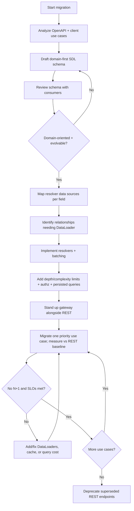
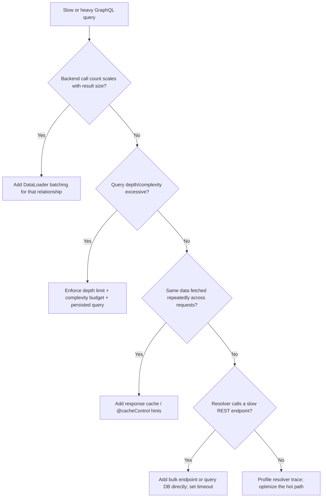

# REST to GraphQL Migration

> Introduce a GraphQL API in front of (and incrementally replacing) existing
> REST endpoints, with a schema-first contract, a resolver strategy that avoids
> N+1 queries via DataLoader, and a gateway for incremental adoption — without
> breaking existing REST clients.

## Objective

Stand up a production GraphQL API that exposes the domain through a well-
designed, versionless schema; resolves fields efficiently (batched, cached, no
N+1); and coexists with the existing REST API so clients migrate incrementally.
"Done" means the priority use cases (typically the ones suffering from
over-fetching, under-fetching, or chatty round-trips) are served by GraphQL in
production, REST remains available for un-migrated clients, and the GraphQL API
meets latency, error-rate, and security (depth/complexity limiting) SLOs.

## Business Context

REST APIs are simple and cacheable but push two costs onto clients:
over-fetching (endpoints return more than a screen needs) and under-fetching
(a screen needs data from several endpoints, causing waterfalls of round-trips).
Mobile and rich web clients pay this in latency and bandwidth. GraphQL lets the
client request exactly the fields it needs in one round-trip, decouples client
release cadence from server changes via an evolving schema, and provides a
strongly typed, self-documenting contract that accelerates frontend teams.
Adopted incrementally, GraphQL delivers these benefits without a risky big-bang
rewrite: the graph can resolve into existing REST/gRPC services and databases,
and REST endpoints keep serving legacy clients until they migrate. Done poorly,
GraphQL invites N+1 explosions, unbounded query cost, and a schema that leaks
backend implementation details.

## Problem Statement

The current API is REST-only. Frontend teams stitch together multiple endpoints
per view, mobile suffers from over-fetching, and every new field or resource
requires coordinated client/server releases. The migration must (1) design a
domain-oriented GraphQL schema (not a 1:1 mirror of REST routes), (2) implement
resolvers that fetch efficiently — batching with DataLoader to eliminate the N+1
problem inherent to nested resolvers, (3) place a gateway/BFF so the graph can
front existing services and clients can adopt incrementally, and (4) protect the
endpoint with depth limiting, complexity analysis, persisted queries, and proper
authz — all without breaking existing REST consumers.

Out of scope: adopting federation across many teams as an org-wide program (a
follow-on), and replacing the underlying data stores.

## Success Criteria

- [ ] A schema-first GraphQL contract (SDL) exists, reviewed for domain
      orientation and evolvability (no versioning; additive changes only).
- [ ] Resolvers use DataLoader (or equivalent batching) so no query triggers
      N+1 backend calls.
- [ ] A gateway/BFF serves GraphQL alongside REST; REST clients are unaffected.
- [ ] Query depth limiting, complexity/cost analysis, and timeouts are enforced.
- [ ] Persisted/allow-listed queries are used for first-party clients in prod.
- [ ] Priority client use cases are served by GraphQL with p99 within SLO.
- [ ] Schema changes are checked in CI for breaking changes.
- [ ] Observability: per-resolver tracing and per-operation metrics exist.

## Trigger Conditions

- Frontend/mobile teams report chatty round-trips or over-fetching pain.
- A new client (e.g. mobile app) needs flexible, bandwidth-efficient queries.
- Proliferation of bespoke "BFF" REST endpoints per screen.
- Strong typing / self-documentation is needed to speed up frontend delivery.

## Inputs Required

| Input | Description | Example | Required |
|-------|-------------|---------|----------|
| `rest_openapi` | OpenAPI/Swagger spec of current API | `openapi.yaml` | Yes |
| `priority_usecases` | First screens/flows to migrate | `Product detail` | Yes |
| `backend_sources` | Services/DBs resolvers call | `catalog-svc, PG` | Yes |
| `runtime` | GraphQL server stack | `Apollo Server 4 (Node)` | Yes |
| `clients` | Consumers and their release cadence | `web, iOS, Android` | Yes |
| `authz_model` | AuthN/Z scheme | `OAuth2 + scopes` | Yes |
| `slo` | Latency/error SLOs | `p99 < 250ms` | Yes |

## Required Access

| Scope | Purpose | Read/Write | Sensitivity |
|-------|---------|-----------|-------------|
| API repositories | Add schema, resolvers, gateway | Read/Write | Medium |
| CI/CD | Schema checks, deploy the gateway | Read/Write | Medium |
| Backend services/DBs | Resolver data sources | Read | Medium |
| Gateway/edge config | Route GraphQL alongside REST | Read/Write | Medium |
| Observability | Baseline + per-resolver tracing | Read | Low |

## Assumptions

- The existing REST API has an OpenAPI spec or can be introspected.
- Backend services expose reasonable batch/bulk endpoints, or the DB can be
  queried with `WHERE id IN (...)` for DataLoader batching.
- First-party clients can adopt persisted queries.
- Observability supports distributed tracing into resolvers.

## Risks

| Risk | Likelihood | Impact | Mitigation |
|------|-----------|--------|------------|
| N+1 query explosion in nested resolvers | High | High | DataLoader batching + per-request cache; assert query counts in tests |
| Unbounded query cost / DoS | Medium | High | Depth limit, complexity analysis, timeouts, persisted queries |
| Schema mirrors REST, leaking backend shape | Medium | Medium | Design domain-first; review with consumers; use `Node`/connections |
| Breaking schema change hurts clients | Medium | High | Additive-only evolution; CI schema checks; deprecate, never delete abruptly |
| Caching regression vs REST HTTP caching | Medium | Medium | Response caching, `@cacheControl`, persisted-query CDN caching |
| AuthZ gaps at field level | Medium | High | Enforce authz in resolvers/directives, not just at the edge |

## Constraints

- REST must keep working unchanged for the entire transition.
- No unbounded queries in production (depth + complexity limits mandatory).
- Schema evolves additively; deletions require a deprecation window.
- First-party production traffic uses persisted/allow-listed queries.
- Respect existing authn/authz and data-access boundaries.

## Agent Persona

Adopt the persona of a **Principal API Architect** who has run GraphQL at scale.
Be schema-first and consumer-driven; design for the domain and client needs, not
the database. Treat the N+1 problem and query-cost control as first-class from
day one. Prefer incremental adoption behind a gateway over rewrites. Externalize
schema decisions for review. Follow
[`docs/AI_AGENT_STANDARDS.md`](../../docs/AI_AGENT_STANDARDS.md).

## Planning Instructions

1. Derive the domain model from the OpenAPI spec and real client use cases; draft
   an SDL that is domain-oriented (types, relationships, connections) rather than
   a 1:1 route mirror.
2. Choose the resolver strategy per field: call existing REST/gRPC, query the DB
   directly, or delegate to a service. Identify every relationship that needs
   batching.
3. Decide the topology: single graph now, federation later; gateway/BFF
   placement; how REST and GraphQL coexist at the edge.
4. Plan safeguards: depth limit, complexity budget, persisted queries, authz.
5. Sequence adoption: migrate one priority use case at a time behind the
   gateway, measuring against REST baselines.
6. Present the schema + adoption plan for approval.

## Execution Instructions

Design a domain-first schema (SDL), using the Relay `Node`/connection pattern
for pagination and deprecating rather than deleting fields:

```graphql
# schema.graphql — domain-oriented, additive-evolution, versionless
type Query {
  product(id: ID!): Product
  products(first: Int!, after: String, filter: ProductFilter): ProductConnection!
}

type Product {
  id: ID!
  name: String!
  price: Money!
  reviews(first: Int!, after: String): ReviewConnection!  # batched resolver
  legacySku: String @deprecated(reason: "Use `sku`")
  sku: String!
}

type Review { id: ID!, rating: Int!, author: User! }

type Mutation {
  addReview(input: AddReviewInput!): AddReviewPayload!
}
```

Implement resolvers with DataLoader to batch and cache per request, eliminating
N+1 when many `Product.reviews` or `Review.author` fields resolve:

```javascript
// dataloaders.js — one batch fn per relationship, created per request
import DataLoader from "dataloader";

export function createLoaders(ctx) {
  return {
    userById: new DataLoader(async (ids) => {
      // ONE call for N ids instead of N calls (fixes N+1)
      const users = await ctx.users.getMany(ids); // WHERE id IN (...)
      const map = new Map(users.map((u) => [u.id, u]));
      return ids.map((id) => map.get(id) ?? null);
    }),
    reviewsByProduct: new DataLoader(async (productIds) =>
      ctx.reviews.getByProductIds(productIds),
    ),
  };
}

// resolvers.js
export const resolvers = {
  Review: {
    author: (review, _args, { loaders }) => loaders.userById.load(review.authorId),
  },
  Product: {
    reviews: (product, _args, { loaders }) =>
      loaders.reviewsByProduct.load(product.id),
  },
};
```

Enforce query-cost safeguards and coexist with REST at the gateway:

```javascript
// server.js — Apollo Server 4 with depth + complexity limits
import { ApolloServer } from "@apollo/server";
import depthLimit from "graphql-depth-limit";
import { createComplexityLimitRule } from "graphql-validation-complexity";

const server = new ApolloServer({
  schema,
  validationRules: [depthLimit(10), createComplexityLimitRule(1000)],
  // persisted queries: accept only allow-listed operation hashes in prod
});
```

```nginx
# edge: GraphQL and REST coexist; clients migrate per route
location /graphql { proxy_pass http://graphql-gateway; }
location /api/    { proxy_pass http://rest-backend; }   # unchanged for legacy
```

Add a CI schema check to block breaking changes:

```bash
# Fails the build on breaking schema changes; publishes on success
rover graph check my-graph@prod --schema ./schema.graphql
rover graph publish my-graph@prod --schema ./schema.graphql
```

## Investigation Workflow



## Analysis Framework

Evaluate the migration across four lenses:

1. **Schema design quality:** The schema should model the domain and client
   needs, not the database tables or REST routes. Use `Node` + Relay-style
   connections for pagination, nullability to express real optionality, and
   input types for mutations. Additive evolution + `@deprecated` replaces
   versioning.
2. **Resolver efficiency (N+1):** Nested resolvers naturally cause N+1 — a list
   of N products each resolving `reviews` fires N queries. DataLoader batches
   these into one and caches within the request. Assert the backend call count
   in integration tests to catch regressions.
3. **Query-cost & security:** GraphQL exposes arbitrary query shapes, so
   unbounded depth/breadth is a DoS vector. Enforce depth limits, static
   complexity/cost analysis, execution timeouts, and — for first-party clients —
   persisted/allow-listed queries. Enforce authorization at the field/resolver
   level, not only at the edge.
4. **Adoption & coexistence:** GraphQL should front existing services so
   migration is incremental and reversible. Compare each migrated use case
   against its REST baseline (round-trips, payload size, p99). Keep REST intact
   until clients cut over; deprecate endpoints only after usage drops to zero.

Beware the "GraphQL-as-REST-proxy" anti-pattern: if the schema is a 1:1 mirror of
routes, you inherit REST's over/under-fetching without GraphQL's benefits.

## Decision Tree



## Validation Steps

- [ ] Schema passes CI breaking-change check (`rover graph check`).
- [ ] Integration tests assert backend call counts (no N+1) for nested queries.
- [ ] Depth-limit and complexity-limit reject abusive queries with clear errors.
- [ ] Persisted-query allow-list is enforced in the production config.
- [ ] Field-level authorization verified with negative tests.
- [ ] Per-migrated-use-case: fewer round-trips and payload within target vs REST.
- [ ] p99 latency and error rate within SLO under load.
- [ ] REST endpoints remain unchanged for legacy clients (contract tests pass).

## Expected Outputs

- A reviewed GraphQL SDL and generated types.
- Resolvers with DataLoader batching and enforced query-cost limits.
- A gateway serving GraphQL alongside untouched REST.
- Dashboards comparing GraphQL vs REST per use case.

## Deliverables

- PRs for the schema, resolvers/DataLoaders, gateway config, and CI schema
  checks.
- A completed report per
  [`templates/report-template.md`](../../templates/report-template.md) covering
  schema rationale, N+1 mitigation, security controls, and before/after metrics.
- An ADR documenting schema-design principles and the coexistence/adoption plan.

## Escalation Process

- **P1 (production incident):** An unbounded/expensive query degrades the
  backend, or an N+1 causes a datastore overload — enable stricter limits or
  disable the offending operation and escalate to the API platform lead within
  1 hour.
- **P2 (schema disagreement):** Consumers and producers cannot agree on a
  breaking change — escalate to the API design review.
- **Security:** Field-level authz gap discovered — escalate to security
  immediately and gate the field.
- Communicate in `#api-platform` with the operation, trace, and metrics.

## Rollback Strategy

1. Route the migrated client use case back to its REST endpoint at the gateway
   (clients that support both, or feature-flag the client's data layer).
2. Because REST remains fully operational throughout, rollback is a routing/flag
   change — no data migration to undo.
3. If a specific GraphQL operation is abusive, remove it from the persisted-query
   allow-list to disable it without a deploy.
4. Confirm rollback: the use case is served by REST again and backend load /
   latency return to baseline.

## Post-Execution Review

- Did any resolver reintroduce N+1 as the schema grew? Add call-count tests.
- Were depth/complexity limits tuned correctly (false rejections vs abuse)?
- How much did round-trips/payload shrink for migrated screens?
- Is the schema staying domain-oriented, or drifting toward a REST mirror?
- Should we adopt federation next as more teams join the graph?

## Metrics

| Metric | Definition | Target |
|--------|-----------|--------|
| Round-trip reduction | REST calls → GraphQL ops per screen | Decreasing |
| Payload size delta | Bytes per view vs REST | Decreasing |
| N+1 incidents | Nested resolvers firing per-row calls | 0 |
| p99 latency | Per priority operation | Within SLO |
| Rejected-query rate | Depth/complexity rejections of legit queries | < 0.1% |
| Schema breaking changes | Shipped without deprecation window | 0 |

## Example Execution

Inputs: `openapi.yaml` (catalog + reviews), priority use case `Product detail`,
sources `catalog-svc` + Postgres, runtime Apollo Server 4, clients web/iOS/
Android, OAuth2 scopes, p99 SLO 250ms.

Agent reasoning excerpt:

```text
Step 1 — Product detail today = 4 REST calls (product, price, 20 reviews, author
         per review = 1+1+1+20 round-trips on mobile). Classic under-fetching.
Step 2 — Drafted domain SDL: Product with reviews connection; Review.author.
         Reviewed with mobile team; used Relay connections for pagination.
Step 3 — Resolvers: Product.reviews -> reviewsByProduct loader; Review.author ->
         userById loader. Integration test asserts exactly 3 backend calls for a
         product with 20 reviews (was 22 -> N+1 eliminated).
Step 4 — Added depthLimit(10), complexity budget 1000, 2s timeout, persisted
         queries allow-list for first-party clients. Field authz on Review.author.
Step 5 — Gateway routes /graphql; /api/* untouched. Migrated iOS product-detail.
Step 6 — Result: 22 round-trips -> 1; payload 210KB -> 48KB; p99 190ms (< 250ms
         SLO). rover graph check gates CI; no breaking changes shipped.
```

Sample report excerpt:

```text
Finding F1 — Product detail collapsed from 22 round-trips to 1 GraphQL operation.
Finding F2 — DataLoader eliminated N+1: 20 per-review author lookups batched to 1.
Impact — Mobile product-detail p95 payload -77%; perceived load time -1.4s.
Recommendation R1 — Migrate the cart flow next; adopt response caching for the
             catalog query via @cacheControl + CDN persisted-query GET.
```

## References

- [GraphQL best practices](https://graphql.org/learn/best-practices/)
- [DataLoader (batching & caching)](https://github.com/graphql/dataloader)
- [Apollo Server 4 documentation](https://www.apollographql.com/docs/apollo-server/)
- [Relay connections / pagination spec](https://relay.dev/graphql/connections.htm)
- [Rover schema checks](https://www.apollographql.com/docs/rover/commands/graphs/)
- [`docs/AI_AGENT_STANDARDS.md`](../../docs/AI_AGENT_STANDARDS.md)
- [`templates/report-template.md`](../../templates/report-template.md)
