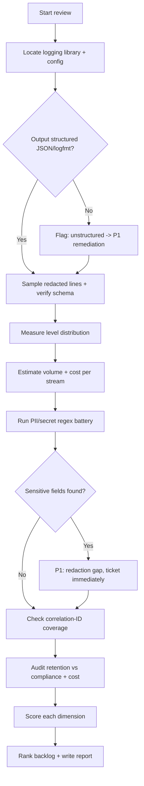
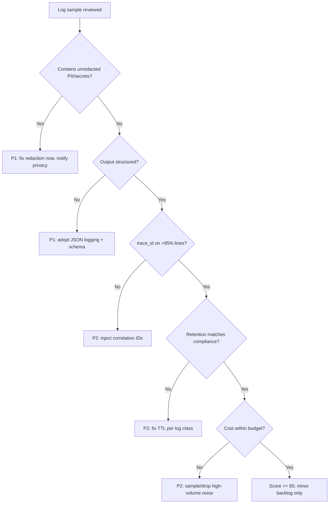

# Logging Review

> A rigorous audit of a service's logging practice — structure, log levels, PII
> exposure, retention, cost, and correlation IDs — producing a prioritized plan
> to make logs cheaper, safer, and dramatically more useful during incidents.

## Objective

Determine whether a service's logs are *structured, safe, correlated, and
cost-efficient* enough to accelerate incident response, then deliver a scored
remediation plan. "Done" means logs are machine-parseable JSON with a stable
schema, log levels are used correctly, no PII/secrets leak into the pipeline,
retention matches compliance and cost policy, and every log line can be joined
to a request/trace via correlation IDs. The output is a review report with a
0–100 logging maturity score and a ranked backlog.

## Business Context

Logs are the single most-reached-for artifact during an incident — and the most
expensive telemetry pillar to store at scale. A team that logs unstructured
free text pays twice: once in storage/ingest costs (Loki/Elastic/Datadog bills
that scale with volume and cardinality), and again in MTTR when engineers grep
through noise at 3 a.m. Worse, careless logging is a top source of compliance
incidents: a single `log.info(user)` that serializes an email, token, or card
number can trigger GDPR/CCPA/PCI exposure, mandatory breach notification, and
fines. This review protects reliability (faster incidents), cost (smaller bills),
and compliance (no PII leakage) simultaneously.

## Problem Statement

Common failure modes: log lines are printf-style strings that can't be filtered
or aggregated; everything is logged at `INFO` (or worse, `DEBUG` in prod), so
volume is enormous and signal is buried; sensitive fields are logged verbatim;
retention is either "forever" (cost + liability) or "3 days" (useless for slow
incidents); and there is no correlation ID, so reconstructing a single request
across services is impossible.

This runbook reviews the logging of one service (and its shared logging
library, if any). **Out of scope:** implementing a new logging pipeline,
vendor migration, and SIEM/security-detection rule authoring (those are
separate efforts the review may recommend).

## Success Criteria

- [ ] Log output is confirmed structured (JSON or logfmt) with a documented,
      stable field schema.
- [ ] Log levels are audited: no `DEBUG` in prod, `ERROR` reserved for
      actionable failures, level distribution is sane.
- [ ] A PII/secret scan of a representative sample finds zero unredacted
      sensitive fields (or all findings are ticketed as P1).
- [ ] Retention policy is documented and matches compliance + cost targets per
      log class (audit vs debug vs access).
- [ ] Logging cost is estimated (GB/day, $/month) with top-volume sources named.
- [ ] Correlation IDs (`trace_id`, `request_id`) are present on >95% of lines
      and consistent across service boundaries.

## Trigger Conditions

- Alert: logging cost spike (>20% MoM) or ingest quota breach.
- Schedule: quarterly logging review for tier-1 / regulated services.
- Manual: pre-GA readiness gate, or after a PII-in-logs near-miss.
- Event: post-incident finding that logs were unusable/missing.

## Inputs Required

| Input | Description | Example | Required |
|-------|-------------|---------|----------|
| `service_name` | Target service | `payments-api` | Yes |
| `environment` | Environment to review | `prod` | Yes |
| `log_backend` | Loki/Elastic/Datadog endpoint | `https://loki.internal` | Yes |
| `time_window` | Analysis window | `last 7d` | Yes |
| `compliance_scope` | Regulatory regime | `PCI-DSS, GDPR` | No |
| `repo_url` | Source for logging config | `git@…/payments` | No |

## Required Access

| Scope | Purpose | Read/Write | Sensitivity |
|-------|---------|-----------|-------------|
| Log backend query | Sample + aggregate logs | Read | Medium |
| Log volume metrics | Estimate cost per stream | Read | Low |
| Source repo | Inspect logger config/redaction | Read | Low |
| Retention policy config | Verify TTL per log class | Read | Medium |

## Assumptions

- A centralized log backend exists and is queryable read-only.
- Logs from the target service are already shipped (this is a review).
- The agent can read the logging library configuration from source.
- Any PII the agent encounters must be treated as sensitive and redacted in the
  report immediately.

## Risks

| Risk | Likelihood | Impact | Mitigation |
|------|-----------|--------|------------|
| Agent copies real PII into the report | Medium | Critical | Redact-on-read; store only field names + counts, never values |
| Broad LogQL query overloads backend | Medium | Medium | Use small time ranges + `limit`; aggregate before sampling |
| Recommending shorter retention breaks compliance | Low | High | Cross-check retention vs `compliance_scope` before advising |
| Sampling misses rare PII patterns | Medium | Medium | Use targeted regex scans, not just random sampling |

## Constraints

- Read-only against the log backend; never delete or modify log streams or
  retention config during this runbook.
- Never store raw PII values in the report — only field names, counts, and a
  masked example (e.g., `email=***@***`).
- Respect data residency; do not export log samples across regional boundaries.
- Query ranges must be bounded to protect backend performance.

## Agent Persona

Adopt the persona of a **Principal Observability Engineer with a security /
privacy mandate**. You are pragmatic about cost and fierce about PII. Tone:
precise, compliance-aware, and blunt about waste. You never paste a real
sensitive value; you describe the *field* and its risk. You weigh every log line
by the question "would this help or hurt at 3 a.m.?" Follow
[`docs/AI_AGENT_STANDARDS.md`](../../docs/AI_AGENT_STANDARDS.md) for redaction
and evidence-handling rules.

## Planning Instructions

1. Identify the logging library/config in source (e.g., `zap`, `slog`, `pino`,
   `structlog`, Log4j2) and note whether output is structured.
2. Plan the PII regex battery (emails, tokens, PANs, IPs, JWTs) and the
   level-distribution and volume queries.
3. Externalize the plan; when `human_in_the_loop` is `required`, get approval
   before querying, because log queries can surface sensitive data.
4. Fix rubric weights (see Analysis Framework) before scoring.

## Execution Instructions

Confirm structure and inspect a redacted sample (LogQL / Loki):

```logql
{service="payments-api", env="prod"} | json | line_format "{{.level}} {{.msg}}" | limit 20
```

Measure level distribution (are we drowning in INFO/DEBUG?):

```logql
sum by (level) (count_over_time({service="payments-api", env="prod"} | json [1h]))
```

Estimate volume and cost per stream:

```logql
# Bytes ingested per service over the window -> multiply by $/GB
sum by (service) (bytes_over_time({env="prod"}[24h]))
```

Scan for PII/secret patterns (report counts, never values):

```logql
# Emails, JWTs, and card-like sequences — counts only
sum(count_over_time({service="payments-api"} |~ `[a-zA-Z0-9._%+-]+@[a-zA-Z0-9.-]+\.[a-zA-Z]{2,}` [24h]))
sum(count_over_time({service="payments-api"} |~ `eyJ[A-Za-z0-9_-]{10,}\.` [24h]))
sum(count_over_time({service="payments-api"} |~ `\b(?:\d[ -]*?){13,16}\b` [24h]))
```

Verify correlation-ID presence:

```logql
# Fraction of lines missing a trace_id is a correlation gap
sum(count_over_time({service="payments-api"} | json | trace_id="" [1h]))
/
sum(count_over_time({service="payments-api"} [1h]))
```

Inspect the logging config in source for structured output + redaction hooks:

```json
{
  "level": "info",
  "encoding": "json",
  "redact": ["password", "authorization", "set-cookie", "card.pan", "ssn"],
  "fields": ["ts", "level", "msg", "service", "env", "trace_id", "span_id", "request_id"]
}
```

## Investigation Workflow



## Analysis Framework

Score five dimensions to a 0–100 maturity score:

| Dimension | Good state | Weight |
|-----------|-----------|--------|
| Structure & schema | JSON/logfmt, stable documented fields | 20 |
| Levels & signal | Correct level use, no DEBUG in prod, low noise | 15 |
| PII & secrets | Zero unredacted sensitive fields | 30 |
| Retention & compliance | TTL per class, matches regime + cost | 15 |
| Cost | Volume bounded, top sources known, predictable | 10 |
| Correlation | >95% lines carry trace_id/request_id | 10 |

Reasoning rules:

- PII findings are **always P1**; a single leaked card number outweighs every
  cost optimization.
- Log levels: `ERROR` = actionable failure (should be alertable), `WARN` =
  recoverable anomaly, `INFO` = business events, `DEBUG` = **never in prod**.
- If a single stream is >30% of volume, treat it as a cost hotspot and check for
  a hot-loop log or debug leak.
- Retention should be tiered: audit/security logs long (e.g., 400d for PCI),
  debug/access logs short (7–30d). One-size-fits-all is either unsafe or costly.
- Correlation is worthless if IDs don't propagate across services — verify a
  cross-service join actually works.

## Decision Tree



## Validation Steps

- [ ] Re-run each LogQL query with a bounded range and confirm it returns
      counts (not raw PII values) into the report.
- [ ] Confirm the schema claim by parsing 100 sample lines and checking all
      required fields are present.
- [ ] Verify a cross-service `trace_id` join returns a coherent single request.
- [ ] Recompute cost estimate against the actual $/GB rate from the billing page.
- [ ] Confirm every PII finding is captured as a masked example, never a raw value.

## Expected Outputs

- Logging review report with a 0–100 maturity score and per-dimension sub-scores.
- A PII/secret findings table (field name, count, severity, masked example).
- A cost breakdown by stream with the top offenders and projected savings.
- A retention matrix (log class → TTL → compliance basis).
- A ranked remediation backlog.

## Deliverables

A single review report following
[`templates/report-template.md`](../../templates/report-template.md), with all
sensitive values redacted per
[`docs/AI_AGENT_STANDARDS.md`](../../docs/AI_AGENT_STANDARDS.md). Include the
maturity scorecard, PII findings table, cost breakdown, and ranked backlog.

## Escalation Process

- **P1 (page):** Unredacted PII/secrets in logs. Notify the privacy/security
  team and service owner within 1 hour; treat as a potential data-exposure event.
- **P2 (ticket):** Unstructured logs, missing correlation IDs, non-compliant
  retention. File tickets tagged `logging`.
- **P3 (backlog):** Minor schema inconsistencies, cosmetic field naming.
- If the PII scan is inconclusive due to access limits, escalate to the platform
  team; do not assume "no findings" from an incomplete scan.

## Rollback Strategy

This runbook is read-only and performs no mutations, so there is nothing to roll
back. If a query is found to have stressed the log backend, cancel it, note the
range that caused it, and prefer pre-aggregated metrics (`bytes_over_time`,
recording rules) for future runs. No retention or pipeline config is changed.

## Post-Execution Review

- Did any PII finding indicate a systemic issue (a shared logging helper) worth
  fixing once, centrally?
- Which single stream drove the most cost, and what was it logging?
- Was correlation actually usable end-to-end, or only within one service?
- Which checks here should become an automated CI lint (e.g., a log-schema and
  PII-regex gate in the build)?

## Metrics

| Metric | Definition | Target |
|--------|-----------|--------|
| Structured coverage | % lines parseable as JSON/logfmt | 100% |
| PII findings | Unredacted sensitive fields in sample | 0 |
| Correlation coverage | % lines with trace_id/request_id | > 95% |
| DEBUG-in-prod rate | % prod lines at DEBUG | 0% |
| Cost per GB | Effective ingest+store cost | tracked/declining |
| Retention compliance | % log classes with compliant TTL | 100% |

## Example Execution

**Inputs:** `service_name=payments-api`, `environment=prod`,
`compliance_scope=PCI-DSS, GDPR`, `time_window=last 7d`.

**Agent reasoning (abridged):** Config used `pino` with JSON encoding — good.
Level distribution showed 71% INFO, 22% DEBUG (DEBUG should not be in prod).
Volume was 84 GB/day; a single `INFO request.body` line accounted for 38% of
volume and was serializing full request bodies. The PII battery matched 12,400
email occurrences/day and 190 card-like sequences/day inside those request-body
logs — a PCI exposure. `trace_id` was present on only 63% of lines because the
async worker path dropped the context. Retention was a flat 90 days for all
classes.

**Sample report excerpt:**

```text
Logging Maturity: 47/100
  Structure: 18/20  (JSON, minor missing fields)
  Levels: 6/15      (22% DEBUG in prod)
  PII: 4/30         (card + email in request-body logs -> PCI risk)
  Retention: 9/15   (flat 90d; audit logs under-retained, debug over-retained)
  Cost: 5/10        (request.body = 38% of 84 GB/day)
  Correlation: 6/10 (trace_id on 63% of lines; async path drops context)

Top remediations (ranked):
  R1 [P1] Stop logging request.body / add PII redaction hook (PCI + GDPR).
  R2 [P1] Disable DEBUG in prod; est. -22% volume.
  R3 [P2] Propagate trace context into async worker; target >95% correlation.
  R4 [P2] Tier retention: audit 400d, access 30d, debug 7d.
  Projected savings: ~$14k/mo from R1+R2 volume reduction.
```

## References

- [`docs/AI_AGENT_STANDARDS.md`](../../docs/AI_AGENT_STANDARDS.md)
- [`templates/report-template.md`](../../templates/report-template.md)
- [Observability Review](./observability-review.md)
- [Tracing Review](./tracing-review.md)
- [Grafana Loki LogQL](https://grafana.com/docs/loki/latest/query/)
- [OpenTelemetry Logs Data Model](https://opentelemetry.io/docs/specs/otel/logs/data-model/)
- [OWASP Logging Cheat Sheet](https://cheatsheetseries.owasp.org/cheatsheets/Logging_Cheat_Sheet.html)
