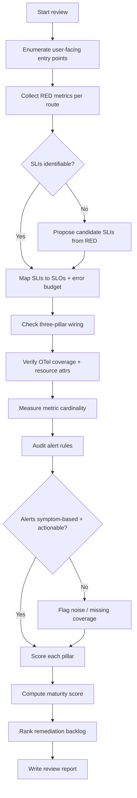
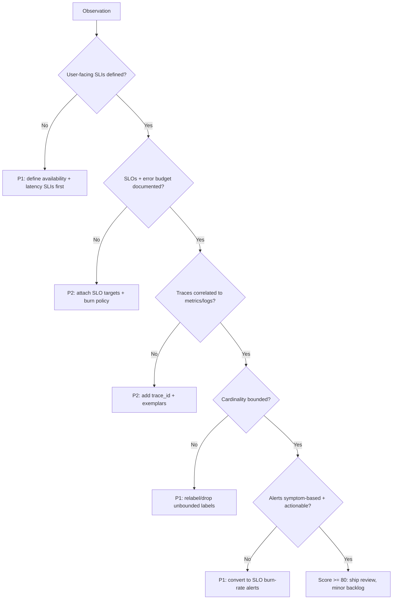

# Observability Review

> A comprehensive audit of a service's observability posture across the three
> pillars — metrics, logs, and traces — grading SLI/SLO coverage, OpenTelemetry
> instrumentation, metric cardinality, and alerting quality, then producing a
> prioritized remediation plan.

## Objective

Produce an evidence-backed assessment of whether a target service is
*observable enough to operate safely in production*, and deliver a scored,
prioritized set of remediations. "Done" means every SLI has a defined SLO with
an error budget, the three pillars are wired end-to-end through OpenTelemetry,
metric cardinality is under control and predictable, and every alert maps to a
documented, actionable, symptom-based condition. The output is a single review
report with a numeric maturity score (0–100) and a ranked backlog.

## Business Context

Observability is the difference between a five-minute incident and a
five-hour one. Poor observability directly inflates Mean Time To Detect (MTTD)
and Mean Time To Resolve (MTTR), which translate into SLA credits, churned
customers, and burned engineering hours. Over-instrumentation is equally
damaging: unbounded metric cardinality can multiply Prometheus/Grafana Cloud
bills by 5–20x, and noisy alerts cause pager fatigue that erodes on-call trust
and slows response to *real* incidents. This review protects both the top line
(reliability, customer trust) and the bottom line (telemetry spend, engineer
time) by ensuring the organization pays only for signal that shortens incidents.

## Problem Statement

Teams frequently ship services with ad-hoc instrumentation: a handful of custom
counters, unstructured logs, no traces, and CPU/memory alerts that fire when
nothing is actually wrong for users. Symptoms include incidents discovered by
customers rather than monitors, dashboards nobody trusts, "mystery" latency
with no trace to explain it, and telemetry bills growing faster than traffic.

This runbook evaluates a single service (or a small bounded set) against a
defined observability maturity rubric. **Out of scope:** building new
dashboards from scratch, migrating vendors, capacity planning, and remediating
the underlying reliability defects the review may surface (those become tickets).

## Success Criteria

- [ ] Every user-facing SLI (availability, latency, error rate, freshness) is
      enumerated and mapped to a documented SLO with an explicit error budget.
- [ ] The three pillars (metrics, logs, traces) are confirmed present and
      correlated via `trace_id`/`exemplars` for the target service.
- [ ] OpenTelemetry coverage is quantified (% of inbound/outbound spans,
      RED metrics, resource attributes) with gaps listed by endpoint.
- [ ] Metric cardinality is measured; top offenders and unbounded labels are
      identified with a concrete cap/relabel plan.
- [ ] Every alert is classified symptom vs cause, checked for actionability,
      runbook link, and correct severity; noisy/flapping alerts are flagged.
- [ ] A numeric maturity score (0–100) and a ranked remediation backlog are
      delivered in the report format.

## Trigger Conditions

- Alert: repeated "detected-by-customer" incidents or missed SLO breach.
- Schedule: quarterly observability review for tier-1 services.
- Manual: pre-production readiness gate before a new service goes GA.
- Manual: telemetry cost spike investigation (>20% MoM increase).
- Event: post-incident action item ("we were blind to X").

## Inputs Required

| Input | Description | Example | Required |
|-------|-------------|---------|----------|
| `service_name` | Target service identifier | `checkout-api` | Yes |
| `environment` | Environment to review | `prod` | Yes |
| `slo_doc_url` | Existing SLO definitions, if any | `wiki/slo/checkout` | No |
| `prom_url` | Prometheus/Thanos query endpoint | `https://prom.internal` | Yes |
| `grafana_url` | Grafana base URL | `https://grafana.internal` | Yes |
| `trace_backend` | Tempo/Jaeger endpoint | `https://tempo.internal` | Yes |
| `time_window` | Analysis window | `last 30d` | Yes |

## Required Access

| Scope | Purpose | Read/Write | Sensitivity |
|-------|---------|-----------|-------------|
| Prometheus/Thanos query | Cardinality + SLI queries | Read | Low |
| Grafana dashboards | Inspect panels/alerts | Read | Low |
| Alertmanager config | Audit routing/inhibition | Read | Medium |
| Tempo/Jaeger | Verify trace coverage | Read | Low |
| Loki/log backend | Verify structured logs | Read | Medium |
| Source repo | Inspect OTel SDK setup | Read | Low |

## Assumptions

- A metrics backend (Prometheus-compatible) and a trace backend
  (Tempo/Jaeger) already exist and are reachable read-only.
- The service emits at least some telemetry; this is a review, not a
  greenfield instrumentation project.
- The reviewer can enumerate user-facing entry points (HTTP routes, gRPC
  methods, queue consumers) from docs or code.
- If SLOs do not exist, the agent proposes candidate SLOs rather than blocking.

## Risks

| Risk | Likelihood | Impact | Mitigation |
|------|-----------|--------|------------|
| High-cardinality query overloads Prometheus | Medium | High | Use `count by` aggregations, `--stats`, short ranges, and query a read replica/Thanos |
| Recommending alert deletion hides a real risk | Low | High | Never delete alerts in this runbook; only recommend, require human review |
| Misreading sampled traces as full coverage | Medium | Medium | Confirm sampling ratio before computing coverage % |
| Review scope creep into remediation | Medium | Medium | Convert fixes to tickets; keep review read-only |

## Constraints

- Strictly read-only against production telemetry; no config writes, no alert
  edits, no dashboard changes during this runbook.
- Prometheus instant/range queries must be bounded (`step`, range) to avoid
  cardinality explosions on the query path.
- Respect data residency: do not export raw logs/traces containing PII off-site.
- No changes during an active change freeze; the review itself is safe to run.

## Agent Persona

Adopt the persona of a **Principal Observability Engineer** who has run on-call
for tier-1 services and owns the telemetry budget. Tone: precise, evidence-first,
skeptical of vanity metrics. You quantify everything, you distrust dashboards
without SLOs behind them, and you treat every alert as a promise to wake a human
— so it had better be worth it. You explicitly guard against confirmation bias
by seeking disconfirming evidence for each finding. Follow the conventions in
[`docs/AI_AGENT_STANDARDS.md`](../../docs/AI_AGENT_STANDARDS.md) for evidence
citation, redaction, and change-safety.

## Planning Instructions

1. Read `service_name`, enumerate its user-facing entry points and critical
   dependencies (from code, OpenAPI specs, or service catalog).
2. Draft a review plan listing the four assessment lenses (SLI/SLO,
   three-pillar coverage, cardinality, alerting) and the queries you will run.
3. Externalize the plan and, when `human_in_the_loop` is `required` for the
   environment, obtain approval before running any backend queries.
4. Establish the maturity rubric weights up front (see Analysis Framework) so
   scoring is deterministic and reproducible.

## Execution Instructions

Run observation steps first; there are no mutating steps in this runbook.

Enumerate the RED signals (Rate, Errors, Duration) for the service:

```promql
# Request rate by route
sum by (route) (rate(http_server_request_duration_seconds_count{service="checkout-api"}[5m]))

# Error ratio (5xx) — an availability SLI
sum(rate(http_server_request_duration_seconds_count{service="checkout-api",http_response_status_code=~"5.."}[5m]))
/
sum(rate(http_server_request_duration_seconds_count{service="checkout-api"}[5m]))

# p99 latency from a native histogram / classic histogram
histogram_quantile(0.99, sum by (le) (rate(http_server_request_duration_seconds_bucket{service="checkout-api"}[5m])))
```

Measure cardinality (the number-one cost and stability driver):

```bash
# Total active series
curl -s "$PROM_URL/api/v1/query" --data-urlencode 'query=count({__name__=~".+"})'

# Top metrics by series count (TSDB status)
curl -s "$PROM_URL/api/v1/status/tsdb" | jq '.data.seriesCountByMetricName[:20]'

# Highest-cardinality label values
curl -s "$PROM_URL/api/v1/status/tsdb" | jq '.data.labelValueCountByLabelName[:20]'
```

Verify OpenTelemetry collector pipeline health and that the service exports:

```yaml
# otel-collector-config.yaml (excerpt being audited)
receivers:
  otlp:
    protocols:
      grpc: { endpoint: 0.0.0.0:4317 }
      http: { endpoint: 0.0.0.0:4318 }
processors:
  batch: { timeout: 5s, send_batch_size: 1024 }
  memory_limiter: { check_interval: 1s, limit_percentage: 80 }
exporters:
  prometheusremotewrite: { endpoint: "https://prom.internal/api/v1/write" }
  otlp/tempo: { endpoint: "tempo.internal:4317" }
service:
  pipelines:
    traces:  { receivers: [otlp], processors: [memory_limiter, batch], exporters: [otlp/tempo] }
    metrics: { receivers: [otlp], processors: [memory_limiter, batch], exporters: [prometheusremotewrite] }
```

Confirm exemplars/trace correlation so metrics can pivot to traces:

```bash
# Exemplars attached to latency histograms enable metric -> trace pivots
curl -s "$PROM_URL/api/v1/query_exemplars" \
  --data-urlencode 'query=http_server_request_duration_seconds_bucket{service="checkout-api"}' \
  --data-urlencode "start=$(date -d '-1h' +%s)" --data-urlencode "end=$(date +%s)" | jq '.data | length'
```

## Investigation Workflow



## Analysis Framework

Score each lens 0–25 and sum to a 0–100 maturity score. Weights and thresholds:

| Lens | What "good" looks like | Weight |
|------|------------------------|--------|
| SLI/SLO | Every user journey has an SLI, SLO, and error budget policy | 25 |
| Three-pillar coverage | Metrics, logs, traces present and correlated by `trace_id` | 25 |
| Cardinality/cost | Series growth is bounded; no unbounded labels; cost predictable | 20 |
| Alerting quality | Symptom-based, actionable, runbook-linked, low false-positive rate | 30 |

Reason about evidence with these rules:

- Prefer **symptom-based** alerts (latency/error SLO burn) over cause-based
  (CPU high). Cause alerts are diagnostics, not pages.
- Treat any label carrying user IDs, request IDs, full URLs, or raw
  emails/IPs as an **unbounded cardinality** and PII risk — flag immediately.
- A latency SLO without a histogram (only averages) is a **red flag**: averages
  hide the tail that customers feel.
- Multi-window multi-burn-rate alerting (fast + slow burn) is the target for
  SLO alerts; single-threshold alerts are legacy.
- Rank findings by `impact × reach ÷ effort`; a missing availability SLI on the
  checkout path outranks a cosmetic dashboard fix every time.

## Decision Tree



## Validation Steps

- [ ] Re-run each PromQL query with `--stats` to confirm it returns bounded
      series counts and does not time out.
- [ ] Confirm every proposed SLI has a real metric backing it (query returns data).
- [ ] Cross-check that a sampled trace for the service actually carries the
      expected resource attributes (`service.name`, `deployment.environment`).
- [ ] Verify at least one exemplar links a latency bucket to a live trace.
- [ ] Confirm each flagged alert exists in Alertmanager and its severity/routing
      matches the report's claim.

## Expected Outputs

- A completed observability review report (see Deliverables).
- A maturity scorecard (0–100) with per-lens sub-scores.
- A ranked remediation backlog suitable for import as tickets.
- A cardinality hotspot table with concrete relabel/drop recommendations.
- A proposed SLI/SLO table for any missing user journeys.

## Deliverables

The final deliverable is a single review report following
[`templates/report-template.md`](../../templates/report-template.md), including
the maturity scorecard, the ranked backlog, and all evidence (queries + results).
Secrets and PII must be redacted per
[`docs/AI_AGENT_STANDARDS.md`](../../docs/AI_AGENT_STANDARDS.md).

## Escalation Process

- **P1 (page):** No availability SLI on a tier-1 revenue path, or cardinality
  actively threatening Prometheus stability. Escalate to the service owner and
  on-call SRE via the incident channel within 1 hour.
- **P2 (ticket):** Missing SLOs, absent trace correlation, or noisy alerts.
  File tickets tagged `observability` and assign to the owning team.
- **P3 (backlog):** Cosmetic dashboard and documentation gaps.
- If read-only access is insufficient to complete a lens, escalate to the
  platform team rather than requesting write access.

## Rollback Strategy

This runbook performs no mutations, so no rollback is required. If any query is
found to have degraded the query backend (e.g., an accidental unbounded range
query), immediately cancel it, note it in the report, and prefer a Thanos read
path or recording rules for future runs. No dashboards, alerts, or configs are
changed, so there is nothing to revert.

## Post-Execution Review

- Did the maturity score correlate with recent incident MTTD/MTTR? If not,
  refine the rubric weights.
- Which single remediation, once done, would most shrink the next incident?
- What was surprising (e.g., a metric costing 40% of the bill for one label)?
- Which checks in this runbook could be automated as a recurring CI job or a
  recording-rule-based scorecard?

## Metrics

| Metric | Definition | Target |
|--------|-----------|--------|
| SLI coverage | % of user journeys with a defined SLI | 100% |
| SLO coverage | % of SLIs with an SLO + error budget | 100% |
| Trace correlation | % of error logs carrying a `trace_id` | > 95% |
| Alert actionability | % of alerts with runbook link + owner | 100% |
| Alert false-positive rate | Pages resolved as "no action" ÷ total pages | < 10% |
| Cardinality growth | WoW active-series growth | < 5% |
| Review turnaround | Time from trigger to delivered report | < 4h |

## Example Execution

**Inputs:** `service_name=checkout-api`, `environment=prod`, `time_window=last 30d`.

**Agent reasoning (abridged):** Enumerated 7 HTTP routes from the OpenAPI spec.
RED queries returned data for 6 of 7; `POST /checkout/refund` had no latency
histogram — only a counter. The availability SLI existed implicitly (5xx ratio)
but no SLO was documented. `status/tsdb` showed `http_client_request_duration_seconds`
carrying a `url` label with 2.1M distinct values (full URLs including query
strings) — 61% of the service's total series and a PII risk. Alerts: 11 rules,
of which 6 were CPU/memory cause-based, 2 flapped >20 times in 30 days, and only
3 mapped to user symptoms. No multi-burn-rate SLO alert existed.

**Sample report excerpt:**

```text
Maturity Score: 54/100
  SLI/SLO: 12/25  (implicit SLIs, zero documented SLOs)
  3-pillar: 15/25 (traces present but no exemplars; logs lack trace_id)
  Cardinality: 8/20 (url label = 2.1M series, PII + cost risk)
  Alerting: 19/30 (mostly cause-based, 2 flapping rules)

Top remediations (ranked):
  R1 [P1] Drop/relabel `url` label -> route template; ~60% series reduction.
  R2 [P1] Define availability SLO 99.9% + fast/slow burn-rate alerts on /checkout.
  R3 [P2] Add latency histogram to POST /checkout/refund.
  R4 [P2] Inject trace_id into structured logs; enable exemplars on histograms.
  R5 [P3] Retire 2 flapping CPU alerts; convert to dashboards.
```

## References

- [`docs/AI_AGENT_STANDARDS.md`](../../docs/AI_AGENT_STANDARDS.md)
- [`templates/report-template.md`](../../templates/report-template.md)
- [Logging Review](./logging-review.md)
- [Tracing Review](./tracing-review.md)
- [Google SRE Workbook — Implementing SLOs](https://sre.google/workbook/implementing-slos/)
- [OpenTelemetry Semantic Conventions](https://opentelemetry.io/docs/specs/semconv/)
- [Prometheus TSDB cardinality](https://prometheus.io/docs/prometheus/latest/querying/api/#tsdb-stats)
