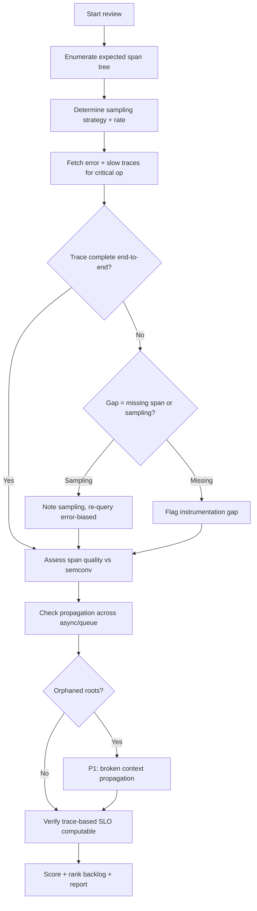
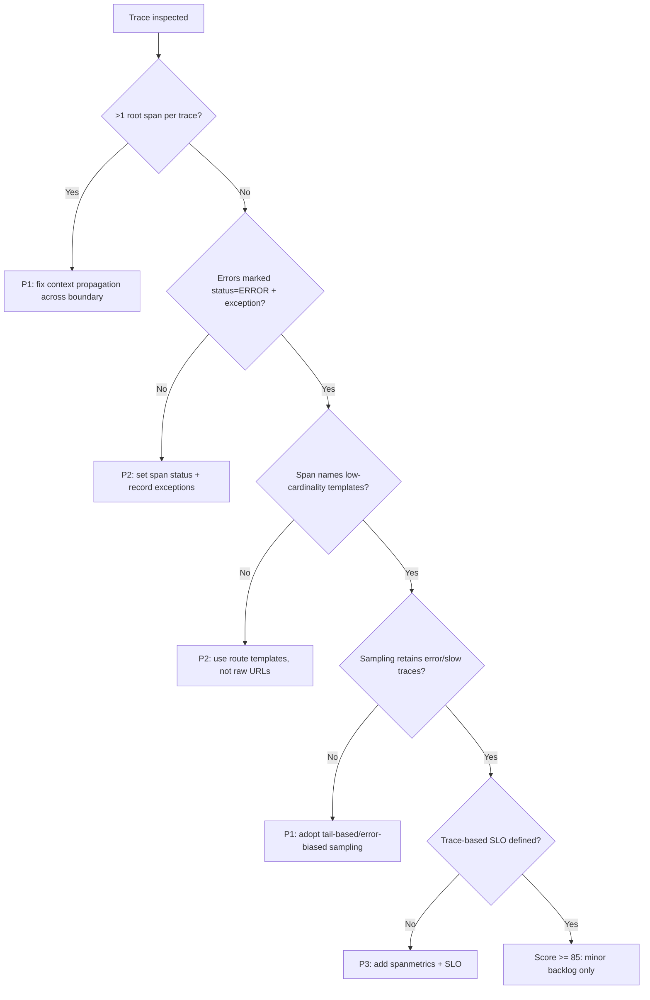

# Distributed Tracing Review

> An expert audit of a service's distributed tracing — span quality, context
> propagation across boundaries, sampling strategy, and trace-based SLOs —
> producing a prioritized plan to make traces complete, cheap, and diagnostic.

## Objective

Determine whether distributed tracing for a target service and its immediate
dependencies is *complete, well-structured, and useful for root-cause analysis*,
then deliver a scored remediation plan. "Done" means spans follow semantic
conventions with meaningful names and attributes, context propagates unbroken
across process/async/queue boundaries, sampling preserves the traces that
matter (errors, slow requests) at a sustainable cost, and at least one
trace-based SLO exists. Output: a review report with a 0–100 tracing maturity
score and ranked backlog.

## Business Context

Metrics tell you *that* something is slow; traces tell you *where* and *why*.
In a microservice or agentic system, a single user request may fan out across
10–50 spans; without connected traces, engineers resort to guesswork and
cross-team pster-hunting during incidents, inflating MTTR. Tracing is also a
cost lever: naive 100% sampling of a high-QPS service can dwarf the metrics and
logs bill combined, while blind head-sampling throws away exactly the rare
error traces you need. Good tracing simultaneously shortens incidents (find the
slow span in seconds), enables trace-based SLOs (latency measured where the user
feels it), and controls spend via intelligent sampling. This review protects
MTTR, engineering focus, and telemetry budget.

## Problem Statement

Typical defects: traces that "break" at an async boundary or a message queue so
each service shows a disconnected root span; spans named `HTTP GET` with no
route, making aggregation useless; missing error status and exception events on
failed spans; over- or under-sampling; and no linkage between traces and the
SLOs that gate releases. Symptoms include "we have Jaeger but nobody uses it,"
traces that stop at the gateway, and latency mysteries that metrics can't
explain.

This runbook reviews tracing for one service plus its direct upstream/downstream
hops. **Out of scope:** instrumenting a service that emits *no* traces from
scratch, tracing-backend capacity planning, and profiling (continuous profiler)
adoption — though the review may recommend them.

## Success Criteria

- [ ] Span coverage is quantified: inbound, outbound (HTTP/gRPC/DB/cache/queue),
      and internal spans exist for the critical path.
- [ ] Context propagation is verified end-to-end, including async and
      queue-based boundaries (no orphaned root spans).
- [ ] Span quality passes semantic-convention checks: meaningful names, required
      attributes, error status + exception events on failures.
- [ ] Sampling strategy is documented and preserves 100% of error/slow traces
      (tail-based or error-biased), with a sustainable overall rate.
- [ ] At least one trace-based SLO (e.g., p99 of a critical operation) is
      defined and computable from spans.
- [ ] A 0–100 maturity score and ranked backlog are delivered.

## Trigger Conditions

- Alert: recurring latency incidents with no clear metric cause.
- Schedule: quarterly tracing review for tier-1 services.
- Manual: pre-GA readiness gate; onboarding a new downstream dependency.
- Event: tracing cost spike or a "broken trace" complaint from on-call.

## Inputs Required

| Input | Description | Example | Required |
|-------|-------------|---------|----------|
| `service_name` | Target service | `search-api` | Yes |
| `environment` | Environment | `prod` | Yes |
| `trace_backend` | Tempo/Jaeger endpoint | `https://tempo.internal` | Yes |
| `critical_operation` | Key user operation | `POST /search` | Yes |
| `time_window` | Analysis window | `last 24h` | Yes |
| `repo_url` | Source for OTel setup | `git@…/search` | No |

## Required Access

| Scope | Purpose | Read/Write | Sensitivity |
|-------|---------|-----------|-------------|
| Trace backend query | Fetch/inspect traces | Read | Low |
| OTel collector config | Audit sampling pipeline | Read | Medium |
| Source repo | Inspect SDK/propagator setup | Read | Low |
| Metrics backend | Cross-check RED + exemplars | Read | Low |

## Assumptions

- A trace backend (Tempo or Jaeger) exists and receives at least some spans.
- The service uses OpenTelemetry (or an OTel-compatible) SDK.
- The critical operation and its direct dependencies can be enumerated.
- Sampling ratios are discoverable from collector config or SDK setup.

## Risks

| Risk | Likelihood | Impact | Mitigation |
|------|-----------|--------|------------|
| Mistaking sampling gaps for missing instrumentation | High | Medium | Confirm sample rate before concluding a span is absent |
| Trace queries return PII in attributes/tags | Medium | High | Redact-on-read; report attribute keys, not sensitive values |
| Recommending 100% sampling blows up cost | Medium | High | Recommend tail-based/error-biased sampling, not full capture |
| Reviewing too many hops causes analysis paralysis | Medium | Low | Limit to direct upstream/downstream neighbors |

## Constraints

- Read-only against the trace backend and collector config.
- Do not alter sampling configuration during the runbook; only recommend.
- Redact sensitive span attributes (tokens, emails, SQL with literals) in the
  report.
- Bound trace search ranges to avoid backend strain.

## Agent Persona

Adopt the persona of a **Principal Observability Engineer specializing in
distributed systems**. You think in causal graphs, not isolated services. Tone:
forensic, precise, and cost-aware. You are suspicious of any trace that "ends"
too early and you always ask whether a gap is a real instrumentation hole or
just sampling. You never conflate a pretty Jaeger screenshot with usable
tracing. Follow [`docs/AI_AGENT_STANDARDS.md`](../../docs/AI_AGENT_STANDARDS.md)
for redaction and evidence standards.

## Planning Instructions

1. Enumerate the critical operation's expected span tree (inbound → business
   logic → DB/cache/downstream → queue) from code or an architecture doc.
2. Determine the current sampling strategy and rate from collector/SDK config —
   this gates every coverage conclusion.
3. Externalize the plan; when `human_in_the_loop` is `required`, obtain approval
   before querying (trace attributes can contain sensitive data).
4. Fix rubric weights (see Analysis Framework).

## Execution Instructions

Confirm the propagator and SDK setup in source (W3C `traceparent` is the target):

```python
# OTel SDK setup being audited (Python example)
from opentelemetry.propagate import set_global_textmap
from opentelemetry.propagators.b3 import B3MultiFormat  # legacy
from opentelemetry.propagators.tracecontext import TraceContextTextMapPropagator

# Target: W3C tracecontext (interop) — flag if only B3/legacy or none
set_global_textmap(TraceContextTextMapPropagator())
```

Fetch traces for the critical operation and inspect the span tree (Tempo API):

```bash
# Find slow + error traces for the critical operation
curl -s "$TEMPO_URL/api/search" --data-urlencode \
  'q={ resource.service.name="search-api" && name="POST /search" && duration>500ms }' \
  --data-urlencode "start=$(date -d '-1h' +%s)" --data-urlencode "end=$(date +%s)" | jq '.traces | length'

# Pull one trace and inspect span names, status, and parent linkage
curl -s "$TEMPO_URL/api/traces/<trace_id>" | jq '.batches[].scopeSpans[].spans[] | {name, kind, status:.status.code, parent:.parentSpanId}'
```

Check for broken propagation (orphaned roots = a snapped trace):

```bash
# Count root spans per trace; >1 root strongly implies broken context propagation
curl -s "$TEMPO_URL/api/traces/<trace_id>" \
  | jq '[.batches[].scopeSpans[].spans[] | select(.parentSpanId == null or .parentSpanId == "")] | length'
```

Audit the sampling pipeline (tail-based sampling is the target for prod):

```yaml
# otel-collector: tail_sampling keeps errors + slow traces, samples the rest
processors:
  tail_sampling:
    decision_wait: 10s
    policies:
      - name: errors
        type: status_code
        status_code: { status_codes: [ERROR] }
      - name: slow
        type: latency
        latency: { threshold_ms: 500 }
      - name: baseline
        type: probabilistic
        probabilistic: { sampling_percentage: 5 }
```

Verify a trace-based SLO can be computed (span metrics connector):

```yaml
# spanmetrics connector generates RED metrics from spans for trace-based SLOs
connectors:
  spanmetrics:
    histogram:
      explicit: { buckets: [50ms, 100ms, 250ms, 500ms, 1s, 2s] }
    dimensions:
      - name: service.name
      - name: span.name
```

## Investigation Workflow



## Analysis Framework

Score four dimensions to a 0–100 maturity score:

| Dimension | Good state | Weight |
|-----------|-----------|--------|
| Span coverage | Inbound/outbound/DB/queue spans on critical path | 25 |
| Span quality | Semconv names, attributes, error status + exceptions | 25 |
| Context propagation | Unbroken across sync/async/queue; W3C tracecontext | 30 |
| Sampling & SLO | Error/slow traces retained; trace-based SLO exists | 20 |

Reasoning rules:

- A gap in a trace is **sampling until proven otherwise**. Always re-query with
  an error/latency filter before declaring a span missing.
- Span names must be **low-cardinality templates** (`GET /users/{id}`), not raw
  URLs — the same PII/cardinality rule as metrics.
- A failed operation must have `status = ERROR` and an `exception` event with a
  stack trace; a green span on a failed request is a serious quality defect.
- Tail-based sampling that keeps 100% of errors + slow traces plus a small
  probabilistic baseline is the target. Pure head sampling that discards errors
  is a red flag.
- Prefer trace-based SLOs (via the `spanmetrics` connector) for operations where
  the user-perceived boundary differs from any single service's metrics.

## Decision Tree



## Validation Steps

- [ ] Re-run the critical-operation search and confirm error/slow traces are
      retrievable (proves sampling keeps them).
- [ ] Inspect at least 3 traces and confirm a single root and unbroken parent
      chain across every boundary.
- [ ] Confirm a known failed request produced a span with `status=ERROR` and an
      `exception` event.
- [ ] Verify `spanmetrics`-derived latency histogram matches the metrics-based
      p99 within tolerance.
- [ ] Confirm no sensitive literals appear in reported span attributes.

## Expected Outputs

- Tracing review report with a 0–100 maturity score and per-dimension sub-scores.
- An annotated span-tree diagram of the critical operation showing gaps.
- A propagation matrix (boundary → propagated? → propagator format).
- A sampling recommendation with projected cost impact.
- A ranked remediation backlog.

## Deliverables

A single review report following
[`templates/report-template.md`](../../templates/report-template.md), with span
attributes redacted per
[`docs/AI_AGENT_STANDARDS.md`](../../docs/AI_AGENT_STANDARDS.md). Include the
scorecard, span-tree analysis, propagation matrix, and ranked backlog.

## Escalation Process

- **P1 (page):** Broken context propagation on the critical revenue path, or
  sampling that discards all error traces (blind during incidents). Notify the
  service owner + on-call SRE within 1 hour.
- **P2 (ticket):** Poor span quality (missing error status, raw-URL names).
  File tickets tagged `tracing`.
- **P3 (backlog):** Missing trace-based SLO, minor attribute gaps.
- If access to collector config is unavailable, escalate to the platform team
  rather than inferring the sampling policy.

## Rollback Strategy

This runbook is read-only; no sampling, collector, or code changes are made, so
there is nothing to roll back. If a broad trace search degrades the backend,
cancel it, record the query, and switch to narrower ranges or the
`spanmetrics`-derived aggregates for subsequent analysis.

## Post-Execution Review

- Was the trace gap a real instrumentation hole or a sampling artifact? Capture
  the lesson so the team doesn't chase phantom gaps.
- Which boundary broke propagation, and is the fix reusable across services
  (shared middleware/library)?
- Did tail-based sampling meaningfully cut cost while keeping error visibility?
- Which checks should become an automated conformance test (e.g., a CI check
  that a synthetic request produces a single connected trace)?

## Metrics

| Metric | Definition | Target |
|--------|-----------|--------|
| Critical-path span coverage | % expected spans present | > 95% |
| Trace completeness | % traces with single root, no orphans | > 98% |
| Error-span correctness | % failed ops with ERROR status + exception | 100% |
| Error-trace retention | % error traces kept after sampling | 100% |
| Sampling cost | Spans stored/day vs budget | within budget |
| Trace-based SLO coverage | Critical ops with a trace SLO | 100% |

## Example Execution

**Inputs:** `service_name=search-api`, `critical_operation=POST /search`,
`environment=prod`, `time_window=last 24h`.

**Agent reasoning (abridged):** Expected span tree: `POST /search` → `auth
check` → `query-planner` → `elasticsearch client` → `results ranker` → async
`enqueue impression event`. Fetched 40 traces; the async impression path always
appeared as a *separate* root — a snapped trace at the Kafka boundary because
the producer did not inject `traceparent` into headers. Downstream ES spans were
named `HTTP POST` (raw), not `POST /_search`. Sampling was head-based
probabilistic 10%, so most error traces were being discarded. No trace-based SLO
existed; the team relied on gateway metrics that missed the ranker's tail
latency.

**Sample report excerpt:**

```text
Tracing Maturity: 51/100
  Span coverage: 18/25   (async impression path disconnected)
  Span quality: 14/25    (downstream spans named raw "HTTP POST")
  Propagation: 9/30      (Kafka boundary drops traceparent -> 2 roots/trace)
  Sampling+SLO: 10/20    (10% head sampling discards errors; no trace SLO)

Top remediations (ranked):
  R1 [P1] Inject W3C traceparent into Kafka headers (producer + consumer).
  R2 [P1] Switch to tail_sampling: keep 100% errors + >500ms, 5% baseline.
  R3 [P2] Fix ES client span names -> "POST /_search"; set ERROR on failures.
  R4 [P3] Add spanmetrics connector + p99 trace-based SLO on POST /search.
  Projected sampling cost change: -55% spans stored, +100% error visibility.
```

## References

- [`docs/AI_AGENT_STANDARDS.md`](../../docs/AI_AGENT_STANDARDS.md)
- [`templates/report-template.md`](../../templates/report-template.md)
- [Observability Review](./observability-review.md)
- [Logging Review](./logging-review.md)
- [W3C Trace Context](https://www.w3.org/TR/trace-context/)
- [OpenTelemetry Tracing Semantic Conventions](https://opentelemetry.io/docs/specs/semconv/general/trace/)
- [OTel Collector tail_sampling processor](https://github.com/open-telemetry/opentelemetry-collector-contrib/tree/main/processor/tailsamplingprocessor)
- [Grafana Tempo TraceQL](https://grafana.com/docs/tempo/latest/traceql/)
