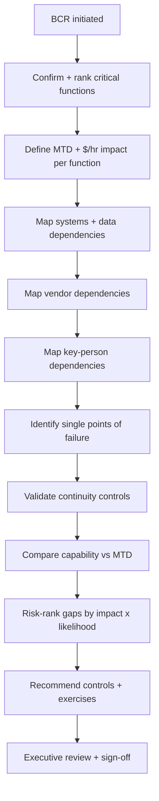
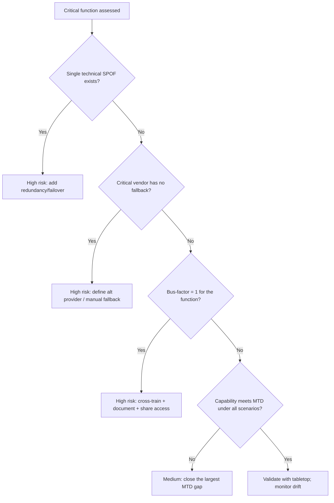

# Business Continuity Review

> Assess an organization's or product line's ability to continue delivering critical business functions through major disruptions — infrastructure, vendor, or operational — by mapping critical functions to their dependencies and validating continuity controls.

## Objective

Evaluate whether critical business functions can continue operating through realistic disruption scenarios, identify single points of failure across technology and process, and produce a prioritized continuity-improvement plan. "Done" means critical business functions are mapped to their supporting systems, people, and vendors; each has a validated continuity control or a documented gap; and a remediation plan is delivered with owners and risk-ranked priorities.

## Business Context

Business continuity is broader than disaster recovery: DR asks "can we restore this database?", while continuity asks "can the company keep taking orders / paying staff / serving customers if a critical vendor, region, or team is unavailable?" A single dependency — a payment processor, an auth provider, a key third-party API, or a lone engineer with tribal knowledge — can halt revenue even when every server is healthy. Boards, insurers, and regulators (SOC 2, ISO 22301, DORA in financial services) increasingly require demonstrable continuity planning. A rigorous review converts implicit assumptions about "the business will keep running" into tested, owned controls.

## Problem Statement

Organizations accumulate hidden single points of failure across systems, vendors, and people that only surface during a crisis. Critical functions are rarely mapped end-to-end to their dependencies, so leadership cannot see where a disruption becomes existential. This runbook maps critical business functions to dependencies and validates continuity controls. It does **not** perform technical DR restore testing for a specific data store (see `disaster-recovery-assessment.md`) or incident response (see `root-cause-analysis.md`), though it consumes their outputs.

## Success Criteria

- [ ] Critical business functions are enumerated and prioritized by business impact.
- [ ] Each critical function is mapped to its supporting systems, vendors, and key people.
- [ ] Single points of failure (technical, vendor, and personnel) are identified.
- [ ] Continuity controls (redundancy, alternatives, manual fallback) are validated or gapped.
- [ ] Maximum Tolerable Downtime (MTD) per function is defined and compared to capability.
- [ ] A risk-ranked continuity-improvement plan is delivered with owners.
- [ ] Executive sponsor has reviewed the assessment.

## Trigger Conditions

- Schedule: annual business continuity review; regulatory cadence (ISO 22301, DORA).
- Manual: after a major reorganization, acquisition, or vendor change.
- Post-incident: a disruption that revealed an unanticipated dependency.
- Vendor risk: a critical vendor announces instability, acquisition, or EOL.

## Inputs Required

| Input | Description | Example | Required |
|-------|-------------|---------|----------|
| `scope` | Business unit / product line | `payments platform` | Yes |
| `critical_functions` | Known critical functions | `accept payment, issue payout` | Yes |
| `vendor_list` | Third-party dependencies | `Stripe, Auth0, Twilio` | Recommended |
| `mtd_targets` | Max tolerable downtime per function | `payments: 30m` | Recommended |
| `system_catalog` | Service/system inventory | link | Recommended |

## Required Access

| Scope | Purpose | Read/Write | Sensitivity |
|-------|---------|-----------|-------------|
| Service catalog / CMDB | Map functions to systems | Read | Medium |
| Cloud inventory | Identify infra dependencies | Read | Medium |
| Vendor/contract registry | Assess vendor risk | Read | Medium |
| Metrics/dashboards | Validate redundancy behavior | Read | Low |
| Continuity docs | Review existing BCP/runbooks | Read | Medium |

## Assumptions

- Leadership can identify and rank the critical business functions.
- A system/service catalog and vendor registry exist or can be assembled.
- Owners of key functions are available to validate dependency maps.
- The review can reference (not re-run) recent DR assessments.

## Risks

| Risk | Likelihood | Impact | Mitigation |
|------|-----------|--------|------------|
| Hidden dependencies missed in mapping | High | High | Trace real request/data flows, not just diagrams |
| Personnel SPOFs overlooked | Medium | High | Explicitly assess bus-factor per critical function |
| Vendor risk underestimated | Medium | High | Assess vendor SLAs, alternatives, and exit cost |
| Plan documented but never exercised | High | Medium | Recommend tabletop/game-day exercises |

## Constraints

- Read-only assessment; no changes to systems or vendor relationships.
- Sensitive contract and personnel information handled per governance policy.
- Recommendations prioritized by business impact and likelihood, not exhaustiveness.
- Continuity controls involving vendors require legal/procurement collaboration to action.

## Agent Persona

Adopt the persona of a **business continuity architect with a Staff SRE's systems fluency**. Think in terms of critical business outcomes, not just servers: revenue capture, customer trust, regulatory obligations, and staff safety. Hunt relentlessly for single points of failure — technical, vendor, and human. Translate technical dependencies into business-impact language for executives. Follow [`docs/AI_AGENT_STANDARDS.md`](../../docs/AI_AGENT_STANDARDS.md).

## Planning Instructions

1. Confirm the scope and the ranked list of critical business functions with the sponsor.
2. For each function, define its Maximum Tolerable Downtime (MTD) and financial impact per hour.
3. Plan the dependency mapping: systems, data, vendors, and key people per function.
4. Identify the disruption scenarios to test: infra outage, vendor outage, key-person unavailability, facility/network loss.
5. Define the SPOF-identification and control-validation method.
6. Present the plan to the executive sponsor for approval.

## Execution Instructions

```bash
# 1. Map a critical function to its runtime dependencies via traces
# (identify all services touched by the 'accept payment' journey)
curl -s "$TEMPO/api/search?tags=journey%3Daccept-payment&limit=20" \
  | jq -r '.traces[].serviceNames[]' | sort -u
```

```bash
# 2. Enumerate external vendor dependencies from egress config
grep -rEn 'stripe|auth0|twilio|sendgrid|api\.' config/ deploy/ | sort -u
```

```bash
# 3. Check redundancy of a critical dependency (are there fallbacks?)
grep -rEn 'fallback|secondary|failover|backup_provider' config/payments/
```

```bash
# 4. Assess personnel bus-factor via code ownership (proxy signal)
git -C payments-service shortlog -sne --since=1.year | head -10
git -C payments-service log --format='%an' --since=1.year -- src/settlement/ | sort | uniq -c | sort -rn
```

## Investigation Workflow



## Analysis Framework

Assess continuity across three dependency classes for each critical function.

**Technical dependencies:** trace the end-to-end flow (not the architecture diagram, which lies) to find every system, data store, and network path required. A single unreplicated cache, a shared database, or a hard-coded region is a SPOF. Cross-reference with the DR assessment for recovery capability.

**Vendor dependencies:** for each third party, assess criticality (does the function stop without it?), the vendor's own SLA and reliability history, contractual recourse, the existence of a fallback or alternative provider, and the switching cost. A payment function wholly dependent on one processor with no fallback is a top-tier continuity risk. Score vendors on a criticality × substitutability matrix.

**Personnel dependencies (bus-factor):** identify functions where knowledge or access concentrates in one or few people. Use code ownership, runbook authorship, and access-holder counts as proxies. A settlement pipeline only one engineer understands is as much a SPOF as an unreplicated database.

For each function compare capability against MTD: if the function cannot be restored/continued within its MTD under a plausible scenario, that is a critical gap. Rank all gaps by business impact ($/hr × MTD breach probability). Recommend layered controls: redundancy/failover (technical), secondary vendors or manual fallback (vendor), documentation + cross-training + shared access (personnel), and validate with tabletop exercises.

## Decision Tree



## Validation Steps

- [ ] Dependency maps validated by tracing real journeys, not only diagrams.
- [ ] Each critical vendor has a documented criticality and fallback status.
- [ ] Personnel SPOFs corroborated by access and ownership data.
- [ ] MTD comparisons cite the recovery/failover capability evidence.
- [ ] Function owners have reviewed and confirmed their dependency maps.

## Expected Outputs

- A critical-function-to-dependency map (systems, vendors, people).
- A single-point-of-failure register with risk rankings.
- A capability-vs-MTD comparison per function.
- A risk-ranked continuity-improvement plan and recommended exercises.

## Deliverables

A business continuity review report following [`templates/report-template.md`](../../templates/report-template.md), extended with the SPOF register and function-to-dependency map. Improvement items must be filed as tracked initiatives with owners.

## Escalation Process

Escalate to the executive sponsor and risk/compliance leadership for any critical function with no viable continuity path within its MTD — this is an enterprise risk, not an engineering ticket. Escalate vendor-concentration risks to procurement and legal for contract and alternative-sourcing action. Escalate personnel SPOFs to engineering management for cross-training and access remediation. For regulated functions, notify the compliance officer of any material continuity gap.

## Rollback Strategy

The review is read-only and produces analysis and plans, so there is no production rollback. If a continuity control recommended and later implemented proves ineffective in a tabletop exercise, revise the control and re-test; treat the continuity plan as a living document versioned after each exercise. Never mark a control "validated" without exercise evidence.

## Post-Execution Review

- Were the identified SPOFs remediated, and did tabletop exercises confirm the fixes?
- Did any real disruption since the last review expose a dependency the map missed?
- Are MTD targets still aligned with business expectations?
- How can dependency mapping be kept current automatically (service catalog + trace-derived maps)?

## Metrics

| Metric | Definition | Target |
|--------|-----------|--------|
| Critical function coverage | Functions with validated continuity plan | 100% |
| Open critical SPOFs | Unmitigated SPOFs on critical functions | 0 |
| Vendor fallback coverage | Critical vendors with a fallback | > 80% |
| Exercise cadence | Tabletop/game-day per critical function | ≥ annual |

## Example Execution

**Input:** scope `payments platform`, critical functions `accept payment` (MTD 30m, $220k/hr) and `issue payout` (MTD 4h).

**Agent reasoning (abridged):** Tracing the `accept payment` journey reveals dependencies on the internal `payments-service`, a Postgres cluster (multi-AZ, GREEN per the DR assessment), and Stripe as the sole payment processor. Stripe is a critical vendor with no fallback and no manual capture path — if Stripe has a regional outage (they have had multi-hour ones), payment acceptance stops entirely, blowing the 30m MTD and costing $220k/hr. That is the top continuity risk. For `issue payout`, the settlement reconciliation logic is understood and access-held by a single engineer (bus-factor 1) — a personnel SPOF that would breach the 4h MTD if that engineer were unavailable during a settlement incident. Technical redundancy is otherwise sound.

**Sample report excerpt:**

```text
SPOF register (payments platform):
  SPOF-1 Vendor: Stripe sole processor, no fallback. Function: accept payment.
         Impact $220k/hr, MTD 30m. Risk: CRITICAL.
  SPOF-2 Personnel: settlement logic bus-factor=1. Function: issue payout.
         MTD 4h. Risk: HIGH.
Capability vs MTD:
  accept payment  MTD 30m  | capability: 0 (hard vendor dependency) -> GAP
  issue payout    MTD 4h   | capability: fragile (single owner)     -> GAP
Improvement plan:
  P1 Add secondary processor (Adyen) + routing fallback. Owner @payments-lead + procurement.
  P1 Cross-train 2 engineers on settlement; share access; document runbook. Owner @eng-mgr.
  P2 Tabletop exercise: simulate Stripe outage. Owner @bcp-lead. Quarterly.
```

## References

- [`disaster-recovery-assessment.md`](./disaster-recovery-assessment.md)
- [`service-reliability-review.md`](./service-reliability-review.md)
- [ISO 22301 — Business Continuity Management](https://www.iso.org/standard/75106.html)
- [`docs/AI_AGENT_STANDARDS.md`](../../docs/AI_AGENT_STANDARDS.md)
