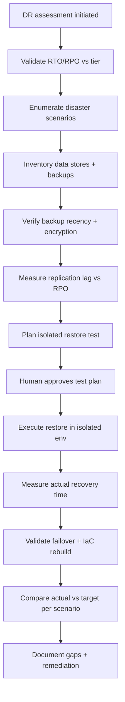
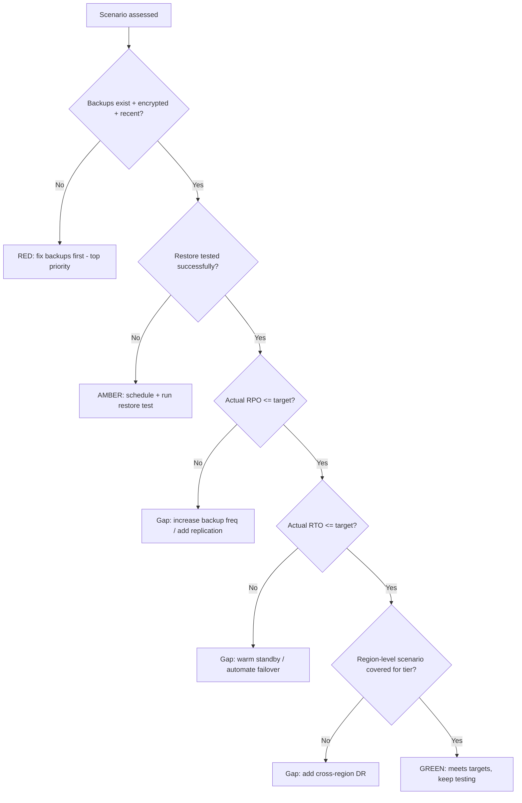

# Disaster Recovery Assessment

> Evaluate a service's ability to recover from catastrophic failure — data loss, region outage, or infrastructure destruction — against defined RTO/RPO targets, and identify gaps in backups, failover, and recovery procedures.

## Objective

Determine whether a service can meet its Recovery Time Objective (RTO) and Recovery Point Objective (RPO) under realistic disaster scenarios, and produce a gap analysis with prioritized remediation. "Done" means each disaster scenario has been assessed against RTO/RPO with evidence (ideally a tested restore), backup integrity is verified, failover mechanisms are validated, and a remediation plan closes the gaps between target and actual recovery capability.

## Business Context

Disaster recovery is insurance the business hopes never to claim — but when a region goes dark, a database is corrupted, or ransomware encrypts a data store, the difference between a documented, tested DR plan and an untested one is the difference between hours and days of downtime, and between full recovery and permanent data loss. Regulators (SOC 2, ISO 27001, financial and healthcare regimes) increasingly mandate tested DR. Untested backups are the classic silent killer: teams discover at the worst possible moment that backups were never restorable. This assessment converts assumed recoverability into verified recoverability.

## Problem Statement

Services declare RTO/RPO targets but rarely verify them under realistic failure. Backups may be misconfigured, un-encrypted, un-restorable, or missing critical data stores. Failover may be documented but never exercised, with stale runbooks and untested cross-region replication. This runbook assesses actual recovery capability against targets for defined disaster scenarios. It does **not** cover live incident response, nor broad organizational continuity beyond technical recovery (see `business-continuity-review.md`).

## Success Criteria

- [ ] RTO and RPO targets are documented and validated as appropriate for the service tier.
- [ ] Every critical data store has a verified, encrypted, restorable backup.
- [ ] A restore has been tested (or recent evidence of a successful test exists) with measured recovery time.
- [ ] Failover mechanisms (multi-AZ/region, replicas) are validated or gaps documented.
- [ ] Each disaster scenario has an actual-vs-target RTO/RPO verdict.
- [ ] A prioritized remediation plan closes identified gaps.
- [ ] Human owner has reviewed the assessment and any test plan before execution.

## Trigger Conditions

- Schedule: annual or semi-annual DR assessment per tier-1 service; regulatory cadence.
- Manual: after a significant architectural change affecting data or region topology.
- Compliance: audit requirement (SOC 2 CC7/CC9, ISO 27001 A.17).
- Post-incident: a near-miss involving data loss or region degradation.

## Inputs Required

| Input | Description | Example | Required |
|-------|-------------|---------|----------|
| `service_name` | Service under assessment | `payments-db` | Yes |
| `rto_target` | Recovery Time Objective | `1h` | Yes |
| `rpo_target` | Recovery Point Objective | `5m` | Yes |
| `data_stores` | Critical data stores | `postgres, s3, redis` | Yes |
| `region_topology` | Primary/DR regions | `us-east-1 / us-west-2` | Yes |
| `dr_runbook` | Existing DR procedure | link | Recommended |

## Required Access

| Scope | Purpose | Read/Write | Sensitivity |
|-------|---------|-----------|-------------|
| Backup system | Verify backups exist/restorable | Read | High |
| Cloud inventory | Verify region/replica topology | Read | Medium |
| IaC repo | Verify reproducibility of infra | Read | Medium |
| Metrics/dashboards | Replication lag, backup age | Read | Low |
| DR test environment | Perform restore test | Read/Write (isolated) | High |

## Assumptions

- A defined RTO/RPO exists (or the assessment will establish tier-appropriate targets).
- Restore tests can be performed in an isolated, non-production environment.
- Backup and cloud inventory are accessible with read privileges.
- The owning team approves any restore test that consumes resources.

## Risks

| Risk | Likelihood | Impact | Mitigation |
|------|-----------|--------|------------|
| Restore test disrupts production | Low | Critical | Test only in isolated environment; never restore over prod |
| Backups exist but are not restorable | Medium | Critical | Require an actual test restore, not just backup presence |
| Replication lag exceeds RPO silently | Medium | High | Measure lag continuously; alert on RPO breach |
| DR runbook stale, fails under real event | High | High | Validate runbook steps during assessment |

## Constraints

- No destructive testing against production data stores; restores go to isolated targets only.
- Any failover drill in production requires explicit change approval and a maintenance window.
- Backup data may contain PII; handle per data-governance policy.
- The assessment must not itself increase load enough to affect production.

## Agent Persona

Adopt the persona of a **Principal SRE / DR specialist** with a compliance-aware, worst-case mindset. Assume anything untested does not work until proven. Insist on evidence of an actual restore, not documentation of intent. Be meticulous about RTO/RPO arithmetic and blast radius. Treat production data with maximum caution. Follow [`docs/AI_AGENT_STANDARDS.md`](../../docs/AI_AGENT_STANDARDS.md).

## Planning Instructions

1. Confirm RTO/RPO targets and validate them against the service tier and business impact.
2. Enumerate disaster scenarios: data corruption/deletion, single-AZ failure, full-region outage, ransomware, accidental infra destruction.
3. Inventory all critical data stores and their backup/replication configuration.
4. Plan a safe, isolated restore test for the highest-risk data store.
5. Define the actual-vs-target measurement method for each scenario.
6. Obtain human approval for the test plan before execution.

## Execution Instructions

```bash
# 1. Verify backup existence, recency, and encryption (example: RDS)
aws rds describe-db-snapshots --db-instance-identifier payments-db \
  --query 'DBSnapshots[].{id:DBSnapshotIdentifier,time:SnapshotCreateTime,enc:Encrypted}' \
  --output table
```

```bash
# 2. Measure replication lag against RPO (PromQL / pg)
# Prometheus:
max(pg_replication_lag_seconds{service="payments-db"})
```

```sql
-- direct check on the replica
SELECT now() - pg_last_xact_replay_timestamp() AS replication_lag;
```

```bash
# 3. Perform an isolated restore test (NEVER over production)
aws rds restore-db-instance-from-db-snapshot \
  --db-instance-identifier payments-db-dr-test \
  --db-snapshot-identifier <latest-snapshot> \
  --db-instance-class db.r6g.large
# time the restore to completion for RTO measurement
```

```bash
# 4. Validate cross-region replica / failover readiness
aws rds describe-db-instances --db-instance-identifier payments-db-replica-usw2 \
  --query 'DBInstances[].{status:DBInstanceStatus,az:AvailabilityZone}'
```

```bash
# 5. Confirm IaC can rebuild infra in DR region
terraform plan -var region=us-west-2 -target=module.payments 2>&1 | tail -20
```

## Investigation Workflow



## Analysis Framework

For each disaster scenario, compute actual-vs-target on two axes.

**RPO (data loss window):** driven by backup frequency and replication lag. If backups run every 6h but RPO is 5m, the gap is enormous — synchronous or near-sync replication is required. Measure real replication lag over time, not the configured target; lag spikes under load are the silent RPO killer.

**RTO (time to recover):** driven by restore speed, failover automation, and DNS/traffic cutover time. Decompose RTO into: detect + decide + restore/failover + validate + cut-over. A 1h RTO with a 90-minute snapshot restore is unmeetable regardless of good intentions — it demands warm standby or continuous replication, not cold backups.

Assess by scenario tier: **data corruption/deletion** needs point-in-time recovery (PITR); **single-AZ failure** needs multi-AZ; **full-region outage** needs cross-region replicas + IaC reproducibility + data-layer failover; **ransomware** needs immutable/air-gapped backups. Rate each scenario RED (target unmeetable, no tested path), AMBER (path exists but untested or marginal), or GREEN (tested, meets target with margin). The overall DR posture is the worst applicable scenario for the tier — a tier-1 service that is GREEN on AZ failure but RED on region outage is RED overall.

## Decision Tree



## Validation Steps

- [ ] A restore test completed successfully in an isolated environment.
- [ ] Measured RTO and RPO are recorded with timestamps and compared to targets.
- [ ] Backup encryption and retention verified against policy.
- [ ] Replication lag observed to stay within RPO under representative load.
- [ ] DR runbook steps were exercised and any stale steps corrected.
- [ ] No production data store was touched by the test.

## Expected Outputs

- A scenario-by-scenario RTO/RPO actual-vs-target matrix with RED/AMBER/GREEN ratings.
- Evidence of a tested restore with measured recovery time.
- A backup integrity and encryption report.
- A prioritized DR remediation plan.

## Deliverables

A DR assessment report following [`templates/report-template.md`](../../templates/report-template.md), extended with the scenario matrix and restore-test evidence. Remediation items must be filed as tracked tickets, with RED items flagged for immediate attention.

## Escalation Process

Escalate immediately to engineering leadership and the service owner for any RED finding on a tier-1 service — an unrecoverable data store is a business-critical risk. Escalate to the security team for backup encryption or immutability gaps (ransomware exposure). Escalate to compliance/audit stakeholders when findings affect regulatory attestations. For a region-outage gap on a critical service, treat as a P1 program with executive visibility.

## Rollback Strategy

The isolated restore test creates temporary resources; the "rollback" is teardown: after measuring recovery time, delete the DR-test instances and any temporary storage to avoid cost and data-sprawl (`aws rds delete-db-instance --db-instance-identifier payments-db-dr-test --skip-final-snapshot`). If any production failover drill was performed under approval, follow the documented fail-back procedure and verify replication re-established and data consistent before declaring complete.

## Post-Execution Review

- Did the actual restore time match expectations, or reveal hidden slowness?
- Were any backups discovered to be non-restorable or incomplete?
- Is the DR runbook now accurate and executable by any on-call engineer?
- How can restore testing be automated to run continuously (e.g., monthly game day)?

## Metrics

| Metric | Definition | Target |
|--------|-----------|--------|
| Actual RTO | Measured time to recover | ≤ target |
| Actual RPO | Measured max data loss window | ≤ target |
| Restore test success | Successful tested restores / attempts | 100% |
| Backup coverage | Critical stores with tested backups | 100% |

## Example Execution

**Input:** `payments-db`, RTO 1h, RPO 5m, stores postgres/s3, regions us-east-1/us-west-2.

**Agent reasoning (abridged):** RDS automated snapshots run daily and PITR is enabled with 5-minute log shipping — RPO for corruption/deletion is GREEN (measured replay lag stays under 90s). But the cross-region read replica in us-west-2 shows intermittent lag spikes to 8 minutes under peak, breaching the 5m RPO for a region-outage scenario — AMBER. The isolated restore test from the latest snapshot took 47 minutes to a usable state, within the 1h RTO for single-instance recovery — GREEN. However, full region failover is untested: DNS cutover is manual and the runbook references a decommissioned load balancer — this makes the region-outage RTO effectively unbounded, RED. Overall tier-1 posture: RED, driven by untested/unautomated region failover and RPO lag spikes.

**Sample report excerpt:**

```text
Scenario matrix (payments-db, tier-1):
  Data corruption/deletion   RPO GREEN (PITR ~90s)  | RTO GREEN (47m restore)
  Single-AZ failure          Multi-AZ enabled       | GREEN
  Full-region outage         RPO AMBER (lag to 8m)  | RTO RED (manual, stale runbook)
  Ransomware                 Backups NOT immutable  | RED
Overall posture: RED.
Remediation (prioritized):
  P1 Enable immutable/air-gapped backups (ransomware). Owner @dba.
  P1 Automate region DNS failover + fix runbook. Owner @sre. Test in game day.
  P2 Investigate replica lag spikes; move to synchronous where feasible. Owner @dba.
```

## References

- [`business-continuity-review.md`](./business-continuity-review.md)
- [`service-reliability-review.md`](./service-reliability-review.md)
- [AWS Well-Architected — Reliability Pillar (DR)](https://docs.aws.amazon.com/wellarchitected/latest/reliability-pillar/)
- [`docs/AI_AGENT_STANDARDS.md`](../../docs/AI_AGENT_STANDARDS.md)
