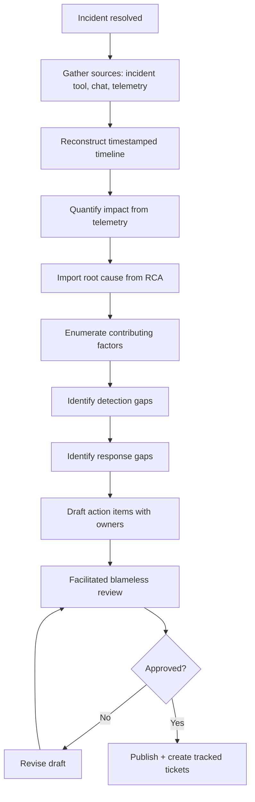
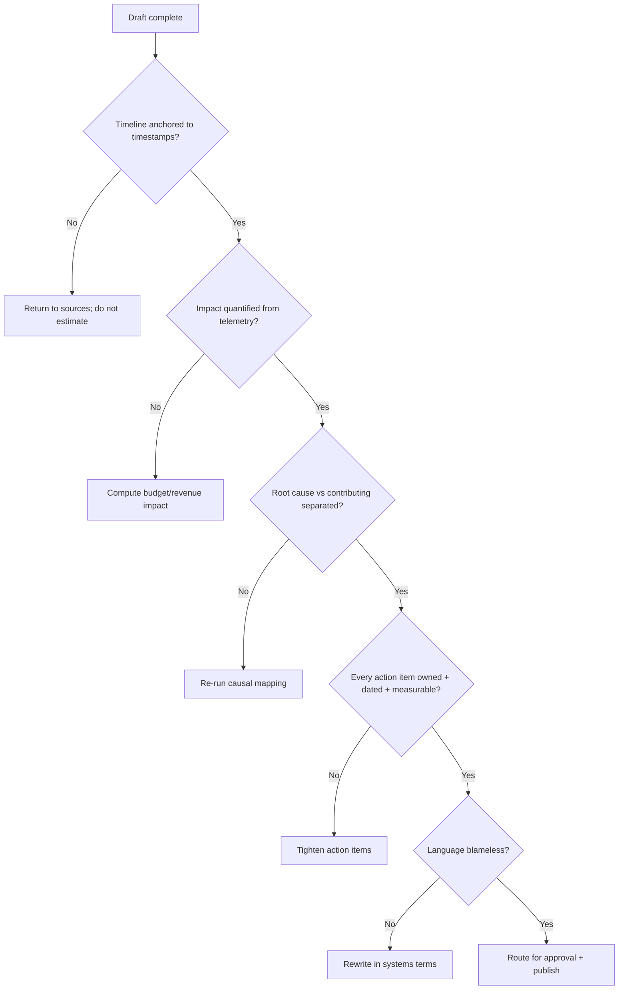

# Incident Postmortem

> Produce a blameless, evidence-based postmortem that captures the timeline, impact, causes, and durable action items so the organization learns from an incident.

## Objective

Convert a resolved incident into a complete, blameless postmortem document that a stakeholder can read to understand what happened, why, how much it hurt, and what will prevent recurrence. "Done" means the timeline is accurate to the minute, impact is quantified, causal analysis distinguishes root cause from contributing factors, and every action item has an owner, a due date, and a measurable definition of complete.

## Business Context

Postmortems are the compounding-interest mechanism of reliability engineering: each incident, properly analyzed, permanently retires a class of failure. Skipping or diluting them guarantees repeat outages, which erode customer trust, trigger SLA credits, and burn on-call teams into attrition. A rigorous, blameless postmortem culture is also a hiring and retention signal — engineers stay where failure is treated as a system property, not a personal fault. For regulated industries, postmortems are frequently an audit and compliance artifact demonstrating due diligence.

## Problem Statement

An incident has been detected, mitigated, and resolved. The organization now needs a durable record and a set of preventive actions. This runbook governs the creation of that record: assembling the timeline, quantifying impact, analyzing causes, and defining action items. It does **not** cover the live incident response itself, nor the deep root-cause isolation (see `root-cause-analysis.md`), which it consumes as an input.

## Success Criteria

- [ ] Timeline reconstructed with UTC timestamps for detection, escalation, mitigation, and resolution.
- [ ] Impact quantified: users affected, duration, error budget burned, revenue/SLA exposure.
- [ ] Root cause and contributing factors clearly separated and evidence-linked.
- [ ] Detection and response gaps identified with concrete improvements.
- [ ] Every action item has an owner, due date, priority, and completion definition.
- [ ] Document is blameless (systems and processes named, not individuals).
- [ ] Human reviewer (incident commander or eng lead) has approved before publication.

## Trigger Conditions

- Any incident classified SEV-2 or higher automatically requires a postmortem.
- A SEV-3 that recurs or has notable customer impact, at IC discretion.
- Schedule: postmortem due within 5 business days of incident resolution.
- Manual: leadership or customer request for an incident review.

## Inputs Required

| Input | Description | Example | Required |
|-------|-------------|---------|----------|
| `incident_id` | Incident tracking ID | `INC-2026-0842` | Yes |
| `severity` | Declared severity | `SEV-2` | Yes |
| `incident_window` | Detection to resolution | `14:05Z..15:40Z` | Yes |
| `rca_reference` | Completed RCA if available | `RCA-0842` | Recommended |
| `comms_log` | Incident channel/timeline | Slack `#inc-0842` | Yes |

## Required Access

| Scope | Purpose | Read/Write | Sensitivity |
|-------|---------|-----------|-------------|
| Incident tool (PagerDuty/Incident.io) | Timeline, acks, escalations | Read | Medium |
| ChatOps (Slack) | Reconstruct human timeline | Read | Medium |
| Metrics/Logs/Traces | Quantify impact | Read | Medium |
| Deploy history | Correlate changes | Read | Low |
| Source repo | Reference code/config | Read | Medium |

## Assumptions

- The incident is fully resolved; the system is stable at postmortem time.
- Incident-response communications were logged in a retrievable channel.
- SLO/SLI definitions and error-budget accounting exist for impact quantification.
- Participants are available for a facilitated review of the draft.

## Risks

| Risk | Likelihood | Impact | Mitigation |
|------|-----------|--------|------------|
| Blame creeps into narrative | Medium | High | Enforce systems-language; review for names/fault framing |
| Action items are vague/unowned | High | High | Require owner, date, and completion criterion for each |
| Timeline inaccurate from memory | Medium | Medium | Anchor every event to a timestamped source |
| Impact under/over-stated | Medium | Medium | Compute from telemetry, not estimates |

## Constraints

- Read-only; the postmortem process makes no production changes.
- Publication requires human approval; drafts are not shared externally.
- Language must remain blameless per organizational policy.
- Sensitive customer data in logs must be redacted before inclusion.

## Agent Persona

Adopt the persona of a **Staff SRE and skilled postmortem facilitator**. Be precise, neutral, and relentlessly blameless — describe what the system and processes did, never what a person "failed" to do. Distinguish fact (timestamped evidence) from interpretation. Push for specific, measurable action items and resist hand-wavy "be more careful" resolutions. Follow [`docs/AI_AGENT_STANDARDS.md`](../../docs/AI_AGENT_STANDARDS.md).

## Planning Instructions

1. Assemble source material: incident tool export, ChatOps log, metrics snapshots, RCA if present.
2. Draft the timeline skeleton from timestamped events before adding narrative.
3. Identify the impact dimensions to quantify (availability, latency, revenue, customers, error budget).
4. Plan the causal analysis: confirm root cause from RCA, then enumerate contributing factors and detection/response gaps.
5. Draft candidate action items, each tagged prevent / detect / mitigate / process.
6. Present the draft outline for human review before full write-up.

## Execution Instructions

```bash
# 1. Export the incident timeline from the incident tool (example: incident.io API)
curl -sH "Authorization: Bearer $INCIDENT_TOKEN" \
  https://api.incident.io/v2/incidents/INC-2026-0842 | jq '.incident.incident_timestamps'
```

```bash
# 2. Quantify availability impact — failed-request count in window (PromQL)
sum(increase(http_requests_total{service="checkout-api",code=~"5.."}[95m]))
```

```bash
# 3. Compute error budget burned (30d window, 99.9% SLO)
# budget_burned = failed / (allowed_error_budget)
sum(increase(http_requests_total{service="checkout-api",code=~"5.."}[95m]))
  / (0.001 * sum(increase(http_requests_total{service="checkout-api"}[30d])))
```

```bash
# 4. Pull the ChatOps human timeline for detection/escalation markers
# (Slack export tooling) - identify who acked and when
jq -r '.messages[] | "\(.ts) \(.user): \(.text)"' inc-0842-slack-export.json | head -60
```

## Investigation Workflow



## Analysis Framework

Structure the analysis in four layers. **Detection**: how long from first customer impact to first alert (Time to Detect)? Was the alert actionable or noisy? **Response**: how long from alert to acknowledged, to mitigated, to resolved? Where did handoffs, unclear ownership, or missing runbooks slow us? **Causation**: apply the RCA's root cause, then map contributing factors — the conditions that let a single fault become an incident (missing canary, no circuit breaker, alerting blind spot). **Prevention**: for each factor, ask which control would have prevented, detected earlier, or reduced blast radius. Classify each action item as *prevent*, *detect*, *mitigate*, or *process*. Favor systemic controls (automated gates, guardrails) over human vigilance. Use the "how many things had to go wrong" lens: healthy systems fail only when multiple defenses fail simultaneously; count them.

## Decision Tree



## Validation Steps

- [ ] Timeline events each cite a timestamped source.
- [ ] Impact numbers reproduce from the documented queries.
- [ ] Action items exist as tracked tickets with owners and due dates.
- [ ] A second reviewer confirms blameless language.
- [ ] Root cause matches the RCA conclusion (no drift).

## Expected Outputs

- A published postmortem document.
- A set of tracked action-item tickets (Jira/Linear) linked from the document.
- Updated error-budget accounting reflecting the incident.
- Optional: an updated alert or runbook if a gap was found.

## Deliverables

A complete postmortem following [`templates/report-template.md`](../../templates/report-template.md), extended with Timeline, Detection Analysis, and Action Items sections. All action items must be tracked externally, not only listed in prose.

## Escalation Process

Escalate to the Incident Commander if the analysis surfaces a previously unknown ongoing risk (e.g., the same latent bug affects other services). Escalate to engineering leadership if action items require cross-team prioritization or budget. For SEV-1 incidents, schedule an executive review. Communicate the published postmortem in the reliability channel and to affected stakeholders; for customer-facing impact, coordinate with support/comms on external messaging.

## Rollback Strategy

The postmortem process is read-only and produces documents, so there is no production rollback. If a published postmortem contains an error (wrong timestamp, mis-stated impact, accidental blame or unredacted data), issue a corrected version, note the correction in a changelog entry, and re-notify recipients. Never silently edit a published record; maintain an auditable revision history.

## Post-Execution Review

- Did action items from prior postmortems actually ship? Track completion rate.
- Was the postmortem produced within the SLA (5 business days)?
- Did the review surface systemic themes across incidents (recurring gaps)?
- Which parts of assembly (timeline, impact) can be automated for next time?

## Metrics

| Metric | Definition | Target |
|--------|-----------|--------|
| Postmortem timeliness | Published within 5 business days | > 90% |
| Action-item completion | Items closed by due date | > 80% |
| Recurrence rate | Incidents repeating a known cause | < 5% |
| Blameless compliance | Docs passing language review first try | > 95% |

## Example Execution

**Input:** `INC-2026-0842`, SEV-2, window `14:05–15:40Z`, RCA-0842 attached.

**Agent reasoning (abridged):** Telemetry shows 214k failed checkout requests over 95 minutes; at a 99.9% monthly SLO on 190M requests, allowed budget is 190k errors — this single incident burned 113% of the monthly budget. Time to Detect was 2 minutes (good). Time to Mitigate was 61 minutes because the on-call lacked a runbook to roll back the specific timeout change and paged the wrong team first. Root cause imported from RCA: deploy #4821 lowered a dependency timeout below normal latency. Contributing factors: no canary gate, no circuit breaker, and an alert that pointed at the symptom (5xx) not the change.

**Sample report excerpt:**

```text
Impact: 214,000 failed checkouts over 95m; ~$182k estimated lost GMV; 113% of
        monthly error budget consumed; 41,000 unique users affected.
Timeline: 14:05 detect, 14:07 page, 14:22 wrong-team handoff, 15:06 rollback,
          15:40 resolved. TTD 2m, TTMitigate 61m.
Action items:
  AI-1 (prevent) Add canary gate to checkout deploys. Owner: @sre-lead, due 08/27, P1.
  AI-2 (detect)  Alert on deploy+error correlation. Owner: @obs-team, due 09/03, P2.
  AI-3 (mitigate) Add circuit breaker to payment-gateway client. Owner: @checkout, due 09/10, P1.
```

## References

- [`root-cause-analysis.md`](./root-cause-analysis.md)
- [`service-reliability-review.md`](./service-reliability-review.md)
- [Google SRE — Postmortem Culture](https://sre.google/sre-book/postmortem-culture/)
- [`docs/AI_AGENT_STANDARDS.md`](../../docs/AI_AGENT_STANDARDS.md)
