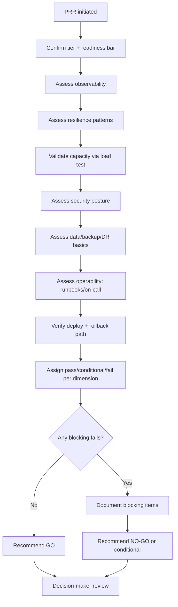
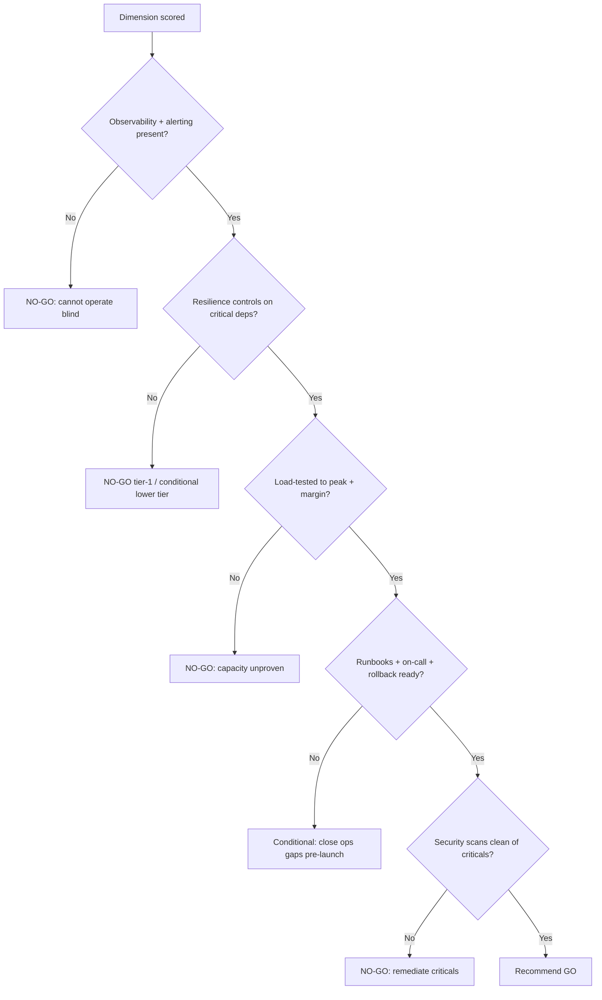

# Production Readiness Review

> Gate a new or significantly changed service before it takes production traffic, verifying observability, resilience, capacity, security, and operability against a formal readiness checklist.

## Objective

Determine whether a service is ready to safely serve production traffic and, if not, produce the specific list of blocking gaps that must be closed before launch. "Done" means the service has been evaluated against every readiness dimension, each dimension has a pass/conditional/fail verdict backed by evidence, and a go/no-go recommendation with blocking items is delivered to the launch decision-maker.

## Business Context

The Production Readiness Review (PRR) is the single most cost-effective reliability control an organization has: catching a missing runbook, an unbounded dependency, or a blind observability spot before launch costs hours; catching it via a 2 a.m. SEV-1 after launch costs an outage, customer trust, and engineering weekends. A disciplined PRR process lets a company launch faster with confidence because the criteria are known in advance. It also creates a shared definition of "production-grade" that scales engineering quality across teams.

## Problem Statement

A service is approaching launch (new service, major rewrite, or a large capability addition) and needs an objective readiness assessment. Teams under launch pressure systematically underweight operability, failure modes, and observability. This runbook applies a consistent readiness bar across observability, resilience, capacity, security, data, and operational readiness. It does **not** cover ongoing reliability reviews of live services (see `service-reliability-review.md`) or per-release gating of an already-live service (see `release-readiness-review.md`).

## Success Criteria

- [ ] Every readiness dimension has a pass / conditional / fail verdict with evidence.
- [ ] Observability is verified: metrics, logs, traces, dashboards, and SLO-based alerts exist.
- [ ] Resilience is verified: timeouts, retries, circuit breakers, graceful degradation, and load-shedding.
- [ ] Capacity is validated against projected peak with headroom.
- [ ] Runbooks and on-call ownership exist for the service.
- [ ] A go / no-go recommendation with a prioritized blocking-items list is delivered.
- [ ] Launch decision-maker has reviewed the recommendation.

## Trigger Conditions

- A new service is scheduled for production launch.
- A major architectural change or rewrite of an existing service.
- A service is being promoted from internal/beta to general availability.
- Manual: launch committee requests a formal PRR.

## Inputs Required

| Input | Description | Example | Required |
|-------|-------------|---------|----------|
| `service_name` | Service under review | `recommendations-api` | Yes |
| `launch_date` | Target go-live | `2026-09-01` | Yes |
| `service_tier` | Intended criticality tier | `tier-1` | Yes |
| `projected_peak` | Expected peak load | `12k rps` | Yes |
| `arch_doc` | Design/architecture doc | link | Recommended |
| `dependency_list` | Declared dependencies | link | Yes |

## Required Access

| Scope | Purpose | Read/Write | Sensitivity |
|-------|---------|-----------|-------------|
| Metrics/dashboards | Verify observability | Read | Low |
| Config repo | Verify resilience/limits | Read | Medium |
| Source repo | Verify error handling | Read | Medium |
| CI/CD (pipeline config) | Verify deploy/rollback | Read | Medium |
| Security scan results | Verify posture | Read | Medium |

## Assumptions

- The service is functionally complete and deployed to staging with representative config.
- A load-test capability and staging environment exist for capacity validation.
- The owning team has drafted (or will draft) runbooks and on-call rotation.
- Dependency owners have agreed to the projected load.

## Risks

| Risk | Likelihood | Impact | Mitigation |
|------|-----------|--------|------------|
| Launch pressure overrides blocking findings | High | Critical | Require decision-maker sign-off on accepted risks |
| Staging not representative of prod | Medium | High | Validate config/scale parity before trusting results |
| Untested failure modes ship | Medium | High | Require fault-injection / load-shed evidence |
| Capacity extrapolated, not tested | Medium | High | Require a load test to projected peak + margin |

## Constraints

- Read-only assessment; no changes to the service under review.
- A "conditional pass" must enumerate exactly which items are waived and by whom.
- The PRR bar is calibrated to the service tier; tier-1 has stricter gates than tier-3.
- No production traffic ramp until blocking items are resolved or formally accepted.

## Agent Persona

Adopt the persona of a **launch-gating Staff SRE on a production readiness committee**. Be rigorous and unafraid to recommend no-go, but pragmatic about tiering — a tier-3 internal tool need not meet tier-1 gates. Separate blocking gaps from nice-to-haves. Demand evidence, not assurances ("show me the dashboard and the load-test result"). Follow [`docs/AI_AGENT_STANDARDS.md`](../../docs/AI_AGENT_STANDARDS.md).

## Planning Instructions

1. Confirm the service tier and pull the corresponding readiness bar.
2. Enumerate the readiness dimensions: observability, resilience, capacity, security, data/backup, operability, deploy/rollback.
3. For each dimension, define the concrete evidence required for a pass.
4. Identify the staging environment and load-test tooling for capacity validation.
5. Draft the checklist and the scoring rubric (pass / conditional / fail).
6. Present the plan to the owning team and launch decision-maker.

## Execution Instructions

```bash
# 1. Verify SLO-based alerts exist for the service
amtool config routes show --alertmanager.url=$AM_URL | grep recommendations-api
promtool check rules alerts/recommendations-api.yaml
```

```bash
# 2. Verify dashboards and golden signals exist
curl -s "$GRAFANA/api/search?query=recommendations-api" | jq '.[].title'
```

```bash
# 3. Verify resilience config (timeouts, retries, breakers, resource limits)
grep -rEn 'timeout|retries|circuitBreaker|resources:|limits:|requests:' deploy/recommendations-api/
```

```bash
# 4. Capacity: run a load test to projected peak + 30% margin
k6 run --vus 500 --duration 15m -e TARGET=$STAGING_URL loadtest/recommendations_peak.js
```

```bash
# 5. Verify deploy/rollback path and health gates
grep -En 'strategy:|rollingUpdate|readinessProbe|livenessProbe' deploy/recommendations-api/deployment.yaml
```

## Investigation Workflow



## Analysis Framework

Score seven dimensions against tier-appropriate criteria.

**Observability:** golden signals (rate, errors, duration, saturation) instrumented; distributed tracing enabled; structured logs with correlation IDs; dashboards published; SLO-based burn-rate alerts wired to PagerDuty. A launch with no alerting is an automatic fail.

**Resilience:** bounded timeouts on all outbound calls; jittered retries with a retry budget; circuit breakers on critical dependencies; graceful degradation and load-shedding under overload; idempotency for retried mutations.

**Capacity:** load-tested to projected peak plus ≥30% margin; autoscaling configured and verified to trigger; resource requests/limits set; dependency owners have confirmed headroom for the added load.

**Security:** authn/authz enforced; secrets managed (not in code/env plaintext); dependency and image scans clean of criticals; least-privilege IAM; TLS everywhere.

**Data/backup:** backups configured and a restore tested; migration reversibility; PII handling and retention compliant.

**Operability:** runbooks exist for known failure modes; on-call rotation staffed; escalation paths defined; feature flags for risky paths.

**Deploy/rollback:** progressive rollout (canary/blue-green); readiness/liveness probes; a tested one-command rollback. Weight blocking severity by tier: for tier-1, any fail in observability, resilience, capacity, or rollback is blocking.

## Decision Tree



## Validation Steps

- [ ] Every dimension verdict cites concrete evidence (dashboard link, load-test result, config line).
- [ ] Load test reproduces projected peak + 30% with acceptable p99 and error rate.
- [ ] A rollback was demonstrated in staging (not just documented).
- [ ] Blocking items are unambiguous and independently verifiable as closed.
- [ ] Decision-maker has acknowledged any accepted (waived) risks in writing.

## Expected Outputs

- A readiness scorecard (dimension × verdict × evidence).
- A load-test report at projected peak.
- A prioritized blocking-items list.
- A go / no-go / conditional-go recommendation.

## Deliverables

A PRR report following [`templates/report-template.md`](../../templates/report-template.md), extended with the readiness scorecard and go/no-go recommendation. Blocking items must be filed as tickets and linked.

## Escalation Process

Escalate to the launch decision-maker (eng director / launch committee) with the go/no-go recommendation. If the team wishes to launch with unresolved blocking items, require explicit written risk acceptance from the accountable leader — the agent does not waive gates. Escalate to dependency owners if projected load endangers a shared service. For security criticals, escalate to the security team before any launch consideration.

## Rollback Strategy

The PRR itself is read-only. The relevant "rollback" is the launch abort/rollback plan the PRR validates: if the service launches and degrades, the documented path is to halt the traffic ramp (feature flag or load-balancer weight to 0) and roll back the deployment via the tested one-command rollback. The PRR must confirm this path exists and works before recommending go.

## Post-Execution Review

- Post-launch, did any incident trace back to a dimension marked pass? Recalibrate the bar.
- Were accepted-risk waivers resolved on schedule?
- Was the load-test projection accurate versus real peak?
- Which checklist items can be automated as CI gates for future PRRs?

## Metrics

| Metric | Definition | Target |
|--------|-----------|--------|
| Launch incident rate | Post-launch SEV-2+ within 30d | < 10% of launches |
| Blocking-item escape | Passed dims causing incidents | 0 |
| PRR cycle time | Initiation to recommendation | < 3 business days |
| Waiver resolution | Accepted risks closed on time | > 90% |

## Example Execution

**Input:** `recommendations-api`, tier-1, launch 2026-09-01, projected peak 12k rps.

**Agent reasoning (abridged):** Observability passes — golden-signal dashboards and burn-rate alerts exist. Resilience is conditional: outbound calls to the `feature-store` have a 2s timeout but no circuit breaker; under load test at 12k rps the feature-store latency spiked and cascaded, driving service p99 from 180ms to 4.2s with no shedding. Capacity fails: the load test only reached 8k rps before pods hit CPU limits with no autoscaling headroom (HPA max was set below projected peak). Security passes; runbooks are drafted but on-call rotation is unstaffed (conditional). Verdict: NO-GO until the HPA max is raised and validated to 15.6k rps (peak + 30%), a circuit breaker is added to the feature-store client, and the on-call rotation is staffed.

**Sample report excerpt:**

```text
Readiness scorecard:
  Observability   PASS  (dashboards + burn-rate alerts wired)
  Resilience      COND  (no breaker on feature-store; cascade under load)
  Capacity        FAIL  (HPA max 8k < projected peak 12k; no margin)
  Security        PASS  (scans clean, least-privilege IAM)
  Operability     COND  (runbooks drafted, on-call unstaffed)
  Deploy/Rollback PASS  (canary + tested rollback)
Recommendation: NO-GO.
Blocking items:
  P1 Raise HPA max + validate load to 15.6k rps. Owner @reco-team.
  P1 Add circuit breaker to feature-store client. Owner @reco-team.
  P1 Staff on-call rotation. Owner @eng-manager.
```

## References

- [`service-reliability-review.md`](./service-reliability-review.md)
- [`release-readiness-review.md`](./release-readiness-review.md)
- [Google SRE — Production Readiness Reviews](https://sre.google/sre-book/evolving-sre-engagement-model/)
- [`docs/AI_AGENT_STANDARDS.md`](../../docs/AI_AGENT_STANDARDS.md)
