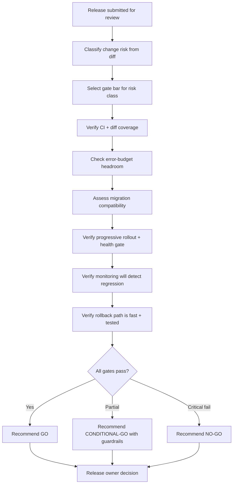
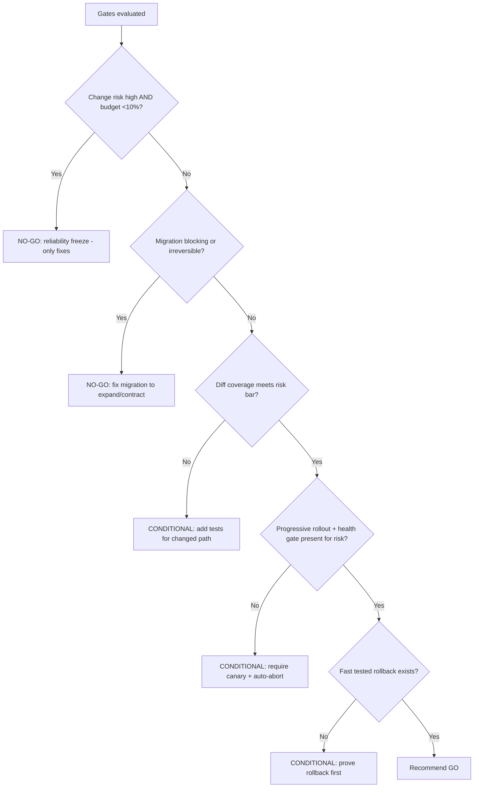

# Release Readiness Review

> Gate a specific release of an already-live service, verifying test coverage, error-budget headroom, rollout safety, monitoring, and rollback before promotion to production.

## Objective

Deliver a go / no-go / conditional-go decision for a specific release by verifying that the change is tested, the service has error-budget headroom to absorb risk, the rollout is progressive and observable, and rollback is fast and tested. "Done" means every release-gate criterion has a pass/fail verdict with evidence and a clear recommendation is delivered to the release owner before promotion.

## Business Context

Most production incidents are change-induced — a deploy, a migration, or a flag flip. The release readiness review is the last, cheapest checkpoint to catch a risky change before it reaches customers. Unlike a Production Readiness Review (which certifies a service once at launch), this runbook runs per significant release and calibrates risk to the change and the current error-budget position. Done well, it lets teams ship fast because risk is managed explicitly: safe changes sail through, risky ones get canaries and guardrails, and budget-exhausted services pause risky work rather than compounding outages.

## Problem Statement

Teams ship changes without consistently checking whether the change is adequately tested, whether the service can afford the risk right now (error budget), whether the rollout will be observable and reversible, and whether the on-call is prepared. Under deadline pressure these checks are skipped, and change-induced incidents follow. This runbook applies a consistent, risk-calibrated release gate. It does **not** replace the one-time launch certification (`production-readiness-review.md`) or post-incident analysis (`incident-postmortem.md`).

## Success Criteria

- [ ] Change scope and risk classification (low/medium/high) are established.
- [ ] Test evidence (unit, integration, e2e) meets the bar for the risk class.
- [ ] Current error-budget headroom is checked; risky releases are blocked when budget is exhausted.
- [ ] Rollout strategy is progressive (canary/blue-green) with automated health gates for high-risk changes.
- [ ] Monitoring/alerting will detect a bad release (SLO burn-rate + release-scoped dashboards).
- [ ] A tested, fast rollback path exists.
- [ ] A go / no-go / conditional-go recommendation is delivered to the release owner.

## Trigger Conditions

- A release/deploy to production of a tier-1 or tier-2 service.
- A database migration or schema change accompanying a release.
- A significant feature-flag rollout affecting a critical path.
- Manual: release owner requests a readiness check before promotion.

## Inputs Required

| Input | Description | Example | Required |
|-------|-------------|---------|----------|
| `service_name` | Service being released | `checkout-api` | Yes |
| `release_ref` | Version/tag/PR being shipped | `v2.14.0 / PR #4930` | Yes |
| `change_summary` | What the release changes | `new payment retry logic` | Yes |
| `rollout_plan` | Intended rollout strategy | `canary 5%->50%->100%` | Recommended |
| `migration` | Any DB migration included | `add index concurrently` | If applicable |

## Required Access

| Scope | Purpose | Read/Write | Sensitivity |
|-------|---------|-----------|-------------|
| CI/CD | Verify test results, pipeline gates | Read | Medium |
| Source repo | Review diff + risk | Read | Medium |
| Metrics (Prometheus/Grafana) | Error-budget headroom | Read | Low |
| Feature-flag system | Verify flag guardrails | Read | Medium |
| Deploy config | Verify rollout + rollback | Read | Medium |

## Assumptions

- CI has run and results are retrievable for the release ref.
- The service has defined SLOs and an error-budget dashboard.
- A rollback mechanism (deploy revert or flag disable) exists.
- The release owner is available to receive and act on the recommendation.

## Risks

| Risk | Likelihood | Impact | Mitigation |
|------|-----------|--------|------------|
| Green CI hides untested critical path | Medium | High | Check coverage of the changed code, not just pass/fail |
| Releasing while error budget exhausted | Medium | High | Block risky releases when budget < threshold |
| Migration not backward-compatible | Medium | Critical | Require expand/contract + reversibility check |
| Rollback assumed but untested | Medium | High | Require evidence rollback works for this change |

## Constraints

- Read-only assessment; the agent does not execute the promotion.
- Risk calibration: low-risk changes need lighter gates than high-risk ones.
- A conditional-go must specify exactly which guardrails are required (e.g., "canary only").
- Migrations must be backward/forward compatible or the release is no-go.

## Agent Persona

Adopt the persona of a **release-gating Staff Engineer / SRE** who ships fast but safely. Calibrate scrutiny to risk: do not block a typo fix with heavyweight process, and do not wave through a payment-path rewrite without a canary. Demand evidence over assurance. Be explicit about what would turn a no-go into a go. Follow [`docs/AI_AGENT_STANDARDS.md`](../../docs/AI_AGENT_STANDARDS.md).

## Planning Instructions

1. Classify the change risk from the diff: blast radius, criticality of the path, migration presence, and reversibility.
2. Determine the gate bar for that risk class (light / standard / heavy).
3. Identify evidence sources: CI results, coverage, error-budget dashboard, rollout config.
4. Check current error-budget position for the service.
5. Define the go/no-go criteria and the guardrails a conditional-go would require.
6. Present the plan and receive human approval to issue a recommendation.

## Execution Instructions

```bash
# 1. Verify CI status and test results for the release ref
gh pr checks 4930 --repo org/checkout-api
gh run view --repo org/checkout-api --json jobs -q '.jobs[] | {name, conclusion}'
```

```bash
# 2. Assess coverage of the changed lines (diff coverage, not global)
git diff --name-only origin/main...v2.14.0 -- 'src/**'
# cross-reference with coverage report for those files
```

```bash
# 3. Check current error-budget headroom (30d, 99.9% SLO)
1 - (
  sum(increase(http_requests_total{service="checkout-api",code=~"5.."}[30d]))
  / sum(increase(http_requests_total{service="checkout-api"}[30d]))
) 
# compare remaining budget to threshold
```

```bash
# 4. Verify rollout strategy + automated health gate
grep -En 'canary|steps:|analysis:|rollback|maxSurge|maxUnavailable' deploy/checkout-api/rollout.yaml
```

```sql
-- 5. If a migration is included, confirm it is non-blocking + reversible
-- Good: additive, concurrent, backward-compatible
CREATE INDEX CONCURRENTLY IF NOT EXISTS idx_orders_status ON orders(status);
-- Bad (blocking): ALTER TABLE orders ADD COLUMN ... NOT NULL DEFAULT ...
```

## Investigation Workflow



## Analysis Framework

Calibrate gates to a three-tier change-risk classification.

**Risk classification:** *Low* = isolated, non-critical-path, no migration, easily reverted (e.g., copy change, internal tool). *Medium* = touches a user-facing path or shared component, no schema change, reversible. *High* = critical path (payments, auth, checkout), includes a migration, hard to reverse, or affects many services.

**Gates (scaled by risk):**

- **Testing:** low needs green CI; medium needs green CI + integration coverage of the changed path; high needs e2e coverage + manual verification of the critical scenario. Check *diff coverage*, since global coverage can mask an untested new branch.
- **Error budget:** compute remaining 30-day budget. Policy: if budget < 10% remaining, block high-risk releases (reliability freeze) and allow only low-risk or reliability fixes. This is the core SRE mechanism tying release velocity to reliability.
- **Migrations:** must follow expand/contract (backward + forward compatible), be non-blocking (`CREATE INDEX CONCURRENTLY`, additive columns nullable), and have a reversal. A blocking `ALTER TABLE` on a large hot table is an automatic no-go.
- **Rollout:** high-risk requires canary with automated analysis (SLO/error-rate gate that auto-aborts). Medium requires at least a staged rollout. Low can go direct.
- **Detection:** a release-scoped dashboard and burn-rate alert must exist so a bad release is caught in minutes, not by customer reports.
- **Rollback:** must be fast (< 5 min) and proven for this change type. A forward-only migration with no reversal makes rollback impossible — a critical finding.

The recommendation is the worst-blocking gate: any critical fail (exhausted budget on a high-risk change, irreversible blocking migration, no rollback) is no-go; partial gaps become conditional-go with named guardrails.

## Decision Tree



## Validation Steps

- [ ] CI status and diff coverage verified against the risk bar with cited evidence.
- [ ] Error-budget figure reproduces from the documented query.
- [ ] Migration reviewed for compatibility and reversibility (if present).
- [ ] Rollout config confirmed to include the required progressive strategy and health gate.
- [ ] Rollback path confirmed to work for this change class.
- [ ] Recommendation clearly states any required guardrails for conditional-go.

## Expected Outputs

- A release-gate scorecard (gate × pass/fail × evidence).
- A change-risk classification with rationale.
- The current error-budget position.
- A go / no-go / conditional-go recommendation with required guardrails.

## Deliverables

A release readiness report following [`templates/report-template.md`](../../templates/report-template.md), extended with the release-gate scorecard and recommendation. Conditional-go guardrails must be explicit and verifiable.

## Escalation Process

Deliver the recommendation to the release owner and, for no-go on a time-sensitive release, escalate to the engineering manager to weigh the risk/deadline trade-off — the agent does not override a documented risk acceptance, but requires it in writing. Escalate to the DBA/data team for any migration flagged as blocking or irreversible. If the error budget is exhausted, escalate the reliability-freeze decision to the service owner and SRE lead per the error-budget policy.

## Rollback Strategy

The review is read-only. It validates the rollback plan that would execute if the release degrades production: for a deploy, `argocd app rollback checkout-api <prev>` or `kubectl rollout undo`; for a flag rollout, disable the flag; for a canary, the automated analysis aborts and shifts traffic back. The review must confirm this path is fast (< 5 min) and, for high-risk changes, that it was exercised in staging. If the release includes a forward-only migration, the rollback plan must include a compensating forward fix, since the schema cannot be reverted.

## Post-Execution Review

- Did the release proceed as recommended, and did any incident follow? Feed back into risk calibration.
- Were conditional-go guardrails actually applied?
- Was the change-risk classification accurate in hindsight?
- Which gates can be automated as hard CI/CD checks (diff coverage, budget gate, migration linter)?

## Metrics

| Metric | Definition | Target |
|--------|-----------|--------|
| Change failure rate | Releases causing incidents | < 15% |
| Gate accuracy | GO releases with no incident | > 95% |
| Rollback time | Time to revert a bad release | < 5m |
| Budget-freeze adherence | Risky releases blocked when budget low | 100% |

## Example Execution

**Input:** `checkout-api`, `v2.14.0 / PR #4930`, change = new payment retry logic, rollout = canary 5%→50%→100%.

**Agent reasoning (abridged):** The diff touches the payment critical path and adds retry logic to the payment-gateway client — high-risk classification. CI is green, but diff coverage on the new retry branch is only 48%: the exhausted-retry-budget path is untested. Error budget is healthy (34% remaining), so budget is not blocking. No migration is included. The rollout config defines a canary but has no automated analysis step, so a bad canary would not auto-abort. Rollback is a standard `rollout undo`, fast and proven. Verdict: CONDITIONAL-GO — proceed only after adding a test for the exhausted-retry path and enabling automated canary analysis (abort on 5xx > 1% or p99 > 400ms at the 5% step).

**Sample report excerpt:**

```text
Change risk: HIGH (payment critical path, new retry logic).
Release-gate scorecard:
  Testing        FAIL  (diff coverage 48%; exhausted-retry branch untested)
  Error budget   PASS  (34% remaining, 30d)
  Migration      N/A   (none included)
  Rollout        COND  (canary defined but no automated analysis/abort)
  Detection      PASS  (burn-rate alert + release dashboard present)
  Rollback       PASS  (rollout undo, <5m, proven in staging)
Recommendation: CONDITIONAL-GO.
Required guardrails:
  1. Add test covering exhausted-retry-budget path (raise diff coverage >80%).
  2. Enable canary auto-analysis: abort if 5xx>1% or p99>400ms at 5% step.
```

## References

- [`production-readiness-review.md`](./production-readiness-review.md)
- [`incident-postmortem.md`](./incident-postmortem.md)
- [Google SRE — Release Engineering](https://sre.google/sre-book/release-engineering/)
- [`docs/AI_AGENT_STANDARDS.md`](../../docs/AI_AGENT_STANDARDS.md)
