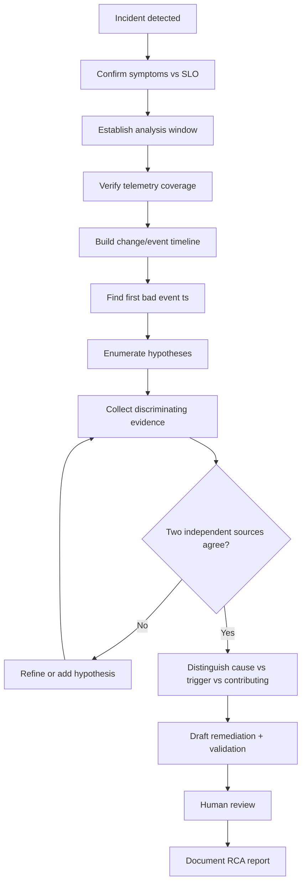
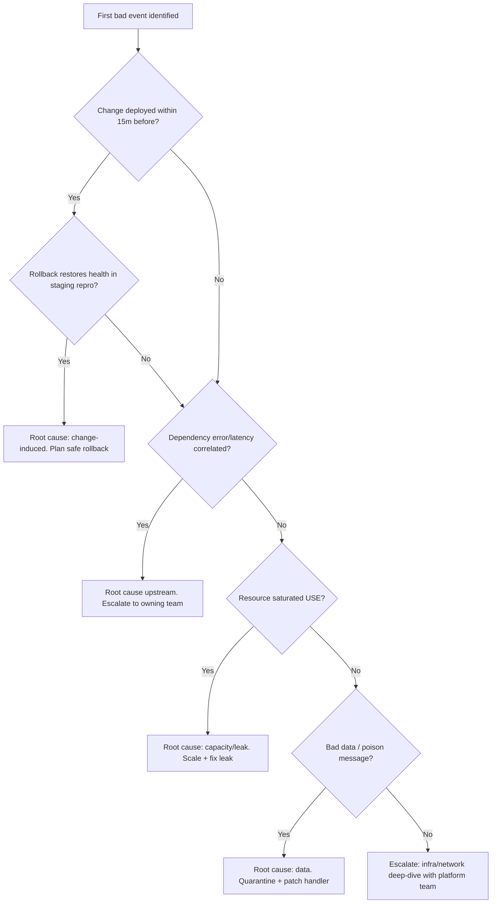

# Root Cause Analysis

> Systematically isolate the true root cause of a production reliability failure, distinguish it from proximate symptoms, and produce an evidence-backed remediation plan.

## Objective

Identify the single verifiable root cause (or the minimal set of contributing causes) of an observed reliability degradation — elevated error rate, latency regression, saturation, or outage — and deliver a prioritized remediation plan with supporting evidence. "Done" means every observed symptom is causally linked to a mechanism, that mechanism is reproducible or strongly corroborated by telemetry, and a fix with an explicit validation strategy has been proposed.

## Business Context

Unresolved or misdiagnosed root causes directly translate into repeat incidents, eroded customer trust, SLA penalties, and burned engineering time. A checkout API returning 5xx for even 0.5% of requests can represent tens of thousands of dollars per hour in lost revenue for a mid-size e-commerce platform. Worse, shipping a fix for the wrong cause creates false confidence: the incident recurs, on-call fatigue compounds, and the error budget is depleted twice. Rigorous RCA is the mechanism by which an organization converts an incident into durable learning and prevents recurrence, protecting both revenue and engineering morale.

## Problem Statement

A service is exhibiting one or more objective reliability signals outside of normal operating bounds: HTTP 5xx rate above baseline, p99 latency regression, queue backlog growth, saturation of a resource, or a full outage. The symptoms are known; the causal mechanism is not. This runbook covers the disciplined isolation of that mechanism. It explicitly does **not** cover long-term architectural redesign, capacity planning beyond the immediate incident, or the writing of the customer-facing postmortem (see `incident-postmortem.md`).

## Success Criteria

- [ ] Every observed symptom is mapped to a mechanism with supporting telemetry (metric, log, trace, or config diff).
- [ ] A "first bad event" timestamp is established within a 5-minute window.
- [ ] The root cause hypothesis is corroborated by at least two independent evidence sources.
- [ ] Contributing factors and the trigger are distinguished from the underlying cause.
- [ ] A remediation plan with a validation method and rollback path is documented.
- [ ] A human reviewer has approved the root cause conclusion before any production change.

## Trigger Conditions

- Alert: `HighErrorRate` (5xx ratio > 1% for 5m) or `LatencyRegression` (p99 > SLO for 10m) fires in Prometheus/Alertmanager.
- Alert: PagerDuty incident escalated to SEV-2 or higher with an unknown cause.
- Schedule: Follow-up RCA requested after a mitigated incident where the cause remains unconfirmed.
- Manual: On-call engineer or incident commander requests deep-dive analysis.

## Inputs Required

| Input | Description | Example | Required |
|-------|-------------|---------|----------|
| `service_name` | Target service | `checkout-api` | Yes |
| `incident_window` | Start/end of degradation | `2026-08-13T14:05Z..14:52Z` | Yes |
| `environment` | Affected environment | `prod` | Yes |
| `slo_reference` | Relevant SLO/SLI definition | `p99 < 300ms, 99.9% availability` | Yes |
| `recent_changes` | Deploys/config/flags in window | `deploy #4821, flag checkout_v2` | Recommended |

## Required Access

| Scope | Purpose | Read/Write | Sensitivity |
|-------|---------|-----------|-------------|
| Metrics (Prometheus/Grafana) | Observe latency/error/saturation | Read | Low |
| Logs (Loki/ELK/CloudWatch) | Inspect error detail | Read | Medium |
| Traces (Tempo/Jaeger/OTel) | Follow request path | Read | Medium |
| Deploy history (Argo/Spinnaker) | Correlate changes | Read | Low |
| Source repo | Inspect suspect code | Read | Medium |

## Assumptions

- Telemetry (metrics, logs, traces) is retained for the incident window and is trustworthy.
- Deploy and config-change history is queryable and timestamped in UTC.
- The service has defined SLOs/SLIs to anchor "abnormal" against a baseline.
- The agent has read-only access only; no mutation occurs without explicit human approval.

## Risks

| Risk | Likelihood | Impact | Mitigation |
|------|-----------|--------|------------|
| Confirmation bias fixates on first hypothesis | High | High | Require two independent evidence sources; enumerate competing hypotheses |
| Correlating a coincidental deploy as cause | Medium | High | Verify mechanism, not just timing; check counterfactuals |
| Acting on incomplete telemetry (gaps) | Medium | Medium | Flag telemetry gaps explicitly; widen window |
| Recommending production change without approval | Low | Critical | human_in_the_loop is required before any write |

## Constraints

- No production writes, restarts, rollbacks, or flag flips without an approved change and human sign-off.
- Respect active change freezes and compliance windows.
- Blast-radius limits: analysis must not degrade the service further (avoid expensive queries against production databases during an active incident; prefer replicas).
- All conclusions must be evidence-linked; speculation must be labeled as such.

## Agent Persona

Adopt the persona of a **Principal Site Reliability Engineer** conducting a blameless, evidence-driven investigation. Be methodical, skeptical of coincidence, and explicit about confidence levels. Externalize reasoning: state each hypothesis, the evidence for and against, and why it is retained or rejected. Never assert a root cause without corroboration. Follow the conventions in [`docs/AI_AGENT_STANDARDS.md`](../../docs/AI_AGENT_STANDARDS.md) for tone, evidence handling, and escalation.

## Planning Instructions

1. Restate the observed symptoms and the SLO they violate.
2. Establish the analysis window and confirm telemetry coverage across it.
3. Build a timeline skeleton: deploys, config changes, feature-flag flips, infra events, traffic shifts.
4. Enumerate 3–6 candidate hypotheses spanning categories: code change, config/flag, dependency, capacity/saturation, data, infrastructure/network.
5. For each hypothesis, define the discriminating evidence that would confirm or refute it.
6. Present the plan for human approval when `human_in_the_loop` is required.

## Execution Instructions

Begin read-only. Observe before touching anything.

```bash
# 1. Confirm the error-rate signal and find the "first bad" minute
# PromQL: 5xx ratio for the service
sum(rate(http_requests_total{service="checkout-api",code=~"5.."}[1m]))
  / sum(rate(http_requests_total{service="checkout-api"}[1m]))
```

```bash
# 2. Latency regression check (p99)
histogram_quantile(0.99,
  sum(rate(http_request_duration_seconds_bucket{service="checkout-api"}[5m])) by (le))
```

```bash
# 3. Correlate deploys in the window
kubectl -n checkout rollout history deployment/checkout-api
argocd app history checkout-api | head -20
```

```bash
# 4. Pull error logs at the first-bad timestamp
kubectl -n checkout logs deploy/checkout-api --since-time=2026-08-13T14:05:00Z \
  | grep -Ei 'exception|timeout|connection refused|deadline exceeded' | head -50
```

```sql
-- 5. Check for a data/dependency anomaly (run against a read replica)
SELECT date_trunc('minute', created_at) AS minute, count(*)
FROM orders
WHERE created_at BETWEEN '2026-08-13 14:00' AND '2026-08-13 15:00'
GROUP BY 1 ORDER BY 1;
```

## Investigation Workflow



## Analysis Framework

Reason across six causal categories and rank hypotheses by prior probability given the evidence:

1. **Change-induced** — a deploy, config, or feature flag flipped within minutes of the first bad event. Highest prior when timing is tight and a mechanism is plausible.
2. **Dependency** — an upstream/downstream service, database, cache, or third-party API degraded. Look for correlated latency/error in dependency dashboards and trace spans.
3. **Capacity/saturation** — CPU throttling, memory pressure/OOM, connection-pool exhaustion, thread starvation. Check the USE method (Utilization, Saturation, Errors).
4. **Data** — a poison message, schema drift, hot key, or unexpected payload size.
5. **Infrastructure/network** — node failure, DNS, packet loss, zone outage, certificate expiry.
6. **Traffic** — a spike, retry storm, or thundering herd amplifying an otherwise benign fault.

Apply the RED method (Rate, Errors, Duration) at the service edge and the USE method at the resource layer. Beware the classic traps: coincident-deploy correlation, symptom-as-cause (a full connection pool is usually a symptom of slow queries, not the cause), and stopping at the first plausible story. A valid root cause answers "why" until the next "why" is an accepted design decision or external reality.

## Decision Tree



## Validation Steps

- [ ] Reproduce the failure mechanism in staging or via a targeted trace replay.
- [ ] Confirm the proposed fix removes the mechanism (before/after metric comparison).
- [ ] Verify no new error class is introduced by the fix.
- [ ] Confirm the "first bad event" timestamp aligns with the identified cause within 5 minutes.
- [ ] Peer/human review of the causal chain for logical gaps.

## Expected Outputs

- A timeline of the incident with the first-bad-event marker.
- A ranked hypothesis table showing evidence for/against and disposition.
- A confirmed root-cause statement with a causal chain (5 Whys).
- A remediation plan with validation and rollback.

## Deliverables

A completed RCA report following [`templates/report-template.md`](../../templates/report-template.md), including Observations, Findings, Evidence, Impact, and Recommendations. The report must clearly separate root cause, trigger, and contributing factors.

## Escalation Process

Escalate to the owning team's on-call via PagerDuty when the root cause lies outside the service boundary (upstream dependency, platform, network). Escalate to the Incident Commander if the investigation reveals ongoing customer impact requiring immediate mitigation. Map severity: SEV-1 (full outage / data loss risk) → page IC + eng director; SEV-2 (partial degradation) → page service on-call; SEV-3 (elevated but within budget) → ticket. Communicate in the incident Slack channel with evidence links.

## Rollback Strategy

If a change is confirmed as the cause and a rollback is approved: revert the deploy (`argocd app rollback checkout-api <revision>` or `kubectl rollout undo deployment/checkout-api`), then confirm the 5xx ratio and p99 return to baseline within two scrape intervals. If a feature flag is the cause, disable it via the flag system and verify. Document the rollback revision and the confirming metric snapshot. If rollback does not restore health, the change was likely a trigger, not the cause — return to the workflow.

## Post-Execution Review

- Was the first-bad-event timestamp found quickly? If not, what telemetry was missing?
- Did any hypothesis survive on weak evidence? Tighten the evidence bar.
- What detection gap allowed this to reach the severity it did? File an observability improvement.
- Which step could be automated (e.g., automatic deploy-correlation)?

## Metrics

| Metric | Definition | Target |
|--------|-----------|--------|
| MTTI | Mean time to identify root cause | < 45m |
| RCA accuracy | Confirmed-correct causes / total | > 90% |
| Recurrence rate | Same cause within 90 days | < 5% |
| Evidence density | Findings backed by ≥2 sources | 100% |

## Example Execution

**Input:** `checkout-api`, window `14:05–14:52Z`, prod, SLO p99<300ms.

**Agent reasoning (abridged):** The 5xx ratio jumped from 0.1% to 4.2% at 14:07Z. Deploy #4821 landed at 14:06Z — tight correlation. Traces show `payment-gateway` calls timing out at 5s. But the gateway's own dashboard is green, so the dependency is not degraded. Reading the diff for #4821 reveals the HTTP client timeout was lowered from 10s to 3s while the p95 gateway latency is 4.1s. Mechanism: the new timeout is below normal dependency latency, so a fraction of calls abort. Two sources agree: the code diff and the trace-level abort-at-3s pattern.

**Sample report excerpt:**

```text
F1 — Root cause: deploy #4821 reduced payment-gateway client timeout 10s->3s.
     Gateway p95 latency (4.1s) exceeds new timeout, causing DeadlineExceeded
     aborts on ~4% of checkout calls.
Evidence: code diff L212; trace span abort pattern at exactly 3000ms; 5xx onset
     at 14:07Z, 60s after 14:06Z deploy.
Trigger: elevated but normal gateway latency. Contributing: no canary on #4821.
Recommendation R1: rollback #4821, restore 10s timeout, add canary gate. (S/High)
```

## References

- [`incident-postmortem.md`](./incident-postmortem.md)
- [`service-reliability-review.md`](./service-reliability-review.md)
- [Google SRE Book — Effective Troubleshooting](https://sre.google/sre-book/effective-troubleshooting/)
- [`docs/AI_AGENT_STANDARDS.md`](../../docs/AI_AGENT_STANDARDS.md)
