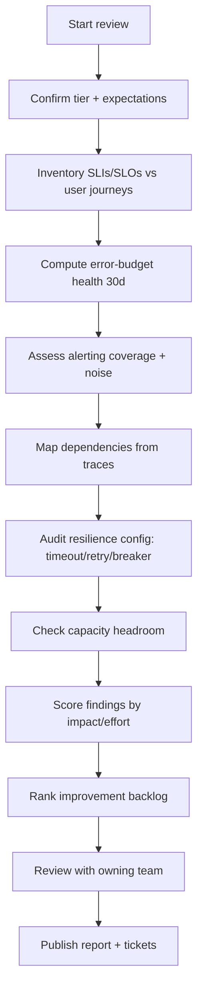
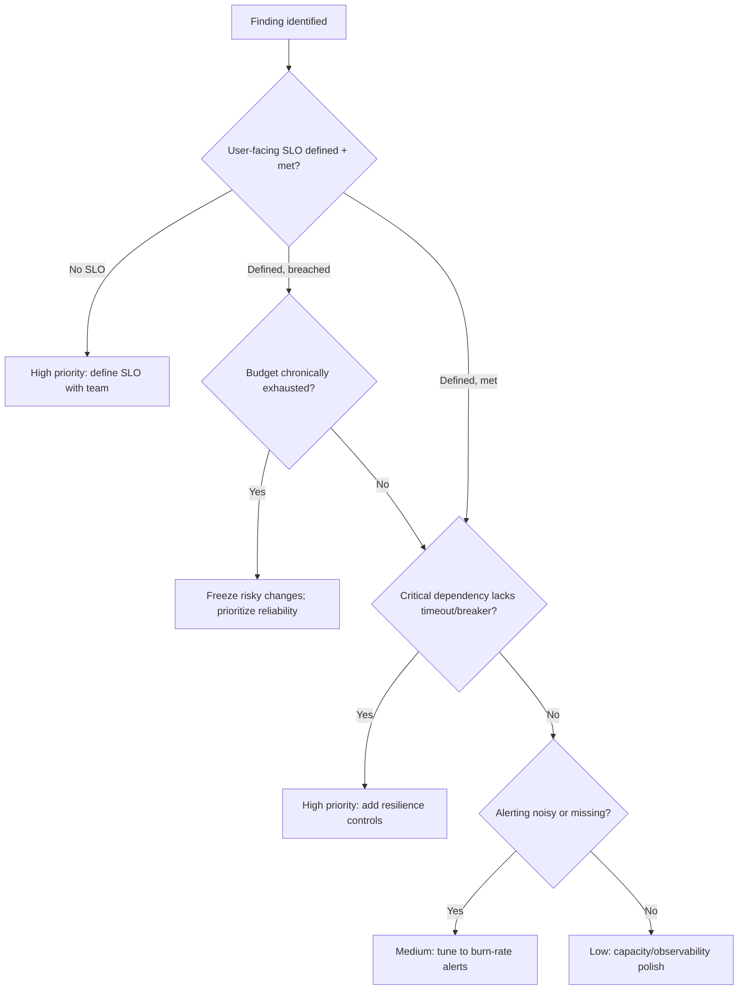

# Service Reliability Review

> Perform a structured, periodic assessment of a service's reliability posture — SLOs, error budgets, dependencies, and resilience patterns — and produce a prioritized improvement backlog.

## Objective

Assess whether a service reliably meets its reliability targets and identify the highest-leverage improvements to its SLOs, alerting, dependency handling, and resilience. "Done" means the service's SLO/SLI coverage is verified, error-budget health is quantified over a trailing window, resilience gaps (retries, timeouts, circuit breakers, bulkheads) are cataloged, and a ranked improvement backlog with effort estimates is delivered.

## Business Context

Reliability is a feature customers pay for and churn over. A periodic reliability review catches slow-burning regressions — a dependency that has quietly become flakier, an SLO no longer aligned with customer expectations, alerting that has drifted into noise — before they become the next SEV-1. It turns reliability from reactive firefighting into a managed, budgeted discipline. For the business, this means fewer outages, predictable release velocity (error budgets that gate risky changes), and objective data to justify reliability investment versus feature work.

## Problem Statement

Over time a service accumulates reliability debt: SLOs that were never defined or have gone stale, alerts that page on symptoms rather than customer impact, missing timeouts and retries, unbounded dependencies, and untested failure modes. This runbook systematically surfaces that debt for a single service. It does **not** perform incident response (see `root-cause-analysis.md`), certify a new service for launch (see `production-readiness-review.md`), or assess disaster recovery specifically (see `disaster-recovery-assessment.md`).

## Success Criteria

- [ ] All user-facing SLIs are identified and each has a defined, agreed SLO.
- [ ] Error-budget consumption is quantified over the trailing 30 days.
- [ ] Every critical dependency has documented timeout, retry, and fallback behavior.
- [ ] Alerting is assessed for coverage, actionability, and noise (alert-to-incident ratio).
- [ ] A prioritized improvement backlog with effort/impact estimates is produced.
- [ ] Findings are reviewed with the owning team.

## Trigger Conditions

- Schedule: quarterly reliability review per service tier (tier-1 services quarterly, tier-2 semi-annually).
- Manual: requested after a significant incident or before a major launch.
- Alert: repeated error-budget exhaustion or rising alert-noise triggers an ad-hoc review.
- Change: a major architectural change to the service.

## Inputs Required

| Input | Description | Example | Required |
|-------|-------------|---------|----------|
| `service_name` | Target service | `checkout-api` | Yes |
| `service_tier` | Criticality tier | `tier-1` | Yes |
| `review_window` | Trailing analysis window | `last 30d` | Yes |
| `slo_catalog` | Existing SLO definitions | link | Recommended |
| `dependency_map` | Known upstream/downstream | link | Recommended |

## Required Access

| Scope | Purpose | Read/Write | Sensitivity |
|-------|---------|-----------|-------------|
| Metrics (Prometheus/Grafana) | SLI/error-budget analysis | Read | Low |
| Alerting (Alertmanager/PagerDuty) | Alert coverage/noise | Read | Low |
| Traces (Tempo/Jaeger) | Dependency behavior | Read | Medium |
| Config repo | Timeout/retry/breaker config | Read | Medium |
| Source repo | Resilience patterns | Read | Medium |

## Assumptions

- The service has been in production long enough (≥30 days) to have meaningful telemetry.
- Metrics retention covers the review window.
- The owning team is available to validate SLO targets and prioritize the backlog.
- Dependency topology is discoverable via traces or service catalog.

## Risks

| Risk | Likelihood | Impact | Mitigation |
|------|-----------|--------|------------|
| SLOs set to current behavior, not customer need | High | Medium | Anchor SLOs to user journeys, not existing metrics |
| Review becomes checklist theater | Medium | Medium | Require ranked, owned backlog with impact estimates |
| Missing telemetry hides real gaps | Medium | High | Flag observability blind spots as findings |
| Backlog never actioned | High | Medium | Convert items to tracked tickets with owners |

## Constraints

- Read-only; no configuration or code changes during the review.
- Recommendations must be prioritized by impact and effort, not enumerated exhaustively.
- Respect the owning team's roadmap; deliver a backlog, not a mandate.
- SLO changes require owning-team agreement before adoption.

## Agent Persona

Adopt the persona of an **embedded SRE performing a reliability audit**. Be pragmatic and prioritization-driven: the goal is the top 5–10 improvements that move reliability most per unit effort, not a 100-item wishlist. Ground every recommendation in telemetry. Challenge stale SLOs and noisy alerts directly but constructively. Follow [`docs/AI_AGENT_STANDARDS.md`](../../docs/AI_AGENT_STANDARDS.md).

## Planning Instructions

1. Confirm the service tier and the reliability expectations that tier implies.
2. Inventory existing SLIs/SLOs and map them to user-facing journeys.
3. Plan the four assessment tracks: SLO/error budget, alerting, dependencies/resilience, capacity headroom.
4. Identify telemetry sources for each track and confirm coverage.
5. Define the scoring rubric for the improvement backlog (impact × 1/effort).
6. Share the plan with the owning team when `human_in_the_loop` is recommended.

## Execution Instructions

```bash
# 1. Availability SLI over the review window (PromQL)
1 - (
  sum(increase(http_requests_total{service="checkout-api",code=~"5.."}[30d]))
  / sum(increase(http_requests_total{service="checkout-api"}[30d]))
)
```

```bash
# 2. Latency SLI: fraction of requests under the 300ms threshold
sum(rate(http_request_duration_seconds_bucket{service="checkout-api",le="0.3"}[30d]))
  / sum(rate(http_request_duration_seconds_count{service="checkout-api"}[30d]))
```

```bash
# 3. Error-budget burn rate (multi-window; fast burn if > 14.4 over 1h)
(
  sum(rate(http_requests_total{service="checkout-api",code=~"5.."}[1h]))
  / sum(rate(http_requests_total{service="checkout-api"}[1h]))
) / 0.001
```

```bash
# 4. Alert noise: alerts fired vs incidents declared (last 30d)
amtool alert query --alertmanager.url=$AM_URL 'service="checkout-api"' | wc -l
```

```bash
# 5. Inspect dependency timeout/retry config
grep -rEn 'timeout|retries|circuitBreaker|maxConnections' deploy/checkout-api/
```

## Investigation Workflow



## Analysis Framework

Evaluate four tracks and synthesize into one ranked backlog.

**SLO/error budget:** Are SLIs tied to real user journeys (e.g., "checkout completes < 300ms") rather than infrastructure proxies? Is the SLO target achievable and meaningful? Compute trailing-30d budget consumption and the burn-rate profile. Chronic budget exhaustion signals either an unrealistic SLO or genuine reliability debt.

**Alerting:** Assess coverage (does every SLO have a burn-rate alert?), actionability (does each page have a runbook and a clear owner?), and noise (alert-to-incident ratio; a ratio far above 1 indicates fatigue-inducing noise). Prefer multi-window multi-burn-rate alerting (fast burn 2%/1h and slow burn 5%/6h) over static thresholds.

**Dependencies and resilience:** For each critical dependency, verify a bounded timeout, a sane retry policy (with jittered backoff and a retry budget, not unbounded retries), a circuit breaker, and a graceful fallback. Unbounded retries cause retry storms; missing timeouts cause cascading failure. Check for bulkheads isolating dependency pools.

**Capacity headroom:** Confirm the service has headroom above peak (target ~40% at p95 utilization) and that autoscaling triggers on the right signal. Rank all findings by impact (customer-facing severity × frequency) divided by effort.

## Decision Tree



## Validation Steps

- [ ] Each computed SLI reproduces from its documented query.
- [ ] Dependency audit covers 100% of critical dependencies in the trace map.
- [ ] Every backlog item has an impact rating, effort estimate, and owner.
- [ ] SLO target changes are agreed by the owning team.
- [ ] Alert-noise figure is corroborated by PagerDuty incident counts.

## Expected Outputs

- An SLO/SLI conformance table with error-budget health.
- A dependency resilience matrix (timeout/retry/breaker/fallback per dependency).
- An alerting quality assessment.
- A ranked improvement backlog with impact/effort.

## Deliverables

A reliability review report following [`templates/report-template.md`](../../templates/report-template.md), extended with the SLO conformance table and dependency resilience matrix. Backlog items must be filed as tracked tickets.

## Escalation Process

Escalate to engineering leadership when reliability debt requires roadmap trade-offs (dedicating a sprint to resilience work). Escalate to the platform/dependency owners when a shared dependency is the reliability bottleneck. If the review reveals an active, undetected risk (e.g., a dependency with no timeout that could cascade), raise it immediately as a high-priority ticket and notify the on-call. Map: active risk → page; systemic debt → leadership review; local polish → team backlog.

## Rollback Strategy

The review is read-only and produces analysis, so no production rollback applies. If a delivered SLO recommendation is later found to be miscalibrated (too strict, causing false error-budget alarms), revise the SLO with the owning team and update the burn-rate alert thresholds accordingly, documenting the change rationale. Treat SLO definitions as versioned artifacts.

## Post-Execution Review

- How many backlog items from the prior review were completed?
- Did error-budget health improve quarter over quarter?
- Did alert noise decrease after tuning recommendations?
- Which assessment steps can be automated into a recurring dashboard?

## Metrics

| Metric | Definition | Target |
|--------|-----------|--------|
| SLO coverage | User journeys with an SLO | 100% |
| Error-budget health | Budget remaining at period end | > 20% |
| Alert-to-incident ratio | Pages per real incident | < 3:1 |
| Backlog completion | Prior items closed | > 70% |

## Example Execution

**Input:** `checkout-api`, tier-1, trailing 30d.

**Agent reasoning (abridged):** Availability SLI is 99.94% against a 99.9% SLO — met, with 40% budget remaining. However, latency SLO coverage is missing: there is no p99 SLO despite checkout latency being customer-critical. Trace analysis shows the `payment-gateway` dependency has a 10s timeout but no circuit breaker and unbounded retries (3 attempts, no jitter) — a retry-storm risk confirmed during INC-0842. Alerting fires 47 pages/month against 3 real incidents (15.7:1 noise ratio), driven by a flapping static latency threshold. Top backlog items: add a p99 latency SLO with burn-rate alerting, add a circuit breaker + retry budget to the gateway client, and replace static latency alerts with multi-window burn-rate alerts.

**Sample report excerpt:**

```text
SLO conformance:
  Availability 99.94% vs 99.9% SLO — MET (budget 40% remaining)
  Latency — NO SLO DEFINED (gap)
Dependency resilience matrix (payment-gateway):
  timeout: 10s | retry: 3x no-jitter (unbounded budget) | breaker: NONE | fallback: NONE
Backlog (ranked):
  B1 Define p99<300ms SLO + burn-rate alerts. Impact High / Effort S. Owner @checkout.
  B2 Add circuit breaker + retry budget to gateway client. Impact High / Effort M.
  B3 Replace static latency alert w/ multi-window burn-rate. Impact Med / Effort S.
```

## References

- [`root-cause-analysis.md`](./root-cause-analysis.md)
- [`production-readiness-review.md`](./production-readiness-review.md)
- [Google SRE Workbook — Implementing SLOs](https://sre.google/workbook/implementing-slos/)
- [`docs/AI_AGENT_STANDARDS.md`](../../docs/AI_AGENT_STANDARDS.md)
