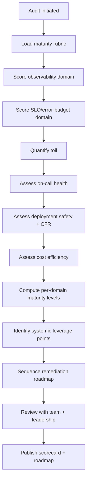
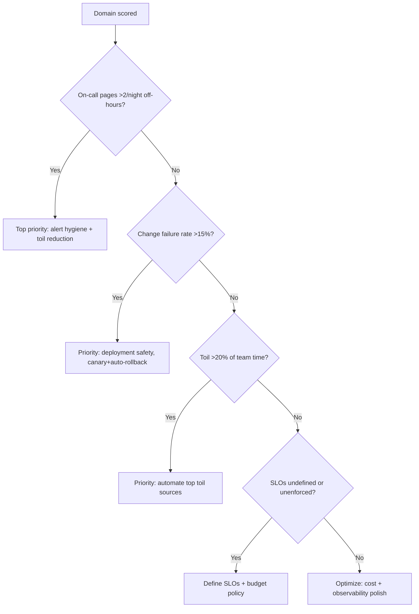

# SRE Service Audit

> Conduct a comprehensive operational-maturity audit of a service across the full SRE lifecycle — observability, SLOs, toil, on-call health, deployment safety, and cost — producing a scored maturity assessment and remediation roadmap.

## Objective

Produce an objective, scored assessment of a service's operational maturity across the SRE lifecycle and a prioritized roadmap to raise it. "Done" means every audit domain has a maturity score with evidence, systemic weaknesses (toil hotspots, on-call pain, deployment risk, observability gaps) are identified, and a sequenced remediation roadmap with owners and expected maturity gains is delivered.

## Business Context

Operational maturity is what separates a service that scales gracefully from one that consumes ever-more engineering time as it grows. A service audit gives leadership an objective, comparable picture of where reliability investment pays off most — which services generate disproportionate toil, page the most, or carry the highest deployment risk. It informs staffing, prioritization, and platform investment decisions with data rather than anecdote, and it gives the owning team a concrete, benchmarked improvement path.

## Problem Statement

Services accrue operational debt unevenly and invisibly. One service may have excellent dashboards but crushing manual toil; another deploys safely but pages on-call nightly with non-actionable alerts. Without a structured audit, leadership cannot compare services or target investment. This runbook performs a full-lifecycle audit of a single service. It complements but does not replace incident-specific analysis (`root-cause-analysis.md`), launch gating (`production-readiness-review.md`), or DR-specific assessment (`disaster-recovery-assessment.md`).

## Success Criteria

- [ ] Each audit domain scored on a defined maturity scale (Level 1–4) with evidence.
- [ ] Toil is quantified (hours/week of manual operational work).
- [ ] On-call health assessed (page volume, off-hours pages, alert actionability).
- [ ] Deployment safety assessed (rollout strategy, rollback time, change failure rate).
- [ ] A prioritized, sequenced remediation roadmap is delivered with owners.
- [ ] Overall maturity level and top-3 leverage points are summarized for leadership.

## Trigger Conditions

- Schedule: annual operational audit per tier-1/tier-2 service.
- Manual: requested when a service is consuming disproportionate on-call/toil.
- Ownership transfer: audit before a service changes owning teams.
- Post-incident theme: repeated incidents suggest systemic maturity gaps.

## Inputs Required

| Input | Description | Example | Required |
|-------|-------------|---------|----------|
| `service_name` | Service under audit | `orders-service` | Yes |
| `audit_window` | Trailing data window | `last 90d` | Yes |
| `service_tier` | Criticality tier | `tier-1` | Yes |
| `oncall_rotation` | On-call schedule ref | link | Recommended |
| `cost_data` | Cloud cost for service | link | Optional |

## Required Access

| Scope | Purpose | Read/Write | Sensitivity |
|-------|---------|-----------|-------------|
| Metrics/dashboards | Observability + SLO maturity | Read | Low |
| PagerDuty/on-call | Page volume + health | Read | Medium |
| CI/CD | Deployment safety, change failure rate | Read | Medium |
| Config/source repo | Automation, IaC, resilience | Read | Medium |
| Cost tooling | Cost efficiency | Read | Low |

## Assumptions

- The service has ≥90 days of operational history for trend analysis.
- On-call and incident data are retrievable and attributable to the service.
- The owning team can validate toil estimates and prioritize the roadmap.
- IaC and CI/CD configuration are discoverable in repositories.

## Risks

| Risk | Likelihood | Impact | Mitigation |
|------|-----------|--------|------------|
| Maturity scoring is subjective | Medium | Medium | Use a defined rubric with objective evidence per level |
| Toil self-reported inaccurately | Medium | Medium | Corroborate with ticket/automation telemetry |
| Audit produces a report no one actions | High | Medium | Deliver a sequenced roadmap with owners and dates |
| Comparing services unfairly across tiers | Medium | Low | Normalize scoring by tier expectations |

## Constraints

- Read-only; no changes to the audited service.
- Scoring must be evidence-based and reproducible, not impressionistic.
- Roadmap prioritized by leverage (maturity gain per effort), not exhaustiveness.
- Respect team autonomy: deliver recommendations, not mandates.

## Agent Persona

Adopt the persona of an **SRE consultant performing an operational-maturity audit**. Be objective and benchmarked: apply the same rubric consistently, corroborate every score with evidence, and translate findings into leadership-legible leverage points. Be candid about painful truths (excessive toil, on-call burnout) while remaining constructive. Follow [`docs/AI_AGENT_STANDARDS.md`](../../docs/AI_AGENT_STANDARDS.md).

## Planning Instructions

1. Confirm the maturity rubric and the six audit domains.
2. Identify data sources for each domain (metrics, PagerDuty, CI/CD, cost).
3. Define the Level 1–4 criteria for each domain up front.
4. Plan the toil quantification method (ticket categories + automation coverage).
5. Define the roadmap scoring: maturity-gain × 1/effort.
6. Share the plan with the owning team when human-in-the-loop is recommended.

## Execution Instructions

```bash
# 1. On-call health: page volume + off-hours ratio (last 90d)
curl -sH "Authorization: Token token=$PD_TOKEN" \
  "https://api.pagerduty.com/incidents?service_ids[]=$SVC&since=2026-05-15&until=2026-08-13&limit=100" \
  | jq '[.incidents[] | {created: .created_at, urgency}] | length'
```

```bash
# 2. Change failure rate (deploys causing incidents / total deploys)
argocd app history orders-service | wc -l   # total deploys
# cross-reference incident timestamps with deploy timestamps
```

```bash
# 3. Deployment safety: rollout strategy + rollback capability
grep -En 'strategy:|canary|blueGreen|rollback|readinessProbe' deploy/orders-service/*.yaml
```

```bash
# 4. Observability maturity: golden signals + trace coverage
curl -s "$GRAFANA/api/search?query=orders-service" | jq 'length'
```

```bash
# 5. Toil signal: repetitive manual ops tickets (last 90d)
# query the ticketing system for label:manual-ops service:orders-service
```

## Investigation Workflow



## Analysis Framework

Score six domains on a 4-level maturity scale (1=ad hoc, 2=repeatable, 3=defined/automated, 4=optimizing).

**Observability:** L1 = logs only; L2 = golden-signal metrics + dashboards; L3 = tracing + structured logs + SLO burn-rate alerts; L4 = exemplars linking metrics→traces, automated anomaly detection.

**SLO/error budget:** L1 = none; L2 = SLIs measured; L3 = agreed SLOs with budget policy; L4 = budget gates releases automatically.

**Toil:** quantify hours/week of manual operational work (restarts, manual scaling, manual runbook steps, ticket triage). L4 means <5% of team time on toil. Corroborate self-reports with ticket telemetry and automation coverage.

**On-call health:** page volume per week, off-hours page ratio, and alert actionability. L1 = frequent non-actionable off-hours pages; L4 = rare, always-actionable pages with runbooks. A team paged >2×/night is a burnout risk regardless of other scores.

**Deployment safety:** change failure rate (DORA), rollout strategy, rollback time (DORA: elite < 1h MTTR, CFR < 15%). L4 = progressive delivery with automated rollback on SLO breach.

**Cost efficiency:** cost per request/tenant trend and obvious waste (over-provisioned, idle). Synthesize into an overall level and identify the top-3 leverage points — the improvements that raise the most maturity per unit effort.

## Decision Tree



## Validation Steps

- [ ] Each domain score maps to a rubric level with cited evidence.
- [ ] Toil estimate corroborated by at least two sources.
- [ ] Change failure rate computed from actual deploy/incident correlation.
- [ ] On-call figures reproduce from PagerDuty export.
- [ ] Roadmap items each specify expected maturity gain, effort, and owner.

## Expected Outputs

- A per-domain maturity scorecard (Level 1–4).
- A toil inventory with quantified hours/week.
- An on-call and deployment-safety health summary (DORA metrics).
- A sequenced remediation roadmap with expected maturity gains.

## Deliverables

An SRE audit report following [`templates/report-template.md`](../../templates/report-template.md), extended with the maturity scorecard and remediation roadmap. Roadmap items must be filed as tracked tickets.

## Escalation Process

Escalate to engineering leadership when the audit reveals a service consuming unsustainable toil or an on-call rotation at burnout risk — these are staffing and prioritization decisions. Escalate to platform teams when systemic gaps (no standard canary tooling, no shared alerting library) are best solved centrally rather than per-service. Present the scorecard at the quarterly reliability review so services can be compared and investment targeted.

## Rollback Strategy

The audit is read-only and produces analysis; there is no production rollback. If a maturity score is later disputed with new evidence, re-score that domain transparently and version the scorecard so trends remain comparable over time. Never retroactively alter a published score without a documented rationale.

## Post-Execution Review

- Did the roadmap move the maturity score at the next audit?
- Did toil-reduction items actually reduce measured toil?
- Were on-call and CFR metrics improved after the recommended changes?
- Which audit steps can be turned into an always-on maturity dashboard?

## Metrics

| Metric | Definition | Target |
|--------|-----------|--------|
| Overall maturity | Weighted domain average | Level ≥ 3 (tier-1) |
| Toil ratio | Team time on manual ops | < 10% |
| Off-hours page rate | Pages/night off-hours | < 0.5 |
| Change failure rate | Deploys causing incidents | < 15% |

## Example Execution

**Input:** `orders-service`, tier-1, trailing 90d.

**Agent reasoning (abridged):** Observability scores L3 (tracing + burn-rate alerts present). SLOs score L3 (defined, budget policy exists) but are not release-gating (L4 gap). On-call health is the standout problem: 62 pages in 90 days, 41% off-hours, and 30% non-actionable (flapping disk-usage alerts) — this is an L1 signal driving burnout. Toil is ~14 hrs/week, dominated by manual replica scaling every peak (no HPA) and manual replay of failed order events. Change failure rate is 22% (above the 15% target) because deploys are all-at-once with no canary. Top-3 leverage points: (1) fix alert hygiene to cut off-hours pages, (2) add HPA + automated event replay to cut toil ~9 hrs/week, (3) add canary + auto-rollback to drop CFR below 15%.

**Sample report excerpt:**

```text
Maturity scorecard (orders-service, tier-1):
  Observability     L3   Toil            L2 (14 hrs/wk)
  SLO/error budget  L3   On-call health  L1 (62 pages/90d, 41% off-hours)
  Deployment safety L2 (CFR 22%)   Cost efficiency L3
Overall: Level 2 (Repeatable). Target: Level 3.
Top-3 leverage points:
  1. Alert hygiene: retire 3 flapping alerts, add burn-rate multi-window. Effort S / Gain High.
  2. Add HPA + automate failed-event replay. Effort M / Gain High (-9 hrs/wk toil).
  3. Canary + auto-rollback on SLO breach. Effort M / Gain Med (CFR 22%->~10%).
```

## References

- [`service-reliability-review.md`](./service-reliability-review.md)
- [`production-readiness-review.md`](./production-readiness-review.md)
- [DORA — Four Key Metrics](https://dora.dev/)
- [`docs/AI_AGENT_STANDARDS.md`](../../docs/AI_AGENT_STANDARDS.md)
