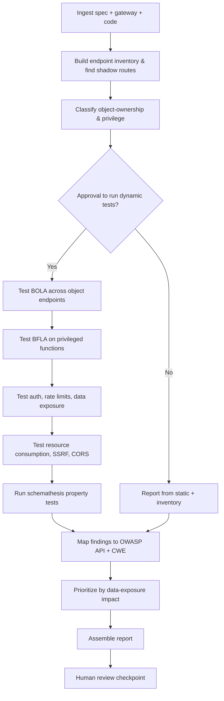
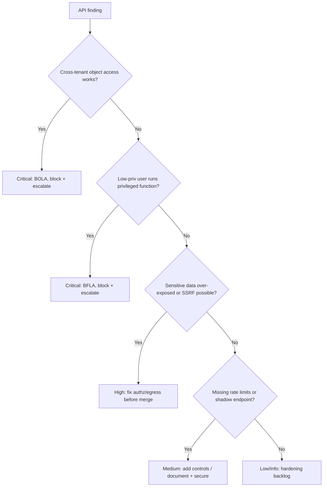

# API Security Audit

> A defensive runbook for auditing REST/GraphQL APIs against the OWASP API Security Top 10 (2023) — object- and function-level authorization, authentication, resource consumption, and business-logic abuse — tested only in staging.

## Objective

Deliver an evidence-backed security audit of an API surface against the OWASP API Security Top 10 (2023). "Done" means the API's endpoints and their authorization model are mapped, each Top 10 category is tested (BOLA, broken authentication, BOPLA, unrestricted resource consumption, BFLA, sensitive business-flow abuse, SSRF, misconfiguration, inventory management, unsafe consumption), and every finding is mapped to an OWASP API risk ID, a CWE, and a CVSS-style severity with concrete remediation.

## Business Context

APIs are the primary attack surface of modern applications — the machinery behind mobile apps, SPAs, partner integrations, and microservices. The OWASP API Security Top 10 exists because API-specific flaws (especially Broken Object Level Authorization, BOLA) differ from classic web flaws and are now the most common cause of large-scale data breaches: enumerable IDs, missing per-object checks, and unversioned shadow endpoints have leaked millions of records. Authorization bugs are logic bugs — scanners miss them, so they persist. A rigorous, repeatable API audit protects customer data, partner trust, and revenue, and satisfies SOC 2, PCI-DSS, and GDPR obligations. Automating it gives every release the depth of testing a manual pentest can't sustain.

## Problem Statement

APIs accumulate authorization and design flaws that are invisible to signature-based scanners: **BOLA/IDOR** (user A reads user B's object by changing an ID), **broken authentication** (weak tokens, no rate limiting on login), **BOPLA** (mass assignment / excessive data exposure in responses), **unrestricted resource consumption** (no pagination/rate limits enabling DoS and cost blowups), **BFLA** (a normal user calling admin-only functions), **sensitive business-flow abuse** (automation of purchase/refund flows), **SSRF** (server fetches attacker-controlled URLs), **security misconfiguration** (verbose errors, permissive CORS), **improper inventory management** (undocumented v1/debug endpoints), and **unsafe consumption of third-party APIs**. This runbook tests all ten. **Out of scope:** attacking production, exfiltrating real customer data, and destructive/DoS testing — everything runs in staging with test accounts.

## Success Criteria

- [ ] Full endpoint inventory built (from spec + gateway + code) including shadow/legacy routes.
- [ ] BOLA tested on every object-referencing endpoint using two test users.
- [ ] BFLA tested: privileged functions rejected for low-privilege tokens.
- [ ] Authentication & rate-limiting on sensitive endpoints verified.
- [ ] Response payloads checked for excessive data exposure / mass assignment.
- [ ] Resource-consumption controls (pagination, size/rate limits) verified.
- [ ] SSRF, CORS, error verbosity, and TLS configuration reviewed.
- [ ] Every finding mapped to OWASP API risk ID + CWE + severity with remediation.

## Trigger Conditions

- PR adding/modifying API endpoints, authz middleware, or the OpenAPI/GraphQL schema.
- New public or partner API launch.
- Scheduled: quarterly full audit of production APIs (executed against staging).
- Alert: WAF/gateway anomaly, scraping, or a spike in `403`/enumeration patterns.
- Manual: pre-audit or post-incident review.

## Inputs Required

| Input | Description | Example | Required |
|-------|-------------|---------|----------|
| `api_spec` | OpenAPI/GraphQL schema | `openapi.yaml` | Yes |
| `base_url` | Staging API base URL | `https://staging.api.acme.com` | Yes |
| `repo_url` | API source repository | `git@github.com:acme/api.git` | Yes |
| `test_users` | Two accounts w/ different tenants/roles | `userA, userB, adminC` | Yes |
| `auth_method` | How to authenticate | `Bearer JWT` | Yes |
| `gateway_config` | API gateway/WAF config | `Kong / APIGW` | No |

## Required Access

| Scope | Purpose | Read/Write | Sensitivity |
|-------|---------|-----------|-------------|
| API repository | Review authz logic & handlers | Read | Low |
| API gateway config | Inventory routes, rate limits, CORS | Read | Medium |
| Staging environment | Execute dynamic authz tests | Test | Medium |
| CI pipeline artifacts | Retrieve contract/integration tests | Read | Low |

## Assumptions

- A staging environment mirrors production routes and authorization logic.
- At least two test users in different tenants/roles are available.
- The OpenAPI/GraphQL spec is reasonably current (gaps are themselves a finding).
- `curl`/`httpie`, `jq`, and a schema-driven fuzzer/`schemathesis` are available.

## Risks

| Risk | Likelihood | Impact | Mitigation |
|------|-----------|--------|------------|
| Test hits production data | Low | Critical | Restrict to staging base URL + test tenants |
| DoS from resource-consumption tests | Medium | High | Cap request rate; coordinate load windows |
| Real PII returned during BOLA test | Medium | High | Use synthetic test data; redact; staging only |
| Missing authz mistaken for intended public | Medium | Medium | Confirm against spec + owner before rating |
| Mutating tests create/delete real records | Medium | Medium | Prefer read tests; clean up created test data |

## Constraints

- No testing against production; staging + synthetic data only.
- No destructive/DoS testing beyond controlled, rate-limited probes.
- No exfiltration or retention of real customer PII.
- `human_in_the_loop: required` — approve the dynamic test plan before execution.
- Respect gateway rate limits and change-freeze windows.

## Agent Persona

Adopt the persona of a **Principal API Security Engineer**. Think like an attacker but act defensively: the highest-value tests are authorization tests (BOLA/BFLA), which require reasoning about *who should access what*, not just *what the code does*. Every finding cites the endpoint, the test-user context, the request/response evidence (redacted), and the OWASP API risk ID. Bias control: a `200` for user A reading user B's object is only BOLA if A genuinely lacks entitlement — verify the intended access model first. Follow [`docs/AI_AGENT_STANDARDS.md`](../../docs/AI_AGENT_STANDARDS.md).

## Planning Instructions

1. Build the endpoint inventory from three sources — spec, gateway routes, and code handlers — and diff them to find shadow endpoints.
2. Classify each endpoint by object-ownership and required privilege to design BOLA/BFLA tests.
3. Externalize a dynamic test plan (which endpoints, which user pairs, which payloads).
4. Because `human_in_the_loop` is `required`, obtain approval before running dynamic tests.
5. Define the OWASP-API-mapped severity model and the data-cleanup procedure for any mutating test.

## Execution Instructions

Inventory and static review first; dynamic tests in staging after approval.

```bash
# 1. Build endpoint inventory from the spec and diff against live routes
jq -r '.paths | keys[]' openapi.yaml | sort > spec_routes.txt
curl -s https://staging.api.acme.com/openapi.json | jq -r '.paths|keys[]' | sort > live_routes.txt
comm -13 spec_routes.txt live_routes.txt   # live routes NOT in spec = shadow endpoints
```

```bash
# 2. BOLA (API1): user A tries to read user B's object (expect 403/404, NOT 200 w/ data)
curl -s -o /dev/null -w 'A->B object: %{http_code}\n' \
  -H "Authorization: Bearer $TOKEN_A" https://staging.api.acme.com/orders/$ORDER_OF_B

# 3. BFLA (API5): low-priv user calls an admin function (expect 403)
curl -s -o /dev/null -w 'user->admin fn: %{http_code}\n' \
  -H "Authorization: Bearer $TOKEN_A" -X DELETE https://staging.api.acme.com/admin/users/123

# 4. Broken auth + rate limiting (API2): hammer login, expect throttling/lockout
for i in $(seq 1 30); do curl -s -o /dev/null -w '%{http_code} ' \
  -X POST https://staging.api.acme.com/login -d '{"u":"userA","p":"wrong"}'; done; echo
```

```bash
# 5. Excessive data exposure / mass assignment (API3): inspect payloads + inject extra fields
curl -s -H "Authorization: Bearer $TOKEN_A" https://staging.api.acme.com/me | jq 'keys'   # PII bloat?
curl -s -X PATCH -H "Authorization: Bearer $TOKEN_A" \
  -d '{"role":"admin","is_verified":true}' https://staging.api.acme.com/me   # should ignore role

# 6. Unrestricted resource consumption (API4): oversized page / payload
curl -s -o /dev/null -w 'limit=1000000 -> %{http_code}\n' \
  -H "Authorization: Bearer $TOKEN_A" 'https://staging.api.acme.com/orders?limit=1000000'

# 7. SSRF (API7) + misconfig: attacker-controlled URL & CORS/error checks
curl -s -X POST -H "Authorization: Bearer $TOKEN_A" \
  -d '{"webhook":"http://169.254.169.254/latest/meta-data/"}' https://staging.api.acme.com/webhooks
curl -s -I -H 'Origin: https://evil.example.com' https://staging.api.acme.com/me | grep -i access-control
```

```bash
# 8. Automated schema-driven property testing against staging
schemathesis run https://staging.api.acme.com/openapi.json \
  --checks all --hypothesis-max-examples 50 --header "Authorization: Bearer $TOKEN_A"
```

## Investigation Workflow



## Analysis Framework

Anchor on the OWASP API Security Top 10 (2023). Prioritize authorization above all: **BOLA (API1)** and **BFLA (API5)** are the highest-impact because they directly expose or mutate other tenants' data and are undetectable by scanners. Rank by **data-exposure and privilege-escalation impact × exploitability**: an unauthenticated BOLA on PII is Critical; a BFLA behind auth but reachable by any user is High. Correlate static and dynamic evidence — a missing ownership check in code is confirmed by a `200` returning another user's object. Treat shadow/undocumented endpoints (API9) as force multipliers: they often lack the authz applied to documented routes. Verify the intended access model before rating, to avoid flagging deliberately public endpoints.

| Finding | Severity | CWE | OWASP API (2023) |
|---------|----------|-----|------------------|
| BOLA / IDOR (cross-object access) | Critical | CWE-639 | API1 |
| Broken authentication / no login rate limit | High | CWE-307 | API2 |
| Excessive data exposure / mass assignment | High | CWE-213/CWE-915 | API3 |
| Unrestricted resource consumption | High | CWE-770 | API4 |
| BFLA (function-level authz bypass) | Critical | CWE-285 | API5 |
| Sensitive business-flow abuse | Medium | CWE-840 | API6 |
| SSRF | High | CWE-918 | API7 |
| Security misconfiguration / permissive CORS | Medium | CWE-16/CWE-942 | API8 |
| Improper inventory (shadow endpoints) | Medium | CWE-1059 | API9 |
| Unsafe consumption of third-party APIs | Medium | CWE-20 | API10 |

## Decision Tree



## Validation Steps

- [ ] Re-test BOLA endpoints after fix; user A gets 403/404 for user B's objects.
- [ ] Re-test BFLA; privileged functions reject low-privilege tokens.
- [ ] Confirm login/sensitive endpoints throttle after N failures.
- [ ] Confirm responses expose only necessary fields; extra fields on write are ignored.
- [ ] Confirm pagination and max page-size limits are enforced.
- [ ] Confirm SSRF egress is blocked (allow-list) and CORS is not `*` with credentials.
- [ ] Confirm shadow endpoints are removed or brought under the same authz.

## Expected Outputs

- A reconciled endpoint inventory with shadow-endpoint diff.
- Per-category test result matrix mapped to OWASP API Top 10.
- Redacted request/response evidence for each finding.
- Schemathesis property-test output.
- A prioritized findings list with remediations.

## Deliverables

A completed report using [`templates/report-template.md`](../../templates/report-template.md): executive summary, findings mapped to OWASP API/CWE/severity, redacted evidence, and a remediation plan (add per-object checks, enforce RBAC on functions, add rate limits, restrict egress). Never retain real PII.

## Escalation Process

- **Critical (BOLA/BFLA exposing or mutating other tenants' data):** notify security on-call immediately; recommend gating the endpoint at the gateway until patched.
- **High (excessive exposure, SSRF, missing auth rate limits):** block release, open `security/high` ticket, notify the API owner.
- **Medium/Low:** aggregate into the report and backlog.
- Include endpoint, test-user context, redacted evidence, and OWASP API risk ID.

## Rollback Strategy

The audit is read-biased and staging-only. If mutating tests created or modified test records, delete/restore them using the documented cleanup script and verify counts return to baseline. If a remediation (e.g., new authz middleware) was merged to a branch and blocks legitimate traffic, `git revert <sha>` and redeploy; confirm with the contract test suite passing on staging. No production data was touched, so no production rollback is needed.

## Post-Execution Review

- Can per-object authorization be centralized (policy engine / middleware) to eliminate BOLA class-wide?
- Should the API gateway enforce global rate limits and a strict CORS allow-list?
- Is the OpenAPI spec kept in sync in CI to prevent shadow endpoints?
- Which tests should become contract/CI checks to prevent regression?

## Metrics

| Metric | Definition | Target |
|--------|-----------|--------|
| BOLA coverage | % object endpoints tested | 100% |
| Authz escapes | BOLA/BFLA reaching prod | 0 |
| Spec drift | Live routes not in spec | 0 |
| Rate-limit coverage | % sensitive endpoints throttled | 100% |
| Audit lead time | Trigger to report | < 3 days |
| Mean remediation time | Critical finding to fix | < 5 days |

## Example Execution

**Input:** `api_spec=openapi.yaml`, `base_url=https://staging.api.acme.com`, `test_users=userA (tenant-1), userB (tenant-2), adminC`, `auth_method=Bearer JWT`.

**Agent reasoning (abridged):** Inventory diff found `/v1/orders/{id}` present live but absent from the spec (shadow, API9). BOLA test: userA (tenant-1) requested `/orders/{orderId-of-userB}` and received `200` with userB's full order incl. address → cross-tenant data exposure → Critical (CWE-639, API1). BFLA test: userA called `DELETE /admin/users/123` and got `204` → Critical (CWE-285, API5). Login endpoint accepted 30 rapid failed attempts with no throttling → High (CWE-307, API2).

**Sample report excerpt:**

```text
F1 — BOLA on /orders/{id} (Critical, CWE-639, OWASP API1)
Evidence: TOKEN_A (tenant-1) GET /orders/<B's id> -> 200 with tenant-2 PII.
Remediation: enforce owner/tenant check in handler; verify order.tenant_id == token.tenant_id.

F2 — BFLA on admin delete (Critical, CWE-285, OWASP API5)
Evidence: TOKEN_A (role=user) DELETE /admin/users/123 -> 204.
Remediation: require role=admin at the route; add gateway RBAC.

F3 — No login rate limiting (High, CWE-307, OWASP API2)
Evidence: 30/30 failed logins returned 401 with no lockout/backoff.
Remediation: add per-IP + per-account throttling and exponential backoff.
```

**Action plan:** Escalate F1/F2 now; gate endpoints at the gateway; add authz + rate-limit and CI contract tests.

## References

- [`docs/AI_AGENT_STANDARDS.md`](../../docs/AI_AGENT_STANDARDS.md)
- [`templates/report-template.md`](../../templates/report-template.md)
- [`oauth-security-assessment.md`](./oauth-security-assessment.md)
- [`jwt-security-review.md`](./jwt-security-review.md)
- OWASP API Security Top 10 (2023)
- OWASP Top 10 (A01: Broken Access Control)
- CWE-639, CWE-285, CWE-918; Schemathesis documentation
