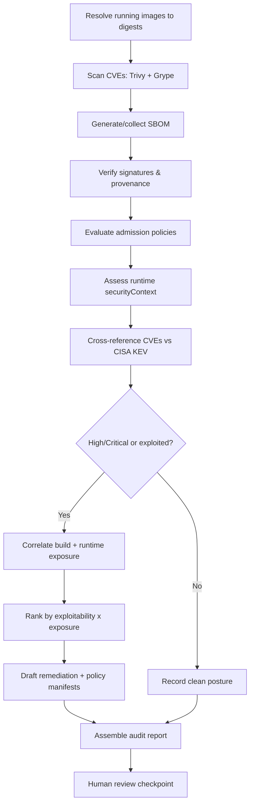
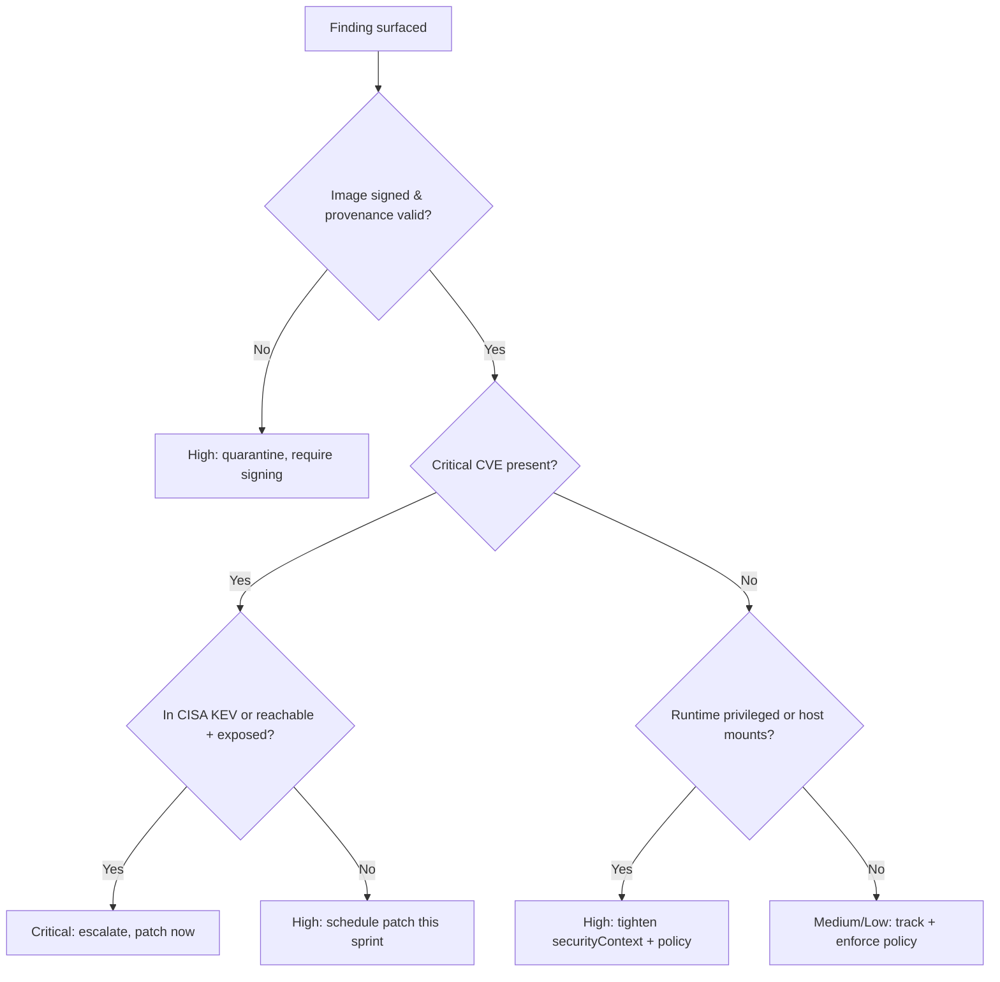

# Container Security Audit

> A defensive runbook for end-to-end container security auditing across the software supply chain: image vulnerability scanning, SBOM and provenance verification, admission control policy, and runtime posture.

## Objective

Produce a comprehensive, evidence-backed audit of the container lifecycle for a set of images and their runtime, covering build-time vulnerabilities, supply-chain integrity (SBOM, signatures, provenance), admission-control enforcement, and runtime security posture. "Done" means every in-scope image has an SBOM and vulnerability scan, signatures/provenance are verified, admission policies are evaluated against the deployed workloads, runtime configuration (capabilities, privilege, host mounts) is assessed, and all High/Critical findings are mapped to CWE/CVSS and a remediation owner.

## Business Context

The container supply chain — from base image to registry to running pod — is a high-value target: compromised dependencies (Log4Shell, xz-utils backdoor), typosquatted images, and unsigned artifacts have all led to real breaches. A single unscanned image with a Critical RCE, deployed via a permissive admission policy and running privileged with the host filesystem mounted, is a full cluster compromise waiting to happen. Auditing the whole chain — not just one stage — is what separates checkbox compliance from actual resilience. This satisfies SLSA, PCI-DSS, and SOC 2 supply-chain controls and materially reduces breach likelihood and dwell time. Automating it lets an agent continuously verify what would otherwise be a fragile, manual, periodic review.

## Problem Statement

Container risk spans four stages that are usually audited in isolation: (1) **build** — vulnerable OS/app dependencies; (2) **supply chain** — missing SBOMs, unsigned images, no provenance/attestation, mutable tags; (3) **admission** — clusters that accept any image, run as root, or allow privileged pods; (4) **runtime** — containers with excess capabilities, host network/PID, hostPath mounts, or the Docker socket exposed. This runbook audits all four and correlates them. **Out of scope:** Dockerfile authoring (see `docker-hardening.md`), applying cluster policy changes, and evicting running workloads — the agent recommends, humans enforce.

## Success Criteria

- [ ] Every in-scope image scanned (Trivy + Grype) and an SBOM (Syft, SPDX/CycloneDX) produced.
- [ ] Image signatures and provenance verified (cosign / SLSA attestation) where available.
- [ ] Admission control policy (e.g., Pod Security Admission, Kyverno, OPA/Gatekeeper) evaluated against deployed workloads.
- [ ] Runtime posture assessed: no privileged pods, no host namespaces/mounts, dropped capabilities, read-only root FS.
- [ ] Every High/Critical finding mapped to CWE/CVSS and an OWASP/CIS/SLSA control with an owner.
- [ ] Mutable-tag and `latest` usage in running workloads identified.
- [ ] A prioritized remediation plan produced with policy manifests and image bump recommendations.

## Trigger Conditions

- Scheduled: weekly full audit of production namespaces and their images.
- Alert: new Critical CVE disclosed affecting a base image in use (e.g., via KEV catalog).
- CI event: image promoted to the production registry.
- Manual: pre-audit hardening or post-incident supply-chain review.
- Admission controller rejects a deployment (investigate policy gap or genuine violation).

## Inputs Required

| Input | Description | Example | Required |
|-------|-------------|---------|----------|
| `registry` | Registry/namespace to audit | `ghcr.io/acme` | Yes |
| `image_list` | Images/tags or digests in scope | `payments@sha256:...` | Yes |
| `cluster_context` | Read-only kube context | `prod-eks` | Yes |
| `namespaces` | Namespaces in scope | `payments,checkout` | Yes |
| `policy_engine` | Admission engine in use | `kyverno` | No |
| `kev_feed` | Known-Exploited-Vulns source | `CISA KEV` | No |

## Required Access

| Scope | Purpose | Read/Write | Sensitivity |
|-------|---------|-----------|-------------|
| Container registry | Pull images & attestations to scan | Read | Medium |
| Kubernetes API | List pods/deployments & securityContext | Read | High |
| Admission policy config | Evaluate enforced policies | Read | Medium |
| CI pipeline artifacts | Retrieve SBOMs & provenance | Read | Medium |
| KEV / CVE feeds | Prioritize exploited vulns | Read | Low |

## Assumptions

- `trivy`, `grype`, `syft`, `cosign`, and `kubectl` (read-only) are available.
- The registry allows pulling images and their attestations for scanning.
- The cluster context is strictly read-only; no `apply`/`delete` is possible.
- SBOMs and provenance may be attached as OCI artifacts if the pipeline produces them.

## Risks

| Risk | Likelihood | Impact | Mitigation |
|------|-----------|--------|------------|
| Pulling a malicious image during scan | Low | High | Scan by digest in isolated env; never run the image |
| CVE noise overwhelms triage | High | Medium | Prioritize by KEV + reachability + exposure |
| Missing SBOM masks vulnerable transitive dep | Medium | High | Generate SBOM from image if pipeline lacks one |
| Read of cluster secrets during inspection | Low | High | Restrict RBAC to pod specs, not secret contents |
| Policy eval false-positive blocks nothing real | Medium | Medium | Test policy against actual manifests, not samples |

## Constraints

- No mutating cluster operations (`apply`, `patch`, `delete`, `cordon`, `evict`).
- No pushing images or attestations to registries.
- Never execute audited images or mount the Docker/containerd socket.
- Secrets and token values must never be logged; inspect metadata only.
- Respect change freezes; remediation manifests are proposed, not applied.

## Agent Persona

Adopt the persona of a **Principal Supply-Chain & Cloud-Native Security Engineer**. Reason across the whole chain, not one tool's output. Prioritize ruthlessly: a Critical CVE that is in the CISA KEV catalog, reachable, and running on an internet-exposed privileged pod outranks 200 unreachable Medium CVEs. Every finding cites a digest, a manifest path, and a control ID. Bias control: confirm a CVE is actually present in the shipped SBOM and reachable before elevating. Follow [`docs/AI_AGENT_STANDARDS.md`](../../docs/AI_AGENT_STANDARDS.md).

## Planning Instructions

1. Resolve all running images to immutable digests via the cluster (tags lie).
2. Externalize a plan covering the four stages: build scan, supply-chain verification, admission evaluation, runtime posture.
3. Because `human_in_the_loop` is `recommended`, present proposed policy manifests before any is committed to a branch.
4. Load the KEV feed to bias prioritization toward actively exploited CVEs.
5. Define the correlation model: how a build CVE + runtime exposure combine into an overall risk rating.

## Execution Instructions

Read-only throughout; scan by digest.

```bash
# 1. Resolve running images to digests (source of truth)
kubectl get pods -A -o jsonpath='{range .items[*]}{.spec.containers[*].image}{"\n"}{end}' | sort -u

# 2. Vulnerability scan (two scanners) + SBOM
trivy image --severity HIGH,CRITICAL ghcr.io/acme/payments@sha256:<digest>
grype ghcr.io/acme/payments@sha256:<digest> --fail-on critical
syft ghcr.io/acme/payments@sha256:<digest> -o cyclonedx-json > payments.cdx.json

# 3. Supply-chain: verify signature & provenance/attestation
cosign verify --certificate-identity-regexp '.*' --certificate-oidc-issuer-regexp '.*' \
  ghcr.io/acme/payments@sha256:<digest>
cosign verify-attestation --type slsaprovenance ghcr.io/acme/payments@sha256:<digest>
```

```bash
# 4. Admission control posture (read the enforced policies)
kubectl get clusterpolicies.kyverno.io -o yaml          # Kyverno
kubectl get constraints -A                               # OPA/Gatekeeper
kubectl get ns -o jsonpath='{range .items[*]}{.metadata.name}{": "}{.metadata.labels.pod-security\.kubernetes\.io/enforce}{"\n"}{end}'  # PSA labels

# 5. Runtime posture: find dangerous securityContext settings
kubectl get pods -A -o json | jq -r '.items[]
  | select(.spec.containers[].securityContext.privileged==true
      or .spec.hostNetwork==true or .spec.hostPID==true
      or (.spec.volumes[]?.hostPath))
  | "\(.metadata.namespace)/\(.metadata.name) RISKY"'
```

```bash
# 6. Cross-reference CVEs against CISA KEV for exploited-in-wild prioritization
trivy image --format json ghcr.io/acme/payments@sha256:<digest> \
  | jq -r '.Results[].Vulnerabilities[]?.VulnerabilityID' | sort -u > cves.txt
comm -12 cves.txt kev_cve_list.txt   # intersection = actively exploited, fix first
```

## Investigation Workflow



## Analysis Framework

Fuse four evidence streams — vulnerability, supply-chain integrity, admission, runtime — into a single risk rating per workload. The core formula is **risk = exploitability × exposure × privilege**. A CVE in the KEV catalog (exploitability high) on an internet-facing pod (exposure high) running privileged with hostPath (privilege high) is the top of the queue. Unsigned or unattested images are treated as supply-chain integrity failures regardless of CVE count, because provenance is the precondition for trusting the scan at all. Reconcile Trivy vs Grype discrepancies by checking fix availability and whether the package is actually loaded. Missing admission enforcement is a systemic finding: it means today's clean image doesn't prevent tomorrow's bad one.

| Finding | Severity | CWE | Control (OWASP/CIS/SLSA) |
|---------|----------|-----|--------------------------|
| KEV-listed Critical CVE in running image | Critical | varies | OWASP A06 |
| Unsigned image / no provenance | High | CWE-494 | SLSA L2+ / A08 |
| Privileged container | Critical | CWE-250 | CIS K8s 5.2.1 |
| hostPath / hostNetwork / hostPID | High | CWE-668 | CIS K8s 5.2.4-5.2.9 |
| No admission control enforcement | High | CWE-284 | CIS K8s 5.2 |
| Mutable `latest` tag in production | Medium | CWE-1104 | SLSA / A08 |
| Capabilities not dropped | Medium | CWE-250 | CIS K8s 5.2.8 |
| Secrets mounted as env from plaintext | Medium | CWE-522 | A02 |

## Decision Tree



## Validation Steps

- [ ] Re-scan patched image digests; confirm Critical/KEV CVEs resolved.
- [ ] Confirm all production images are signed and provenance verifies with cosign.
- [ ] Confirm proposed admission policies would reject the offending manifests (dry-run/test).
- [ ] Confirm no running pod is privileged or uses host namespaces after remediation.
- [ ] Confirm workloads reference immutable digests, not mutable tags.
- [ ] Confirm SBOMs exist and are attached for every production image.

## Expected Outputs

- Per-image vulnerability reports (Trivy + Grype) and SBOMs (CycloneDX/SPDX).
- Signature/provenance verification results.
- An admission-policy gap analysis and proposed Kyverno/Gatekeeper/PSA manifests.
- A runtime posture matrix (privileged, caps, host mounts) per workload.
- A KEV-prioritized remediation queue.

## Deliverables

A completed audit report using [`templates/report-template.md`](../../templates/report-template.md): executive summary, four-stage findings mapped to CWE/CVSS/control, evidence (digests, manifest paths), proposed policy manifests, and a prioritized action plan. Redact secret values and tokens.

## Escalation Process

- **Critical (KEV CVE on privileged internet-facing pod, unsigned image in prod):** notify security on-call immediately, recommend restricting the workload and rolling to a patched digest.
- **High:** open `security/high` ticket, notify service and platform owners, propose admission policy to prevent recurrence.
- **Medium/Low:** aggregate into report; backlog with manifests.
- Provide digest, manifest path, CVE IDs (flag KEV), and exposure context.

## Rollback Strategy

The audit is read-only, so no live rollback is normally required. If proposed policy manifests were later applied by a human and unexpectedly blocked legitimate workloads, revert by removing the policy (`kubectl delete -f policy.yaml`) or setting it to `Audit`/`validationFailureAction: Audit` mode, then re-test. If an image was rolled forward to a patched digest and regressed, redeploy the prior known-good digest. Confirm rollback by verifying workloads are Running and health checks pass.

## Post-Execution Review

- Can admission control be moved from Audit to Enforce to prevent this class of finding?
- Should image signing/provenance be a hard CI gate before registry promotion?
- Which CVEs were unreachable and can be suppressed with documented VEX statements?
- Did runtime findings indicate a Helm chart/base template that needs central hardening?

## Metrics

| Metric | Definition | Target |
|--------|-----------|--------|
| Signed image coverage | % prod images with valid signature | 100% |
| KEV exposure | KEV CVEs in running images | 0 |
| Privileged pods | Count in production | 0 |
| SBOM coverage | % images with attached SBOM | 100% |
| Admission enforcement | % namespaces in Enforce mode | 100% |
| MTTR (Critical CVE) | Disclosure to patched deploy | < 72h |

## Example Execution

**Input:** `registry=ghcr.io/acme`, `namespaces=payments,checkout`, `cluster_context=prod-eks`, `policy_engine=kyverno`.

**Agent reasoning (abridged):** Resolved 14 running images to digests. Trivy+Grype flagged `payments@sha256:ab..` with CVE-2024-21626 (Critical, RCE) — present in the SBOM and listed in CISA KEV. `cosign verify` failed: the image was unsigned. Runtime check found the pod `privileged: true` with `hostPath: /var/run/docker.sock`. That combination (KEV CVE + unsigned + privileged + docker socket) is a full-node compromise path → Critical. Kyverno had no policy blocking privileged pods.

**Sample report excerpt:**

```text
F1 — KEV RCE on unsigned privileged pod (Critical, CWE-250/CWE-494)
Evidence: payments@sha256:ab..  CVE-2024-21626 [KEV]; cosign verify FAILED;
          pod payments-7d privileged=true, mounts /var/run/docker.sock.
Remediation: roll to payments@sha256:cd.. (patched, signed);
             drop privileged; remove docker.sock mount;
             add Kyverno disallow-privileged policy (enforce).

F2 — No admission enforcement (High, CWE-284, CIS K8s 5.2)
Evidence: namespaces payments,checkout have no PSA enforce label; no Kyverno policy.
Remediation: apply provided restricted PSA + Kyverno baseline manifests.
```

**Action plan:** Escalate F1 now; apply patched digest; roll out admission policies in Audit then Enforce.

## References

- [`docs/AI_AGENT_STANDARDS.md`](../../docs/AI_AGENT_STANDARDS.md)
- [`templates/report-template.md`](../../templates/report-template.md)
- [`docker-hardening.md`](./docker-hardening.md)
- [`terraform-security-review.md`](./terraform-security-review.md)
- OWASP Top 10 (A06: Vulnerable Components; A08: Integrity Failures)
- CIS Kubernetes Benchmark; NIST SP 800-190
- SLSA framework; CISA Known Exploited Vulnerabilities (KEV) catalog
- Trivy, Grype, Syft, Cosign, Kyverno, OPA/Gatekeeper documentation
