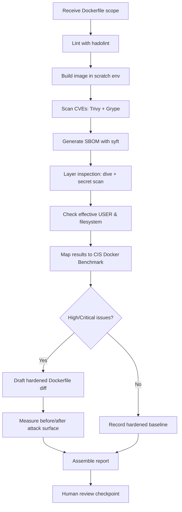
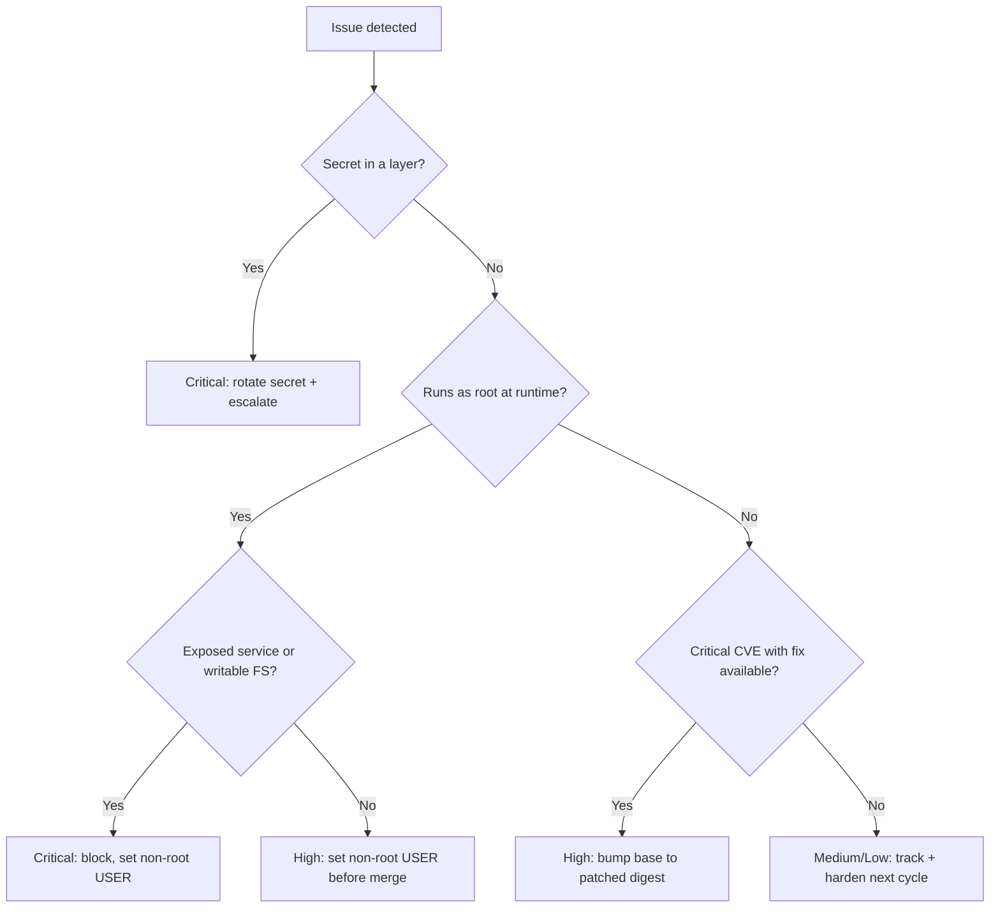

# Docker Hardening

> A defensive runbook for reviewing and hardening Dockerfiles and image build pipelines against the CIS Docker Benchmark and container best practices — non-root execution, minimal base images, no embedded secrets, and reproducible builds.

## Objective

Deliver a hardened, evidence-backed assessment of one or more Dockerfiles and their build configuration. "Done" means each Dockerfile has been evaluated against the CIS Docker Benchmark and image best practices, all High/Critical issues (root user, embedded secrets, bloated attack surface, unpinned bases) are mapped to a control and severity, and a hardened Dockerfile diff plus a measured attack-surface reduction (image size, package count, CVE count) is produced for human review.

## Business Context

Containers are the default unit of deployment, and the Dockerfile is where most container risk is born. A single `FROM ubuntu:latest` running as root with build secrets baked into a layer becomes an easy pivot point for lateral movement and data theft, replicated across every service that inherits the pattern. Hardened images reduce breach blast radius, shrink CVE remediation toil (fewer packages = fewer CVEs), speed up deploys (smaller images), and are frequently mandated by SOC 2, PCI-DSS, and FedRAMP container controls. Automating this review lets an agent enforce a consistent hardening baseline across hundreds of Dockerfiles without slowing developers.

## Problem Statement

Dockerfiles routinely ship with insecure patterns: running as `root` (UID 0), fat base images (full OS distributions) with hundreds of unnecessary packages, secrets and credentials embedded via `COPY` or `ARG`/`ENV`, `latest` tags that break reproducibility and supply-chain integrity, missing `HEALTHCHECK`, writable root filesystems, unnecessary capabilities and setuid binaries, and use of `ADD` with remote URLs. This runbook detects these and produces hardened alternatives (multi-stage builds, distroless/minimal bases, non-root users, pinned digests). **Out of scope:** modifying the running Docker daemon configuration on production hosts, pushing images to registries, and altering orchestrator runtime policy (covered by `container-security-audit.md`).

## Success Criteria

- [ ] Every in-scope Dockerfile linted (hadolint) and scanned (Trivy/Grype) for base-image CVEs.
- [ ] CIS Docker Benchmark image-relevant checks evaluated with pass/fail evidence.
- [ ] Confirmed no image runs as root; a dedicated non-root `USER` is set.
- [ ] Confirmed no secrets in any layer (validated via history/layer inspection + secret scan).
- [ ] Base images pinned by digest (not `latest`); multi-stage build separates build/runtime.
- [ ] Attack-surface reduction quantified (before/after image size, package count, CVE count).
- [ ] Hardened Dockerfile diff produced with a rationale per change.

## Trigger Conditions

- Pull request adding or modifying a `Dockerfile`, `.dockerignore`, or build args.
- Scheduled: monthly rescan of all published base/service images for new CVEs.
- Alert: registry/CSPM flags a deployed image running as root or with Critical CVEs.
- Manual: hardening sprint ahead of a compliance audit.
- New service onboarding into the shared image platform.

## Inputs Required

| Input | Description | Example | Required |
|-------|-------------|---------|----------|
| `repo_url` | Repository containing the Dockerfile(s) | `git@github.com:acme/payments.git` | Yes |
| `dockerfile_paths` | Dockerfiles in scope | `services/*/Dockerfile` | Yes |
| `target_ref` | Branch/PR ref | `pr/91` | Yes |
| `registry` | Registry for base/published images | `ghcr.io/acme` | Yes |
| `runtime_context` | How the image runs (user, caps) | `k8s, non-root enforced` | No |
| `baseline_image` | Prior image for delta comparison | `ghcr.io/acme/payments:1.4` | No |

## Required Access

| Scope | Purpose | Read/Write | Sensitivity |
|-------|---------|-----------|-------------|
| Git repository | Read Dockerfiles and context | Read | Low |
| Container registry | Pull base/published images to scan | Read | Medium |
| CI pipeline artifacts | Retrieve build logs & SBOMs | Read | Medium |
| Local Docker/BuildKit | Build image locally for inspection | Read/Local | Medium |

## Assumptions

- `hadolint`, `trivy`/`grype`, `docker`/`buildkit`, `dive`, and `syft` (SBOM) are available.
- Images can be built locally in an isolated scratch environment (no production push).
- The agent does not modify the production Docker daemon or host configuration.
- Build context is available so layer/secret inspection is meaningful.

## Risks

| Risk | Likelihood | Impact | Mitigation |
|------|-----------|--------|------------|
| Local build pulls a malicious base image | Low | High | Pin by digest; scan before running; no `--privileged` |
| Distroless breaks runtime (no shell/tools) | Medium | Medium | Validate app boots; keep a debug variant with shell |
| Non-root breaks file permissions | Medium | Medium | Test with target UID; fix ownership in build stage |
| Secret found in an old layer already pushed | Medium | High | Treat as compromised; rotate + escalate |
| False sense of security from single scanner | Medium | Medium | Run Trivy and Grype; reconcile results |

## Constraints

- No pushing images to production registries or deploying to clusters.
- No changes to the host Docker daemon (`/etc/docker/daemon.json`) on production nodes.
- Never run untrusted images with `--privileged` or with the Docker socket mounted.
- Secrets discovered in layers must never be echoed to logs or PR comments.
- Respect change freezes; hardening diffs are proposed, not auto-merged.

## Agent Persona

Adopt the persona of a **Principal Container Platform Security Engineer**. Tone is pragmatic and build-aware: recommend the smallest change that achieves the hardening goal without breaking the app (e.g., prefer a distroless runtime stage over rewriting the whole build). Every claim cites the Dockerfile line, the CIS control ID, and scanner output. Bias control: verify that a "root" finding actually runs as root at runtime (the orchestrator may override `USER`) before ranking it Critical. Follow [`docs/AI_AGENT_STANDARDS.md`](../../docs/AI_AGENT_STANDARDS.md).

## Planning Instructions

1. Inventory all in-scope Dockerfiles and identify base images and build stages.
2. Externalize a plan: lint, build, scan, layer-inspect, SBOM, and CIS mapping steps.
3. Since `human_in_the_loop` is `recommended`, present hardened diffs for review before any commit to a branch.
4. Decide the target hardened base per language runtime (e.g., `gcr.io/distroless/java`, `python:3.12-slim`, `chainguard/*`).
5. Establish before/after metrics to quantify the improvement.

## Execution Instructions

Observation first; build in an isolated scratch environment only.

```bash
# 1. Lint the Dockerfile against best practices
hadolint services/payments/Dockerfile

# 2. Build locally with BuildKit, no secrets leaked into layers
DOCKER_BUILDKIT=1 docker build -t payments:review services/payments

# 3. Scan the built image for CVEs with two independent scanners
trivy image --severity HIGH,CRITICAL --format table payments:review
grype payments:review --fail-on high

# 4. Generate an SBOM for supply-chain visibility
syft payments:review -o spdx-json > payments.sbom.json
```

```bash
# 5. Inspect layers for secrets and bloat
dive payments:review --ci
docker history --no-trunc payments:review
docker save payments:review -o img.tar && tar -xf img.tar -C ./layers   # then secret-scan layers
gitleaks detect --source ./layers --no-banner --report-path layer-secrets.json

# 6. Verify effective runtime user (must NOT be root/UID 0)
docker inspect payments:review --format '{{.Config.User}}'
docker run --rm payments:review id 2>/dev/null || echo "distroless: no shell (good)"
```

```dockerfile
# 7. Example hardened multi-stage Dockerfile (proposed diff)
FROM golang:1.22 AS build
WORKDIR /src
COPY . .
RUN CGO_ENABLED=0 go build -o /app ./cmd/payments

FROM gcr.io/distroless/static-debian12@sha256:<digest>
COPY --from=build /app /app
USER 65532:65532
EXPOSE 8080
HEALTHCHECK CMD ["/app", "healthcheck"]
ENTRYPOINT ["/app"]
```

## Investigation Workflow



## Analysis Framework

Correlate three signals: static Dockerfile analysis (hadolint/CIS), image composition (SBOM + layer history), and vulnerability posture (Trivy/Grype). Rank by exploitability and blast radius: a root user is only Critical when combined with a writable filesystem, unnecessary capabilities, or an externally exposed service. Prefer eliminating whole classes of risk over patching instances — switching to distroless removes the shell, package manager, and most CVEs at once. Reconcile the two scanners: a CVE flagged by one and not the other warrants a look at fix availability and reachability. Treat embedded secrets and `latest` base tags as systemic supply-chain risks.

| Finding | Severity | CWE | CIS Docker Benchmark |
|---------|----------|-----|----------------------|
| Container runs as root (UID 0) | High | CWE-250 | 4.1 |
| Secret embedded in image layer | Critical | CWE-798 | 4.10 |
| Base image `latest` / unpinned | Medium | CWE-1104 | 4.2 (trusted base) |
| Writable root filesystem | Medium | CWE-732 | 5.12 |
| Unnecessary setuid/setgid binaries | Medium | CWE-250 | 4.8 |
| No HEALTHCHECK defined | Low | CWE--/ops | 4.6 |
| `ADD` with remote URL | Medium | CWE-494 | 4.9 |
| Critical CVE in base packages | Critical | varies | 4.4 (scan images) |

## Decision Tree



## Validation Steps

- [ ] Re-scan the hardened image; confirm CVE count and Critical count decreased.
- [ ] Confirm `docker inspect` shows a non-root `User` (or distroless nonroot UID).
- [ ] Confirm the application still starts and passes its smoke/health test in the hardened image.
- [ ] Confirm no secrets in any layer after rebuild (`gitleaks` on extracted layers = 0).
- [ ] Confirm base image is pinned by digest and `.dockerignore` excludes sensitive files.
- [ ] Confirm image size and package count dropped vs baseline.

## Expected Outputs

- hadolint report, Trivy + Grype scan results, SBOM (SPDX/CycloneDX), and `dive` efficiency report.
- A hardened Dockerfile diff with per-line rationale.
- A before/after attack-surface table (size, packages, CVEs, effective UID).
- A CIS Docker Benchmark pass/fail matrix for image-scope controls.

## Deliverables

A completed report using [`templates/report-template.md`](../../templates/report-template.md) with findings mapped to CIS/CWE/severity, evidence excerpts, the hardened Dockerfile diff, and a prioritized action plan. Redact any discovered secret values; reference only their location and the rotation requirement.

## Escalation Process

- **Critical (secret in a pushed layer):** treat as a credential compromise — notify security on-call immediately, initiate rotation, and identify who/what consumed the image.
- **High (root + exposed service, Critical CVE):** block the PR, open a `security/high` ticket, notify the service owner.
- **Medium/Low:** aggregate into the report and backlog with proposed diffs.
- Include image digest, layer/line evidence, and the number of downstream images inheriting the base.

## Rollback Strategy

The review is non-mutating to production. If a hardened Dockerfile was committed to a review branch and the app fails to start, revert with `git revert <sha>` or restore the previous Dockerfile; the previously published image tag remains deployable, so no runtime rollback is required. If a locally built review image was loaded into a shared daemon, remove it with `docker rmi payments:review`. Confirm rollback by redeploying the prior known-good image tag and verifying health checks pass.

## Post-Execution Review

- Can a golden, pre-hardened base image per language eliminate recurring findings at the source?
- Should hadolint + Trivy gates be added to CI to block non-compliant images pre-merge?
- Did distroless cause debuggability issues that warrant a standard debug sidecar pattern?
- Which CVEs were unreachable and can be safely suppressed with documented rationale?

## Metrics

| Metric | Definition | Target |
|--------|-----------|--------|
| Non-root coverage | % images with non-root USER | 100% |
| Image size reduction | (old-new)/old average | > 60% |
| CVE reduction | Critical+High CVEs removed | > 80% |
| Secret escapes | Secrets found in published layers | 0 |
| Base pinning | % images pinned by digest | 100% |
| Review lead time | Dockerfile change to hardened diff | < 30m |

## Example Execution

**Input:** `repo_url=git@github.com:acme/payments.git`, `dockerfile_paths=services/payments/Dockerfile`, `target_ref=pr/91`.

**Agent reasoning (abridged):** hadolint flagged `DL3007` (`FROM ubuntu:latest`) and missing `USER`. Built the image (612 MB). Trivy reported 214 CVEs (7 Critical); Grype agreed on the 7 Criticals, all in OS packages. `docker inspect` showed `User` empty → runs as root. Proposed a multi-stage distroless build. Rebuilt: 28 MB, 3 CVEs (0 Critical), effective UID 65532. Elevated the root+exposed-service finding to Critical, the `latest` tag to Medium.

**Sample report excerpt:**

```text
F1 — Container runs as root on an exposed service (High→Critical, CWE-250, CIS 4.1)
Evidence: services/payments/Dockerfile — no USER directive; docker inspect User="".
Remediation: multi-stage distroless build, USER 65532:65532.
Attack surface: 612MB/214 CVEs (7 Crit)  ->  28MB/3 CVEs (0 Crit).

F2 — Unpinned base image (Medium, CWE-1104, CIS 4.2)
Evidence: services/payments/Dockerfile:1  FROM ubuntu:latest
Remediation: FROM gcr.io/distroless/static-debian12@sha256:<digest>
```

**Action plan:** Merge hardened diff after smoke test; add hadolint+Trivy CI gate; publish a shared distroless base.

## References

- [`docs/AI_AGENT_STANDARDS.md`](../../docs/AI_AGENT_STANDARDS.md)
- [`templates/report-template.md`](../../templates/report-template.md)
- [`container-security-audit.md`](./container-security-audit.md)
- [`terraform-security-review.md`](./terraform-security-review.md)
- CIS Docker Benchmark
- OWASP Top 10 (A05: Security Misconfiguration; A08: Software and Data Integrity Failures)
- Docker / BuildKit, hadolint, Trivy, Grype, Syft, Dive documentation
- NIST SP 800-190 (Application Container Security Guide)
