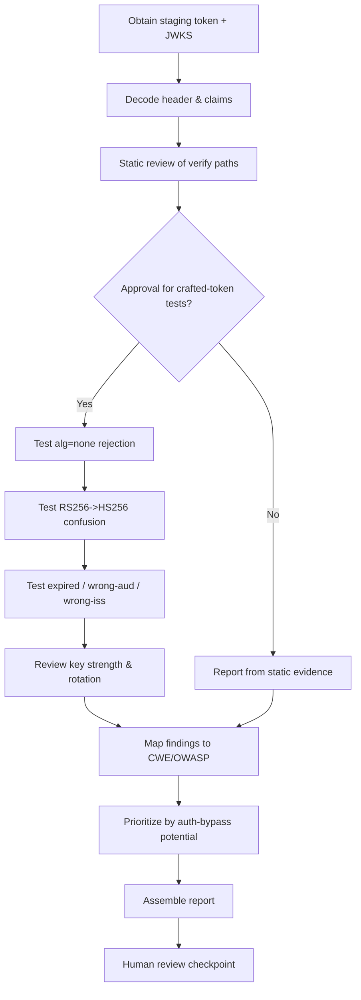
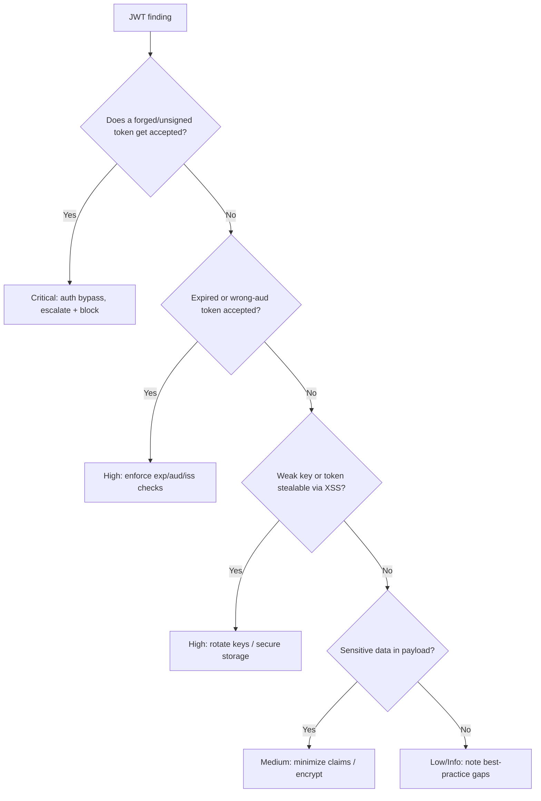

# JWT Security Review

> A defensive runbook for reviewing JSON Web Token (JWT) issuance and validation for algorithm confusion, signature verification gaps, weak keys, expiry/claim handling, and insecure storage — testing only against staging endpoints.

## Objective

Produce an evidence-backed assessment of how an application issues and validates JWTs. "Done" means the signing algorithms and key management are reviewed, signature verification is confirmed to be strict and algorithm-pinned, all critical claims (`exp`, `nbf`, `iat`, `aud`, `iss`, `sub`) are validated, `alg=none` and algorithm-confusion attacks are proven to fail, key rotation and revocation are assessed, and every finding is mapped to CWE/OWASP with a remediation.

## Business Context

JWTs are the bearer credential that authorizes most API and microservice calls. If a token can be forged or replayed, an attacker becomes any user or service — a full authentication bypass. The classic failures (accepting `alg=none`, RS256→HS256 confusion, skipping signature verification, never expiring tokens) have caused real-world account-takeover incidents and map to OWASP A02 (Cryptographic Failures) and A07 (Identification & Authentication Failures). Because JWTs cross service boundaries, one weak validator undermines the trust of the whole mesh. A rigorous, repeatable defensive review protects customer data, prevents privilege escalation, and supports SOC 2 / ISO 27001 controls. Automating it ensures every service validates tokens the same, correct way.

## Problem Statement

JWT implementations commonly fail in predictable ways: verifiers that trust the token's own `alg` header (enabling `alg=none` and RS256→HS256 confusion where the public key is used as an HMAC secret); libraries used in "decode" mode without signature verification; missing or unchecked `exp`/`nbf` leading to tokens that never expire; absent `aud`/`iss` checks allowing token reuse across services/tenants; weak HMAC secrets vulnerable to offline cracking; sensitive PII stored in the (base64, not encrypted) payload; and tokens stored in `localStorage` where XSS can steal them. This runbook detects and prioritizes these. **Out of scope:** forging tokens against production, cracking production secrets, and any test that mutates production state — dynamic tests run against staging only.

## Success Criteria

- [ ] Signing algorithm(s) identified; verifier confirmed to pin an allow-list (no `alg` trust).
- [ ] `alg=none` and RS256↔HS256 confusion proven to be rejected on staging.
- [ ] Signature verification confirmed on every protected route (no decode-only paths).
- [ ] `exp`, `nbf`, `iat` validated; token TTLs reasonable; clock-skew handling sane.
- [ ] `aud` and `iss` validated to prevent cross-service/tenant reuse.
- [ ] Key strength and rotation reviewed (HMAC >= 256-bit, RSA >= 2048, JWKS rotation).
- [ ] No sensitive PII/secrets in JWT payload; secure storage confirmed.
- [ ] All findings mapped to CWE/OWASP with severity and remediation.

## Trigger Conditions

- PR touching token issuance, validation middleware, or JWKS/key config.
- New service joining an internal auth mesh that consumes JWTs.
- Scheduled: quarterly review of authentication libraries and key rotation.
- Alert: spike in `401`/`403`, or SIEM detects malformed/expired tokens being accepted.
- Manual: pre-audit or post-incident authentication review.

## Inputs Required

| Input | Description | Example | Required |
|-------|-------------|---------|----------|
| `app_repo` | Repo with token issue/validate code | `git@github.com:acme/api.git` | Yes |
| `token_type` | JWS/JWE, and signing family | `JWS RS256` | Yes |
| `jwks_url` | Public key set endpoint | `https://idp/.well-known/jwks.json` | Yes |
| `staging_endpoint` | Protected route to test | `https://staging.api/acme/me` | Yes |
| `sample_token` | A non-production sample JWT | `eyJ...` (staging) | No |
| `library` | JWT library in use | `jsonwebtoken 9.x` | No |

## Required Access

| Scope | Purpose | Read/Write | Sensitivity |
|-------|---------|-----------|-------------|
| Application repository | Review issue/validate logic | Read | Low |
| IdP / JWKS config | Inspect keys, algs, rotation | Read | High |
| Staging protected endpoint | Prove attacks fail | Test | Medium |
| CI pipeline artifacts | Retrieve auth tests | Read | Low |

## Assumptions

- A staging endpoint and non-production tokens exist for dynamic testing.
- The JWKS endpoint is reachable and the signing algorithm family is known.
- `openssl`, a JWT CLI/decoder, and `curl` are available.
- The agent cannot modify production keys or issue production tokens.

## Risks

| Risk | Likelihood | Impact | Mitigation |
|------|-----------|--------|------------|
| Handling live tokens leaks credentials | Medium | High | Use staging tokens; redact; never log full tokens |
| Crafted token accepted in prod during test | Low | Critical | Test staging only; never target prod issuer |
| False positive on "no verification" | Medium | Medium | Confirm with both code path and live 401 result |
| Secret cracking flagged but infeasible | Low | Low | Report entropy, don't attempt prod cracking |
| Weak-key test mistaken for attack | Low | Medium | Coordinate with owners; staging keys only |

## Constraints

- No forging or replaying tokens against production.
- No brute-forcing production HMAC secrets or private keys.
- Full token values must never appear in logs, tickets, or PR comments.
- Dynamic negative tests run only against staging (`human_in_the_loop: recommended`).
- Respect rate limits on the auth and JWKS endpoints.

## Agent Persona

Adopt the persona of a **Principal Application Security Engineer** specializing in authentication cryptography. Ground reasoning in RFC 7519 (JWT), 7515 (JWS), 7517 (JWK), and 8725 (JWT BCP). Be precise about algorithm families — the RS256→HS256 confusion is subtle and depends on the verifier accepting the header's `alg`. Every finding cites the verifier code path and the specific RFC/OWASP control. Bias control: prove exploitability on staging (a crafted token is *accepted*) before rating a verification gap Critical. Follow [`docs/AI_AGENT_STANDARDS.md`](../../docs/AI_AGENT_STANDARDS.md).

## Planning Instructions

1. Identify the token type (JWS vs JWE) and signing algorithm family; locate every verification code path.
2. Enumerate protected routes to confirm each enforces verification (not decode-only).
3. Externalize a plan of static checks and the exact crafted-token negative tests to run on staging.
4. Since `human_in_the_loop` is `recommended`, present the crafted-token tests for approval before running.
5. Define severity mapping: any accepted forged/expired token = Critical (auth bypass).

## Execution Instructions

Static analysis first; crafted-token tests on staging only.

```bash
# 1. Decode header/claims of a STAGING sample token (no secret needed)
echo "$SAMPLE_TOKEN" | cut -d. -f1 | base64 -d 2>/dev/null | jq   # header: alg, kid, typ
echo "$SAMPLE_TOKEN" | cut -d. -f2 | base64 -d 2>/dev/null | jq   # claims: exp, iss, aud...
```

```bash
# 2. Static: how is the token verified? Look for the dangerous patterns
grep -rEn 'verify|decode' . | grep -i jwt
grep -rEn 'algorithms?\s*[:=]' .            # must PIN an allow-list, e.g. ["RS256"]
grep -rEn 'none|verify.*false|decode\(' .    # alg=none / decode-only red flags
grep -rEn 'localStorage|sessionStorage' . | grep -i token   # insecure storage
```

```bash
# 3. Dynamic negative test #1 — alg=none (must be REJECTED / 401)
HEADER=$(printf '{"alg":"none","typ":"JWT"}' | base64 | tr '+/' '-_' | tr -d '=')
CLAIMS=$(printf '{"sub":"admin","exp":9999999999}' | base64 | tr '+/' '-_' | tr -d '=')
NONE_TOKEN="$HEADER.$CLAIMS."
curl -s -o /dev/null -w 'alg=none -> %{http_code}\n' \
  -H "Authorization: Bearer $NONE_TOKEN" https://staging.api.example.com/me   # expect 401

# 4. Dynamic negative test #2 — expired token (must be REJECTED)
curl -s -o /dev/null -w 'expired -> %{http_code}\n' \
  -H "Authorization: Bearer $EXPIRED_STAGING_TOKEN" https://staging.api.example.com/me  # expect 401

# 5. Dynamic negative test #3 — wrong audience (must be REJECTED)
curl -s -o /dev/null -w 'wrong-aud -> %{http_code}\n' \
  -H "Authorization: Bearer $WRONG_AUD_STAGING_TOKEN" https://staging.api.example.com/me # expect 401
```

```bash
# 6. RS256->HS256 confusion check (staging): sign with the PUBLIC key as HMAC secret
#    If accepted, the verifier trusts header alg -> Critical. (Run only on staging.)
curl -s https://idp.example.com/.well-known/jwks.json | jq '.keys[] | {kty,alg,kid}'
# Reconstruct PEM from JWKS, then forge an HS256 token using that PEM as the secret,
# and confirm the staging endpoint REJECTS it (expected: 401).
```

## Investigation Workflow



## Analysis Framework

Center the analysis on RFC 8725 (JWT Best Current Practices). The cardinal rule: the verifier must **pin an algorithm allow-list** and must never trust the token's own `alg` header — this single control prevents both `alg=none` and RS256↔HS256 confusion. Rank findings by **authentication-bypass potential**: any path where a forged, unsigned, or expired token is accepted is Critical because it yields impersonation. Correlate static and dynamic evidence: code that "looks" strict can still be bypassed if a decode-only path exists on some route, so test each route class. Assess key hygiene as a compounding factor — a weak HMAC secret turns a properly-verifying HS256 system into a forgeable one via offline cracking.

| Finding | Severity | CWE | OWASP |
|---------|----------|-----|-------|
| `alg=none` accepted | Critical | CWE-347 | A02/A07 |
| RS256→HS256 algorithm confusion | Critical | CWE-347 | A02 |
| Signature not verified (decode-only) | Critical | CWE-347 | A07 |
| `exp` not validated (no expiry) | High | CWE-613 | A07 |
| `aud`/`iss` not validated (cross-use) | High | CWE-345 | A07 |
| Weak HMAC secret (< 256-bit / low entropy) | High | CWE-326 | A02 |
| Sensitive PII/secrets in payload | Medium | CWE-312 | A02 |
| Token in localStorage (XSS-stealable) | High | CWE-522 | A02 |
| No key rotation / revocation | Medium | CWE-320 | A02 |

## Decision Tree



## Validation Steps

- [ ] Confirm verifier pins an explicit algorithm allow-list (e.g., `["RS256"]`).
- [ ] Confirm `alg=none` returns 401 on all protected routes tested.
- [ ] Confirm RS256→HS256 confusion token is rejected.
- [ ] Confirm expired, wrong-`aud`, and wrong-`iss` tokens are rejected.
- [ ] Confirm HMAC secrets >= 256-bit and RSA/EC keys meet strength minimums.
- [ ] Confirm no PII/secrets in the payload beyond required claims.
- [ ] Confirm tokens are stored in HttpOnly cookies, not browser storage.

## Expected Outputs

- Decoded header/claims analysis (redacted).
- Static verification-path review with the algorithm-pinning determination.
- Negative-test result matrix (alg=none, confusion, expired, wrong-aud/iss).
- Key strength & rotation assessment.
- Prioritized findings mapped to CWE/OWASP.

## Deliverables

A completed report using [`templates/report-template.md`](../../templates/report-template.md): executive summary, findings mapped to CWE/OWASP/severity, redacted evidence (HTTP status per crafted token), and remediation (pin algorithms, enforce claims, rotate keys, move storage). Never include full token values or secrets.

## Escalation Process

- **Critical (alg=none accepted, algorithm confusion, no signature verification):** notify security on-call immediately; recommend disabling the vulnerable route/service until patched.
- **High (no expiry, missing aud/iss, weak secret, localStorage):** block release, open `security/high` ticket, notify the service owner.
- **Medium/Low:** aggregate into the report and backlog.
- Include the crafted-token test result, the verifier code path, and the RFC 8725 reference.

## Rollback Strategy

The review does not modify production. If staging keys/config were changed for testing, revert them and confirm via the IdP/JWKS. If remediation code (e.g., stricter validation) was merged to a branch and breaks legitimate tokens, `git revert <sha>` and redeploy; confirm by validating a known-good staging token returns 200 and a forged token 401. No production tokens were issued, so no user rollback is required.

## Post-Execution Review

- Can a shared, hardened JWT-validation library enforce algorithm pinning and claim checks everywhere?
- Should the IdP shorten access-token TTLs and pair them with rotating refresh tokens?
- Are keys rotated on a schedule with a documented emergency-revocation procedure?
- What CI tests can assert alg=none/confusion/expiry rejection on every route?

## Metrics

| Metric | Definition | Target |
|--------|-----------|--------|
| Algorithm pinning | % services pinning an allow-list | 100% |
| Forgery rejection | Crafted tokens accepted on staging | 0 |
| Claim validation | % routes validating exp/aud/iss | 100% |
| Secure storage | % apps using HttpOnly cookies | 100% |
| Key strength | % keys meeting minimums | 100% |
| Review lead time | Trigger to report | < 1 day |

## Example Execution

**Input:** `app_repo=git@github.com:acme/api.git`, `token_type=JWS RS256`, `jwks_url=https://idp/.well-known/jwks.json`, `staging_endpoint=https://staging.api/me`.

**Agent reasoning (abridged):** Code review found `jwt.verify(token, key)` called **without** an `algorithms` allow-list in the Node `jsonwebtoken` library — the verifier trusts the header `alg`. Dynamic test: an `alg=none` token with `sub=admin` returned **200** on `/me` → full auth bypass → Critical (CWE-347). RS256→HS256 confusion also returned 200. Additionally, no `exp` check on an internal service route (expired token accepted) → High (CWE-613).

**Sample report excerpt:**

```text
F1 — alg=none accepted / algorithm confusion (Critical, CWE-347, OWASP A02/A07)
Evidence: jwt.verify(token, key) with no `algorithms` option (auth/middleware.js:42);
          staging /me returned 200 for alg=none token (sub=admin).
Remediation: jwt.verify(token, pubKey, { algorithms: ["RS256"] }); reject unexpected alg.

F2 — No expiry enforcement on internal route (High, CWE-613, OWASP A07)
Evidence: expired staging token accepted (200) on /internal/report.
Remediation: validate exp with clockTolerance <= 60s on all routes.
```

**Action plan:** Escalate F1 now; pin algorithms in the shared validator; add CI negative tests.

## References

- [`docs/AI_AGENT_STANDARDS.md`](../../docs/AI_AGENT_STANDARDS.md)
- [`templates/report-template.md`](../../templates/report-template.md)
- [`oauth-security-assessment.md`](./oauth-security-assessment.md)
- [`api-security-audit.md`](./api-security-audit.md)
- OWASP Top 10 (A02, A07); OWASP JWT / JSON Web Token Cheat Sheet
- RFC 7519 (JWT), 7515 (JWS), 7517 (JWK), 8725 (JWT Best Current Practices)
- CWE-347 (Improper Verification of Cryptographic Signature)
