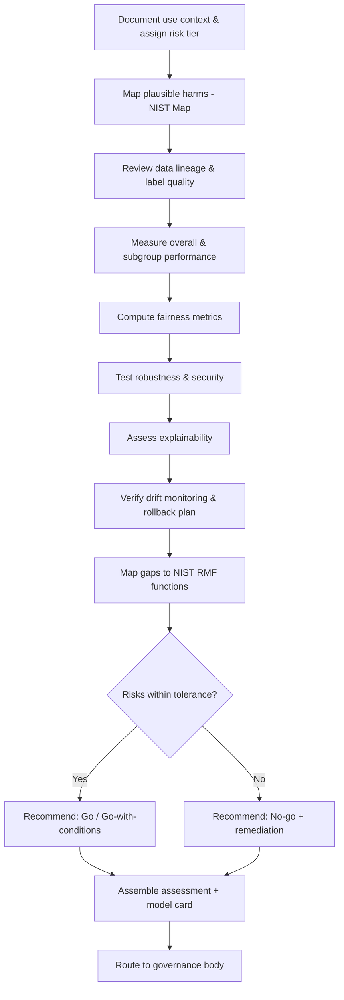
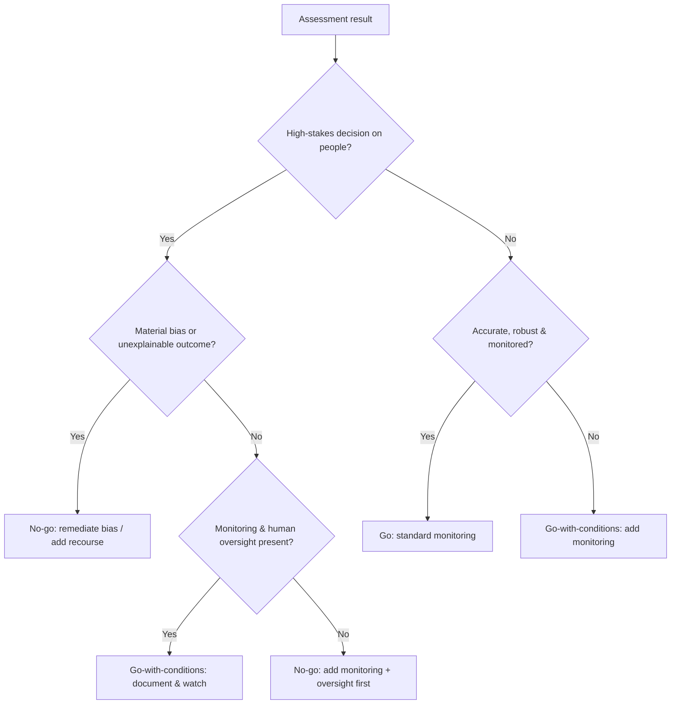

# Model Risk Assessment

> A defensive runbook for assessing machine-learning and AI models for bias, robustness, explainability, drift, and governance gaps, aligned to the NIST AI Risk Management Framework and sound model-risk-management (MRM) practice.

## Objective

Produce a governance-grade risk assessment of a machine-learning or AI model before or during production use. "Done" means the model's intended use and risk tier are documented, data and label quality are reviewed, performance is evaluated across subgroups for bias/fairness, robustness and security (adversarial/poisoning) are tested, explainability and monitoring are assessed, and every gap is mapped to a NIST AI RMF function (Govern/Map/Measure/Manage) with a severity and remediation — culminating in a documented go/no-go recommendation.

## Business Context

Models increasingly drive consequential decisions — credit, hiring, fraud, healthcare triage, content moderation, and agentic actions. A model that is accurate on average but biased against a subgroup, brittle under distribution shift, or unmonitored in production creates legal, ethical, financial, and reputational risk. Model Risk Management (rooted in banking guidance like SR 11-7 and now generalized by the NIST AI RMF and the EU AI Act) treats models as a governed asset with documented risk, validation, and monitoring. A structured, repeatable assessment prevents discriminatory outcomes, reduces regulatory exposure, and builds the auditable evidence trail regulators and customers expect. Automating the assessment gives every model launch consistent scrutiny that scales with model velocity.

## Problem Statement

Models ship with under-examined risks: **bias/fairness** gaps where performance or error rates differ across protected groups; **robustness** failures under noise, distribution shift, or adversarial perturbation; **data risks** including leakage, label errors, poisoning, and unrepresentative training sets; **explainability** deficits that block recourse and debugging; **drift** where live data diverges from training, silently degrading accuracy; **security** exposures (model/data theft, membership inference, extraction); and **governance** gaps — no model card, no documented owner, no approved use, no monitoring or rollback plan. This runbook assesses all of these against the NIST AI RMF. **Out of scope:** retraining or modifying the production model, changing live traffic routing, and making the final go/no-go decision — the agent assembles evidence and a recommendation; a human governance body decides.

## Success Criteria

- [ ] Model intent, context of use, and risk tier documented (a model card exists or is produced).
- [ ] Data lineage, representativeness, and label quality reviewed.
- [ ] Performance evaluated overall and disaggregated by subgroup with fairness metrics.
- [ ] Robustness tested (perturbation/shift) and security risks (poisoning, extraction, membership inference) assessed.
- [ ] Explainability approach documented and validated for the use case.
- [ ] Drift and performance monitoring, alerting, and rollback plan verified to exist.
- [ ] Every gap mapped to a NIST AI RMF function with severity and remediation.
- [ ] A documented go / go-with-conditions / no-go recommendation produced.

## Trigger Conditions

- New model proposed for production, or a material change (retrain, new features, new population).
- Scheduled: periodic revalidation (e.g., quarterly for high-risk models).
- Alert: monitoring detects drift, a fairness metric breach, or degraded accuracy.
- Regulatory or audit request (EU AI Act conformity, SR 11-7 validation, customer due diligence).
- Manual: incident review after a harmful or biased outcome.

## Inputs Required

| Input | Description | Example | Required |
|-------|-------------|---------|----------|
| `model_id` | Model + version in the registry | `credit-scoring:v3` | Yes |
| `model_card` | Existing documentation (if any) | `cards/credit-v3.md` | No |
| `use_context` | Intended use & decision impact | `credit approval` | Yes |
| `eval_dataset` | Held-out / validation data | `s3://.../holdout.parquet` | Yes |
| `protected_attrs` | Sensitive attributes for fairness | `age, gender, race proxy` | Yes |
| `monitoring_config` | Drift/perf monitoring setup | `evidently dashboards` | No |

## Required Access

| Scope | Purpose | Read/Write | Sensitivity |
|-------|---------|-----------|-------------|
| Model registry | Inspect model, version, metadata | Read | Medium |
| Evaluation data | Compute performance & fairness | Read | High |
| Code repository | Review training/eval pipeline | Read | Low |
| Monitoring/observability | Verify drift & perf alerting | Read | Medium |

## Assumptions

- A representative held-out evaluation dataset with (proxy) protected attributes is available.
- The model can be queried for predictions on the evaluation set in a read-only manner.
- `python` with `scikit-learn`/`fairlearn`/`aif360`, and a robustness toolkit are available.
- The agent does not retrain or alter the production model or its routing.

## Risks

| Risk | Likelihood | Impact | Mitigation |
|------|-----------|--------|------------|
| Using protected attributes leaks/violates policy | Medium | High | Access via approved, governed dataset; minimize retention |
| Fairness metric misinterpreted | Medium | High | Report multiple metrics; state the fairness definition & trade-offs |
| Small subgroup sample → noisy metrics | High | Medium | Report confidence intervals; flag low-n subgroups |
| Robustness test mistaken for an attack | Low | Medium | Run on held-out data offline; coordinate with owners |
| Assessment used as sole basis for launch | Medium | High | Recommendation only; human governance decides |

## Constraints

- No retraining, fine-tuning, or modification of the production model.
- No changes to live traffic, routing, or feature pipelines.
- Protected-attribute data handled under data-governance policy; never exported unredacted.
- `human_in_the_loop: required` — the go/no-go decision is made by a human governance body.
- Respect data residency and privacy (GDPR/CCPA) for evaluation data.

## Agent Persona

Adopt the persona of a **Principal Responsible-AI / Model Risk Engineer** working within an MRM function. Reason with the NIST AI RMF's four functions — **Govern, Map, Measure, Manage** — and be explicit that fairness involves value-laden trade-offs (there is no single "fair" metric; demographic parity and equalized odds can conflict). Quantify with confidence intervals and flag low-sample subgroups rather than over-claiming. Every finding cites the metric, the dataset slice, and the RMF function. Bias control: never launder a subjective judgment as an objective threshold — state the chosen fairness definition and why. Follow [`docs/AI_AGENT_STANDARDS.md`](../../docs/AI_AGENT_STANDARDS.md).

## Planning Instructions

1. Establish the model's context of use and assign a risk tier (impact × autonomy × population affected).
2. Map the RMF: which harms are plausible (Map), what to measure (Measure), and existing controls (Govern/Manage).
3. Externalize an evaluation plan: metrics, subgroups, robustness perturbations, and monitoring checks.
4. Because `human_in_the_loop: required`, present the plan and route the final recommendation to the governance body.
5. Define pass/fail thresholds and fairness definitions up front, with stakeholder sign-off where possible.

## Execution Instructions

All steps are read-only/offline evaluation; no retraining.

```python
# 1. Overall + disaggregated performance and fairness (fairlearn)
import pandas as pd
from sklearn.metrics import accuracy_score, precision_score, recall_score, roc_auc_score
from fairlearn.metrics import MetricFrame, selection_rate, false_positive_rate

df = pd.read_parquet("holdout.parquet")           # X, y_true, y_pred, protected attrs
mf = MetricFrame(
    metrics={"accuracy": accuracy_score, "recall": recall_score,
             "fpr": false_positive_rate, "selection_rate": selection_rate},
    y_true=df.y_true, y_pred=df.y_pred, sensitive_features=df[["gender", "age_band"]])
print(mf.by_group)                                 # per-subgroup metrics
print("Demographic parity diff:", mf.difference(method="between_groups"))
print("Equalized odds (FPR) diff:", mf.by_group["fpr"].max() - mf.by_group["fpr"].min())
```

```python
# 2. Robustness under perturbation / distribution shift (sanity + adversarial-lite)
import numpy as np
def perturb(X, sigma=0.05):
    return X + np.random.normal(0, sigma, X.shape)
base = accuracy_score(df.y_true, model.predict(df.X))
robust = accuracy_score(df.y_true, model.predict(perturb(df.X)))
print(f"Accuracy drop under noise: {base - robust:.3f}")   # large drop => brittle
```

```bash
# 3. Data & pipeline review (leakage, label quality, splits)
grep -rEn 'fit_transform.*test|test.*fit' .        # train/test leakage red flags
grep -rEn 'drop_duplicates|stratify|random_state' .# reproducibility & split hygiene

# 4. Governance artifacts check
ls cards/ && cat cards/credit-v3.md | head -50     # model card present & complete?
grep -rEn 'owner|approved_use|review_date' cards/  # documented ownership & approval
```

```bash
# 5. Monitoring & drift verification (read-only)
curl -s https://monitoring.acme.com/api/models/credit-scoring/v3/drift | jq '{psi, drift_alerts, last_check}'
curl -s https://monitoring.acme.com/api/models/credit-scoring/v3/perf | jq '{live_auc, baseline_auc, alerting_enabled}'
```

## Investigation Workflow



## Analysis Framework

Structure the assessment around the NIST AI RMF functions. **Map**: characterize the context, affected populations, and plausible harms. **Measure**: quantify performance, fairness (report multiple, potentially conflicting metrics — demographic parity, equalized odds, predictive parity — and state which the use case prioritizes and why), robustness, and security. **Manage**: verify monitoring, drift detection, human oversight, and rollback exist. **Govern**: confirm ownership, documented approved use, and a model card. Rank findings by **decision impact × affected population × likelihood**: a fairness gap in a high-stakes, high-volume decision (credit denial) is Critical; the same gap in a low-stakes internal tool is lower. Always report uncertainty (confidence intervals, subgroup sample sizes) so the governance body can weigh statistical significance.

| Finding | Severity | NIST AI RMF Function | Reference |
|---------|----------|----------------------|-----------|
| Disparate error rate across protected groups | Critical | Measure | EU AI Act / SR 11-7 |
| Train/test data leakage inflating metrics | High | Measure | MRM validation |
| Brittle to minor perturbation / shift | High | Measure/Manage | AI RMF Robustness |
| No drift monitoring or alerting in prod | High | Manage | AI RMF Monitoring |
| No model card / undocumented owner or use | Medium | Govern | AI RMF Govern |
| No explainability for a consequential decision | High | Measure/Govern | GDPR Art. 22 recourse |
| Membership inference / extraction exposure | Medium | Measure | AI security |
| No human oversight or rollback plan | High | Manage | AI RMF Manage |

## Decision Tree



## Validation Steps

- [ ] Fairness metrics recomputed on a fresh slice reproduce within confidence intervals.
- [ ] Subgroups with n below the reliability threshold are explicitly flagged, not silently reported.
- [ ] Robustness accuracy-drop is within the documented tolerance for the risk tier.
- [ ] No train/test leakage in the pipeline (independent split confirmed).
- [ ] A complete model card exists with owner, approved use, metrics, and limitations.
- [ ] Drift monitoring and performance alerting are live with a rollback runbook linked.
- [ ] The go/no-go recommendation is signed off by the human governance body.

## Expected Outputs

- A completed or updated model card (intent, data, metrics, fairness, limitations).
- A disaggregated performance & fairness report with confidence intervals.
- A robustness & security assessment summary.
- A monitoring/governance gap list mapped to NIST AI RMF functions.
- A documented go / go-with-conditions / no-go recommendation with conditions.

## Deliverables

A completed assessment report using [`templates/report-template.md`](../../templates/report-template.md): executive summary, findings mapped to NIST AI RMF functions and severity, fairness/robustness evidence with uncertainty, the model card, and a prioritized remediation plan plus the go/no-go recommendation. Handle protected-attribute data per policy; redact individual records.

## Escalation Process

- **Critical (material discriminatory outcome in a high-stakes decision):** escalate to the AI governance board and legal/compliance immediately; recommend no-go / halt until remediated.
- **High (data leakage, no monitoring, no explainability for consequential use):** block launch, open a `model-risk/high` item, notify the model owner and MRM lead.
- **Medium/Low:** aggregate into the report; schedule remediation with the owner.
- Provide metrics with confidence intervals, affected populations, and the RMF function each gap maps to.

## Rollback Strategy

The assessment is read-only and does not change the production model. If a model was launched under "go-with-conditions" and later breaches a fairness or performance threshold in monitoring, invoke the model's rollback runbook: route traffic back to the prior approved version (or a safe fallback / human-review queue), and freeze the offending version in the registry. Confirm rollback by verifying live metrics return to the baseline range and that no further decisions use the withdrawn version. Document the rollback and re-open the assessment.

## Post-Execution Review

- Did the chosen fairness definition match stakeholder intent, and should thresholds be revised?
- Were any subgroups too small to assess reliably, requiring targeted data collection?
- Should the model card and assessment become a required, automated gate in the MLOps pipeline?
- What monitoring signals would have caught the top risk earlier, and are they now instrumented?

## Metrics

| Metric | Definition | Target |
|--------|-----------|--------|
| Fairness gap | Max subgroup metric disparity | Within documented tolerance |
| Robustness drop | Accuracy loss under standard perturbation | < tier threshold |
| Governance completeness | Required model-card fields present | 100% |
| Monitoring coverage | High-risk models with live drift alerting | 100% |
| Assessment cycle time | Trigger to recommendation | < 10 days |
| Revalidation timeliness | High-risk models revalidated on schedule | 100% |

## Example Execution

**Input:** `model_id=credit-scoring:v3`, `use_context=credit approval`, `eval_dataset=holdout.parquet`, `protected_attrs=[gender, age_band]`.

**Agent reasoning (abridged):** Overall AUC 0.86 looked strong, but disaggregated analysis showed the false-positive (wrongful-denial) rate was 0.22 for one gender group vs 0.11 for another — an equalized-odds gap of 0.11, well outside tolerance for a high-stakes credit decision → Critical (Measure). Pipeline review found `fit_transform` applied before the train/test split → data leakage inflating metrics → High. No live drift monitoring existed → High (Manage). A model card existed but lacked documented limitations and approved use → Medium (Govern). Recommendation: **No-go** until bias is remediated and monitoring is added.

**Sample report excerpt:**

```text
F1 — Disparate wrongful-denial rate (Critical, NIST Measure)
Evidence: FPR groupA=0.22 vs groupB=0.11 (equalized-odds diff 0.11; 95% CI excludes 0).
Recommendation: reweigh/threshold-optimize; add recourse; re-evaluate before launch.

F2 — Train/test leakage (High, NIST Measure)
Evidence: scaler.fit_transform on full data before split (train.py:41).
Recommendation: fit transforms on train fold only; re-report metrics.

F3 — No drift monitoring (High, NIST Manage)
Evidence: monitoring API returns no PSI/drift config for v3.
Recommendation: enable PSI drift + performance alerting with rollback runbook.
```

**Action plan:** No-go. Remediate F1/F2, instrument F3, then re-assess and route to the governance board.

## References

- [`docs/AI_AGENT_STANDARDS.md`](../../docs/AI_AGENT_STANDARDS.md)
- [`templates/report-template.md`](../../templates/report-template.md)
- [`ai-system-security-review.md`](./ai-system-security-review.md)
- NIST AI Risk Management Framework (AI RMF 1.0) and Playbook
- Federal Reserve SR 11-7 (Guidance on Model Risk Management)
- EU AI Act (risk tiers and conformity obligations)
- Fairlearn / AIF360; ISO/IEC 23894 (AI risk management)
