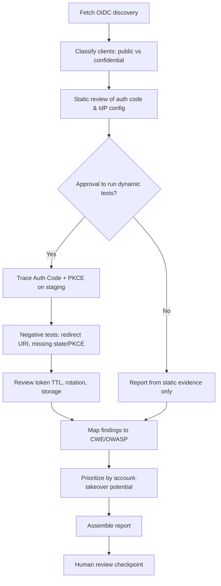
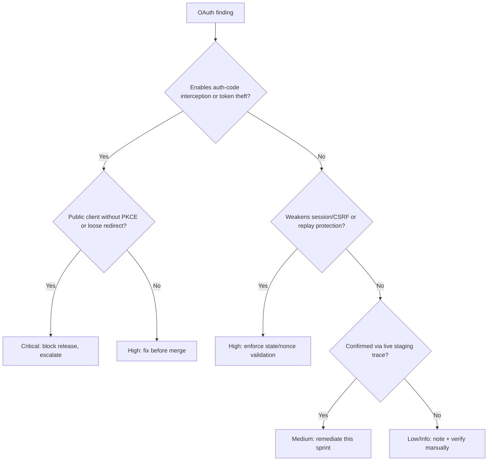

# OAuth Security Assessment

> A defensive runbook for assessing OAuth 2.0 / 2.1 and OpenID Connect implementations for flow selection, PKCE, redirect and state handling, token lifecycle, and common misconfigurations — testing only against non-production clients.

## Objective

Deliver an evidence-backed security assessment of an application's OAuth/OIDC implementation. "Done" means the authorization flows in use have been identified and validated against OAuth 2.1 best current practice, PKCE and state/nonce protections are confirmed, redirect URI and scope handling are verified, token issuance/validation/storage are reviewed, and every finding is mapped to a CWE, an OWASP control, and a severity with a concrete remediation.

## Business Context

OAuth is the front door to most modern applications and APIs; a flaw there is not one bug but a keys-to-the-kingdom failure enabling account takeover, token theft, and cross-tenant data access. Misconfigurations — implicit flow still in use, missing PKCE, lax redirect URI matching, absent state parameter — are among the most exploited authorization weaknesses and map directly to OWASP A01 (Broken Access Control) and A07 (Identification & Authentication Failures). Because OAuth mediates trust between users, apps, and APIs, a defensive review protects revenue, customer trust, and compliance posture (SOC 2, GDPR, PSD2 SCA). Automating this assessment provides consistent, repeatable coverage that manual pentests can't sustain at release cadence.

## Problem Statement

OAuth deployments accumulate dangerous patterns: use of the deprecated **Implicit** or **Resource Owner Password Credentials (ROPC)** grants; Authorization Code flow **without PKCE** for public clients; **missing or unvalidated `state`** (CSRF) and `nonce` (replay) parameters; **loose redirect URI** matching allowing open redirects and token exfiltration; over-broad or unconsented **scopes**; long-lived, non-rotating **refresh tokens**; access tokens placed in URLs or browser storage; and missing token audience/issuer validation. This runbook detects and prioritizes these. **Out of scope:** attacking production tenants, brute-forcing credentials, and any test that could lock out real users — all dynamic tests run against a dedicated staging client only.

## Success Criteria

- [ ] All OAuth grant types in use enumerated; deprecated grants (Implicit, ROPC) flagged.
- [ ] PKCE (S256) confirmed present and enforced for all public clients.
- [ ] `state` (CSRF) and `nonce` (OIDC replay) validated on the callback.
- [ ] Redirect URI matching confirmed to be exact (no wildcard/substring/open redirect).
- [ ] Scope minimization and consent behavior reviewed.
- [ ] Token lifecycle reviewed: TTLs, refresh rotation, revocation, storage location.
- [ ] Every finding mapped to CWE + OWASP + severity with remediation.

## Trigger Conditions

- New OAuth client/integration onboarding or IdP migration.
- Pull request touching auth/callback/token-exchange code or IdP config.
- Scheduled: quarterly assessment of production auth flows (against staging clients).
- Alert: anomalous token issuance or a rise in failed authorizations.
- Manual: pre-audit review for SOC 2 / PSD2 / customer security questionnaire.

## Inputs Required

| Input | Description | Example | Required |
|-------|-------------|---------|----------|
| `app_repo` | Repo with OAuth client/server code | `git@github.com:acme/web.git` | Yes |
| `idp` | Identity provider / authorization server | `Auth0 / Keycloak / Okta` | Yes |
| `discovery_url` | OIDC discovery document | `https://idp/.well-known/openid-configuration` | Yes |
| `client_type` | Public (SPA/mobile) or confidential | `public-spa` | Yes |
| `staging_client_id` | Dedicated test client | `test-abc123` | Yes |
| `flows_in_use` | Grant types configured | `auth_code+pkce` | No |

## Required Access

| Scope | Purpose | Read/Write | Sensitivity |
|-------|---------|-----------|-------------|
| Application repository | Review client/server auth code | Read | Low |
| IdP configuration | Inspect client, grants, redirect URIs | Read | High |
| Staging test client | Exercise flows dynamically | Test | Medium |
| CI pipeline artifacts | Retrieve auth integration tests | Read | Low |

## Assumptions

- A dedicated staging OAuth client exists that can be exercised without affecting production users.
- The OIDC discovery document and JWKS endpoint are reachable.
- `curl`, a JWT decoder, and a browser/HTTP proxy for flow tracing are available.
- The agent has read-only IdP config access and cannot modify production clients.

## Risks

| Risk | Likelihood | Impact | Mitigation |
|------|-----------|--------|------------|
| Dynamic test locks out real accounts | Low | High | Use staging client + test users only |
| Handling live tokens leaks credentials | Medium | High | Never log tokens; redact; short-lived test tokens |
| Misreading flow as insecure (false positive) | Medium | Medium | Confirm with both code review and live trace |
| Testing hits production authorization server | Medium | High | Restrict to staging issuer/tenant |
| Consent/scopes change during test | Low | Medium | Use isolated test client; revert after |

## Constraints

- No tests against production tenants or real user accounts.
- No credential brute-forcing, no denial-of-service, no token replay against prod.
- Access/refresh tokens must never be written to logs, tickets, or PR comments.
- `human_in_the_loop: required` — dynamic tests need explicit approval before running.
- Respect the IdP's rate limits and terms.

## Agent Persona

Adopt the persona of a **Principal Identity & Access Management Security Engineer**. Reason from the OAuth 2.1 BCP and RFC 6749/6819/7636/9700. Distinguish public vs confidential clients precisely, since the correct controls differ. Every finding cites the code path or IdP setting plus the relevant RFC/OWASP reference. Bias control: confirm dynamically (via a staging flow trace) before declaring a control missing — configuration and code can disagree. Follow [`docs/AI_AGENT_STANDARDS.md`](../../docs/AI_AGENT_STANDARDS.md).

## Planning Instructions

1. Fetch the OIDC discovery document and enumerate supported/enabled grant types and endpoints.
2. Classify each client as public or confidential; this drives which controls are mandatory (e.g., PKCE for public).
3. Externalize a plan listing static code checks and the exact dynamic flows to trace on the staging client.
4. Because `human_in_the_loop` is `required`, get approval before executing any dynamic authorization request.
5. Define severity mapping (account takeover potential = Critical) up front.

## Execution Instructions

Static review first; dynamic tests on staging only, after approval.

```bash
# 1. Pull the OIDC discovery + JWKS metadata (read-only)
curl -s https://idp.example.com/.well-known/openid-configuration | jq \
  '{grant_types_supported, response_types_supported, code_challenge_methods_supported, token_endpoint_auth_methods_supported}'
curl -s https://idp.example.com/.well-known/jwks.json | jq '.keys[].alg'
```

```bash
# 2. Static checks in the app code
grep -rEn 'response_type=token|grant_type=password|implicit' .        # deprecated flows
grep -rEn 'code_challenge|code_verifier|S256' .                        # PKCE presence
grep -rEn 'state=|nonce=' .                                            # CSRF/replay params
grep -rEn 'redirect_uri' .                                             # redirect handling
grep -rEn 'localStorage|sessionStorage' . | grep -i token             # insecure token storage
```

```bash
# 3. Dynamic: initiate Authorization Code + PKCE on the STAGING client
VERIFIER=$(openssl rand -base64 96 | tr -d '=+/' | cut -c1-64)
CHALLENGE=$(printf '%s' "$VERIFIER" | openssl dgst -sha256 -binary | openssl base64 | tr '+/' '-_' | tr -d '=')
echo "Authorize URL:"
echo "https://idp.example.com/authorize?response_type=code&client_id=$STAGING_CLIENT&redirect_uri=https://staging.example.com/cb&scope=openid%20profile&state=$(openssl rand -hex 16)&code_challenge=$CHALLENGE&code_challenge_method=S256"

# 4. Negative test: verify redirect URI is exact-match (expect rejection)
curl -s -o /dev/null -w '%{http_code}\n' \
  "https://idp.example.com/authorize?response_type=code&client_id=$STAGING_CLIENT&redirect_uri=https://evil.example.com/cb&scope=openid&state=x"

# 5. Token exchange with PKCE (expect success only WITH correct verifier)
curl -s -X POST https://idp.example.com/oauth/token \
  -d grant_type=authorization_code -d client_id="$STAGING_CLIENT" \
  -d code="$AUTH_CODE" -d redirect_uri=https://staging.example.com/cb \
  -d code_verifier="$VERIFIER" | jq 'del(.access_token,.id_token,.refresh_token)'   # redact tokens
```

## Investigation Workflow



## Analysis Framework

Anchor the analysis in OAuth 2.1 BCP: Authorization Code + PKCE is the target for public clients; Implicit and ROPC are disallowed. Rank findings by **account-takeover potential**: anything enabling token theft or authorization-code interception (missing PKCE, loose redirect URI, absent state) is Critical/High because it directly yields user impersonation. Correlate static and dynamic evidence — a `state` parameter present in code means nothing if the callback doesn't validate it, so confirm the check server-side. Evaluate token hygiene holistically: short access-token TTLs, rotating refresh tokens with reuse detection, correct `aud`/`iss`/`exp` validation, and storage in HttpOnly cookies rather than browser storage.

| Finding | Severity | CWE | OWASP |
|---------|----------|-----|-------|
| Implicit or ROPC grant enabled | High | CWE-287 | A07 |
| PKCE missing for public client | Critical | CWE-352 | A01 |
| `state` not validated (CSRF) | High | CWE-352 | A01 |
| `nonce` missing/unvalidated (OIDC replay) | Medium | CWE-294 | A07 |
| Loose/wildcard redirect URI (open redirect) | Critical | CWE-601 | A01 |
| Over-broad scopes / no consent | Medium | CWE-269 | A01 |
| Access token in URL or localStorage | High | CWE-522 | A02 |
| Refresh token non-rotating / no revocation | Medium | CWE-613 | A07 |
| Missing `aud`/`iss` validation | High | CWE-345 | A07 |

## Decision Tree



## Validation Steps

- [ ] Confirm Implicit/ROPC grants are disabled on all clients.
- [ ] Confirm token exchange fails without a valid PKCE `code_verifier`.
- [ ] Confirm authorization is rejected for any redirect URI not exactly registered.
- [ ] Confirm the callback rejects requests with a missing/mismatched `state`.
- [ ] Confirm `id_token` validation checks `aud`, `iss`, `exp`, and `nonce`.
- [ ] Confirm tokens are stored in HttpOnly, Secure, SameSite cookies (not localStorage).
- [ ] Confirm refresh tokens rotate and old tokens are invalidated (reuse detection).

## Expected Outputs

- An enumeration of enabled grants/flows and client classifications.
- Static + dynamic evidence per control (with tokens redacted).
- A redirect-URI and PKCE negative-test result set.
- A token-lifecycle review table.
- A prioritized findings list mapped to CWE/OWASP.

## Deliverables

A completed report using [`templates/report-template.md`](../../templates/report-template.md): executive summary, findings mapped to CWE/OWASP/severity, redacted evidence excerpts, and a remediation plan (e.g., migrate to Auth Code + PKCE, enforce exact redirect matching). Never include live tokens.

## Escalation Process

- **Critical (missing PKCE on public client, open redirect enabling token theft):** notify security on-call and IdP owner immediately; recommend disabling the affected flow/client.
- **High (Implicit grant, missing state validation, token in localStorage):** block release, open `security/high` ticket, notify the app team.
- **Medium/Low:** aggregate into the report and backlog.
- Provide the flow trace (redacted), the RFC/OWASP reference, and the account-takeover scenario.

## Rollback Strategy

The assessment does not change production. If a staging client's configuration was altered during dynamic testing (e.g., a redirect URI added), revert it to its original value and confirm via the IdP config. If remediation code was merged to a branch and breaks login, `git revert <sha>` and redeploy the previous auth build; confirm by completing a full login on staging. No production tokens were issued to real users, so no user-facing rollback is needed.

## Post-Execution Review

- Can the IdP enforce PKCE and exact redirect matching at the tenant level to prevent recurrence?
- Should deprecated grants be globally disabled across all clients?
- Are token TTLs and refresh rotation standardized in a shared auth library?
- What automated integration tests can assert these controls in CI going forward?

## Metrics

| Metric | Definition | Target |
|--------|-----------|--------|
| PKCE coverage | % public clients enforcing S256 | 100% |
| Deprecated grants | Clients with Implicit/ROPC enabled | 0 |
| Redirect strictness | % clients with exact-match only | 100% |
| Token storage | % apps using HttpOnly cookies | 100% |
| Assessment lead time | Trigger to report | < 1 day |
| Critical escapes | ATO-enabling flaws reaching prod | 0 |

## Example Execution

**Input:** `app_repo=git@github.com:acme/web.git`, `idp=Auth0`, `client_type=public-spa`, `staging_client_id=test-abc123`.

**Agent reasoning (abridged):** Discovery showed `response_types_supported` still included `token` (Implicit). Code review found the SPA used Authorization Code but had no `code_challenge` — no PKCE. Dynamic test on staging: token exchange succeeded without a `code_verifier`, confirming PKCE not enforced → Critical (CWE-352, A01). Negative redirect test to `evil.example.com` returned `200` and issued a code → loose redirect matching → Critical (CWE-601). Tokens were stored in `localStorage` → High (CWE-522).

**Sample report excerpt:**

```text
F1 — Public client without enforced PKCE (Critical, CWE-352, OWASP A01)
Evidence: authorize request lacks code_challenge; token exchange succeeded w/o code_verifier (staging).
Remediation: enforce PKCE S256; disable code exchange without verifier at the IdP.

F2 — Loose redirect URI (Critical, CWE-601, OWASP A01)
Evidence: authorize accepted redirect_uri=https://evil.example.com/cb (HTTP 200, code issued).
Remediation: register exact redirect URIs; disable wildcard/substring matching.

F3 — Access token in localStorage (High, CWE-522, OWASP A02)
Remediation: store tokens in HttpOnly, Secure, SameSite=strict cookies.
```

**Action plan:** Escalate F1/F2 now; disable Implicit grant tenant-wide; migrate storage.

## References

- [`docs/AI_AGENT_STANDARDS.md`](../../docs/AI_AGENT_STANDARDS.md)
- [`templates/report-template.md`](../../templates/report-template.md)
- [`jwt-security-review.md`](./jwt-security-review.md)
- [`api-security-audit.md`](./api-security-audit.md)
- OWASP Top 10 (A01, A02, A07); OWASP Cheat Sheets (OAuth, OIDC)
- RFC 6749 (OAuth 2.0), RFC 6819 (Threat Model), RFC 7636 (PKCE), RFC 9700 (OAuth 2.0 Security BCP)
- OAuth 2.1 draft; OpenID Connect Core
