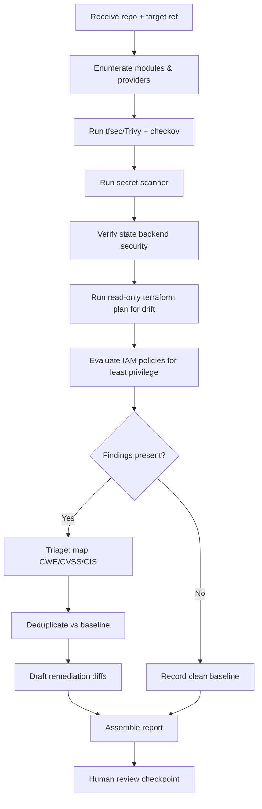
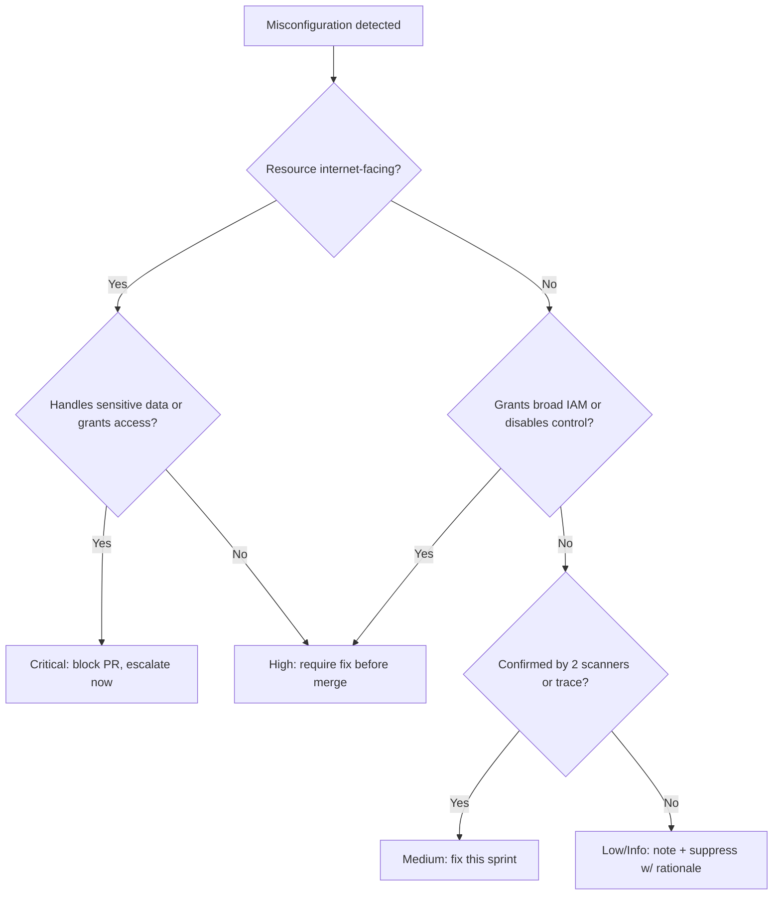

# Terraform Security Review

> A defensive runbook for autonomously reviewing Terraform Infrastructure-as-Code (IaC) for misconfigurations, insecure defaults, state exposure, drift, and least-privilege violations before they reach production.

## Objective

Produce a prioritized, evidence-backed security assessment of a Terraform codebase and its associated state and cloud footprint. "Done" means every module in scope has been statically scanned, every High/Critical misconfiguration has been triaged against CWE/CVSS and an OWASP or CIS control, state confidentiality and integrity have been verified, drift has been quantified, and IAM policies have been evaluated for least privilege — all delivered as a report with concrete, minimally invasive remediation diffs.

## Business Context

Infrastructure-as-Code is the single largest amplifier of cloud risk: one insecure module reused across 40 environments propagates the same public S3 bucket or `0.0.0.0/0` security group 40 times. Terraform misconfigurations are a leading root cause of cloud data breaches (public storage, over-broad IAM, unencrypted volumes). Catching these in code review is 10-100x cheaper than post-deployment incident response and avoids regulatory exposure under SOC 2, PCI-DSS, HIPAA, and ISO 27001. Shifting this review left — and automating it with an AI agent that never gets fatigued reviewing the 300th security group rule — directly reduces breach likelihood and audit findings while preserving developer velocity.

## Problem Statement

Terraform code frequently ships with insecure defaults and copy-pasted anti-patterns: publicly readable object storage, security groups open to the internet, unencrypted databases and volumes, hardcoded secrets in `.tf` files or `terraform.tfvars`, IAM roles with `*:*` permissions, remote state stored without encryption or locking, and unpinned provider/module versions enabling supply-chain drift. This runbook detects and prioritizes these issues. It is explicitly **out of scope** to apply changes to live infrastructure, run `terraform apply`, rotate credentials, or modify production state. The agent reviews and recommends; humans approve and apply.

## Success Criteria

- [ ] 100% of in-scope Terraform modules scanned with both `tfsec`/Trivy config and `checkov`.
- [ ] Every High/Critical finding mapped to a CWE, a CIS/OWASP control, and a CVSS-style severity.
- [ ] Remote state backend verified for encryption-at-rest, access logging, versioning, and state locking.
- [ ] Terraform drift detected and quantified via `terraform plan` against read-only credentials.
- [ ] All IAM policies evaluated for wildcard actions/resources and privilege-escalation paths.
- [ ] No secrets detected in tracked files (validated with a secret scanner).
- [ ] A deliverable report produced with per-finding remediation diffs and a suppression rationale for any accepted risk.

## Trigger Conditions

- Pull request touching `*.tf`, `*.tfvars`, or module source references.
- Scheduled: weekly baseline scan of `main` for all IaC repositories.
- Manual: pre-audit hardening ahead of SOC 2 / PCI assessment.
- Alert: cloud posture tool (CSPM) flags a resource whose definition originates in Terraform.
- Onboarding a new module into the shared module registry.

## Inputs Required

| Input | Description | Example | Required |
|-------|-------------|---------|----------|
| `repo_url` | Terraform repository to review | `git@github.com:acme/infra.git` | Yes |
| `target_ref` | Branch, tag, or PR ref | `pr/482` | Yes |
| `module_scope` | Paths/modules in scope | `envs/prod/**` | Yes |
| `cloud_provider` | Primary provider | `aws` | Yes |
| `state_backend` | Backend type & location | `s3://acme-tfstate` | Yes |
| `baseline_report` | Prior report for delta comparison | `reports/2026-07.md` | No |
| `readonly_creds` | Read-only cloud role for drift/plan | `arn:aws:iam::...:role/tf-audit-ro` | Yes |

## Required Access

| Scope | Purpose | Read/Write | Sensitivity |
|-------|---------|-----------|-------------|
| Git repository | Read `.tf` source and history | Read | Low |
| Terraform state (backend) | Verify config, detect drift | Read | High |
| Cloud IAM (read-only) | Evaluate policies, run `plan` | Read | High |
| CI pipeline artifacts | Retrieve scan logs and plan output | Read | Medium |
| Secrets manager metadata | Confirm secrets are referenced, not inlined | Read (metadata only) | High |

## Assumptions

- The agent has read-only credentials only; no write/apply capability is granted or expected.
- `terraform` (>= 1.5), `tfsec`/`trivy`, `checkov`, and a secret scanner (`gitleaks`/`trufflehog`) are available in the execution environment.
- The repository builds/initializes cleanly (`terraform init` with a backend override to a scratch/local state for planning).
- The provided read-only role can execute `terraform plan` without mutating resources.
- Module versions and provider constraints are declared in code (if not, that itself is a finding).

## Risks

| Risk | Likelihood | Impact | Mitigation |
|------|-----------|--------|------------|
| `terraform plan` mutates state or resources | Low | Critical | Use read-only role; `-refresh=false` where possible; never run `apply` |
| False positives create alert fatigue | Medium | Medium | Map each finding to evidence; use tuned rule baselines and documented suppressions |
| Exposed state read during review leaks secrets | Medium | High | Handle state in-memory only; never write plaintext state to logs/artifacts |
| Scanning misses provider-specific issues | Medium | High | Run two independent scanners (tfsec + checkov) and cross-reference |
| Suppressions hide real risk | Medium | High | Require human sign-off on every `#tfsec:ignore` / `checkov:skip` |

## Constraints

- No `terraform apply`, `import`, `state rm`, or any mutating command against real infrastructure.
- No production writes without explicit human approval (`human_in_the_loop: required`).
- Plaintext state and secrets must never be persisted to logs, PR comments, or artifacts.
- Respect change-freeze windows; findings are reported but not auto-remediated during freezes.
- Data residency: state and scan artifacts stay within the approved region/tenant.

## Agent Persona

Adopt the persona of a **Principal Cloud Security Engineer** specializing in IaC and cloud posture. Tone is precise, evidence-driven, and non-alarmist: every claim is backed by a file path, line number, and scanner rule ID. Bias controls: never assume a finding is exploitable without tracing the resource's exposure (e.g., a security group open to `0.0.0.0/0` is only Critical if attached to an internet-facing resource). Prefer least-privilege recommendations and the smallest possible diff. Follow the conventions in [`docs/AI_AGENT_STANDARDS.md`](../../docs/AI_AGENT_STANDARDS.md) for reasoning transparency and human checkpoints.

## Planning Instructions

1. Enumerate all in-scope modules and resources; build a dependency graph of module sources and provider versions.
2. Externalize a plan listing: scanners to run, state checks, IAM policies to evaluate, and the read-only commands that will touch the cloud.
3. Because `human_in_the_loop` is `required`, present the plan — especially any command that authenticates to the cloud — and obtain approval before execution.
4. Define the finding severity model (CVSS + CIS/OWASP mapping) up front so triage is consistent.
5. Identify the baseline report (if any) to compute deltas rather than re-reporting known accepted risks.

## Execution Instructions

Run read-only/observation steps first. Never run mutating commands.

```bash
# 1. Clone and checkout the target ref (shallow, read-only)
git clone --depth 50 "$REPO_URL" src && cd src && git checkout "$TARGET_REF"

# 2. Static IaC scan #1 — tfsec (via Trivy) with SARIF output
trivy config --severity HIGH,CRITICAL --format sarif -o tfsec.sarif ./envs/prod
tfsec ./envs/prod --format json --out tfsec.json --minimum-severity HIGH

# 3. Static IaC scan #2 — checkov, cross-reference for coverage gaps
checkov -d ./envs/prod --compact --output json --output-file-path checkov.json \
  --framework terraform terraform_plan

# 4. Secret scanning across tracked files and history
gitleaks detect --source . --report-format json --report-path gitleaks.json --no-banner

# 5. Provider/module version pinning audit
grep -rEn 'source\s*=|version\s*=' ./envs ./modules
```

```bash
# 6. Backend / state security verification (READ ONLY)
terraform -chdir=envs/prod init -backend=false           # validate config w/o touching backend
aws s3api get-bucket-encryption --bucket acme-tfstate     # expect SSE enabled
aws s3api get-bucket-versioning --bucket acme-tfstate     # expect Enabled
aws dynamodb describe-table --table-name acme-tfstate-lock # expect lock table present

# 7. Drift detection using the READ-ONLY role (no apply)
export AWS_PROFILE=tf-audit-ro
terraform -chdir=envs/prod init
terraform -chdir=envs/prod plan -lock=false -input=false -no-color > plan.txt
```

```bash
# 8. IAM least-privilege evaluation — flag wildcards & privesc
grep -rEn '"Action":\s*"\*"|"Resource":\s*"\*"|:\*"' ./modules ./envs
# Optionally simulate with IAM policy analyzers where available (read-only)
```

## Investigation Workflow



## Analysis Framework

Correlate signals across the three data sources — static scan, state/backend config, and live drift — rather than treating each in isolation. A `tfsec` finding of an unencrypted RDS instance is corroborated (or contradicted) by the `plan` output and the live resource state. Rank hypotheses by **exposure × sensitivity**: internet-reachable + sensitive data + weak control = Critical. Deduplicate against the baseline so accepted risks are not re-litigated. Guard against confirmation bias by requiring two independent scanners to agree, or a manual code trace, before elevating a finding above Medium. Treat unpinned module/provider versions and disabled state locking as systemic (control-plane) risks that multiply the impact of any single misconfiguration.

| Finding | Severity | CWE | CIS/OWASP Mapping |
|---------|----------|-----|-------------------|
| S3 bucket public read/write | Critical | CWE-732 | CIS AWS 2.1.5 / OWASP A01 |
| Security group `0.0.0.0/0` to 22/3389 | High | CWE-284 | CIS AWS 5.2 |
| Unencrypted RDS / EBS / S3 | High | CWE-311 | CIS AWS 2.1.1 |
| IAM policy with `*:*` | Critical | CWE-269 | CIS AWS 1.16 / OWASP A01 |
| Hardcoded secret in `.tf`/`.tfvars` | Critical | CWE-798 | OWASP A07 |
| Remote state without encryption/locking | High | CWE-311 / CWE-362 | CIS AWS 2.1.1 |
| Unpinned provider/module version | Medium | CWE-1104 | Supply chain |
| Logging/flow logs disabled | Medium | CWE-778 | CIS AWS 3.x |

## Decision Tree



## Validation Steps

- [ ] Re-run both scanners after remediation diffs are applied in a branch; confirm the finding disappears.
- [ ] Confirm `terraform validate` and `terraform plan` still succeed (no syntax regression).
- [ ] Verify no new findings were introduced by the remediation (net-negative finding count).
- [ ] Confirm every suppression has an inline rationale and an owner.
- [ ] Confirm state backend still shows encryption, versioning, and locking enabled.
- [ ] Verify secret scanner reports zero secrets in tracked files.

## Expected Outputs

- SARIF/JSON scan artifacts from tfsec/Trivy and checkov.
- A drift summary (resources changed outside Terraform) from read-only `plan`.
- An IAM least-privilege evaluation table with flagged wildcards and privesc paths.
- Per-finding remediation diffs (unified diff format) ready for human review.
- A markdown security report following the shared report template.

## Deliverables

A completed security assessment report using [`templates/report-template.md`](../../templates/report-template.md), including an executive summary, findings mapped to CWE/CVSS/CIS, evidence excerpts (file:line + rule ID), remediation diffs, and an action plan bucketed by priority. Do not include plaintext state or secrets in the deliverable — reference secret identifiers only.

## Escalation Process

- **Critical (public data exposure, `*:*` IAM, hardcoded prod secret):** halt review, notify the security on-call and repo owner immediately via the incident channel, recommend blocking the PR.
- **High:** file a ticket tagged `security/high`, require remediation before merge, notify the module owner.
- **Medium/Low:** aggregate into the report; create backlog tickets with suggested fixes.
- Provide full context: finding ID, evidence, blast radius (how many environments consume the module), and proposed diff.

## Rollback Strategy

The runbook is read-only, so there is nothing to roll back on live infrastructure. If remediation diffs were committed to a review branch and cause issues, revert with `git revert <sha>` or delete the branch; no `terraform apply` was run by the agent. If a read-only `plan` inadvertently refreshed and wrote lock metadata, release it with the documented `force-unlock` procedure only after human confirmation. Confirm rollback by re-running `terraform plan` and verifying a clean, expected diff.

## Post-Execution Review

- Which finding categories recurred across modules, and can a shared hardened module eliminate them at the source?
- Were there false positives worth encoding as tuned suppressions in the scanner config?
- Did drift indicate out-of-band changes that need a process fix (e.g., console changes bypassing IaC)?
- What can be added to CI pre-merge checks to catch these earlier next time?

## Metrics

| Metric | Definition | Target |
|--------|-----------|--------|
| Scan coverage | % in-scope modules scanned by both tools | 100% |
| MTTD (config) | Time from PR open to finding reported | < 15m |
| False positive rate | Suppressed-as-invalid / total findings | < 10% |
| Critical escape rate | Criticals reaching prod post-review | 0 |
| Remediation lead time | Finding reported to fix merged | < 5 days |
| Drift ratio | Resources drifted / total managed | < 2% |

## Example Execution

**Input:** `repo_url=git@github.com:acme/infra.git`, `target_ref=pr/482`, `module_scope=envs/prod/**`, `cloud_provider=aws`.

**Agent reasoning (abridged):** Enumerated 12 modules. Ran `trivy config` and `checkov`; both flagged `envs/prod/storage.tf:14` — an S3 bucket with `acl = "public-read"`. Cross-referenced `plan.txt`: the bucket is not behind CloudFront and has no bucket policy denying public access. Traced consumers: the `storage` module is used in 6 environments. Elevated to Critical (CWE-732, CIS AWS 2.1.5, OWASP A01). Secret scan flagged a base64 key in `terraform.tfvars` — Critical (CWE-798).

**Sample report excerpt:**

```text
F1 — Public S3 bucket (Critical, CWE-732, CIS AWS 2.1.5)
Evidence: envs/prod/storage.tf:14  acl = "public-read"  [tfsec AWS017 / checkov CKV_AWS_20]
Blast radius: module reused in 6 environments.
Remediation:
- acl = "public-read"
+ acl = "private"
+ block_public_acls = true
+ restrict_public_buckets = true

F2 — Hardcoded secret (Critical, CWE-798)
Evidence: envs/prod/terraform.tfvars:8  db_password = "***REDACTED***"
Remediation: move to secrets manager; reference via data source.
```

**Action plan:** Block PR #482. Escalate F1/F2 to security on-call. Recommend a hardened shared `s3-secure` module to prevent recurrence.

## References

- [`docs/AI_AGENT_STANDARDS.md`](../../docs/AI_AGENT_STANDARDS.md)
- [`templates/report-template.md`](../../templates/report-template.md)
- [`docker-hardening.md`](./docker-hardening.md)
- [`container-security-audit.md`](./container-security-audit.md)
- OWASP Top 10 (A01: Broken Access Control; A05: Security Misconfiguration)
- CIS Amazon Web Services Foundations Benchmark
- tfsec / Trivy / Checkov documentation
- NIST SP 800-53 (AC, SC control families)
