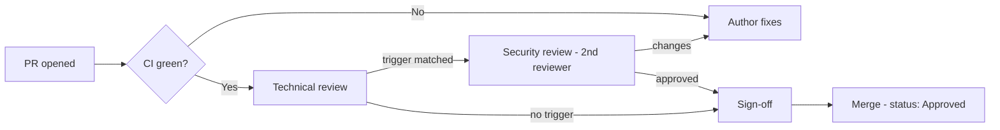

# Security Review Process

Some runbooks are more dangerous than others. Any runbook that lives under
`runbooks/security/` or declares `risk_level: high` or `risk_level: critical`
carries enough blast radius that a single technical review is not enough. This
document defines the **second, security-focused review** those runbooks must
pass, the checklist reviewers apply, and how the review maps to industry control
frameworks. It is the security track referenced by the governance
[review process](../governance/review-process.md) and enforces the safe-content
principles in [`../SECURITY.md`](../SECURITY.md).

## When a security review is mandatory

A security review (a distinct reviewer, in addition to technical review) is
required when **any** trigger is true:

- The runbook is under `runbooks/security/`.
- Front matter declares `risk_level: high` or `risk_level: critical`.
- The runbook contains any `[mutating]` step against a production system.
- It touches authentication, authorization, secrets, key material, network
  policy, or movement of regulated data.
- It broadens an agent's `required_access` versus the prior version.

The security reviewer must be **distinct from the author and the technical
reviewer** (four-eyes). CODEOWNERS routes these paths to the security reviewer
group so the requirement is enforced mechanically — see
[`../governance/change-management.md`](../governance/change-management.md).

## Where it fits

## Security review checklist

The reviewer confirms each item and records the result on the PR.

### Intent and privilege

- [ ] **Defensive only.** Focus is detection, hardening, remediation — not
      enabling attacks, harvesting credentials, or evading defenses.
- [ ] **Least privilege.** `required_access` is the minimum needed; no broad
      "agent admin" role; scoped, short-lived credentials assumed.
- [ ] **Risk classification is honest.** `risk_level` and `human_in_the_loop`
      match the true blast radius × reversibility × environment.

### Actions and reversibility

- [ ] Every `[mutating]` step is **reversible** with a concrete, verified
      rollback.
- [ ] R2/R3 actions are **gated** behind explicit, action-specific human
      approval; R3 requires a named approver and four-eyes.
- [ ] No step disables, weakens, or bypasses a security control to succeed.

### Data protection

- [ ] **No secrets** — no credentials, tokens, private keys, hostnames, or
      customer data anywhere in the runbook.
- [ ] **Redaction** guidance is present wherever command output or reports may
      contain sensitive data.
- [ ] No step moves regulated data across trust or residency boundaries.

### Agent-safety exposure

- [ ] **Prompt-injection resistance** considered: the runbook does not instruct
      the agent to treat untrusted tool output (logs, tickets, web) as commands.
- [ ] **Tool-abuse** paths assessed: the runbook cannot be turned into a
      destructive primitive through parameter manipulation.
- [ ] Escalation triggers fire on signs of active harm (breach, data loss, SEV1).

### Evidence and audit

- [ ] The runbook produces the trajectory evidence required by
      [`../governance/audit-framework.md`](../governance/audit-framework.md).
- [ ] Compliance-relevant claims (logging, retention, redaction) are accurate.

## Mapping to control frameworks

Security reviewers align their judgment to recognized standards so the review is
consistent and defensible.

| Standard | What the reviewer draws on | Applied to |
|----------|----------------------------|-----------|
| **OWASP Top 10 / API Top 10** | Common web and API weaknesses (injection, broken auth, SSRF, misconfig) | Runbooks touching apps, APIs, auth |
| **OWASP Top 10 for LLM Applications** | Prompt injection, insecure output handling, excessive agency, sensitive-info disclosure | Every agent-executed runbook |
| **CIS Benchmarks** | Hardening baselines for OS, containers, Kubernetes, cloud | Infra/security audit runbooks |
| **NIST SP 800-53 / CSF** | Access control (AC), audit (AU), config management (CM), incident response (IR) | Access, logging, and change steps |
| **NIST AI RMF** | Govern / Map / Measure / Manage for AI risk | Autonomy, guardrails, drift |
| **MITRE ATT&CK** | Adversary techniques to ensure detection coverage | Threat-hunting / SOC runbooks |

The **OWASP Top 10 for LLM Applications** is the primary lens for the
agent-safety section — especially *prompt injection*, *insecure output
handling*, and *excessive agency* — because those map directly to how an agent
can be subverted while executing an otherwise legitimate runbook.

## Reviewer conduct and outcomes

- **Assess like an attacker.** Ask "how could following this literally cause
  harm?" not just "is it technically correct?"
- **Block on ambiguity.** If safety cannot be confidently established, request
  changes or escalate to the review board — never approve on faith.
- **Record the attestation.** A security approval is a personal, auditable
  statement that the checklist was met; it is captured on the PR and mirrored to
  the audit trail.

Outcomes are the same three as any review: **request changes** (return to
`Draft`), **approve** (proceed to sign-off), or **escalate**. Emergency security
reviews for a runbook found unsafe in production follow the fast-track
(Class D) path with a ≤ 4 business-hour target and later ratification by the
board.

## Continuous assurance

Security review is a point-in-time gate; it is backed by ongoing controls —
guardrail metrics, drift detection, and immutable audit logging in
[`../governance/agent-governance.md`](../governance/agent-governance.md). A
security finding discovered post-merge triggers emergency deprecation and a
revert per the change-management rollback procedure.
