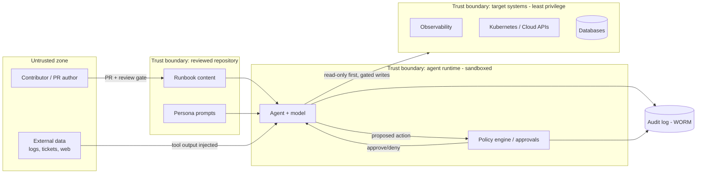

# Threat Model

This threat model examines two attack surfaces together: the **repository** (the
runbooks, templates, prompts, and tooling as content) and the **execution
system** (an autonomous agent reading a runbook and acting on real systems). We
use [STRIDE](https://en.wikipedia.org/wiki/STRIDE_model) — Spoofing, Tampering,
Repudiation, Information disclosure, Denial of service, Elevation of privilege —
to enumerate threats, then map each to a concrete mitigation. It complements the
repository's [`../SECURITY.md`](../SECURITY.md) and the
[security review process](./security-review-process.md).

## Scope and assumptions

- The repository ships **no runtime service and no secrets**; its risk is in
  *content that instructs privileged agents*.
- Agents execute with real, if scoped, credentials against production-adjacent
  systems.
- Trust boundaries exist between: untrusted contributors, the reviewed
  repository, the agent runtime, and the target systems.

## Data-flow and trust boundaries

The dashed insight: **data crossing into the runtime from `EXT` is untrusted** —
log lines, ticket text, or web content returned by tools can carry injected
instructions. The review gate protects `RB`/`PR`; the policy engine and sandbox
protect the target systems.

## Threat catalog (STRIDE)

### Repository as an attack surface

| STRIDE | Threat | Mitigation |
|--------|--------|------------|
| **Tampering** | Malicious runbook content instructs an agent to take unsafe/destructive actions | Review every diff like privileged code; CODEOWNERS gating; security second-review for `security/` and high/critical; defensive-only policy |
| **Tampering** | Compromised tooling/scripts alter validation or scoring | Pinned, minimal dependencies; prefer packages ≥ 7 days old; CI runs from trusted config; branch protection |
| **Spoofing** | Attacker submits a PR impersonating a trusted contributor | Signed commits, required reviews, no self-approval, protected `main` |
| **Elevation of privilege** | Runbook quietly widens `required_access` beyond need | Least-privilege review of `required_access`; diff highlights access changes; MAJOR version + re-review |
| **Repudiation** | A harmful change cannot be attributed | Immutable git history; changelog; audit records for Class C/D changes |
| **Supply chain** | A malicious dependency or transitive package is introduced | Dependency pinning, secret scanning, SCA in CI, minimal surface |

### Agents executing runbooks

| STRIDE | Threat | Mitigation |
|--------|--------|------------|
| **Tampering / EoP** | **Prompt injection** via tool output (logs, tickets, web) redirects the agent | Treat all tool output as untrusted data, not instructions; the runbook and persona are the only authority; red-team for injection before production |
| **Elevation of privilege** | **Over-privileged agent** reuses a broad role to exceed intent | Scoped, short-lived per-run credentials; no standing agent-admin; sandbox with egress controls |
| **Tampering** | Agent takes a destructive/irreversible action | Risk tiers R0–R3; R3 requires named approver + four-eyes + rollback; policy engine blocks above-tier actions |
| **Information disclosure** | Secrets or customer PII exfiltrated or written to logs/reports | No-secrets rule; redaction before persistence; egress restrictions; guardrail on data movement |
| **Spoofing** | An unauthorized runbook or persona is executed | Approved catalog is the single source of truth; only `Approved` runbooks run; identity-bound agents |
| **Repudiation** | An agent run cannot be reconstructed | Trajectory logging: plan, each tool call, approvals, escalations, outcome → WORM audit trail |
| **Denial of service** | Runaway agent loops or exhausts quotas/rate limits | Timeboxes per investigation branch; runtime and action-count budgets; kill switch |
| **Drift** | Model/prompt update silently changes behavior | Behavioral baselines, golden trajectories, drift detection that can demote autonomy or trip the kill switch |

## Highest-priority threats

1. **Prompt injection through untrusted tool output.** The agent's greatest
   exposure: an attacker who cannot touch the reviewed repository can still plant
   instructions in a log line or ticket the agent reads. Mitigation is
   architectural — untrusted content is *data*, never *commands*; only the
   runbook and persona direct behavior; and mutating actions remain gated.
2. **Malicious or careless runbook content.** A runbook is executable policy; a
   bad one scales harm across every run. Mitigation is process — mandatory
   review, security second-review, and CODEOWNERS gating.
3. **Over-privileged agents.** Standing broad credentials turn a single mistake
   or injection into a large blast radius. Mitigation is least privilege:
   scoped, short-lived, per-run credentials and a sandbox.

## Residual risk and monitoring

No control set is perfect. Residual risk is managed by: continuous guardrail
metrics (blocked unsafe actions, escalation rate), immutable audit logging for
detection and forensics, drift detection after any model/prompt change, and a
tested kill switch to contain incidents. These map to the assurance controls in
[`../governance/agent-governance.md`](../governance/agent-governance.md) and the
evidence requirements in
[`../governance/audit-framework.md`](../governance/audit-framework.md).

## Review cadence

Re-run this threat model on any material architectural change (new tool classes,
new target systems, new agent platforms) and at least annually. Findings that
require content rules flow into the
[runbook security guidelines](./runbook-security-guidelines.md); findings that
require process changes flow into the governance framework.
