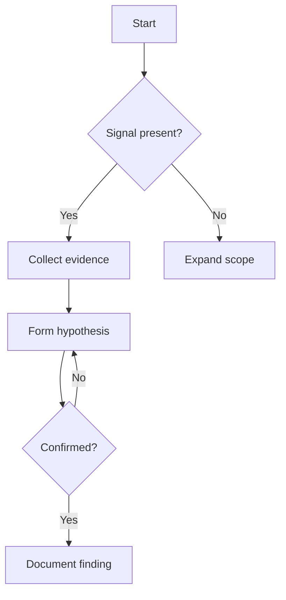
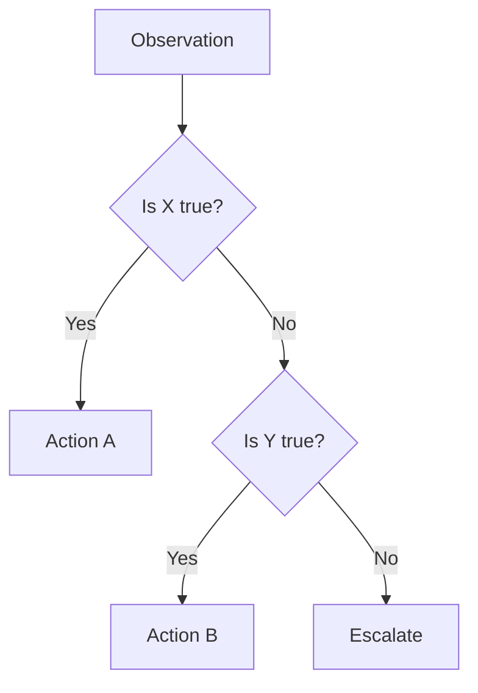

<!--
  awesome-ai-runbooks :: Runbook Template
  Copy this file into runbooks/<category>/<runbook-name>.md and fill in EVERY
  section. Do not delete section headings. The front matter above is
  machine-readable and consumed by the validation and scoring tooling
  (scripts/validate_runbooks.py) — keep the keys stable.
-->

# Title

> One-sentence summary of what this runbook accomplishes and for whom.

## Objective

State the single, measurable objective of this runbook. What does "done" look
like? Keep it outcome-focused (e.g. "Identify the root cause of elevated p99
latency and produce a prioritized remediation plan"), not activity-focused.

## Business Context

Explain why this work matters to the organization. Connect the technical task
to business outcomes: revenue, customer experience, risk, cost, compliance, or
developer velocity. This section grounds the agent's decisions in impact.

## Problem Statement

Describe the problem this runbook addresses in precise terms. Include the
symptoms, the observable signals, and what is explicitly *out of scope*.

## Success Criteria

A checklist of verifiable conditions that must all be true for the runbook to
be considered complete.

- [ ] Criterion 1 (objective, measurable)
- [ ] Criterion 2
- [ ] Criterion 3

## Trigger Conditions

When should this runbook run? Enumerate the alerts, schedules, tickets, or
human requests that legitimately trigger it.

- Alert: ...
- Schedule: ...
- Manual: ...

## Inputs Required

| Input | Description | Example | Required |
|-------|-------------|---------|----------|
| `service_name` | Target service | `checkout-api` | Yes |

## Required Access

Enumerate the minimum privileges needed. Prefer least privilege and read-only
scopes. Flag any write/production access explicitly.

| Scope | Purpose | Read/Write | Sensitivity |
|-------|---------|-----------|-------------|
| Metrics dashboard | Observe latency/error rates | Read | Low |

## Assumptions

State the preconditions assumed to be true. If an assumption is false, the
agent should escalate rather than proceed.

## Risks

| Risk | Likelihood | Impact | Mitigation |
|------|-----------|--------|------------|
| Misdiagnosis leads to wrong fix | Medium | High | Require evidence before recommending change |

## Constraints

Hard boundaries the agent must respect (change freezes, compliance windows,
data residency, blast-radius limits, no production writes without approval).

## Agent Persona

Define the role the agent should adopt (e.g. "Senior SRE"), its tone, its
depth of analysis, and its bias controls. Reference
[`docs/AI_AGENT_STANDARDS.md`](../docs/AI_AGENT_STANDARDS.md). (When copied into
`runbooks/<category>/`, this path becomes `../../docs/AI_AGENT_STANDARDS.md`.)

## Planning Instructions

Step-by-step instructions the agent follows to produce a plan *before* acting.
The agent must externalize its plan and get approval when `human_in_the_loop`
is `required`.

## Execution Instructions

The ordered, concrete steps to execute. Use fenced code blocks for commands and
always show the read-only/observation steps before any mutating steps.

```bash
# Example command
kubectl get pods -n <namespace>
```

## Investigation Workflow



## Analysis Framework

Describe how the agent should reason about evidence: which signals to correlate,
what thresholds matter, how to rank hypotheses, and how to avoid confirmation
bias.

## Decision Tree



## Validation Steps

How to verify each action worked and that no regression was introduced.

- [ ] Validation 1
- [ ] Validation 2

## Expected Outputs

Describe the concrete artifacts produced (reports, dashboards, PRs, tickets).

## Deliverables

The final, reviewable deliverable(s), using
[`templates/report-template.md`](./report-template.md).

## Escalation Process

Who to escalate to, when, and with what context. Include severity mapping and
communication channels.

## Rollback Strategy

Exact steps to safely undo any change made during execution, and how to confirm
the rollback succeeded.

## Post-Execution Review

Prompts for a short retrospective: what worked, what surprised us, what to
automate next time.

## Metrics

Quantitative measures of runbook effectiveness (MTTD, MTTR, accuracy, false
positive rate, cost saved, time saved).

| Metric | Definition | Target |
|--------|-----------|--------|
| MTTR | Mean time to resolve | < 30m |

## Example Execution

A concrete, realistic walkthrough showing inputs, agent reasoning, commands,
and a sample report excerpt.

## References

- [Related runbook](#)
- [External documentation](#)
